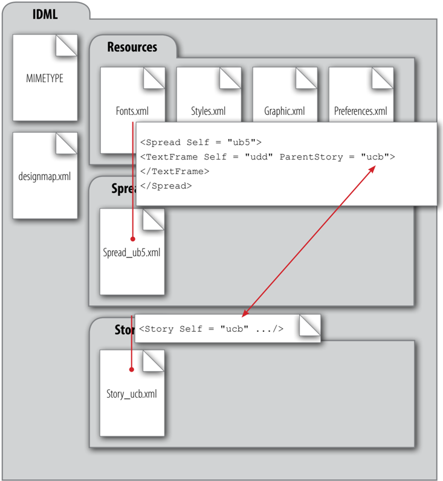
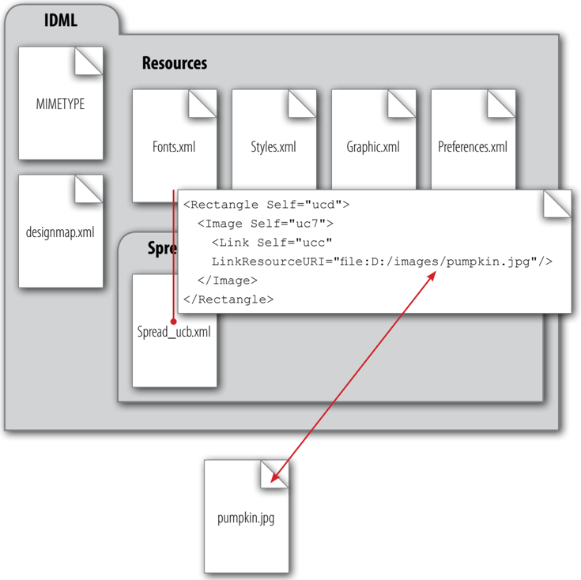

## 9 IDML Syntax

The following sections provide an overview of IDML syntax, starting with the conventions used in IDML and the way that data types are expressed, and then moving on to the details of the ways that In  Design objects and properties are represented.

### 9.1 XML Conventions and Style

The following sections describe a number of conventions we have adopted for IDML.

### 9.1.1 Names in IDML

XML elements and attributes in an IDML file will use the 'long name' of the corresponding objects in the In  Design scripting object model. For example, the Rectangle object in scripting will become a <Rectangle> element in IDML; the Stroke  Weight property will become a Stroke­ Weight attribute (shown here in a <Rectangle> element):

```xml
<Rectangle StrokeWeight="6"/>
```

Note that the elements representing text objects in IDML differ from the text objects used in the scripting object model. In general, the CharacterStyleRange element in IDML corresponds to the Text Style Range object in the scripting object model. Both represent a continuous run of identical formatting, and both have roughly the same set of formatting values (represented by properties in scripting and by attributes in IDML).

### 9.1.2 Use of Empty Elements

Whenever possible, IDML uses empty elements to represent objects or properties. For example, a <MarginPreference> element in a <Page> element usually looks something like this:

```xml
<MarginPreference ColumnCount="1" ColumnGutter="12" Top="36" Bottom="36" Left="36" Right="36" ColumnDirection="Horizontal" ColumnsPositions="0 540"/>
```

As you can see, the <MarginPreference> element does not contain any child elements-all of the properties of the element are represented as attributes.Empty elements can be processed more rapidly than elements containing child elements.

### 9.2 Generating IDML Schema

The complete IDML schema can be written as Relax NG Compact Syntax files. You can generate these schema files using the following script:

```js
//Fill in the location of a folder on your system in the following line. 
app.generateIDMLSchema(Folder("/c/IDMLSchema"), false);
```

When you generate an IDML schema with the second parameter set to false, all of the schema elements are contained in two files: IDMarkupLanguage.rnc and datatype.rnc (the latter file is included by reference in the former). If you want to view only the schema elements for a specific type of file in the IDML package (e.g., a Story\_nnn.xml file), you generate separate schema files corresponding to each XML file included in the IDML package ( Master  Spreads.xml , Spread.xml , Text.xml , etc.). To do this, run the following script:

```js
//Fill in the location of a folder on your system in the following line. 
app.generateIDMLSchema(Folder("/c/IDMLSchema"), true);
```

The output folder you specified will include the following schema files (in the same folder organization as in an IDML package):

```
datatype.rnc 
designmap.rnc 
Master Spreads.rnc 
Fonts.rnc 
Graphic.rnc 
Preferences.rnc 
Styles.rnc 
Spread.rnc 
Story.rnc 
BackingStory.rnc 
Mapping.rnc 
Tags.rnc
```

Note that the content of the datatype.rnc file is the same in either method of generating the schema.

### 9.3 Data Types in IDML

IDML data types are declared in a Relax NG Compact Syntax file named datatype.rnc , which will be included by all other schema files. This schema is can be extended by In  Design plug-ins by adding objects and properties to the scripting object model. New versions of the schema can be generated at any time by In  Design. For more on generating the file, see 'Generating IDML Schema'.

The following table shows a list of basic types. The first column lists the script data types, the second column is the corresponding type name used in the Relax NG schema, and the third column is the value of the type attribute that appears in the IDML file (Note that the type attribute will only appear in a child element of the <Properties> element):

# Table 1. IDML basic data types

| Script Data Type     | Schema Data Type     | Value of Type Attribute in an IDML File |
| -------------------- | -------------------- | ------------------------------------------------------------------------ |
| boolean              | xsd:boolean          | boolean |
| string               | xsd:string           | string |
| short integer        | xsd:short            | short |
| long integer         | xsd:int              | long |
| longlong integer     | xsd:int              | longlong |
| double               | xsd:double           | double |
| object               | xsd:string           | object |
| object list          | xsd:string           | list of strings as a space­separated string |
| list                 | xsd:string           | list of simple types as a space­separated string |
| date                 | xsd:date             | date |
| file                 | xsd:string           | file |
| enumeration          | xsd:string           | Depends on the definition of the enumeration specified in datatype.rnc |
| unit                 | xsd:double           | unit or double |
| record               | text                 | record |
| stream               | text                 | binary |


### 9.3.1 Scalar Data Types vs. Complex Data Types

Scalar types are basic types which have a single value associated with them. They are the building blocks upon which all other data types are constructed.

Complex types are comprised of combinations of the basic types. Lists and records are two examples of complex types which exist today in the scripting object model.

- Lists are homogenous collections of elements. They are similar to arrays used by traditional programming languages. Lists contain an attribute that identifies the length of the list.

- Records are heterogeneous collections of elements. Records may contain other records. Records may also be contained within a list.

### 9.3.2 Enumerations

In  Design scripting makes frequent use of enumerations to define the scope of a property value. For example, story types can be Regulartext , Toctext , or Indexingtext . In  Design's IDML export uses the following rules to determine how an enumeration value should be expressed:

- When the value of a property is always an enumeration, it is expressed as an attribute of an element, and its data type is 'string'.
- If the value of a property's can be one of several different types, including an enumeration, the property will be expressed as a child element of a <Properties> element, with the type attribute of enumeration . For example, the following segment of the <DocumentPreference> element indicates the column and margin guide colors are 'Green'.

IDML schema example (from designmap.rnc, edited to remove off-topic attributes):

```rnc
Document  Preference_Object = element Document  Preference { element Properties { element Column  Guide Color { In  Design UIColor  Type_Type  Def }?& element Margin  Guide Color { In  Design UIColor  Type_Type  Def }? } ? }

```

Example from an IDML package (edited to remove off-topic attributes):

**[IDML Example 1. Properties Expressed as Attributes or Elements, Depending on Their Value](examples/01_example_properties_expressed_as_attributes_or_elements_depending_on_their_value.md)**

```xml
<DocumentPreference> <Properties> <ColumnGuideColor type="enumeration">Violet</ColumnGuideColor> <MarginGuideColor type="list"> <ListItem type="double">66</ListItem> <ListItem type="double">60</ListItem> <ListItem type="double">196</ListItem> </MarginGuideColor> </Properties> </DocumentPreference>

```

In the above example, the value of a <ColumnGuideColor> or <MarginGuideColor> can be either an In  Design UIColor Type enumeration (defined in the datatype.rnc file), or an RGB color (defined as an array of three doubles). Because the value can be more than a single, simple type, it is expressed as an element, rather than as an attribute. When the color is an enumeration, as in the <ColumnGuideColor> element shown above, the name of the enumeration appears as the value of the element. When the color is an RGB array, it is represented by a series of elements, as shown by the child elements of the <MarginGuideColor> element.

### 9.3.3 Key String

Many elements and attributes in IDML refer to various settings in an In  Design document by name (default colors or styles, for example) or by the string displayed in the In  Design user interface. These strings can change as the locale (or language) of the application changes.

IDML can use a 'key string' and an untranslated string for these values. The key string is used to look up a localized (translated) string. An untranslated string is used 'as is' with no lookup. Both of these string usages are represented as script data type string .

The four character prefix $ID/ inserted at the beginning of a string indicates that the string is a key string, and that In  Design should look up the appropriate localized string during the IDML import process. For example, in the following abbreviated <IndexOptions> element, the value of the Title attribute is a key string.

```xml
<IndexOptions Title="$ID/Index"/>
```

In the example above, the use of the key string means that In  Design will look up the localized string during the process of importing the IDML document. Once the document is open, the correct string for the current locale will be displayed in the relevant areas of the user interface, and the corresponding value (object or other setting) will be applied to the property. If, instead, the value of the attribute was simply the term 'Index', In  Design would display that string, regardless of the locale of the application, and would attempt to apply an object or setting of that name.

If InDesign cannot find a string value to replace the key string, the key string will be used as is.

The following example shows the syntax used when a key string appears in an element:

```xml
<RuleAboveGapColor type="string">$ID/Text Color</RuleAboveGapColor>
```

### 9.3.4 Measurement Units

Measurement units in IDML exported from In  Design are always points (defined as 72 units per inch).

### 9.4 Representation of Objects

In  Design objects (spreads, colors, or TextFrames, for example) are represented by XML elements in IDML. Each object has properties that can be expressed as child XML elements or as attributes.

An object in an In  Design document is generally written into an IDML XML element in the following (simplified) format:

**[IDML Example 2. Object Serialization](examples/02_example_object_serialization.md)**

```xml
<Object SimpleProperty="Value" ... Self="Unique  ID"> <Properties> <ComplexProperty>Value</ComplexProperty> </Properties> <ChildObject>...</ChildObject> ... </Object>

```


Where Object is the name of the In  Design object type, `SimpleProperty` is a property that can be expressed as an XML attribute, `Self` is a unique identifier for the object, Value is the value of the property, `ComplexProperty` is a property that must be expressed as an XML element (see 'Representation of Properties'), and <ChildObject> is an object contained by the object (e.g., an object inside a group). The content of the <ChildObject> element follows the same pattern as the <Object> element.

The <Properties> and <ChildObject> sections are optional, and depend on the object being serialized. If both are empty, object can be written as simplified form:

```xml
<ObjectSimple  Attribute="Value", ... Self="Unique  ID"/>
```

### 9.5 Representation of Properties

Properties can be expressed either as attributes or child elements of the containing XML element. In general, simple values are represented as attributes; more complex values are represented as elements.

### 9.5.1 Properties Represented as Attributes

An object property will be expressed as an XML attribute if it meets any of the following conditions:

- The property is defined as simple scripting type (i.e., not Strea m  T ype , Variabl e  T ype , or Recor dT ype , see 'Properties Represented as Elements') and its property name is not 'Contents'. Because the Contents property may be a very long string and may contain line ending characters, it is not suitable to be represented as an XML attribute.
- The value of the property is one dimensional array where each member of the array is a simple data type. It is not necessary for every member to be the same type.
- All of the possible values of the property are either objects or enumerations.

The name of the scripting property is generally used as the key of the XML attribute, and the value of the property is stored as the value of the attribute. The value can be either a single value, or a list of values separated by spaces. For example:

```
PointSize="12" ColorValue="0 0 0 100"
```

Note that if the value of the property contains space character, it is encoded as '%20'.

### 9.5.2 Properties Represented as Elements

If a given property does not meet the rules described above for being written as an attribute, it will be expressed as an XML element inside the <Properties> child element of the XML element representing the containing object. The name of the scripting property is used as the name of the element, and the value of the property is serialized as the content of the element. In general, the data type of the value will be specified in the type attribute of the element.

Properties are expressed as elements in two basic forms: as a single value and as a list of values.

**[Table 2. Property Elements](tables/02_property_elements.md)**


In the example above, the guide color property of an In  Design guide is expressed as an element because it can be either a UIColors\_Enum  Value enumeration or a custom RGB color.

The scripting object model contains two data types that are always represented as elements in IDML: Recor d  T ype , and Geometry . In addition, some properties of the type Variabl e  T ype are written to IDML as elements. The following sections discuss these types.

## Record  Type

Properties whose data type (in the scripting object model) is Record  Type are serialized into XML as a series of child elements inside the <Properties> element, as shown in the following example (where Ta b  L ist is the property name and Alignment , Alignmen t  C haracter , Leader , and Position are items in the property record):

**[IDML Example 3.  Record  Type Serialization](examples/03_example_record_type_serialization.md)**

```xml
<TabList type="record"> <Alignment type="enumeration">Left  Align</Alignment> <AlignmentCharacter type="string">$ID/.</AlignmentCharacter> <Leader type="string">$ID/</Leader> <Position type="unit">36</Position> </TabList>

```


## Geometry

Page item geometry (the shape of the page item) is represented as a <PathGeometry> element. This element, in turn, contains one or more <GeometryPath> elements, each of which, in turn, contains two or more <PathPoint> elements.

The <PathGeometry> element has the following form:

**[IDML Example 4. Geometry Serialization](examples/04_example_geometry_serialization.md)**


For more on geometry in IDML, see 'Spreads and Master Spreads.'

#### Variable Type

Properties in the scripting object model with the data type Stream  Type or properties whose name is Contents are represented as XML elements.

#### Complex Structures

If the scripting object model data type of a property is more complex than the structures we have discussed, it is serialized as a list of elements. The < Descriptor> element (found in the <Page> element) is an array containing one or more elements of any type. It is serialized as an element containing a series of property elements, as shown in the following example:

```xml
<Descriptor type="list"> <ListItem type="string"></ListItem> <ListItem type="enumeration">Arabic</ListItem> <ListItem type="boolean">true</ListItem> <ListItem type="boolean">false</ListItem> <ListItem type="long">1</ListItem> <ListItem type="string"></ListItem> </Descriptor>
```

In general, properties serialized as <ListItem> elements are used for storing data for round-trip to and from In  Design and In  Copy, and can be thought of as read-only properties. It is unlikely that you will ever need to construct these elements.

### 9.5.3 Use of the Type Attribute in Property Elements

If a <Properties> element is used to represent the properties of an object, each property is represented as a child element of the <Properties> element. Each child element, includes a type attribute whose value is set to the data type (see 'Data Types in IDML') of the property. For example:

```xml
<Properties> <BaselineFrameGrid Color type="enumeration">Light  Blue</BaselineFrameGrid> Color> </Properties>
```

In the above example, the value Light Blue comes from the definition of the UIColors enumeration in the datatype.rnc file.

### 9.5.4 Object Reference Format

Properties in the scripting object model often contain references to objects. For example, the FillColor property of a Rectangle will always refer to a Color , Tint , Mixed Ink , Gradient , or Swatch object. IDML expresses this relationship by including a reference to the XML element representing the object (which is stored elsewhere in the document) as the value of the XML element or attribute representing the property. Object references are the most common cross reference format within an IDML file.

When serializing an object into an XML element, In  Design generates a unique string for the ID of the element and stores it in the Self attribute. The algorithm used for generating the ID is complex, and proprietary to Adobe, but it generally follows these rules:

- If an object belongs to a class that identifies its members by name, then the value of the Self attribute of the element will be that name. If the name is not unique, then In  Design will add a prefix and/or postfix strings to create a unique ID upon import.
- If an object is a child of another object, the name or ID of the parent object will be added to the value of the Self attribute as a prefix string, using a pattern similar to path syntax:
- If an object does not have a name, the value of the ID property of the object will be used as the value of the Self attribute of the element during export.
- If multiple objects exist of the same type, index numbers will be added to the Self attribute as a postfix string.

```
/parent/childname
```

The only requirement of the value of the Self attribute is that it is unique within the IDML package. If you are writing the IDML yourself, you do not need to observe the above patternyou can change the value of the Self attribute to anything you want as long as it is unique (within the IDML package) and as long as all references to the element are also changed to match.

```xml
<Story Self="ucb" .../>
```

The following shows an example of an element reference expressed as the value of an XML element. In the following example, the <BasedOn> element of a <ParagraphStyle> element refers to another <ParagraphStyle> element whose Self attribute contains the value Heading (the name of the paragraph style). In this case, the paragraph style is defined in the Styles. html file inside the Resources folder in the IDML package.

<BasedOn type="object">ParagraphStyle\Heading</BasedOn>

Cross references can also appear as values of attributes. In the following example, the Title­ Style attribute of the <IndexOptions> element refers to a <ParagraphStyle> element whose Self attribute contains the value Index Title (the name of the paragraph style). In this case, the paragraph style is defined in the Styles.html file inside the Resources folder in the IDML package.

```xml
<IndexOptions Title Style="ParagraphStyle\Index  Title" .../>
```

The following example shows a cross reference that uses the Self attribute of an element to refer to the element. The value ucb is the unique identifier of the <Story> element, as shown above.

```xmö
<TextFrame Parent  Story="ucb" .../>
```

- IDML files can contain forward references (i.e., references to objects which have not yet been included in the IDML file).
- References are valid within an IDML package or within a single IDML file. References from one package to another or one file to another are not allowed.

### 9.5.5 Cross-file Reference Examples

The following example shows how the <Document> element in a designmap.xml file can refer to the spreads that make up the document.

Figure 2. Cross Reference: <Document> to Spread file


The following example shows how the Parent  Story attribute of a <TextFrame> element in a Spread.xml file refers to the story that contains the text in the TextFrame.

Figure 3. Cross Reference: <TextFrame> to <Story>



The following example shows how the Applied  ParagraphStyle attribute of a <ParagraphStyle­Range> element in a Story.xml file refers to the Self attribute of the <ParagraphStyle> applied to the text.

Figure 4. Cross Reference: <ParagraphStyleRange> to <ParagraphStyle>


In the example shown above, the <ParagraphStyle> is part of the <RootParagraphStyle­Group> . IDML uses a syntax similar to that of a file path to refer to paragraph styles within their containing group. For example, if a style named 'List  First' is in a paragraph style group named 'List  Styles,' a reference to the style would look like the following:

```
AppliedParagraphStyle = "ParagraphStyle\List Styles%30a  List First"
```

In this example, a colon, encoded as %30a , acts as a path separator character.

The following example shows how a <Rectangle> element can refer to an external file. Linked files are stored outside the IDML package file. If a file cannot be found when the IDML file is opened in In  Design, it will be listed as a missing link.

Figure 5. Cross Reference: Referring to an External File



The following example shows how to refer to an external hyperlink destination.

Figure 6. Cross Reference: Hyperlink Source and Hyperlink Destination


### 9.5.6 File Paths in IDML

References to linked files are specified in terms of absolute paths in an IDML file. When a file path is encountered during the course of opening an IDML file, InDesign will first attempt to locate the file at the given absolute path. If the file cannot be found at that location, InDesign uses an heuristic to locate the linked file. This approach also attempts to work around cross-platform issues. InDesign first looks for the link in the folder containing the IDML file. If the file cannot be located in the folder, InDesign searches for the file by using the file path to the IDML document. If the file is still not found, InDesign goes up one level in the IDML document's path, and tries again. Finally, InDesign looks for the link in the folders that have been specified by the user when updating file links during the current InDesign session. For example, here are the search locations for the following two paths: IDML file path: `/job/projects/p1/doc.idml` Linked file path: `c:\links\graphics\Image.psd /job/projects/p1/Image.psd`

```
/job/projects/p1/graphics/Image.psd 
/job/projects/p1/links/graphics/Image.psd 
/job/projects/Image.psd /job/projects/graphics/Image.psd 
/job/projects/links/graphics/Image.psd 
/job/Image.psd 
/job/graphics/Image.psd 
/job/links/graphics/Image.psd 
/Image.psd 
/graphics/Image.psd 
/links/graphics/Image.psd
```

If the file is still not found, InDesign looks for the Image.psd file in the list of cached folders selected by the user for re-linking in the current InDesign session.

For example:

Cached folders previously selected during re-linking in current session:

```bash
/job/projects/images/Folder1 
/job/projects/images/Folder2 
/job/projects/images/Folder3 
# Search of missing link in cached re-link folders: 
/job/projects/images/Folder1/Image.psd 
/job/projects/images/Folder2/Image.psd
/job/projects/images/Folder3/Image.psd
```

If the file still cannot be found, it will be listed as a missing link.
