## 10.3 Spreads and Master Spreads

The following sections describe the content and structure of the <Spread> and <MasterSpread> elements in IDML. In an IDML package, <Spread> elements are stored in the Spread files stored within the Spreads folder (which are named according to the rules described in 'IDML Component Names'). For the remainder of this section, we will refer to these files as Spread.xml .

The <MasterSpread> elements are very similar to the <Spread> elements in each Spread.xml file. This distinction is purely for organizational purposes; the XML structures of the two elements are fundamentally the same, and most of the information in this section can be applied to either type of file. In an IDML package, <MasterSpread> elements are stored in MasterSpreads folder.

The pages in an In  Design document are grouped into spreads and master spreads. Master spreads differ from document page spreads in that they can be applied to other pages, and are typically used for repeating layout elements, such as page numbers or running headers. Spreads and master spreads contain pages, and all page items that can appear in an In  Design document. In addition, spreads contain a number of spread-level preferences, such as flattener settings, the spread binding location, and the display state of master page items on the spread.

**Example 53. Spread Schema**

```
Spread_Object = element Spread { attribute Self { xsd:string }, attribute FlattenerOverride { SpreadFlattenerLevel_EnumValue }?, attribute AllowPageShuffle { xsd:boolean }?, attribute ItemTransform { TransformationMatrixType_TypeDef }?, attribute ShowMasterItems { xsd:boolean }?, attribute PageCount { xsd:int }?, attribute BindingLocation { xsd:int }?, attribute PageTransitionType { PageTransitionTypeOptions_EnumValue }?, attribute PageTransitionDirection { PageTransitionDirectionOptions_EnumValue }?, attribute PageTransitionDuration { PageTransitionDurationOptions_EnumValue }?, element Properties { element Label { element KeyValuePair { KeyValuePair_TypeDef }* }? } ?, ( FlattenerPreference_Object?, TimingSetting_Object?, (Pumpkin_Object*& Page_Object*& Oval_Object*& Rectangle_Object*& GraphicLine_Object*& TextFrame_Object*& Polygon_Object*& Group_Object*& EPSText_Object*& FormField_Object*& Button_Object*& MultiStateObject_Object* CheckBox_Object*&ComboBox_Object*& ListBox_Object*& RadioButton_Object*& TextBox_Object*& SignatureField_Object*) ) }
```

Note that the <MasterSpread> element differs from the <Spread> element only in that it can contain Name, Name Prefix, Base Name, and Overridden  PageItem Props attributes-only master spreads have these properties (refer to the In  Design documentation for more on master spread options). <MasterSpread> elements also have a <PageColor> element that they do not share with <Spread> elements. <MasterSpread> elements lack the Binding  Location, Allow Page Shuffle, and Flattener  Override attributes, as these elements only apply to document spreads (again, for more on the differences between master spreads and document spreads, refer to the In  Design documentation). Apart from these minor differences, the two elements-and the child elements that they can contain, such as <TextFrame>, <Rectangle>, or <Group> elements-are the same.

**Example 54. Master Spread Schema**

```
MasterSpread_Object = element MasterSpread { attribute Self { xsd:string }, attribute ItemTransform { TransformationMatrixType_TypeDef }?, attribute OverriddenPageItemProps { list { xsd:int * } }?, attribute Name { xsd:string }?, attribute NamePrefix { xsd:string }?, attribute BaseName { xsd:string }?, attribute ShowMasterItems { xsd:boolean }?, attribute PageCount { xsd:int }?, element Properties { element PageColor { (InDesignUIColorType_TypeDef ) | (enum_type, PageColorOptions_EnumValue ) }?& element Label { element KeyValuePair { KeyValuePair_TypeDef }* }? } ?, ( Page_Object*& Oval_Object*& Rectangle_Object*& GraphicLine_Object*& TextFrame_Object*& Polygon_Object*& Group_Object*& EPSText_Object*& FormField_Object*& Button_Object*& MultiStateObject_Object*& TimingSetting_Object? ) }
```

Most of the properties of a spread or master spread are represented by attributes. The following table shows the attributes that can appear in a <Spread> or <MasterSpread> element.

**Table 66**: Spread/MasterSpread Properties Represented as Attributes

| Attribute                 | Data Type                                        | Req | Description |
| ---                       | ---                                              | --- | ---------------------------------------------------------------------------------------------------------------------------------------------------------------------------------------------------------------------------------------------------------------------------------------------------- |
| FlattenerOverride         | SpreadFlattener_Level_EnumValue                 | no  | The transparency FlattenerPreferences override for the spread. ( <Spread> only). Can be Default, None, or Custom . |
| ItemTransform             | list of doubles                                  | no  | Atransformation matrix applied to the spread. In InDesign, spreads can be rotated, but not translated, scaled, or skewed, so this matrix will only specify rotation, and that only in 90-degree increments. |
| ShowMasterItems           | Boolean                                          | no  | If true, displays master page items on document pages in the spread. |
| PageCount                 | int                                              | no  | The number of pages in the spread. |
| BindingLocation           | int                                              | no  | The location of the binding edge of the spread. ( <Spread> only) |
| AllowPageShuffle          | Boolean                                          | no  | If true, allows the pages of the spread to move to other spreads during repagination. If false, keeps the pages of the spread together, regardless of repagination. ( <Spread> only) |
| AppliedMaster             | string                                           | no  | Areference to the unique ID (the value of the Self attribute) of the master spread applied to the <Spread> or <MasterSpread>. |
| Name                      | string                                           | no  | The name of the master spread. ( <MasterSpread> only) |
| NamePrefix                | string                                           | no  | The name prefix of the master spread. ( <MasterSpread> only) |
| BaseName                  | string                                           | no  | The base name of the master spread. ( <MasterSpread> only) |
| PageTransitionDirection | PageTransitionTypeDirectionOptions_EnumValue | no  | The direction is based on the page transtion type. Can be: HorizontalIn, HorizontalOut, VerticalIn, VerticalOut, Down, Left, LeftDown, LeftUp, Right, RightDown, RightUp, or Up . |
| PageTransitionDuration  | PageTransitionTypeDurationOptions_EnumValue  | no  | The duration of the page transition. Can be Fast, Medim, or Slow . |
| PageTransitionType      | PageTransitionTypeOptions_EnumValue           | no  | The type of the page transition. Can be Blinds- Transition, BoxTransition, CombTransition, CoverTransition, DissolveTransition, Fade- Transition, NoneTransition, PageTurnTransition, PushTransition, SplitTransition, UncoverTransition, WipeTransition, ZoomInTransition, or ZoomOutTransition |

**Table 67**: MasterSpread Properties Represented as Elements

| Name      | Type                                     | Req | Description |
| ---       | ---                                      | --- | --------------------------------------------------------------------------------------------------------------------------------------------------------------------------------- |
| PageColor | list of doubles or InDesignUIColorType | no  | The color of the spread, specified either as a list of three doubles, each in the range 0 to 255 and representing R, G, and B values, or as an InDesignUIColorType enumeration. |

#### Minimal Spread Example

The <Spread> element is simply a container for other elements that can appear on a spread. In the following example, we have omitted the details of the Page and Rectangle elements. For more information on those objects, refer to the corresponding reference sections.

**IDML Example 16. Minimal Spread**

```xml
<Spread Self="ub5" PageCount="1" AppliedMaster="ubc"> <Page>...</Page> <Rectangle>...</Rectangle> </Spread>
```

### 10.3.1 PageItems

Page items are the rectangles, ellipses, graphic lines, polygons, TextFrames, groups, buttons, movies, imported graphics, and interactive elements that can appear in an In  Design document. In IDML, page items are collected on spreads as child elements of the <Spread> element.

Page items can be broken into three groups: spline items (rectangles, ellipses, graphic lines, polygons, and TextFrames), media items (movies and sounds), and graphics (PDF, EPS, TIFF, and other types of imported graphics). This corresponds to the class hierarchy in the InDesign scripting model: SplineItems, MediaItems, and Graphics are all chile elements of the PageItem class.

#### Spline Items

Spline items are usually the most common type of page item found in an InDesign document.

Spline items appear in elements named after their specific class: Rectangle, Oval, GraphicLine, Polygon, TextFrame, Group, and Button . There is no specific spline item for a graphic frame; any rectangle, ellipse, graphic line, or polygon can contain an imported graphic. The only difference between the Rectangle, Oval, GraphicLine, and Polygon elements is in the number and arrangement of the PathPoint elements contained in their PathGeometry elements.

From the point of view of the In  Design scripting model, spline items frequently change their type as you alter their content type or geometry. Add a point to a rectangle, and it becomes a polygon; change the content type of a polygon to text type, and it becomes a TextFrame. IDML works in a similar fashion-you can add multiple paths to a <Rectangle> element, for example, and InDesign will still be able to open and interpret the element.

The schemas for Rectangle, Oval, GraphicLine, Polygon, and TextFrame elements are identical. The following example is for the Rectangle element; variations for other object types will be discussed later in this section.

#### Media Items

In IDML, media items are represented as <Movie> and <Sound> elements. These elements have all of the properties of other <PageItem> elements, but add a small number of unique properties. Media items always appear inside a container element, such as a <Rectangle> .

#### Graphics

In IDML, imported graphics items are represented as <EPS>, <Image>, and <PDF> elements. These elements have all of the properties of other <PageItem> elements, but add a small number of unique properties. Graphics always appear inside a container element, such as a <Rectangle> .

**Example 55. PageItem**

```rnc
Rectangle_Object = element Rectangle { attribute Self { xsd:string }, attribute ContentType { ContentType_EnumValue }?, attribute StoryTitle { xsd:string }?, attribute LinkResourceId { xsd:int }?, attribute ParentInterfaceChangeCount { list { xsd:int * } }?, attribute TargetInterfaceChangeCount { list { xsd:int * } }?, attribute LastUpdatedInterfaceChangeCount { list { xsd:int * } }?, attribute LinkedSourceTableId { xsd:int }?, attribute HorizontalLayoutConstraints { list { DimensionsConstraints_EnumValue,DimensionsConstraints_EnumValue,DimensionsConstraints_EnumValue } }?, attribute VerticalLayoutConstraints { list { DimensionsConstraints_EnumValue,DimensionsConstraints_EnumValue,DimensionsConstraints_EnumValue } }?, attribute AllowOverrides { xsd:boolean }?, attribute FillColor { xsd:string }?, attribute FillTint { xsd:double }?, attribute OverprintFill { xsd:boolean }?, attribute CornerRadius { xsd:double }?, attribute StrokeWeight { xsd:double }?, attribute MiterLimit { xsd:double {minInclusive="1" maxInclusive="500"} }?, attribute EndCap { EndCap_EnumValue }?, attribute EndJoin { EndJoin_EnumValue }?, attribute StrokeType { xsd:string }?, attribute StrokeCornerAdjustment { StrokeCornerAdjustment_EnumValue }?, attribute StrokeDashAndGap { list { xsd:double * } }?, attribute LeftLineEnd { ArrowHead_EnumValue }?, attribute RightLineEnd { ArrowHead_EnumValue }?, attribute StrokeColor { xsd:string }?, attribute StrokeTint { xsd:double }?, attribute GradientFillStart { UnitPointType_TypeDef }?, attribute GradientFillLength { xsd:double }?, attribute GradientFillAngle { xsd:double }?, attribute GradientStrokeStart { UnitPointType_TypeDef }?, attribute GradientStrokeLength { xsd:double }?, attribute GradientStrokeAngle { xsd:double }?, attribute OverprintStroke { xsd:boolean }?, attribute GapColor { xsd:string }?, attribute GapTint { xsd:double }?, attribute OverprintGap { xsd:boolean }?, attribute StrokeAlignment { StrokeAlignment_EnumValue }?, attribute Nonprinting
{ xsd:boolean }
?,
attribute ItemLayer
{ xsd:string }
?,
attribute Locked
{ xsd:boolean }
?,
attribute LocalDisplaySetting
{ DisplaySettingOptions_EnumValue }
?,
attribute GradientFillHiliteLength
{ xsd:double }
?,
attribute GradientFillHiliteAngle
{ xsd:double }
?,
attribute GradientStrokeHiliteLength
{ xsd:double }
?,
attribute GradientStrokeHiliteAngle
{ xsd:double }
?,
attribute AppliedObjectStyle
{ xsd:string }
?,
attribute CornerOption
{ CornerOptions_EnumValue }
?,
attribute Visible
{ xsd:boolean }
?,
attribute Name
{ xsd:string }
?,
attribute TopLeftCornerOption
{ CornerOptions_EnumValue }
?,
attribute TopRightCornerOption
{ CornerOptions_EnumValue }
?,
attribute BottomLeftCornerOption
{ CornerOptions_EnumValue }
?,
attribute BottomRightCornerOption
{ CornerOptions_EnumValue }
?,
attribute TopLeftCornerRadius
{ xsd:double }
?,
attribute TopRightCornerRadius
{ xsd:double }
?,
attribute BottomLeftCornerRadius
{ xsd:double }
?,
attribute BottomRightCornerRadius
{ xsd:double }
?,
attribute ItemTransform
{ TransformationMatrixType_TypeDef }
?,
element Properties
{ element PathGeometry
{ element GeometryPathType
{ GeometryPathType_TypeDef }* }?& element Label
{ element KeyValuePair
{ KeyValuePair_TypeDef }* }? }
?,
( TextPath_Object*,
(TransparencySetting_Object?& StrokeTransparencySetting_Object?& FillTransparencySetting_Object?& AnchoredObjectSetting_Object?& TextWrapPreference_Object?& LinkedPageItemOption_Object?& InCopyExportOption_Object?& FrameFittingOption_Object?& ObjectExportOption_Object?& AnimationSetting_Object?& TimingSetting_Object?),
(Pumpkin_Object*& Oval_Object*& Rectangle_Object*& GraphicLine_Object*& TextFrame_Object*& Polygon_Object*& Sound_Object*& Movie_Object*& Link_Object*& HtmlItem_Object*& Graphic_Object*& Image_Object*& EPS_Object*& WMF_Object*& PICT_Object*& PDF_Object*& Group_Object*& EPSText_Object*& FormField_Object*& Button_Object*& MultiStateObject_Object*& CheckBox_Object*& ComboBox_Object*& ListBox_Object*& RadioButton_Object*& TextBox_Object*& SignatureField_Object*& ImportedPage_Object*) ) }
```

**Table 68**: Common PageItem Properties Represented as Attributes

| Name                      | Type                     | Req | Description |
| ---                       | ---                      | --- | ---------------------------------------------------------------------------------------------------------------------------------------------------------------------------------------------------------------------------------------------------------------------------------------------------------------------------------------------------------------------------------------------------------------------------------------------------------------------------------------------------- |
|AllowOverrides            | boolean                  | no  | If true, the master page page item allows over- rides. |
| AppliedObjectStyle      |string                  | no  | The object style applied to the page item. |
| BottomLeftCornerOption  |CornerOptions_EnumValue | no  | The corner option applied to the bottom left corner of the object. Note: corner option dif- fers from end join in that you can set a radius for a corner option, whereas the rounded or beveled effect of an endjoin depends upon the stroke weight. Can be None (No corner option), RoundedCorner (Rounded corner option), InverseRoundedCorner (Inverted rounded corner option), InsetCorner (Inset corner option), BevelCorner (Beveled corner option), or FancyCorner (Fancy corner option). |
| BottomLeftCornerRadius  |double                  | no  | The corner radius applied to the bottom left cor- ner of the object. |
| BottomRightCornerOption |CornerOptions_EnumValue | no  | The corner option applied to the bottom right corner of the object. Note: corner option dif- fers from end join in that you can set a radius for a corner option, whereas the rounded or beveled effect of an end join depends upon the stroke weight. Can be None (No corner option), RoundedCorner (Rounded corner option), InverseRoundedCorner (Inverted rounded corner option), InsetCorner (Inset corner option), BevelCorner (Beveled corner option), or FancyCorner (Fancy corner option). |
| BottomRightCornerRadius | double                  | no  | The corner radius applied to the bottom right corner of the object. |
| ContentType                    | ContentType_EnumValue   | no      | The type of content that a frame can contain. Can be Unassigned (No content type assigned), GraphicType (The frame is a graphics frame), or TextType (The frame is a TextFrame). |
| EndCap                         | EndCap_EnumValue          | no      | The end shape of an open path. Can be ButtEndCap (A squared end that stops at the path's endpoint), RoundEndCap (A semicircular end that extends beyond the endpoint by half the stroke-width), or ProjectingEndCap (A squared end that extends beyond the endpoint by half the stroke-width). |
| EndJoin                        | EndJoin_EnumValue         | no      | The corner join applied to the page item. Can be MiterEndJoin (Miter end join), RoundEndJoin (Rounded end join), or BevelEndJoin (Beveled end join). |
| FillColor                      | string                    | no      | The swatch (color, gradient, tint, or mixed ink) applied to the to fill the page item. . |
| FillTint                       | double                    | no      | The percent of tint to use in the page item's FillColor. (To specify a tint percent, use a number in the range of 0 to 100; to use the inherited or overridden value, use -1.) |
| GapColor                       | string                    | no      | The swatch (color, gradient, tint, or mixed ink) applied to the gap of a dashed, dotted, or striped stroke. For information, see stroke type. |
| GapTint                        | double                    | no      | The tint as a percentage of the gap color. (To specify a tint percent, use a number in the range of 0 to 100; to use the inherited or overridden value, use -1.) |
| GradientFillAngle              | double                    | no      | The angle of a linear gradient applied to the fill of the page item. (Range: -180 to 180) |
| GradientFillHiliteAngle      | double                    | no      | The angle of the gradient fill highlight. |
| GradientFillHiliteLength     | double                    | no      | The length of the gradient fill highlight. |
| GradientFillLength           | double                    | no      | The length (for a linear gradient) or radius (for a radial gradient) applied to the fill of the page item. |
| GradientStrokeAngle          | double                    | no      | The angle of a linear gradient applied to the stroke of the page item. (Range: -180 to 180) |
| GradientStrokeHiliteAngle    | double                    | no      | The angle of the gradient stroke highlight. |
| GradientStrokeHiliteLength   | double                    | no      | The length of the gradient stroke highlight. |
| GradientStrokeLength   | double                                | no      | The length (for a linear gradient) or radius (for a radial gradient) applied to the stroke of the page item. |
| GradientStrokeStart    | UnitPointType_TypeDef                | no      | The starting point (in page coordinates) of a gra- dient applied to the stroke of the page item, in the format [x, y]. |
| ItemTransform            | TransformationMatrixType_TypeDef   | no      | The transformation matrix applied to the page item. |
| LeftLineEnd              | ArrowHead_EnumValue                 | no      | The arrowhead applied to the start of the path. Can be None (None), SimpleArrowHead (An arrow head formed by two slanting lines whose intersection forms a 45-degree angle and whose stroke weight is the same as the path's stroke), SimpleWideArrowHead (An arrow head formed by two slanting lines whose intersection forms a 90-degree angle and whose stroke weight is the same as the path's stroke), TriangleArrowHead (A solid triangle arrow head whose point describes a 45-degree angle), TriangleWideArrowHead (A solid triangle arrow head whose point describes a 90-degree angle), BarbedArrowHead (A solid arrow head whose pierced end bows sharply toward the point and whose point describes a 45-degree angle), CurvedArrowHead (A solid arrow head whose pierced end concaves toward the point and whose point describes a 45-degree angle), CircleArrowHead (A hollow circle whose outline is the same weight as the stroke The circle's diameter is 5 times the stroke width), CircleSolidArrowHead (A solid circle whose diameter is 5 times the stroke width), SquareArrowHead (A hollow square set perpendicular to the path, whose outline is the same weight as the stroke The length of one side of the square is 5 times the stroke width), SquareSolidArrowHead (A solid square set perpendicular to the end of the path The length of one side of the square is 5 times the stroke width), or BarArrowHead (A vertical bar bisected by the stroke, which meets the stroke at a right angle and is the same weight as the stroke The bar's length is 45 times the stroke width). |
| LocalDisplaySetting   | DisplaySettingOptions_EnumValue   | no      | Display performance options for the page item. Can be HighQuality (Slower performance; dis- plays high-resolution graphics and high-quality transparencies and turns on anti-aliasing), Typical (Moderate performance speed; dis- plays proxy graphics and low-quality transpar- encies and turns on anti-aliasing), Optimized (Best performance; grays out graphics and turns off transparency and anti-aliasing), or Default (Uses the container object's default display per- formance preferences setting For information, see default display settings). |
| Locked                  | boolean                             | no      | If true, the page item is locked. |
| MiterLimit              | double                              | no      | The limit of the ratio of stroke width to miter length before a miter (pointed) join becomes a bevel (squared-off) join. |
| Nonprinting             | boolean                             | no      | If true, the page item does not print. |
| OverprintFill           | boolean                             | no      | If true, the page item's FillColor overprints any underlying objects. If false, the FillColor knocks out the underlying colors. |
| OverprintGap            | boolean                             | no      | If true, the gap color overprints any underly- ing colors. If false, the gap color knocks out the underlying colors. |
| OverprintStroke         | boolean                             | no      | If true, the page item's stroke color overprints any underlying objects. If false, the stroke color knocks out the underlying colors. |
| RightLineEnd      | ArrowHead_EnumValue        | no      | The arrowhead applied to the end of the path. Can be None (None), SimpleArrowHead (An arrow head formed by two slanting lines whose intersection forms a 45-degree angle and whose stroke weight is the same as the path's stroke), SimpleWideArrowHead (An arrow head formed by two slanting lines whose intersection forms a 90-degree angle and whose stroke weight is the same as the path's stroke), TriangleArrowHead (A solid triangle arrow head whose point describes a 45-degree angle), TriangleWideArrowHead (A solid triangle arrow head whose point describes a 90-degree angle), BarbedArrowHead (A solid arrow head whose pierced end bows sharply toward the point and whose point describes a 45-degree angle), CurvedArrowHead (A solid arrow head whose pierced end concaves toward the point and whose point describes a 45-degree angle), CircleArrowHead (A hollow circle whose outline is the same weight as the stroke The circle's diameter is 5 times the stroke width), CircleSolidArrowHead (A solid circle whose diameter is 5 times the stroke width), SquareArrowHead (A hollow square set perpendicular to the path, whose outline is the same weight as the stroke The length of one side of the square is 5 times the stroke width), SquareSolidArrowHead (A solid square setperpendicular to the end of the path The length of one side of the square is 5 times the stroke width), or BarArrowHead (A vertical bar bisected by the stroke, which meets the stroke at a right angle and is the same weight as the stroke The bar's length is 45 times the stroke width). |
| StoryTitle        |string                      | no      | The title of the story associated with this page item, if any. |
| StrokeAlignment   |StrokeAlignment_EnumValue   | no      | The stroke alignment applied to the page item. Can be CenterAlignment (The stroke straddles the path), InsideAlignment (The stroke is inside the path), or OutsideAlignment (The stroke is outside the path, like a picture frame). |
| StrokeColor       | string                       | no      | The swatch (color, gradient, tint, or mixed ink) applied to the to stroke of the page item. |
| StrokeCornerAdjustment   | StrokeCornerAdjustment_EnumValue   | no      | The corner adjustment applied to the page item. Can be None (No adjustment), Dashes (Changes the length of dashes so that dashes always occur at path ends and corners; maintains set gap length Note: Can cause dashes to be different lengths on shapes whose sides are of different lengths, such as rectangles), Gaps (Changes the length of gaps so that dashes or dots always occur at ends and corners; maintains dash length or dot diameter Note: Can cause gaps to be different lengths on shapes whose sides are of different lengths, such as rectangles), or DashesAndGaps (Adjusts both dashes and gaps to cover corners and end points Note: Causes dash and gap sizes to be consistent on all sides of |
| StrokeDashAndGap           | string                                 | no      | The dash and gap measurements that define the pattern of a custom dashed line. Define up to six values (in points) in the format [dash1, gap1, dash2, gap2, dash3, gap3]. |
| StrokeTint                 | double                                 | no      | The percent of tint to use in object's stroke color. (To specify a tint percent, use a number in the range of 0 to 100; to use the inherited or overrid- den value, use -1.) |
|StrokeType                 | string                                 | no      | The name of the stroke style to apply. |
| StrokeWeight               |double                                | no      | The weight (in points) to apply to the page item's stroke. |
| TopLeftCornerOption      |CornerOptions_EnumValue               | no      | The corner option applied to the top left corner of the object. Note: corner option differs from end join in that you can set a radius for a corner option, whereas the rounded or beveled effect of an end joindepends upon the stroke weight. Can be None (No corner option), RoundedCorner (Rounded corner option), InverseRoundedCorner (Inverted rounded corner option), InsetCorner (Inset corner option), BevelCorner (Beveled corner option), or FancyCorner (Fancy corner option). |
| TopLeftCornerRadius      |double                                | no      | The corner radius applied to the top left corner of the object. |
| TopRightCornerOption     |CornerOptions_EnumValue               | no      | The corner option applied to the top right corner of the object. Note: corner option differs from end join in that you can set a radius for a corner option, whereas the rounded or beveled effect of an end join depends upon the stroke weight. Can be None (No corner option), RoundedCorner (Rounded corner option), InverseRoundedCorner (Inverted rounded corner option), InsetCorner (Inset corner option), BevelCorner (Beveled corner option), or FancyCorner (Fancy corner option). |

| Name                     | Type     | Req     | Description |
| ------------------------ | -------- | ------- | ------------------------------------------------------------------ |
| TopRightCornerRadius   | double   | no      | The corner radius applied to the top right corner of the object. |

**Table 69**: Common PageItem Properties Represented by Elements

| Name           | Type                                 | Req     | Description |
| -------------- | ------------------------------------ | ------- | --------------------------------------------------------------------------------------------------------- |
| PathGeometry   | Array of GeometryPathType elements   | yes     | An element containing the geometry of the page item. For more information, refer to 'Geometry in IDML.' |

#### Live Corner Options and Previous Versions of InDesign

In the InDesign CS4 IDML format, corner options were applied to all of the points in the page item. InDesign CS5 added the Live Corner Effects feature, which can apply a different corner option to each point in the paths of a page item. The CornerRadius and CornerOption attributes in the InDesign CS4 version of IDML have been replaced with the BottomLeftCornerOption, BottomLeftCornerRadius, BottomRightCornerOption, BottomRightCornerRadius, TopLeftCornerOption, TopLeftCornerRadius, TopRightCornerOption, and TopRightCornerRadius in the InDesign CS5 version of IDML.

Opening an InDesign CS4 compliant IDML file containing the CornerRadius and CornerOption attributes in InDesign CS5 will apply the same value to all four corners.

Opening an InDesign CS5 IDML file in InDesign CS4 will apply the corner effect and corner radius specified by the TopLeftCornerOption and TopLeftCornerRadius to the CornerRadius and CornerOption attributes, which means that the top left corner attributes of the InDesign CS5 file will be uniformly applied to all corners of the objects in InDesign CS4.

### 10.3.2 Nested Objects and IDML Structure

Page items (and other objects, such as imported graphics) in an In  Design layout are frequently nested inside other page items. This nesting is explicit in the IDML structure. A <Document> element, for example contains <Spread> elements, which, in turn, contain <Rectangle> elements or other page item elements. An imported image is stored as a child XML element of the containing page item element. Objects inside a group appear as child elements of the <Group> element.

Only the top-level page items of a spread appear as child elements of the <Spread> element; all nested objects appear as child elements of their respective container elements.

### 10.3.3 Geometry in IDML

When you are editing or creating an IDML file, it's likely that you will need to draw a page item at a specific location on a page. You're probably already familiar with the geometry of the paths in page items-that they're made up of points positioned at pairs of x and y coordinates-but it's likely that you'll have a few questions in mind. What units of measurement should you use? Where is the origin of the coordinate system? Are the coordinates used in page items relative to the page or to the spread? In this section, we'll attempt to answer these questions.

The first thing you need to know is that the coordinates used in IDML are not the same as the coordinates you see in the In  Design user interface or in the In  Design scripting object model (they are, however, the same coordinates as used in the In  Design C++ model). At the same time, IDML offers a robust and consistent set of elements and attributes for specifying object locationsanything that can be drawn in the In  Design user interface can be achieved in IDML.

This section will focus on how geometry is expressed in IDML; the general topic of the geometry of page items and spreads in an In  Design document is far beyond the scope of this specification. For more information, refer to the 'Layout Fundamentals' chapter of the In  Design SDK Programming Guide . For more on coordinate systems and transformation matrices, refer to the Post  Script Language Reference Manual .

Note: In this section, we'll refer to a generic <PageItem> element. There are no <PageItem> elements in IDML; this element is provided for explanatory purposes only-it could be a <Rectangle>, <Oval>, <GraphicLine>, <TextFrame>, or <Polygon> element.

#### Coordinates, Transformation Matrices, and the IDML Element Hierarchy

As we mentioned in 'Nested Objects and IDML Structure,' above, elements in IDML are arranged in a specific hierarchy. A document contains spreads; spreads contain page items; and page items can contain other page items. The location of a page item on a spread depends on its position in the hierarchy. The relationships between the elements are defined by the following:

- A document has a base coordinate system (see 'Pasteboard Coordinates,' below).
- Each spread or master spread has its own coordinate system (see 'Spread Coordinates,' below).
- Each page item element has its own coordinate system (see 'PageItem Geometry,' below).
- The relationship of an element's coordinates to the coordinate system of its parent is determined by the transformation matrix applied to the element (see 'Transformations,' below).

In the paragraphs above, we talk about each element having its own coordinate system. In the rest of this section, we'll refer to the coordinate system of an element as the element's inner coordinates .

#### Pasteboard Coordinates

It's natural to think of the coordinates in an In  Design document in terms of the rulers you see in the layout windowruler coordinates . In ruler coordinates, a page item can actually straddle two different sets of rulers. This, among other reasons, makes ruler coordinates inconvenient for developers.

Instead, IDML geometry is built on the pasteboard coordinate system . This isn't the pasteboard you see surrounding a spread in the user interface; instead, it's a global coordinate system that underlies all of the spreads in an In  Design document. The pasteboard coordinate system starts at zero, above the first page in the document, and encompasses all of the spreads in the document. (The pasteboard coordinate system does not have a negative extent.)

- The units used by the pasteboard coordinate system are points, defined as 72 units per inch. Changing the definition of points in the In  Design user interface has no effect on the definition of points used in IDML.
- Increasing a vertical coordinate (y) moves the specified location down in pasteboard coordinates. This is the same as ruler coordinates, but is 'flipped' relative to the x and y axes of traditional geometry (i.e., what you learned in geometry and trigonometry classes), Post  Script, and PDF.
- Increasing the horizontal coordinate (x) moves the specified location to the right in pasteboard coordinates (the same as in ruler coordinates and in traditional geometry).

## Transformations

In  Design documents consist of (among other things) page items on spreads. These page items have an intrinsic shape that consists of one or more paths. The shape of the paths are completely determined by a sequence of coordinate pairs that specify either a point the path is to pass through (the anchor point) or the curvature of the line segments connected to the anchor point (control points). The shape of page items is completely determined by a collection of x and y coordinates.

If you were to draw the points that make up the path of a page item on a standard sheet of graph paper marked at 72 units per inch, the path would, in general, appear different than it does when printed from In  Design. The coordinate system represented by this fictitious graph paper is the item's inner coordinate system. Each page item has a distinct inner coordinate system-its own sheet of graph paper. The path points that make up the shape of the page item are always described in inner coordinates.

A transformation matrix specifies the relationship between the coordinate system of the page element (the graph paper we talked about earlier) and the coordinate system of its parent element (another sheet of graph paper). By modifying a transformation matrix, objects can be scaled, rotated, moved, or transformed in other ways. For example, in In  Design, when you rotate a page item by 30 degrees, it is the item's transformation matrix that is affected, and not the coordinates of the item's individual path points. To return to our metaphor we're rotating the the graph paper the element is drawn on, relative to the graph paper of its parent element.

The relationship between the pasteboard coordinates of a <Document> element and the coordinate system of a <Spread> element is determined by the Item  Transform attribute of the <Spread> element.

In IDML, page item elements are child elements of a <Spread> or <MasterSpread> element, so you'll be more concerned with the coordinate system of those elements than with the pasteboard coordinate system. (Note that this is unlike the In  Design C++ model, where page items are collected on layers.)

You can think of the sequence of transformations applied to an element as a 'stack' of transformations from the pasteboard coordinate system of the <Document> element, through the inner coordinate system of the <Spread> element, and to the inner coordinate system of a <PageItem> element contained as a child of the <Spread> element. To position the element within its parent element, In  Design transforms the inner coordinates of the child element into the coordinate system of its parent element.

InDesign CS5 supports multiple page sizes in a spread, so <Page> elements have acquired an ItemTransform attribute that specifies their location in the spread. This transformation matrix translates the inner coordinates of the page (defined by the GeometricBounds attribute of the <Page> element) into the coordinate system of the parent <Spread> .

In addition, <Page> elements now have a MasterPageTransform attribute, which defines the relationship of master page items to the page. This transformation matrix transforms the inner coordinates of the master page items into their locations on the page (i.e., it is applied after the ItemTransform of the <Spread>, but before the ItemTransform of the individual master spread page items). This attribute corresponds to the Master Page Overlay feature; refer to the InDesign documentation for more information on this feature.

A transformation between two coordinate systems in two dimensional space is represented by a 3-by-3 transformation matrix written as:

<!-- formula-not-decoded -->

Because a transformation matrix has only six elements that can be changed, it is specified in IDML using the standard form [a b c d e f] . This transformation matrix is stored in ItemTransform attribute of a <PageItem> element, or in the ItemTransform attribute of a <Spread> or <MasterSpread> element.

To transform the inner coordinates of an element into the inner coordinates of its parent element, In  Design performs the following calculation (where T is the transformation matrix of the child element):

<!-- formula-not-decoded -->

If the transformation matrix applied to an element is the identity matrix ( [1 0 0 1 0 0] ), then the inner coordinate system of the element and the inner coordinate system of its parent coincide.

The following list shows the transformation matrices for performing the most common transformations.

- Translations are specified as [1 0 0 1 tx ty], where tx and ty are the horizontal and vertical distances to move the object, relative to the center of the pasteboard.
- Scaling is obtained using the matrix [sx 0 0 sy 0 0] . This scales the object in a given element by sx (horizontal scaling factor) and sy (vertical scaling factor), relative to the pasteboard.

- Rotations are produced by the matrix [cos(θ)	sin(θ)	-sin(θ)	cos(θ)	0	0], which has the effect of rotating the object counterclockwise by the angle θ, relative to the pasteboard.
- Skewing is specified by the matrix [1	tan(α)	tan(β)	1	0	0], which skews the x (horizontal) axis of the object by the angle α and the y (vertical) axis of the object by the angle β, relative to the x and y axis of the pasteboard.

Transformations are applied in the following order: scale, shear, rotate, translate.

#### Spread Coordinates

The Item Transform attribute of a <Spread> or <MasterSpread> element defines the relationship of the spread to the pasteboard coordinate system. In general, only the y translation and rotation of the transformation matrix defined in the Item Transform attribute will be applied to the spread. Since pages cannot be rotated to arbitrary angles in In  Design's user interface, only 90-degree rotations are allowed:

```
Item Transform="1 0 0 1 0 0" No spread rotation Item Transform="0 1 1 0 0 0" 90 degree clockwise spread rotation Item Transform="0 1 1 0 0 0" 90 degree counterclockwise spread rotation Item Transform="1 0 0 1 0 0" 180 degree spread rotation
```

Note: Spreads cannot be scaled or skewed using the transformation matrix in the Item Transform attribute.

The origin of the spread coordinate system is located at center of the spread. The left edge of the first right hand page in the spread aligns with the horizontal center of the spread; the right edge of the first left hand page in the spread appears to the left. The vertical centers of the pages align with the vertical center of  the spread. Each spread has its own coordinate system origin.

**Figure 7**: IDML Spread Coordinate System

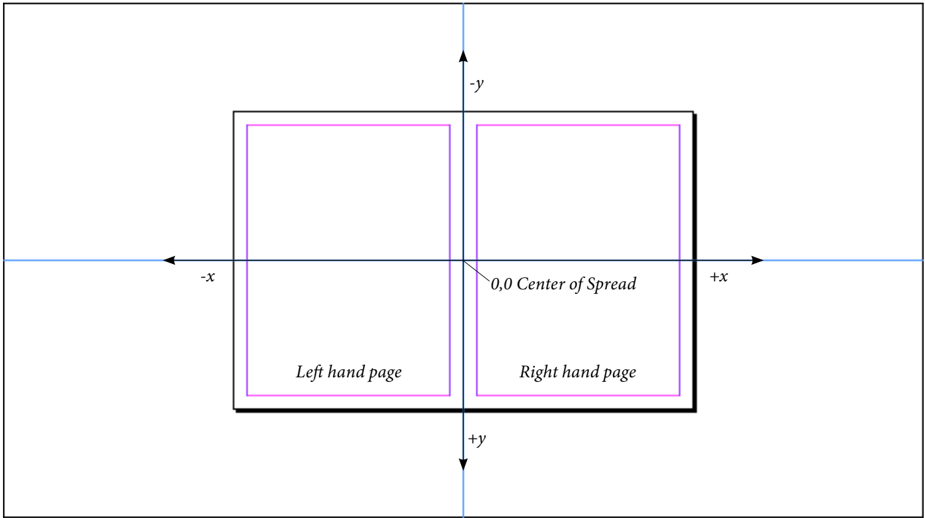

Note: The horizontal center of the spread does not correspond to the binding edge of the spread, and is not marked in any way in the In  Design user interface. Left hand pages are always added to the left of the horizontal center of the spread; right hand pages are always added to the right.

#### PageItem Geometry

The location of a <Spread> element, relative to the pasteboard coordinate system, is determined by its ItemTransform attribute. The <Spread> element uses the same units of measurement as the pasteboard coordinate system: points. The coordinate system used by a <PageItem> element, however, can be entirely arbitrary (though the coordinates are always points in IDML exported form InDesign). The relationship of the inner coordinates of the child element to the coordinate system of the <Spread> element (or other parent element) is defined by the ItemTransform attribute of the child element. What may appear to be absolute coordinates in a child element are not absolute with respect to the spread coordinate system, because the values of the ItemTransform attribute may cause the child element to move, shrink, or expand, relative to the spread.

Most of the time, when you export IDML from In  Design, <PageItem> elements that are direct children of a <Spread> element (i.e., that are not contained by other page items, groups, or anchored in text) will have a coordinate system that coincides with the spread coordinates.

The shape of each page item is defined by the contents of the <PathGeometry> element (which is inside the < Properties> element). The <PathGeometry> element contains:

- One or more <GeometryPath> elements representing the paths that make up the page item. Each <GeometryPath> element contains a <PathPointArray> element, which contains a list of <PathPoint> elements.
- Each <PathPoint> element contains attributes defining three coordinate pairs that define the location of the path point and the curvature of the line segments connecting the path point to the other points in the path. These attributes are named PathPoint Anchor (the location of the point), Left Direction (incoming Bezier control point), and Right Direction (outgoing Bezier control point). Each of these attributes take the form x y (where x is the horizontal location of the point and y is the vertical location, expressed in the inner coordinate system of the page item).
- The Path Open attribute of the <GeometryPath> element specifies whether the path is an open path or a closed path. If Is Open is true, the path is an open path; if it's false, the path is a closed path. An In  Design path does not need to be closed to display a fill that has been applied to it.

Note: In  Design paths use the Nonzero Winding Number rule (not the Even-Odd rule) to determine the fill areas of self-intersecting paths. For more on the Nonzero Winding Number rule, refer to the Pos t  S cript Language Reference Manual .

While the shape of the page item is defined by the contents of the <GeometryPath> element, the actual location of the page item in the spread depends on the contents of the Item Transform attribute of the page item. This transformation matrix defines the relationship between the inner coordinate system of the page item and the inner coordinate system of its parent.

Figure 8. PathGeometry Element

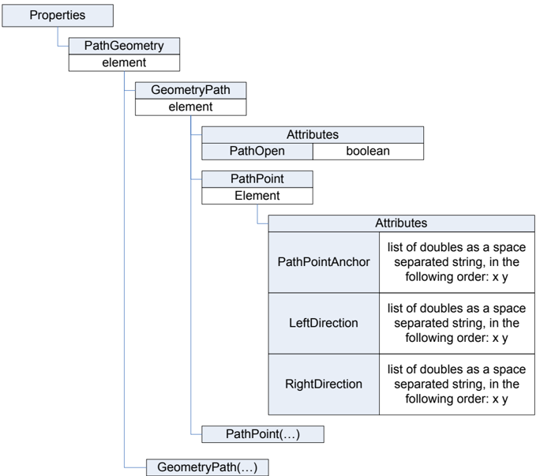

## Geometry Example

To better demonstrate the effect of transformation and object nesting in IDML, let's follow a point on a simple rectangle as it is transformed, nested inside another object, and then has another transformation applied to the parent. In this example, we'll create a rectangle with a geometric bounds defined by putting the upper left corner of the rectangle at (72, 72) and the lower right corner at (144, 144). Both corners are specified in the user interface in points, according to ruler coordinates, and assuming that the zero point is at the upper left corner of the page.

Figure 9. Example Rectangle

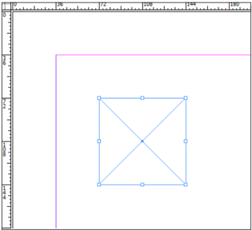

In the following figure, we've selected the point using the Direct Selection tool; the location of the point in ruler coordinates is shown in the X and Y fields of the Control panel.

Figure 10. Selected Point

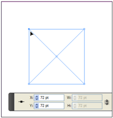

The rectangle in the above example appears in IDML as shown in the following example. The point we're following is highlighted in red.

**IDML Example 17. Untransformed Rectangle**

```xml
<Rectangle Self="ud0" ItemTransform="1 0 0 1 0 0"> <Properties> <PathGeometry> <GeometryPath PathOpen="false"> <PathPointArray> <PathPointType Anchor="72 324" LeftDirection="72 324" RightDirection="72 324"/> <PathPointType Anchor="72 252" LeftDirection="72 252" RightDirection="72 252"/> <PathPointType Anchor="144 252" LeftDirection="144 252"
RightDirection="144 252"/> <PathPointType Anchor="144 324" LeftDirection="144 324" RightDirection="144 324"/> </PathPointArray> </GeometryPath> </PathGeometry> </Properties> </Rectangle>
```

The parent of the <Rectangle> element is a <Spread> element. Since the rectangle has not been transformed, the coordinates of the rectangle are therefore coincident with the same coordinates in the spread. Again, the vertical coordinate origin for the spread is not the same as that shown on the rulers in the user interface, which is why the y coordinates in the IDML differ from what you see in the fields of the Control panel.

Next, we'll rotate the triangle by 30 degrees around its center point. When we do this, the location of the point in ruer coordinates changes, as shown in the following figure.

Figure 11. Rotation Changes the Point Location Relative to the Rulers

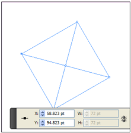

In IDML, however, the coordinates of the point do not change. The transformation is accomplished using the ItemTransform attribute of the <Rectangle> element, as shown in the example below (again, we've used red to highlight the significant parts of the IDML).

**IDML Example 18. Rotation Changes the ItemTransform Attribute in IDML**

```xml
<Rectangle Self="ud0" ItemTransform="0.8660254037844387 0.5000000000000001 0.5000000000000001 0.8660254037844387 158.46925639128065 15.415316289918337"> <Properties> <PathGeometry> <GeometryPath PathOpen="false"> <PathPointArray> <PathPointType Anchor="72 324" LeftDirection="72 324" RightDirection="72 324"/> <PathPointType Anchor="72 252" LeftDirection="72 252" RightDirection="72 252"/> <PathPointType Anchor="144 252" LeftDirection="144 252" RightDirection="144 252"/> <PathPointType Anchor="144 324" LeftDirection="144 324" RightDirection="144 324"/> </PathPointArray> </GeometryPath> </PathGeometry> </Properties> </Rectangle>
```

Next, we'll add the rectangle to a group.

Figure 12. Example Rectangle Grouped with an Ellipse

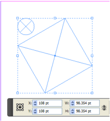

Next, we'll rotate the group by 30 degrees around its center point. As you can see from the X and Y fields in the Control panel, the location of the point changes relative to the ruler coordinates in the user interface.

Figure 13. The Example Rectangle Inside a Rotated Group

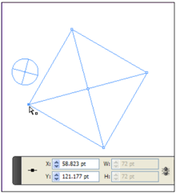

In IDML, you'll see that the <Rectangle> element now appears within a <Group> element. The location of the point inside the <Rectangle> element remains the same; the transformations are applied to the rectangle through the ItemTransform attributes of both the <Group> element and the <Rectangle> element (again, we've highlighted the significant IDML fragments with red). Because we rotated the group by the same angle as the rectangle, the ItemTransform values are the same (showing a 30 degree rotation), but the important point is that the ItemTransform and PathGeometry sections of the rectangle do not change when the group was transformed.

**IDML Example 19. The Rectangle is Transformed by the ItemTransform Attribute of both the Rectangle and the Group**

```xml
<Group Self="ud2" ItemTransform="0.8660254037844387 0.5000000000000001 0.5000000000000001 0.8660254037844387 158.46925639128065 15.415316289918337"> <Rectangle Self="ud0" ItemTransform="0.8660254037844387 0.5000000000000001 0.5000000000000001 0.8660254037844387 158.46925639128065 15.415316289918337"> <Properties> <PathGeometry> <GeometryPath PathOpen="false"> <PathPointArray> <PathPointType Anchor="72 324" LeftDirection="72 324" RightDirection="72 324"/> <PathPointType Anchor="72 252" LeftDirection="72 252" RightDirection="72 252"/> <PathPointType Anchor="144 252" LeftDirection="144 252" RightDirection="144 252"/> <PathPointType Anchor="144 324" LeftDirection="144 324" RightDirection="144 324"/> </PathPointArray> </GeometryPath> </PathGeometry> </Properties> </Rectangle> <Oval Self="ud1" ItemTransform="1 0 0 1 0 0"> <Properties> <PathGeometry> <GeometryPath PathOpen="false"> <PathPointArray> <PathPointType Anchor="69.6615427318801 315.5" LeftDirection="63.67562810529901 315.5" RightDirection="75.6474573584612 315.5"/> <PathPointType Anchor="80.5 326.3384572681199" LeftDirection="80.5 320.35254264153883" RightDirection="80.5 332.32437189470096"/> <PathPointType Anchor="69.6615427318801 337.1769145362398" LeftDirection="75.6474573584612 337.1769145362398" RightDirection="63.67562810529901 337.1769145362398"/> <PathPointType Anchor="58.82308546376021 326.3384572681199" LeftDirection="58.82308546376021 332.32437189470096" RightDirection="58.82308546376021 320.35254264153883"/> </PathPointArray> </GeometryPath> </PathGeometry> </Properties> </Oval> </Group>
```

The coordinates of the example point remain the same, because they're expressed in the inner coordinates of the rectangle. The successive application of transformations via the ItemTransform attributes of the <Rectangle> element and its container elements (a <Group> element and a <Spread> element, in this example) determine where the point appears on the page you see in the InDesign user interface.

### 10.3.4 Rich Interactive Document Features

InDesign CS5 introduces a number of new features for creating interactive objects for export to SWF and PDF documents. These features add a new type of page item, the Multi-State Object (or MSO), which, like a button, is a container for a series of other page items. In addition, all page items gained a new element, <AnimationSettings>, which controls the animation of the object in the exported file. The <TimingSetting> element, which appears inside the <Spread> and <MasterSpread> elements and inside all page item elements, contains further elements that control the timing of the animation and supported dynamic media such as video and sound..

#### Animation Settings

The animation of a page item exported to a SWF document is controlled by the properties of the <AnimationSetting> element of the page item element.

**Example 56. AnimationSetting**

```
AnimationSetting_Object = element AnimationSetting { attribute TransformOffsets { list { xsd:double,xsd:double } }?, attribute Duration { xsd:double {minInclusive="0.125" maxInclusive="60"} }?, attribute DesignOption { DesignOptions_EnumValue }?, attribute EaseType { AnimationEaseOptions_EnumValue }?, attribute Plays { xsd:int {minInclusive="1" maxInclusive="100"} }?, attribute PlaysLoop { xsd:boolean }?, attribute InitiallyHidden { xsd:boolean }?, attribute HiddenAfter { xsd:boolean }?, attribute HasCustomSettings { xsd:boolean }?, element Properties { element Preset { (object_type, xsd:string ) | (string_type, xsd:string ) | (enum_type, NothingEnum_EnumValue ) }?& element MotionPathPoints { GeometryPathType_TypeDef }?& element MotionPath { element AnimationDataPathKeyFrameType { AnimationDataPathKeyFrameType_TypeDef }* }?& element OpacityArray { element AnimationDataKeyFrameType { AnimationDataKeyFrameType_TypeDef }* }?& element RotationArray { element AnimationDataKeyFrameType { AnimationDataKeyFrameType_TypeDef }* }?& element ScaleXArray { element AnimationDataKeyFrameType { AnimationDataKeyFrameType_TypeDef }* }?& element ScaleYArray { element AnimationDataKeyFrameType { AnimationDataKeyFrameType_TypeDef }* }? } ? }
```

**Table 70**: AnimationSetting Properties Represented as Attributes

|Name              | Type                               | Req     | Description |
| --------------    |----------------------------------| ------- | ------------------------------------------------------------------------------- |
| DesignOption      |DesignOptions_EnumValue           | no      | Can be FromCurrentAppearance, ToCurrentAppearance, or ToCurrentLocation . |
| Duration          | double                             | no      | The duration of the animation, from .125 to 60 seconds. |
| EaseType          | AnimationEaseOptions_EnumValue   | no      | Can be NoEase, EaseIn . EaseOut . EaseInOut . or CustomEase . |
| HasCustomSettings | Boolean                            | no      | If true, the animated object has custom settings. |
| HiddenAfter       | Boolean                            | no      | If true, the animated object is hidden after playing. |
| InitiallyHidden   | Boolean                            | no      | If true, the animated object is hidden before playing. |
| Plays             | int                                | no      | The number of times to play the animation. |
| PlaysLoop         | Boolean                            | no      | If true, the animation loops. |
| TransformOffsets  | list of two doubles                | no      | The transform offset percentage from the target object bounding box's left-top corner. |

**Table 71**: AnimationSetting Properties Represented as Elements

| Name               | Type                              | Req     | Description |
| ------------------ | --------------------------------- | ------- | -------------------------------------------------------------------------------------------------------------------------------------------------------------------------------------------------------- |
| MotionPath         | AnimationDataPathKeyFrameType   | no      | The list of motion path points and key frames for this animation. MotionPath and MotionPathPoints are mutually exclusive. Typically a path is either defined by one type or the other, but not both. |
| MotionPathPoints   | GeometryPathType_TypeDef         | no      | The list of motion path points for this anima- tion. MotionPath and MotionPathPoints are mutually exclusive. Typically a path is either defined by one type or the other, but not both. |
| OpacityArray       | AnimationDataKeyFrameType       | no      | The list of opacity key frames for this animation. |
| Preset             | string                            | no      | The motion preset applied to the animated object. Can be a reference to the self attribute of a motion preset in the IDML file, or one of InDesign's default motion presets: appear, disappear, fade-in, fade-out, fly-in-bottom, fly-in-left, fly-in-right, fly-in-top, fly-in-blur-bottom, fly-in-blur-left, fly-in-blur-right, fly-in-blur-top, fly-out-bottom, fly-out-left, fly-out-right, fly-out-top, grow, grow-big, move-left, move-right, move-left-grow, move-left-shrink, move-right-grow, move-right-shrink, rotate180cw, rotate90cw, rotate180ccw, rotate90ccw, shrink, spring-left, spring-right, zoom-in-2D, zoom-out-2D, large-bounce, med-bounce, small-bounce, multiple-bounce, bounce-smoosh, dance, flyin-pause-flyout, flyin-stop-flyout, gallop, pulse, smoke, twirl, swoosh, or wave . Can also be a custom motion preset, as the file name (exclud- ing its extension) containing the preset. Motion presets are stored in the Presets/Motion presets folder inside the InDesign application folder. User custom presets are stored the Motion Pre- sets folder inside the Preferences folder in the InDesign application folder. |
| RotationArray      | AnimationDataKeyFrameType       |         | The list of rotation key frames for this animation. |
| ScaleXArray        | AnimationDataKeyFrameType       |         | The list of scale x key frames for this animation. |
| ScaleYArray        | AnimationDataKeyFrameType       |         | The list of scale y key frames for this animation. |

**IDML Example 20. AnimationSetting**

```xml
<AnimationSetting TransformOffsets="0 0" Duration="1" DesignOption="FromCurrentApp earance" EaseType="EaseIn" Plays="1" PlaysLoop="true" InitiallyHidden="false" HiddenAfter="false" HasCustomSettings="true"> <Properties> <Preset type="object">u10b</Preset> <MotionPathPoints PathOpen="true"> <PathPointArray> </PathPointArray> </MotionPathPoints> <MotionPath> <AnimationDataPathKeyFrameType KeyFrame="0"> <PathPoint Anchor="0 0" LeftDirection="0 0" RightDirection="0 0"/> </AnimationDataPathKeyFrameType> <AnimationDataPathKeyFrameType KeyFrame="23"> <PathPoint Anchor="0.55 4" LeftDirection="0.55 4" RightDirection="0.55 4"/> </AnimationDataPathKeyFrameType></MotionPath> <OpacityArray> <AnimationDataKeyFrameType KeyFrame="0" Value="0"/> <AnimationDataKeyFrameType KeyFrame="23" Value="100"/> </OpacityArray> <RotationArray> <AnimationDataKeyFrameType KeyFrame="0" Value="0"/> <AnimationDataKeyFrameType KeyFrame="23" Value="45"/> </RotationArray> <ScaleXArray> <AnimationDataKeyFrameType KeyFrame="0" Value="100"/> <AnimationDataKeyFrameType KeyFrame="23" Value="50"/> </ScaleXArray> <ScaleYArray> <AnimationDataKeyFrameType KeyFrame="0" Value="100"/> <AnimationDataKeyFrameType KeyFrame="23" Value="150"/> </ScaleYArray> </Properties> </AnimationSetting>
```

**Animation Timing**

The <TimingSetting> element contains one or more <TimingList> elements, which contain one or more <TimingGroup> elements. Each <TimingGroup> element contains at least one <TimingTarget> element. The <TimingTarget> element can be an animation, video, sound, or multi-state object. Video and buttons can also be animated. The order and grouping of elements inside the <TimingSetting> element defines the ordering of the animations in the object containing the <TimingSetting> . The order of <TimingGroup> elements inside a <TimingList> determines the sequence of animation of groups of objects, and the order of <TimingTarget> elements in a <TimingGroup> element determines the order of animation of individual page items inside the <TimingGroup> .

**Example 57. TimingSetting**

```
TimingSetting_Object = element TimingSetting ( TimingList_Object* ) } Schema Example 58. TimingList TimingList_Object = element TimingList { attribute Self { xsd:string } attribute TriggerEvent { DynamicTriggerEvents_EnumValue } ?, ( TimingGroup_Object* ) }
```

**Table 72**: TimingList Properties Represented as Attributes

| Name           | Type                               | Req     | Description |
| -------------- | ---------------------------------- | ------- | ----------------------------------------------------------------------------------------------------------------------------------------------------------- |
| TriggerEvent   | DynamicTriggerEvents_EnumValue   | no      | The event that triggers the animation. Can be OnPageLoad, OnPageClick, OnClick, OnRollover, OnRelease, OnRolloff, OnSelfClick, or OnSelfRollover . |

**Example 60. TimingGroup**

```
TimingGroup_Object = element TimingGroup { attribute Self { xsd:string }, attribute Plays { xsd:int {minInclusive="1" maxInclusive="100"} }?, attribute PlaysLoop { xsd:boolean }?, ( TimingTarget_Object* ) }
```

**Table 73**: TimingGroup Properties Represented as Attributes

| Name        | Type      | Req     | Description |
| ----------- | --------- | ------- | ----------------------------------------------------------------------------- |
| Plays       | int       | no      | The number of times to play the timing group. Ignored if PlaysLoop is true. |
| PlaysLoop   | boolean   | no      | If true, play the timing group in a loop. |

**Example 61. TimingTarget**

```
TimingTarget_Object = element TimingTarget { attribute Self { xsd:string }, attribute DynamicTarget { xsd:string }?, attribute DelaySeconds { xsd:double {minInclusive="0" maxInclusive="60"} }?, attribute ReverseAnimation { xsd:boolean }?, attribute TargetRole { xsd:int }?, attribute TargetAction { xsd:int }?, attribute Placement { xsd:int }? }
```

**Table 74**: TimingTarget Properties Represented as Attributes

| Name               | Type      | Req     | Description |
| ------------------ | --------- | ------- | --------------------------------------------------------------------------------------------------------------------------------------------------------------------------------- |
| DynamicTarget      | string    | no      | The animated page item, as a reference to the Self attribute of the animated page item, video, sound, or multi-state object. Video and buttons can also be animated. |
| DelaySeconds       | int       | no      | The time delay in seconds for this target, relative to the start of the current timing group. |
| ReverseAnimation   | boolean   | no      | If true, reverse the animation. Only valid when the DynamicTriggerEvent for the <TimingList> containing the <TimingGroup> of the <TimingTarget> is OnRolloff or OnSelfRolloff . |

| Name           | Type     | Req     | Description |
| -------------- | -------- | ------- | ------------------------------------------------------------------------------------------------ |
| TargetRole     | int      | no      | The target in the timing as video, sound, anima- tion, or other suppported dynamic media type. |
| TargetAction   | int      | no      | The action associated with this target when exported to SWF. |
| Placement      | int      | no      | The placement of the timing target in the timing group. |

**IDML Example 21. TimingSetting**

```xml
<TimingSetting UnassignedDynamicTargets=""> <TimingList Self="ubbTimingSetting1TimingList0" TriggerEvent="OnPageLoad"> <TimingGroup Self="ubbTimingSetting1TimingList0TimingGroup0" Plays="1" PlaysLoop="false"> <TimingTarget Self="ubbTimingSetting1TimingList0TimingGroup0if7" DynamicTarget="uf7" DelaySeconds="2" ReverseAnimation="false" TargetRole="132354" TargetAction="132353" Placement="0"/> </TimingGroup> <TimingGroup Self="ubbTimingSetting1TimingList0TimingGroup1" Plays="1" PlaysLoop="false"> <TimingTarget Self="ubbTimingSetting1TimingList0TimingGroup1if8" DynamicTarget="uf8" DelaySeconds="0" ReverseAnimation="false" TargetRole="132355" TargetAction="132353" Placement="0"/> </TimingGroup> </TimingList> </TimingSetting>
```

### 10.3.5 PageItem Examples

The following IDML example shows a simple rectangle.

**IDML Example 22. Rectangle**

```xml
<Rectangle Self="ucd" Item Transform="1 0 0 1 0 0"> <Properties> <PathGeometry> <GeometryPath Path Open="false"> <PathPointArray> <PathPoint Type Anchor="72 324" Left Direction="72 324" Right Direction="72 324"/> <PathPoint Type Anchor="72 252" Left Direction="72 252" Right Direction="72 252"/> <PathPoint Type Anchor="144 252" Left Direction="144 252" Right Direction="144 252"/> <PathPoint Type Anchor="144 324" Left Direction="144 324" Right Direction="144 324"/> </PathPointArray> </GeometryPath>> </PathGeometry> </Rectangle>
```

## Nested PageItem

In  Design page items can be pasted inside other page items. IDML reflects this capability by storing the nested page items as child elements of the page item element, as shown in the following example.

**IDML Example 23. Nested PageItem**

```xml
<Rectangle Self="ucd" Item Transform="1 0 0 1 0 0"> <Properties> <PathGeometry> <GeometryPath Path Open="false"> <PathPointArray> <PathPoint Type Anchor="72 324" Left Direction="72 324" Right Direction="72 324"/> <PathPoint Type Anchor="72 252" Left Direction="72 252" Right Direction="72 252"/> <PathPoint Type Anchor="144 252" Left Direction="144 252" Right Direction="144 252"/> <PathPoint Type Anchor="144 324" Left Direction="144 324" Right Direction="144 324"/> </PathPointArray> </GeometryPath>> </PathGeometry> </Properties> <Rectangle Self="uda" Item Transform="1 0 0 1 0 0"> <Properties> <PathGeometry> <GeometryPath Path Open="false"> <PathPointArray> <PathPoint Type Anchor="84 312" Left Direction="84 312" Right Direction="84 312"/> <PathPoint Type Anchor="84 288" Left Direction="84 288" Right Direction="84 288"/> <PathPoint Type Anchor="108 288" Left Direction="108 288" Right Direction="108 288"/> <PathPoint Type Anchor="108 312" Left Direction="108 312" Right Direction="108 312"/> </PathPointArray> </GeometryPath>>
```

Figure 14. Simple PageItem (a Rectangle)

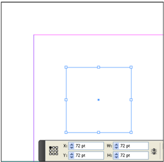

</PathGeometry> </Properties> </Rectangle> </Rectangle>

## Rotated PageItem

The following example shows a page item that has been rotated by 30 degrees around its center point. Note that the path point coordinates and geometric bounds remain the same as in the previous example; only the transformation matrix changes.

In general, applying a counterclockwise rotation using the transformation matrix takes the form:

```latex
a = cos(angle), b =-sin(angle), c = sin(angle), d = cos(angle)
```

Where a, b, c, and d are the first four values in the transformation matrix and angle is the angle of rotation (in degrees).

**IDML Example 24. Rotated PageItem**

```xml
<Rectangle Self="ucd" Item Transform=" 0.8660254037844387 0.5 0.5 0.8660254037844387 0 0"> <Properties> <PathGeometry> <GeometryPath Path Open="false"> <PathPointArray> <PathPoint Type Anchor="72 324" Left Direction="72 324" Right Direction="72 324"/> <PathPoint Type Anchor="72 252" Left Direction="72 252" Right Direction="72 252"/> <PathPoint Type Anchor="144 252" Left Direction="144 252" Right Direction="144 252"/> <PathPoint Type Anchor="144 324" Left Direction="144 324" Right Direction="144 324"/> </PathPointArray> </GeometryPath>> </PathGeometry> </Properties> </Rectangle>
```

Figure 15. Nested PageItem

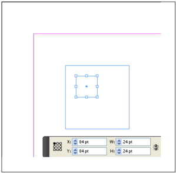

Figure 16. Rotated PageItem

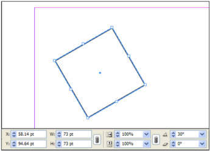

The following example shows the transformation matrix for the rectangle:

```latex
a = 0.8660254037844387 = Cosine of 30 degrees. b = 0.5 = Negative sine of 30 degrees. c = 0.5 = Sine of 30 degrees. d = 0.8660254037844387 = Cosine of 30 degrees.
```

## Transformations and Nested PageItems

The following example shows a rectangle that has been rotated 30 degrees and then pasted inside another rectangle. The container rectangle is then rotated a further 15 degrees.

```xml
<Rectangle Self="ucd" Item Transform="0.9659258262890683 0.25881904510252074 0.25881904510252074 0.9659258262890683 0 0"> <Properties> <PathGeometry> <GeometryPath Path Open="false"> <PathPointArray> <PathPoint Type Anchor="72 324" Left Direction="72 324" Right Direction="72 324"/> <PathPoint Type Anchor="72 252" Left Direction="72 252" Right Direction="72 252"/> <PathPoint Type Anchor="144 252" Left Direction="144 252" Right Direction="144 252"/> <PathPoint Type Anchor="144 324" Left Direction="144 324" Right Direction="144 324"/> </PathPointArray> </GeometryPath>> </PathGeometry> </Properties> <Rectangle Self="uda" Item Transform=" 0.8660254037844387 0.5 0.5 0.8660254037844387 0 0"> <Properties> <PathGeometry> <GeometryPath Path Open="false"> <PathPointArray> <PathPoint Type Anchor="84 312" Left Direction="84 312" Right Direction="84 312"/> <PathPoint Type Anchor="84 288" Left Direction="84 288" Right Direction="84 288"/> <PathPoint Type Anchor="108 288" Left Direction="108 288" Right Direction="108 288"/> <PathPoint Type Anchor="108 312" Left Direction="108 312" Right Direction="108 312"/> </PathPointArray> </GeometryPath>> </PathGeometry> </Properties> </Rectangle> </Rectangle>
```

Figure 17. Outer Rectangle

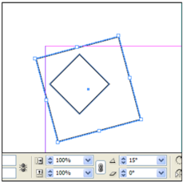

Figure 18. Inner Rectangle

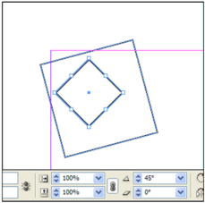

Viewed from In  Design's user interface, you can see that the rotation is cumulative-the rotation applied to the inner rectangle is the sum of its original rotation plus the rotation of the outer rectangle. The transformation matrices in the IDML example reflect this rotation. The following is the transformation matrix for the outer rectangle (formatted for easier reading):

```
a = 0.9659258262890683 = Cosine of 15 degrees. b = 0.25881904510252074 = Negative sine of 15 degrees. c = 0.25881904510252074 = Sine of 15 degrees. d = 0.9659258262890683 = Cosine of 15 degrees.
```

The following example shows the transformation matrix for the inner rectangle:

```
a = 0.8660254037844387 = Cosine of 30 degrees. b = 0.5000000000000001 = Negative sine of 30 degrees. c = 0.5000000000000001 = Sine of 30 degrees. d = 0.8660254037844387 = Cosine of 30 degrees.
```

## Spline Item Containing an Imported Graphic

Placed (imported) graphics always appear inside a spline item. This spline item can be a rectangle, a graphic line, an oval, or a polygon (these spline items can be nested inside a <State> element of a <Button> element or a <MultiStateObject> element). There is no special class of page item for a graphic frame.

The imported graphic itself can be an <Image>, a <PDF>, an <ImportedPage>, an <EPS>, a <PICT>, or a <WMF> . All of these elements share the attributes and elements of the <Graphic> object, and add a few attributes and elements specific to their specific object type. <WMF> and <PICT> elements are identical to <Graphic> .

**Schema Example 62. raphic Schema**

```
Graphic_Object = element Graphic { attribute Self { xsd:string }, attribute LocalDisplaySetting { DisplaySettingOptions_EnumValue }?, attribute ImageTypeName { xsd:string }?, attribute AppliedObjectStyle { xsd:string }?, attribute ItemTransform { TransformationMatrixType_TypeDef }?, attribute LinkResourceId { xsd:int }?, attribute ParentInterfaceChangeCount { list { xsd:int * } }?, attribute TargetInterfaceChangeCount { list { xsd:int * } }?, attribute LastUpdatedInterfaceChangeCount { list { xsd:int * } }?, attribute LinkedSourceTableId { xsd:int }?, attribute HorizontalLayoutConstraints { list { DimensionsConstraints_EnumValue,DimensionsConstraints_EnumValue,DimensionsConstraints_EnumValue } }?, attribute VerticalLayoutConstraints { list { DimensionsConstraints_EnumValue,DimensionsConstraints_EnumValue,DimensionsConstraints_EnumValue } }?, attribute FillColor { xsd:string }?, attribute FillTint { xsd:double }?, attribute OverprintFill { xsd:boolean }?, attribute CornerRadius { xsd:double }?, attribute StrokeWeight { xsd:double }?, attribute MiterLimit { xsd:double {minInclusive="1" maxInclusive="500"} }?, attribute EndCap { EndCap_EnumValue }?, attribute EndJoin { EndJoin_EnumValue }?, attribute StrokeType { xsd:string }?, attribute StrokeCornerAdjustment { StrokeCornerAdjustment_EnumValue }?, attribute StrokeDashAndGap { list { xsd:double * } }?, attribute LeftLineEnd { ArrowHead_EnumValue }?, attribute RightLineEnd { ArrowHead_EnumValue }?, attribute StrokeColor { xsd:string }?, attribute StrokeTint { xsd:double }?, attribute GradientFillStart { UnitPointType_TypeDef }?, attribute GradientFillLength { xsd:double }?, attribute GradientFillAngle { xsd:double }?, attribute GradientStrokeStart { UnitPointType_TypeDef }?, attribute GradientStrokeLength { xsd:double }?, attribute GradientStrokeAngle { xsd:double }?, attribute OverprintStroke { xsd:boolean }?, attribute GapColor { xsd:string }?, attribute GapTint { xsd:double }?, attribute OverprintGap { xsd:boolean }?, attribute StrokeAlignment { StrokeAlignment_EnumValue }?, attribute Nonprinting { xsd:boolean }?, attribute ItemLayer { xsd:string }?, attribute Locked { xsd:boolean }?, attribute GradientFillHiliteLength { xsd:double }?, attribute GradientFillHiliteAngle { xsd:double }?, attribute GradientStrokeHiliteLength { xsd:double }?, attribute GradientStrokeHiliteAngle { xsd:double }?, attribute CornerOption { CornerOptions_EnumValue }?, attribute Visible { xsd:boolean }?, attribute Name { xsd:string }?, attribute TopLeftCornerOption { CornerOptions_EnumValue }?, attribute TopRightCornerOption { CornerOptions_EnumValue }?, attribute BottomLeftCornerOption { CornerOptions_EnumValue }?, attribute BottomRightCornerOption { CornerOptions_EnumValue }?, attribute TopLeftCornerRadius { xsd:double }?, attribute TopRightCornerRadius { xsd:double }?, attribute BottomLeftCornerRadius { xsd:double }?, attribute BottomRightCornerRadius { xsd:double }?, element Properties { element Contents { text }?& element GraphicProxy { text }?& element ClippingPathGeometry { element GeometryPathType { GeometryPathType_TypeDef }* }?& element GraphicBounds { RectangleBoundsType_TypeDef }?& element Label { element KeyValuePair { KeyValuePair_TypeDef }* }? } ?, ( TransparencySetting_Object?& TextWrapPreference_Object?& LinkedPageItemOption_Object?& MetadataPacketPreference_Object?& AnimationSetting_Object?& TimingSetting_Object? ) }
```

<Graphic> elements inherit all of the attributes and elements of page item elements, and add the unique attributes and elements shown in the following tables.

**Table 75**: Graphic Properties Represented as Attributes

| Name            | Type     | Req     | Description |
| --------------- | -------- | ------- | ------------------------ |
| ImageTypeName   | string   | no      | The type of the image. |

**Table 76**: Graphic Properties Represented as Elements

| Name                     | Type              | Req     | Description |
| ------------------------ | ----------------- | ------- | ------------------------------------------------------------------------------------------------------------ |
| ClippingPathGeometry   | GeometryPath      | no      | The clipping path for the graphic. |
| Contents                 | text              | no      | If the graphic is embedded (rather than stored externally), this element contains the data of the graphic. |
| GraphicBounds            | list of doubles   | no      | The geometric bounds of the image, in the form [x1, y1, x2, y2]. |
| GraphicProxy             | text              | no      | The data of the proxy image. |

**Table 77**: Image Properties Represented as Attributes

| Name                     | Type                         | Req     | Description |
| ------------------------ | ----------------------------| ------- | ------------------------------------------------------------------------------- |
| ActualPPI                | list of two doubles          | no      | The actual pixels per inch of the image, in the form horizontal, vertical |
| EffectivePpi             |listof two doubles          | no      | The effective pixels per inch of the image, in the form horizontal, vertical. |
| ImageRenderingIntent   |RenderingIntent_EnumValue   | no      | The rendering intent of the image. |
| Space                    | string                       | no      |  |

**Table 78**: Image Properties Represented as Elements

| Name      | Type                          | Req     | Description |
| --------- | ----------------------------- | ------- | --------------------------------------------------------------------------------------------------------------------------------------------- |
| Profile   | Profile_EnumValue or string   | no      | The color profile applied to the image. Can be NoCMS, PostScriptCMS, UseDocument, Working, or a string that is the name of the profile. |

**Table 79**: PDF and EPS Properties Represented as Attributes

| Name               | Type                                     |Req     | Description |
| ------------------ | ---------------------------------------- | ------- | ----------------------------------------------------------------------------------------------------------------------------------- |
| ActualPPI          | list of two dubles                     |no      | The actual pixels per inch of the image, in the form horizontal, vertical |
| CMKYVectorPolicy   | PlacedVectorProfilePolicy_EnumValue   |no      | The color profile policy for CMYKcontent in a placed graphic. Can be HonorAllProfiles, IgnoreAll, or IgnoreOutputIntent . |
| GrayVectorPolicy   | PlacedVectorProfilePolicy_EnumValue  | no      | The color profile policy for grayscale content in a placed graphic. Can be HonorAllProfiles, IgnoreAll, or IgnoreOutputIntent . |
| RGBVectorPolicy0   | PlacedVectorProfilePolicy_EnumValue   | no      | The color profile policy for RGB content in a placed graphic. Can be HonorAllProfiles, IgnoreAll, or IgnoreOutputIntent . |

| Name     | Type     | Req     | Description |
| -------- | -------- | ------- | --------------- |
| Space    | string   | no      |  |

PDFs include the <PDFAttribute> element, which contains properties specific to imported PDFs.

**Schema Example 63. PDFAttribute**

```
PDFAttribute_Object = element PDFAttribute { attribute PageNumber { xsd:int }?, attribute PDFCrop { PDFCrop_EnumValue }?, attribute TransparentBackground { xsd:boolean }? }
```

**Table 80**: PDFAttribute Properties Represented as Attributes

| Name                      | Type                | Req     | Description |
| ------------------------- | ------------------- | ------- | --------------- |
| PageNumber                | int                 | no      |  |
| PDFCrop                   | PDFCrop_EnumValue   | no      |  |
| TransparentBackground   | boolean             | no      |  |

InDesign can import pages from other InDesign documents as graphics. These pages are represented in IDML by the <ImportedPage> element, which contains the following unique properties.

**Table 81**: ImportedPage Properties Represented as Attributes

| Name               | Type                                  | Req     | Description |
| ------------------ | ------------------------------------- | ------- | ------------------------------------------------------------------------------------------- |
| ImportedPageCrop   | ImportedPageCropOptions_EnumValue   | no      | The cropping applied to the imported page. Can be CropContent, CropBleed, or CropSlug . |
| PageNumber         | int                                   | no      | Which page of the InDesign document should be imported. |

The following example shows an image that has been placed inside the rectangle that we've used in the previous examples. We've omitted the XMP metadata from this example.

**IDML Example 25. PageItem Containing an Imported Graphic**

```xml
<Rectangle Self="ufe" ContentType="GraphicType" ItemLayer="ub6" AppliedObjectStyle="ObjectStyle/$ID/[None]" Visible="true" Name="$ID/" ItemTransform="1 0 0 1 4.200000000000003 6.600000000000023"> <Properties> <PathGeometry> <GeometryPath PathOpen="false"> <PathPointArray> <PathPointType Anchor="76.2 330.6" LeftDirection="76.2 330.6" RightDirection="76.2 330.6"/> <PathPointType Anchor="76.2 258.6" LeftDirection="76.2 258.6" RightDirection="76.2 258.6"/> <PathPointType Anchor="148.2 258.6" LeftDirection="148.2 258.6" RightDirection="148.2 258.6"/> <PathPointType Anchor="148.2 330.6" LeftDirection="148.2 330.6" RightDirection="148.2 330.6"/> </PathPointArray> </GeometryPath> </PathGeometry> </Properties> <FrameFittingOption LeftCrop="12.000000000000014" TopCrop="18.720000000000027" RightCrop="12" BottomCrop="18.719999999999914"/> <Image Self="u101" Space="$ID/#Links_RGB" ActualPpi="300 300" EffectivePpi="500 500" ImageRenderingIntent="UseColorSettings" LocalDisplaySetting="Default" ImageTypeName="$ID/JPEG" AppliedObjectStyle="ObjectStyle/$ID/[None]" ItemTransform="0.6 0 0 0.6 69 341.83200000000005" Visible="true" Name="$ID/"> <Properties> <Profile type="string">$ID/Embedded</Profile> <GraphicBounds Left="0" Top="0" Right="144" Bottom="157.44"/> </Properties> <TextWrapPreference Inverse="false" ApplyToMasterPageOnly="false" TextWrapSide="BothSides" TextWrapMode="None"> <Properties> <TextWrapOffset Top="0" Left="0" Bottom="0" Right="0"/> </Properties> <ContourOption ContourType="SameAsClipping" IncludeInsideEdges="false" ContourPathName="$ID/"/> </TextWrapPreference> <Link Self="u106" AssetURL="$ID/" AssetID="$ID/" LinkResourceURI="file:C:/pumpkin.jpg" LinkResourceFormat="$ID/JPEG" StoredState="Normal" LinkClassID="35906" LinkClientID="257" LinkResourceModified="false" LinkObjectModified="false" ShowInUI="true" CanEmbed="true" CanUnembed="true" CanPackage="true" ImportPolicy="NoAutoImport" ExportPolicy="NoAutoExport" LinkImportStamp="file 129053780397050268 396019" LinkImportModificationTime="20091215T11:13:59" LinkImportTime="20091221T16:52:00"/> <ClippingPathSettings ClippingType="None" InvertPath="false" IncludeInsideEdges="false" RestrictToFrame="false" UseHighResolutionImage="true" Threshold="25" Tolerance="2" InsetFrame="0" AppliedPathName="$ID/" Index="1"/> <ImageIOPreference ApplyPhotoshopClippingPath="true" AllowAutoEmbedding="true" AlphaChannelName="$ID/"/> </Image> </Rectangle>
```

The example image is slightly larger than the rectangle. When you select the graphic in the InDesign user interface, you can see that the bounds of the graphic are outside the bounds of the containing rectangle (in the illustration below, the graphic is selected; the frame itself is the light blue square within the bounding box of the graphic).

## Movies and Sounds

InDesign can place movie and sound files into a document. These media files can be played in exported SWF and PDF files. Movies and sounds share most of their properties with other page items, but each features a few unique properties.

Supported movie and sound file types: MOV (QuickTime), MPEG, AVI, WAV, AU, AIF, SWF, FLV, F4V, MP4, MP3 and H.264-encoded MOV files.

**Table 82**: Movie Properties Represented as Attributes

| Name                       | Type                                   | Req     | Description |
| -------------------------- | -------------------------------------- | ------- | ---------------------------------------------------------------------------------------------------------------------------------------------------------------------------------------------------------------------------------------------------------------- |
| CanChoosePosters           | boolean                                | no      | If true, the user can choose a poster image for the movie. |
| ControllerSkin             | string                                 | no      | Applicable to FLV/F4V clips only. The video con- troller skin name. Can be None, SkinOverAll, SkinOverAllNoCaption, SkinOverAllNoFullNoCaption, SkinOverAllNoFullscreen, SkinOverAllNoVolNoCaptionNoFull, SkinOverPlay . Uses None as a default value. |
| CustomPoster               | boolean                                | no      | If true, the movie has had a custom poster image applied to it. |
| Description                | string                                 | no      | Adescription of the movie. |
| EmbedInPDF                 | boolean                                | no      | If true, embed the movie in exported PDF. |
| FilePath                   | string                                 | no      | The file path to the movie file. |
| FloatingWindow             | boolean                               | no      | If true, display the movie in a floating window (on playback in an exported PDF or SWF docu- ment). |
| FloatingWindowPosition   | FloatingWindowPosition_EnumValue   | no      | The position of the floating window. Can be UpperLeft, UpperMiddle, UpperRight, CenterLeft, Center, CenterRight, LowerLeft, LowerMiddle, or LowerRight . |
| FloatingWindowSize       | FloatingWindowSize_EnumValue         | no      | The Size of the floating window. Can be OneFifth, OneFourth, OneHalf, Full, Double, Triple, Quadruple, or Max . Only valid when FloatingWindow is true. |
| IntrinsicBounds            | list of int                            | no      | The bounds of the movie file, as width, height. |

Figure 19. PageItem Containing an Imported Graphic

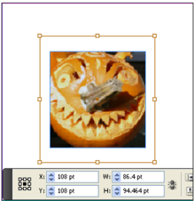

| Name              | Type                   | Req     | Description |
| ----------------- | ---------------------- | ------- | --------------------------------------------------------------------------------------------------------------------------------------- |
| MovieLoop         | boolean               | no      | If true, loop the movie in the exported PDF or SWF document. |
| PlayMode          | PlayMode_EnumValue   | no      | The play mode for the movie. Can be Once, StayOpen, or RepeatPlay . |
| PlayOnPageTurn    | boolean                | no      | If true, the movie plays automatically when a user views the page that contains the movie poster in the exported PDF or SWF document. |
| PosterAvailable   | boolean                | no      | If true, the movie file contains a poster image. |
| ShowController    | boolean                | no      | Applicable to FLV/F4V clips only. If true, dis- plays controller skin with mouse rollover. |
| ShowControls      | boolean                | no      | If true, show movie playback controls in the exported PDF or SWF document |
| URL               | string                 | no      | The URL of the movie. |

**IDML Example 26. Movie**

```xml
<Movie Self="ufa" Name="birdbridge.f4v" Description="" FloatingWindowPosition="Center" FloatingWindowSize="Full" PlayOnPageTurn="false" ShowControls="false" FloatingWindow="false" EmbedInPDF="false" PlayMode="Once" CustomPoster="false" FilePath="C:\birdbridge.f4v" ControllerSkin="SkinOver AllNoCaption" ShowController="true" MovieLoop="false" ItemTransform="1 0 0 1 0 0" LocalDisplaySetting="Default" AppliedObjectStyle="ObjectStyle/$ID/[None]" Visible="true">
```

A <NavigationPoint> element in a <Movie> element represents a cue point in the video.

**Schema Example 64. NavigationPoint**

```
NavigationPoint_Object = element NavigationPoint { attribute Self { xsd:string }, attribute Id { xsd:int }?, attribute Name { xsd:string }?, attribute Time { xsd:double }? }
```

| Name     | Type     | Req     | Description |
| -------- | -------- | ------- | ------------------------------------------------------------------------------------------------------------------------------------- |
| Id       | int      | no      | Unique identifier for the cue point. If this is not specified, a unique number will be assigned as the Id for the navigation point. |
| Name     | string   | no      | The UI display name (not unique) - free form string. |
| Time     | double   | no      | The time in seconds. While reading this value, InDesign rounds it up to two places of decimal. |

**IDML Example 27. NavigationPoint**

```xml
<NavigationPoint Self="uf7NavigationPoint0" Id="1" Name="Point 1" Time="0.53"/>
```

**Table 83**: Sound Properties Represented as Attributes

| Name               | Type      | Req     | Description |
| ------------------ | --------- | ------- | -------------------------------------------------------------------------------------------------------------------------------------------------- |
| Description        | string    | no      | Adescription of the movie. |
| DoNotPrintPoster   | boolean   | no      | If true, the poster image associated with the sound file will not print. |
| EmbedInPDF         | boolean   | no      | If true, embed the movie in exported PDF. |
| FilePath           | string    | no      | The file path to the movie file. |
| SoundLoop          | boolean   | no      | If true, loop the sound in the exported PDF or SWF document. |
| StopOnPageTurn     | boolean   | no      | If true, the sound stops automatically when a user navigates away from the page containing the sound poster in the exported PDF or SWF document. |

**IDML Example 28. Sound**

```xml
<Sound Self="uf3" Name="abc.mp3" Description="" PlayOnPageTurn="false" SoundLoop="false" StopOnPageTurn="false" DoNotPrintPoster="false" EmbedInPDF="true" FilePath="C:\abc.mp3" ItemTransform="1 0 0 1 0 0" LocalDisplaySetting="Default" AppliedObjectStyle="ObjectStyle/$ID/[None]" Visible="true">
```

## TextFrames

<TextFrame> elements have a few properties that other page items do not have. The following sections describe these properties.

**Schema Example 65. TextFrame**

```
TextFrame_Object = element TextFrame { attribute Self { xsd:string }, attribute ParentStory { xsd:string }?, attribute PreviousTextFrame { xsd:string }?, attribute NextTextFrame { xsd:string }?, attribute ContentType { ContentType_EnumValue }?, attribute AllowOverrides { xsd:boolean }?, attribute FillColor { xsd:string }?, attribute FillTint { xsd:double }?, attribute OverprintFill { xsd:boolean }?, attribute CornerRadius { xsd:double }?, attribute StrokeWeight { xsd:double }?, attribute MiterLimit { xsd:double {minInclusive="1" maxInclusive="500"} }?, attribute EndCap { EndCap_EnumValue }?, attribute EndJoin { EndJoin_EnumValue }?, attribute StrokeType { xsd:string }?, attribute StrokeCornerAdjustment { StrokeCornerAdjustment_EnumValue }?, attribute StrokeDashAndGap { list { xsd:double * } }?, attribute LeftLineEnd { ArrowHead_EnumValue }?, attribute RightLineEnd { ArrowHead_EnumValue }?, attribute StrokeColor { xsd:string }?, attribute StrokeTint { xsd:double }?, attribute GradientFillStart { UnitPointType_TypeDef }?, attribute GradientFillLength { xsd:double }?, attribute GradientFillAngle { xsd:double }?, attribute GradientStrokeStart { UnitPointType_TypeDef }?, attribute GradientStrokeLength { xsd:double }?, attribute GradientStrokeAngle { xsd:double }?, attribute OverprintStroke { xsd:boolean }?, attribute GapColor { xsd:string }?, attribute GapTint { xsd:double }?, attribute OverprintGap { xsd:boolean }?, attribute StrokeAlignment { StrokeAlignment_EnumValue }?, attribute Nonprinting { xsd:boolean }?, attribute ItemLayer { xsd:string }?, attribute Locked { xsd:boolean }?, attribute LocalDisplaySetting { DisplaySettingOptions_EnumValue }?, attribute GradientFillHiliteLength { xsd:double }?, attribute GradientFillHiliteAngle { xsd:double }?, attribute GradientStrokeHiliteLength { xsd:double }?, attribute GradientStrokeHiliteAngle { xsd:double }?, attribute AppliedObjectStyle { xsd:string }?, attribute CornerOption { CornerOptions_EnumValue }?, attribute Visible { xsd:boolean }?, attribute Name { xsd:string }?, attribute TopLeftCornerOption { CornerOptions_EnumValue }?, attribute TopRightCornerOption { CornerOptions_EnumValue }?, attribute BottomLeftCornerOption { CornerOptions_EnumValue }?, attribute BottomRightCornerOption { CornerOptions_EnumValue }?, attribute TopLeftCornerRadius { xsd:double }?, attribute TopRightCornerRadius { xsd:double }?, attribute BottomLeftCornerRadius { xsd:double }?, attribute BottomRightCornerRadius { xsd:double }?, attribute ItemTransform { TransformationMatrixType_TypeDef }?, element Properties { element PathGeometry { element GeometryPathType { GeometryPathType_TypeDef }* }?& element Label { element KeyValuePair { KeyValuePair_TypeDef }* }? } ?, ( (TextPath_Object*& GridDataInformation_Object?), (TransparencySetting_Object?& StrokeTransparencySetting_Object?& FillTransparencySetting_Object?& ContentTransparencySetting_Object?& TextFramePreference_Object?& AnchoredObjectSetting_Object?& BaselineFrameGridOption_Object?& TextWrapPreference_Object?& LinkedPageItemOption_Object?& ObjectExportOption_Object?& AnimationSetting_Object?& TimingSetting_Object?)
```

**Table 84**: TextFrame Properties Represented as Attributes

| Name                | Type     | Req     | Description |
| ------------------- | -------- | ------- | --------------------------------------------------------------------------------------------------------------------------------------------------------- |
| NextTextFrame       | string   | no      | The value of the Self attribute of the next TextFrame (relative to the threading order of the TextFrames in the story) linked to this TextFrame. |
| ParentStory         | string   | no      | The value of the Self attribute of the story that appears in this TextFrame. |
| PreviousTextFrame   | string   | no      | The value of the Self attribute of the previous TextFrame (relative to the threading order of the TextFrames in the story) linked to this TextFrame. |

It is important to note that the text of a TextFrame does not appear in the <TextFrame> element. Instead, the <TextFrame> element contains a reference to a <Story> element (usually stored within a Story.xml file within the IDML package). That element contains the text that appears in the TextFrame. This is true even when the story is linked to an external file-the TextFrame refers to the Story.xml file in the IDML package, not to the external file, and the <Story> element contains the reference to the external file.

The following example shows a simple TextFrame.

**IDML Example 29. TextFrame**

```xml
<TextFrame Self="ucd" Parent Story="ue7" Previous TextFrame="n" Next TextFrame="n" Content Type="Text Type" Item Transform="1 0 0 1 0 0"> <Properties> <PathGeometry> <GeometryPath Path Open="false"> <PathPointArray> <PathPoint Type Anchor="72 324" Left Direction="72 324" Right Direction="72 324"/> <PathPoint Type Anchor="72 252" Left Direction="72 252" Right Direction="72 252"/> <PathPoint Type Anchor="144 252" Left Direction="144 252" Right Direction="144 252"/> <PathPoint Type Anchor="144 324" Left Direction="144 324" Right Direction="144 324"/> </PathPointArray> </GeometryPath> </PathGeometry> </Properties> <TextFramePreference Text Column Count="1" Text Column Gutter="12" Text Column Fixed Width="72" Use Fixed Column Width="false" First Baseline Offset="Ascent Offset" Minimum First Baseline Offset="0" Vertical Justification="Top Align" Vertical Threshold="0" Ignore Wrap="false"> <Properties> <InsetSpacing type="list"> <ListItem type="unit">0</ListItem> <ListItem type="unit">0</ListItem> <ListItem type="unit">0</ListItem> <ListItem type="unit">0</ListItem> </InsetSpacing> </Properties> </TextFramePreference> <BaselineFrameGridOption Use Custom BaselineFrameGrid="false" Starting Offset For BaselineFrameGrid="0" BaselineFrameGrid Relative Option="Top Of Inset" BaselineFrameGrid Increment="12"> <Properties> <BaselineFrameGrid Color type="enumeration">Light Blue </BaselineFrameGrid> Color> </Properties> </BaselineFrameGridOption> </TextFrame>
```

Figure 20. TextFrame

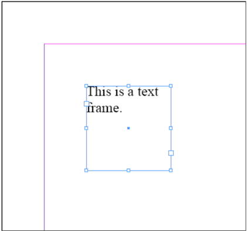

The following example shows how to use the Next TextFrame attribute to thread (or link) the TextFrame to another TextFrame. Note that the two TextFrames refer to the same story; you cannot have linked TextFrames that refer to separate stories.

**IDML Example 30. Threaded (Linked) TextFrames**

```xml
<TextFrame Self="ucd" Applied Object Style="Object Style\[Normal Graphics Frame]" Parent Story="uf2" Previous TextFrame="n" Next TextFrame="u108" Content Type="Text Type" Story Offset="n" Stroke Weight="0" Stroke Color="Swatch\c None" Item Transform="1 0 0 1 0 396" > <Properties> <PathGeometry> <GeometryPath Path Open="false"> <PathPointArray> <PathPoint Type Anchor="36 72" Left Direction="36 72" Right Direction="36 72"/> <PathPoint Type Anchor="36 96" Left Direction="36 96" Right Direction="36 96"/> <PathPoint Type Anchor="136 96" Left Direction="136 96" Right Direction="136 96"/> <PathPoint Type Anchor="136 72" Left Direction="136 72" Right Direction="136 72"/> </PathPointArray> </GeometryPath> </PathGeometry> </Properties> </TextFrame> <TextFrame Self="u108" Applied Object Style="Object Style\k[None]" Parent Story="uf2" Previous TextFrame="ucd" Next TextFrame="n" Content Type="Text Type" Story Offset="n" Stroke Weight="1" Item Transform="1 0 0 1 0 396"> <Properties> <PathGeometry> <GeometryPath Path Open="false"> <PathPointArray> <PathPoint Type Anchor="36 108" Left Direction="36 108" Right Direction="36 108"/><PathPoint Type Anchor="36 132" Left Direction="36 132" Right Direction="36 132"/> <PathPoint Type Anchor="136 132" Left Direction="136 132" Right Direction="136 132"/> <PathPoint Type Anchor="136 108" Left Direction="136 108" Right Direction="136 108"/> </PathPointArray> </GeometryPath> </PathGeometry> </Properties> </TextFrame>
```

Figure 21. Threaded TextFrames

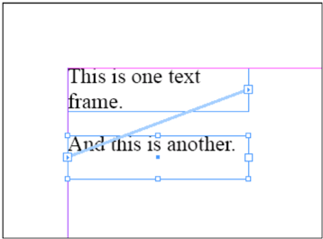

## TextFrame  Preference

The <TextFrame> element also differs from other page items in that it contains a <TextFramePreference> element. The <TextFramePreference> element contains attributes and elements that control properties such as number of columns in the TextFrame, the TextFrame inset distances, and the method used to calculate the location of the first baseline of text in the TextFrame.

**Schema Example 66. TextFrame  Preference**

```rnc
TextFramePreference_Object = element TextFramePreference { attribute TextColumnCount { xsd:int {minInclusive="1" maxInclusive="40"} }?, attribute TextColumnGutter { xsd:double {minInclusive="0" maxInclusive="8640"} }?, attribute TextColumnFixedWidth { xsd:double {minInclusive="0" maxInclusive="8640"} }?, attribute UseFixedColumnWidth { xsd:boolean }?, attribute FirstBaselineOffset { FirstBaseline_EnumValue }?, attribute MinimumFirstBaselineOffset { xsd:double {minInclusive="0" maxInclusive="8640"} }?, attribute VerticalJustification { VerticalJustification_EnumValue }?, attribute VerticalThreshold { xsd:double {minInclusive="0" maxInclusive="8640"} }?, attribute IgnoreWrap { xsd:boolean }?, attribute UseFlexibleColumnWidth { xsd:boolean }?, attribute TextColumnMaxWidth { xsd:double {minInclusive="0" maxInclusive="8640"} }?, attribute AutoSizingType { AutoSizingTypeEnum_EnumValue }?, attribute AutoSizingReferencePoint { AutoSizingReferenceEnum_EnumValue }?, attribute UseMinimumHeightForAutoSizing { xsd:boolean }?, attribute MinimumHeightForAutoSizing { xsd:double }?, attribute UseMinimumWidthForAutoSizing { xsd:boolean }?, attribute MinimumWidthForAutoSizing { xsd:double }?, attribute UseNoLineBreaksForAutoSizing { xsd:boolean }?, attribute VerticalBalanceColumns { xsd:boolean }?, element Properties { element InsetSpacing { (unit_type, xsd:double {minInclusive="0" maxInclusive="8640"} ) | (list_type, element ListItem { unit_type, xsd:double {minInclusive="0" maxInclusive="8640"} }, element ListItem { unit_type, xsd:double {minInclusive="0" maxInclusive="8640"} }, element ListItem { unit_type, xsd:double {minInclusive="0" maxInclusive="8640"} }, element ListItem { unit_type, xsd:double {minInclusive="0" maxInclusive="8640"} }) }? } ? }
```

**Table 85**: TextFrame Preference Properties Represented as Attributes

| Name                           | Type                                                | Req     | Description |
|------------------------------ | --------------------------------------------------- | ------- | ---------------------------------------------------------------------------------------------------------------------------------------------------------------------------------------------------------------|
| FirstBaselineOffset          |FirstBaseline_EnumValue                            | no      | The distance between the baseline of the text and the top inset of the TextFrame. Values can be AscentOffset, CapHeight, LeadingOffset, EmboxHeight, XHeight, or FixedHeight. |
| IgnoreWrap                     | boolean                                             | no      | If true, ignores text wrap settings for drawn or placed objects which intersect the TextFrame. |
| MinimumFirstBaselineOffset   | double {minInclusive="0" maxInclusive="8640"}   | no      | The minimum distance between the baseline of the text and the top inset of the TextFrame. |
| Self                           | string                                              | yes     | The unique ID of the object. |
| TextColumnCount                | int                                                 | no      | The number of columns in the TextFrame. Note: Depending on the value of the UseFixedColumnWidth attribute, the number of columns can change automatically when the TextFrame size changes. Range: 1 to 40. |
| TextColumnFixedWidth         | double                                              | no      | The column width of the columns in the TextFrame. Range: 0 to 8640. |
| TextColumnGutter               | double                                              | no      | The space between columns of the TextFrame. Range: 0 to 8640. |

| Name                              | Type                                               | Req     | Description |
| --------------------------------- | -------------------------------------------------- | ------- | ----------------------------------------------------------------------------------------------------------------------------------------------------------------------------------------------------------------------------------------------------------------------------------------------------- |
| UseFixedColumnWidth             | boolean                                            |no      | If true, maintains column width when the TextFrame is resized. If false, causes columns to resize when the TextFrame is resized. Note: When true, resizing the frame can change the number of columns in the frame. |
| VerticalBalanceColumns          | boolean                                           |no      | If true, balance vertical justification across all columns in the TextFrame. |
| VerticalJustification           | VerticalJustification_EnumValue                 | no      | The vertical alignment of the text in the TextFrame. Values can be TopAlign, CenterAlign, BottomAlign, or JustifyAlign. |
| VerticalThreshold                 | double                                             | no      | The maximum amount of vertical space between two paragraphs. Note: Valid only when the VerticalJustification attribute is is JustifyAlign ; the specified amount is applied in addition to the space before or SpaceAfter val- ues defined for the paragraphs in the TextFrame. Range: 0 to 8640. |
| UseFlexibleColumn Width           | boolean                                            | no      | If true, maintains column width between a min and max range when the TextFrame is resized. If false, causes columns to resize when the TextFrame is resized. Note: When true, resizing the frame can change the number of columns in the frame. |
| TextColumnMax Width               | double {minInclu- sive="0" maxInclusive= "8640"}   | no      | The maximum column width of the columns in the TextFrame. Use 0 to indicate no upper limit. |
| AutoSizingType                    | AutoSizingTypeE- num_EnumValue                     | no      | Auto-sizing type of TextFrame. Based on type, reference value is automatically adjusted. For example, for height only type, top-left reference point becomes top-center. Recommended to change auto-sizing type, after setting other auto- sizing attributes. |
| AutoSizingReference- Point        | AutoSizingRefer- enceEnum_Enum- Value              | no      | The reference point for auto sizing of TextFrame. Reference point is automatically adjusted to the suitable value depending on the auto-sizing type value. As an example, top left reference point becomes top center for height only dimension. |
| UseMinimumHeight- ForAutoSizing   | boolean                                            | no      | If true, minimum height value is used during the auto-sizing of TextFrame. |
| MinimumHeightFor- AutoSizing      | double                                             | no      | The minimum height for auto-sizing of the TextFrame. |
| UseMinimumWidth- ForAutoSizing    | boolean                                            | no      | If true, minimum width value is used during the auto-sizing of TextFrame. |
| MinimumWidthFor- AutoSizing       | double                                             | no      | The minimum width for auto-sizing of the TextFrame. |
| UseNoLineBreaksFor- AutoSizing    | boolean                                            | no      | If true, line-breaks are not introduced after auto sizing. |

**Table 86**: TextFrame  Preference Properties Represented as Elements

| Name           | Type                          | Req     | Description |
| -------------- | ----------------------------- | ------- | ----------------------------------------------------------------------------------------------------------------------------------------------------------------------------------------------------------------------------------------------------------------- |
| InsetSpacing   | double or ListItem elements   | no      | The text insets applied to the TextFrame. Rectangular TextFrames can use four inset values (for the left, top, right, and bottom of the frame); non-rectangular TextFrames can use a single value (all sides). Can contain up to four ListItem elements. |

**IDML Example 31. TextFrame  Preference (Single Inset Spacing Value)**

```xml
<TextFramePreference Self="uda TextFrame Preference1" Text Column Count="2" Text Column Fixed Width="120" First Baseline Offset="Leading Offset"> <Properties> <InsetSpacing type="unit">6</InsetSpacing> </Properties> </TextFramePreference>
```

**IDML Example 32. TextFrame  Preference (Multiple Inset Spacing Values)**

```xml
<TextFramePreference Self="uda TextFrame Preference1" Text Column Count="2" Text Column Fixed Width="120" First Baseline Offset="Leading Offset"> <Properties> <InsetSpacing type="list"> <ListItem type="unit">2</ListItem> <ListItem type="unit">3</ListItem> <ListItem type="unit">6</ListItem> <ListItem type="unit">3</ListItem> </InsetSpacing> </Properties> </TextFramePreference>
```

The following example shows how to create a multi-column TextFrame using the properties of the TextFrame Preference object.

**IDML Example 33. Multi-Column TextFrame**

```xml
<TextFrame Self="ucd" Applied Object Style="Object Style\k[Normal Graphics Frame]" Parent Story="uf2" Previous TextFrame="n" Next TextFrame="n" Content Type="Text Type" Story Offset="n" Stroke Weight="0" Stroke Color="Swatch\c None" Item Transform="1 0 0 1 6 432"> <Properties> <PathGeometry> <GeometryPath Path Open="false"> <PathPointArray> <PathPoint Type Anchor="30 72" Left Direction="30 72" Right Direction="30 72"/> <PathPoint Type Anchor="30 144" Left Direction="30 144" Right Direction="30 144"/> <PathPoint Type Anchor="186 144" Left Direction="186 144" Right Direction="186 144"/> <PathPoint Type Anchor="186 72" Left Direction="186 72" Right Direction="186 72"/> </PathPointArray> </GeometryPath> </PathGeometry>
</Properties> <TextFramePreference Self="ucd TextFrame Preference1" Text Column Count="2" Text Column Gutter="12" Text Column Fixed Width="72" Use Fixed Column Width="false" First Baseline Offset="Ascent Offset" Minimum First Baseline Offset="0" Vertical Justification="Top Align" Vertical Threshold="0" Ignore Wrap="false"> <Properties> <InsetSpacing type="list"> <ListItem type="unit">0</ListItem> <ListItem type="unit">0</ListItem> <ListItem type="unit">0</ListItem> <ListItem type="unit">0</ListItem> </InsetSpacing> </Properties> </TextFramePreference> </TextFrame>
```

Figure 22. Multi-Column TextFrame

<!-- This is a TextFrame. multi-column This is a multi-column TextFrame. TextFrame. This is a multi-column -->

## BaselineFrameGrid  Options

TextFrames can also contain a <BaselineFrameGridOption> element. This element contains properties expressed as attributes and elements that control the baseline grid options for the TextFrame. The BaselineFrameGrid affects paragraphs in the TextFrame that have been set to snap to the baseline grid-if the Use Custom  Baseline  Grid attribute is true, then the baselines of the paragraphs will snap to the grid defined by the <BaselineFrameGrid> element; it it's false, they'll snap to the document baseline grid (which is defined in the <GridPreference> element). For more on grids and guides, refer to the In  Design online help.

**Schema Example 67. BaselineFrameGrid**

```rnc
BaselineFrameGridOption_Object = element BaselineFrameGridOption { attribute UseCustomBaselineFrameGrid { xsd:boolean }?, attribute StartingOffsetForBaselineFrameGrid { xsd:double {minInclusive="0" maxInclusive="8640"} }?, attribute BaselineFrameGridRelativeOption { BaselineFrameGridRelativeOption_EnumValue }?, attribute BaselineFrameGridIncrement { xsd:double {minInclusive="1" maxInclusive="8640"} }?, element Properties { element BaselineFrameGridColor { InDesignUIColorType_TypeDef }? } ? } 
```

**IDML Example 34. BaselineFrameGrid** 

```xml
<BaselineFrameGridOption Self="uda BaselineFrameGrid Option1" Use Custom BaselineFrameGrid="true" BaselineFrameGrid Relative Option="Top Of Margin"> <Properties> <BaselineFrameGrid Color type="enumeration">Light Blue</BaselineFrameGrid> Color> </Properties> </BaselineFrameGridOption>
```

**Table 87**: BaselineFrameGrid Properties Expressed as Attributes

| Name                                  | Type                                             | Req     | Description |
| ------------------------------------- | ------------------------------------------------ | ------- | -------------------------------------------------------------------------------------------------------------------------- |
| UseCustomBaseline FrameGrid           | boolean                                          | no      | If true, uses a custom BaselineFrameGrid. |
| StartingOffsetFor BaselineFrameGrid   | double                                           | no      | The amount to offset the baseline grid. Minimum 0, maximum 8640. |
| BaselineFrameGridRelativeOption      | BaselineFrameGridRelativeOption_EnumValue   | no      | The object from which to offset the custom base- line grid. Can be TopOfPage, TopOfMargin, TopOfFrame, or TopOfInset. |
| BaselineFrameGridIncrement          | double                                           | no      | The distance between grid lines. Minimum 0, maximum 8640. |

**Table 88**: BaselineFrameGrid Properties Represented as Elements

| Name                       | Type                    | Req     | Description |
| -------------------------- | ----------------------- | ------- | ------------------------------------------------------------------------------------------------------------------------------------------------------- |
| BaselineFrameGridColor   | InDesignUIColorType   | no      | The grid line color, specified either as an array of three doubles, each in the range 0 to 255, and representing R, G, and B values, or as a UI color. |

#### Transparency

You can apply transparency effects to page items in an In  Design layout. In IDML, you accomplish this using the <TransparencySetting> element. A child element (or elements) of this element specify the transparency effect you want to apply.

**Schema Example 68. TransparencySetting**

```
TransparencySetting_Object = element TransparencySetting { ( BlendingSetting_Object?& DropShadowSetting_Object?& FeatherSetting_Object?& InnerShadowSetting_Object?& OuterGlowSetting_Object?& InnerGlowSetting_Object?& BevelAndEmbossSetting_Object?& SatinSetting_Object?& DirectionalFeatherSetting_Object?& GradientFeatherSetting_Object? ) } Schema Example 69. Blending Setting attribute Opacity { xsd:double {minInclusive="0" maxInclusive="100"} } ?, BlendingSetting_Object = element BlendingSetting { attribute BlendMode { BlendMode_EnumValue }?, attribute KnockoutGroup { xsd:boolean }?, attribute IsolateBlending { xsd:boolean }? }
```

In the following example, a <BlendingSetting> element applies transparency to the <Oval> element. The appearance of a transparent object is affected by the transparency flattener settings of the document and of the spread containing the transparent page items.

**IDML Example 35. Transparency**

```xml
<Oval Self="ucd" FillColor="Color\c C=100 M=0 Y=0 K=0"> <TransparencySetting Self="ucd TransparencySetting1"> <BlendingSetting Self="ucd TransparencySetting1Blending Setting1" Opacity="50"/> </TransparencySetting> </Oval>
```

Figure 23. Transparency

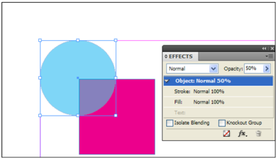

## Group

In  Design page items can be grouped, and groups can contain other groups. Each object stored inside a group is represented as a child element of the <Group> element, as shown in the following example.

**IDML Example 36. Group**

```xml
<Group Self="u111" Item Transform="1 0 0 1 0 0"> <Rectangle Self="u10d" Applied Object Style="Object Style\k[Normal Graphics Frame]" Item Transform ="1 0 0 1 0 0"> <Properties> <PathGeometry > <GeometryPath Path Open="false"> <PathPointArray> <PathPoint Type Anchor="36.5 359.5" Left Direction="36.5 359.5" Right Direction="36.5 359.5"/> <PathPoint Type Anchor="36.5 330.5" Left Direction="36.5 330.5" Right Direction="36.5 330.5"/> <PathPoint Type Anchor="65.5 330.5" Left Direction="65.5 330.5" Right Direction="65.5 330.5"/> <PathPoint Type Anchor="65.5 359.5" Left Direction="65.5 359.5" Right Direction="65.5 359.5"/> </PathPointArray> </GeometryPath> </PathGeometry > </Properties> </Rectangle> <Polygon Self="u10e" Applied Object Style="Object Style\k[Normal Graphics Frame]" Item Transform="1 0 0 1 0 0"> <Properties> <PathGeometry > <GeometryPath Path Open="false"> <PathPointArray> <PathPoint Type Anchor="113.71119986540519 359.5" Left Direction="113.71119986540519 359.5" Right Direction="113.71119986540519 359.5"/> <PathPoint Type Anchor="97.28830013459482 359.5" Left Direction="97.28830013459482 359.5" Right Direction="97.28830013459482 359.5"/> <PathPoint Type Anchor="89.07685026918963 345.2773516293136" Left Direction="89.07685026918963 345.2773516293136" Right Direction="89.07685026918963 345.2773516293136"/> <PathPoint Type Anchor="97.28830013459482 331.0547032586272" Left Direction="97.28830013459482 331.0547032586272" Right Direction="97.28830013459482 331.0547032586272"/> <PathPoint Type Anchor="113.71119986540518 331.0547032586272" Left Direction="113.71119986540518 331.0547032586272" Right Direction="113.71119986540518 331.0547032586272"/> <PathPoint Type Anchor="121.92264973081038 345.2773516293136" Left Direction="121.92264973081038 345.2773516293136" Right Direction="121.92264973081038 345.2773516293136"/> </PathPointArray> </GeometryPath> </PathGeometry > </Properties> </Polygon> <Oval Self="u10f" Applied Object Style="Object Style\k[Normal Graphics Frame]" Item Transform="1 0 0 1 0 0"> <Properties> <PathGeometry ><GeometryPath Path Open="false"> <PathPointArray> <PathPoint Type Anchor="51 288.5005" Left Direction="42.99187117333334 288.5005" Right Direction="59.00812882666667 288.5005"/> <PathPoint Type Anchor="65.5 303.0005" Left Direction="65.5 294.9923711733333" Right Direction="65.5 311.0086288266666"/> <PathPoint Type Anchor="51 317.5005" Left Direction="59.00812882666667 317.5005" Right Direction="42.99187117333334 317.5005"/> <PathPoint Type Anchor="36.5 303.0005" Left Direction="36.5 311.0086288266666" Right Direction="36.5 294.9923711733333"/> </PathPointArray> </GeometryPath> </PathGeometry > </Properties> </Oval> <Rectangle Self="u110" Applied Object Style="Object Style\k[Normal Graphics Frame]" Item Transform="1 0 0 1 0 0"> <Properties> <PathGeometry > <GeometryPath Path Open="false"> <PathPointArray> <PathPoint Type Anchor="90.99950000000001 317.5005" Left Direction="90.99950000000001 317.5005" Right Direction="90.99950000000001 317.5005"/> <PathPoint Type Anchor="90.99950000000001 288.5005" Left Direction="90.99950000000001 288.5005" Right Direction="90.99950000000001 288.5005"/> <PathPoint Type Anchor="119.99950000000001 288.5005" Left Direction="119.99950000000001 288.5005" Right Direction="119.99950000000001 288.5005"/> <PathPoint Type Anchor="119.99950000000001 317.5005" Left Direction="119.99950000000001 317.5005" Right Direction="119.99950000000001 317.5005"/> </PathPointArray> </GeometryPath> </PathGeometry > </Properties> </Rectangle> </Group>
```

## Buttons

The <Button> element can contain <State> elements, which contain page items that define the appearance of the button and attributes that define the behavior of the button. Buttons are objects you can define in In  Design that become interactive elements in exported PDF and SWF.

**Schema Example 70. Button**

```
Button_Object = element Button { attribute Self { xsd:string }, attribute VisibilityInPdf { VisibilityInPdf_EnumValue }?, attribute PrintableInPdf { xsd:boolean }?, attribute HiddenUntilTriggered { xsd:boolean }?, attribute Name { xsd:string }?, attribute Description { xsd:string }?, attribute LinkResourceId { xsd:int }?, attribute ParentInterfaceChangeCount { list { xsd:int * } }?, attribute TargetInterfaceChangeCount { list { xsd:int * } }?, attribute LastUpdatedInterfaceChangeCount { list { xsd:int * } }?, attribute LinkedSourceTableId { xsd:int }?, attribute HorizontalLayoutConstraints { list { DimensionsConstraints_EnumValue,DimensionsConstraints_EnumValue,DimensionsConstraints_EnumValue } }?, attribute VerticalLayoutConstraints { list { DimensionsConstraints_EnumValue,DimensionsConstraints_EnumValue,DimensionsConstraints_EnumValue } }?, attribute AllowOverrides { xsd:boolean }?, attribute FillColor { xsd:string }?, attribute FillTint { xsd:double }?, attribute OverprintFill { xsd:boolean }?, attribute CornerRadius { xsd:double }?, attribute StrokeWeight { xsd:double }?, attribute MiterLimit { xsd:double {minInclusive="1" maxInclusive="500"} }?, attribute EndCap { EndCap_EnumValue }?, attribute EndJoin { EndJoin_EnumValue }?, attribute StrokeType { xsd:string }?, attribute StrokeCornerAdjustment { StrokeCornerAdjustment_EnumValue }?, attribute StrokeDashAndGap { list { xsd:double * } }?, attribute LeftLineEnd { ArrowHead_EnumValue }?, attribute RightLineEnd { ArrowHead_EnumValue }?, attribute StrokeColor { xsd:string }?,
```

Figure 24. Group

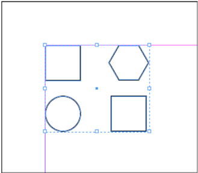

```
attribute StrokeTint
{ xsd:double }
?,
attribute GradientFillStart
{ UnitPointType_TypeDef }
?,
attribute GradientFillLength
{ xsd:double }
?,
attribute GradientFillAngle
{ xsd:double }
?,
attribute GradientStrokeStart
{ UnitPointType_TypeDef }
?,
attribute GradientStrokeLength
{ xsd:double }
?,
attribute GradientStrokeAngle
{ xsd:double }
?,
attribute OverprintStroke
{ xsd:boolean }
?,
attribute GapColor
{ xsd:string }
?,
attribute GapTint
{ xsd:double }
?,
attribute OverprintGap
{ xsd:boolean }
?,
attribute StrokeAlignment
{ StrokeAlignment_EnumValue }
?,
attribute Nonprinting
{ xsd:boolean }
?,
attribute ItemLayer
{ xsd:string }
?,
attribute Locked
{ xsd:boolean }
?,
attribute LocalDisplaySetting
{ DisplaySettingOptions_EnumValue }
?,
attribute GradientFillHiliteLength
{ xsd:double }
?,
attribute GradientFillHiliteAngle
{ xsd:double }
?,
attribute GradientStrokeHiliteLength
{ xsd:double }
?,
attribute GradientStrokeHiliteAngle
{ xsd:double }
?,
attribute AppliedObjectStyle
{ xsd:string }
?,
attribute CornerOption
{ CornerOptions_EnumValue }
?,
attribute Visible
{ xsd:boolean }
?,
attribute TopLeftCornerOption
{ CornerOptions_EnumValue }
?,
attribute TopRightCornerOption
{ CornerOptions_EnumValue }
?,
attribute BottomLeftCornerOption
{ CornerOptions_EnumValue }
?,
attribute BottomRightCornerOption
{ CornerOptions_EnumValue }
?,
attribute TopLeftCornerRadius
{ xsd:double }
?,
attribute TopRightCornerRadius
{ xsd:double }
?,
attribute BottomLeftCornerRadius
{ xsd:double }
?,
attribute BottomRightCornerRadius
{ xsd:double }
?,
attribute ItemTransform
{ TransformationMatrixType_TypeDef }
?,
element Properties
{ element PathBoundingBox
{ RectangleBoundsType_TypeDef }?& element PathGeometry
{ element GeometryPathType
{ GeometryPathType_TypeDef }* }?& element Label
{ element KeyValuePair
{ KeyValuePair_TypeDef }* }? }
?,
( (TransparencySetting_Object?& AnchoredObjectSetting_Object?& TextWrapPreference_Object?& LinkedPageItemOption_Object?& AnimationSetting_Object?),
TimingSetting_Object?,
(State_Object*& Behavior_Object*& GotoFirstPageBehavior_Object*& GotoLastPageBehavior_Object*& GotoNextPageBehavior_Object*& GotoPreviousPageBehavior_Object*& GotoNextViewBehavior_Object*& GotoPreviousViewBehavior_Object*& GotoURLBehavior_Object*& GotoAnchorBehavior_Object*& MovieBehavior_Object*& SoundBehavior_Object*& ShowHideFieldsBehavior_Object*& OpenFileBehavior_Object*& ViewZoomBehavior_Object*& SubmitFormBehavior_Object*& ClearFormBehavior_Object*& PrintFormBehavior_Object*& AnimationBehavior_Object*& GotoNextStateBehavior_Object*& GotoPreviousStateBehavior_Object*& GotoStateBehavior_Object*& GotoPageBehavior_Object*) ) }
```

Most of the properties of a <Button> element are shared with other page items. For a listing of these properties, see 'Common PageItem Properties.' A <Button> element can also have the following properties.

**Table 89**: Button Properties Expressed as Attributes

| Name              | Type                         | Req     | Description |
| ----------------- | ---------------------------- | ------- | ----------------------------------------------------------------------------------------------------------------------------------------------------------------------------------------------------------------------------------------------------------------------------------------------------------------------------------------------------------------------------------------------------------------------------|
| Description       | string                       | no      | The description of the button. |
| Name              |string                      | no      | The name of the button. |
| VisibilityInPdf   |VisibilityInPdf_EnumValue   | no      | The field's visibility in the PDF document. Can be VisibleInPdf (The field is visible), HiddenInPdf (The field is not visible), VisibleButDoesNotPrintInPdf (The field is visible when the PDF document is displayed on-screen but invisible when the document is printed), or HiddenButPrintableInPdf (The field is invisible when the PDF document is displayed on-screen but visible when the document is printed). |

**Table 90**: Button Properties Expressed as Properties

| Name              | Type                            | Req     | Description |
| ----------------- | ------------------------------- | ------- | ------------------------------------------------------------------- |
| PathBoundingBox   | RectangleBoundsType_TypeDef   | no      | The geometric bounds of the button, in the form [x1, y1, x2, y2]. |

**Schema Example 71. State**

```
State_Object = element State { attribute Self { xsd:string }, attribute Active { xsd:boolean }?, attribute Enabled { xsd:boolean }?, element Properties {
```

```
element Statetype
{ (enum_type, StateTypes_EnumValue ) | (long_type, xsd:int ) }
? } ?, ( Oval_Object*& Rectangle_Object*& GraphicLine_Object*& TextFrame_Object*& Polygon_Object*& Graphic_Object*& Image_Object*& EPS_Object*& WMF_Object*& PICT_Object*& PDF_Object*& Group_Object*& EPSText_Object* ) }
```

**Table 91**: State Properties Represented as Attributes

| Name        | Type                     | Req     | Description |
| ----------- | ------------------------ | ------- | ------------------------------------------------------------------------------------------------------------------------------------------------------------------------------------------------------- |
| Active      | boolean                  | no      | If true, the state is the active (or front most) state in the user interface. |
| Enabled     | boolean                  | no      | If true, objects that use the state appear in PDF documents. If false, objects that use the state do not appear in the document when the event that activates the state, such as a mouseover, occurs. |
| Name        | string                  | yes     | The name of the state. |
| Statetype   | StateTypes_EnumValue   | no      | The type of user action that dictates the button's appearance. Can be Up, Rollover, or Down . |

Button properties represented as attributes are identical to those of other page items (see 'Common PageItem Properties'). The main difference between a <Button> element and other page item elements is that the <Button> contains <State> elements (elements that define the appearance of the button in response to certain actions in an exported PDF or SWF), and can contain one or more of the 'Behavior' objects, which are discussed after the following example. For more on button states and behaviors, refer to the In  Design online help.

**IDML Example 37. Button**

```xml
<Button Self="ud6" Name="Go To First Page" Description="" FillColor="Color/Black" Item Transform="1 0 0 1 0 0"> <Properties> <PathBoundingBox Left="36" Top="336.25" Right="76" Bottom="312"/> </Properties> <State Self="ud6i0" Name="Up" Active="true" Enabled="true" Statetype="Up"> <Group Self="ud5" FillColor="Color/Black" Item Transform="1 0 0 1 0 0"> <Polygon Self="ucc" Content Type="Unassigned" FillColor="Color/Black" Stroke Weight="0" Item Transform="1 0 0 1 0 0"> <Properties> <PathGeometry> <GeometryPath Path Open="false"> <PathPointArray> <PathPoint Type Anchor="36 324" Left Direction="36 324" Right Direction="36 324"/> <PathPoint Type Anchor="60 312" Left Direction="60 312" Right Direction="60 312"/> <PathPoint Type Anchor="60 336.25" Left Direction="60 336.25" Right Direction="60 336.25"/> </PathPointArray> </GeometryPath> </PathGeometry> </Properties> <TransparencySetting> <BevelAndEmbossSetting Applied="true" Style="Emboss" Size="3"/> </TransparencySetting> </Polygon> <Rectangle Self="ud3" StoryTitle="$ID/" Content Type="Unassigned" FillColor="Color/Black" Stroke Weight="0" Stroke Color="Swatch/None" Item Transform="1 0 0 1 0 0"> <Properties> <PathGeometry> <GeometryPath Path Open="false"> <PathPointArray> <PathPoint Type Anchor="66 336.25" Left Direction="66 336.25" Right Direction="66 336.25"/> <PathPoint Type Anchor="66 312" Left Direction="66 312" Right Direction="66 312"/> <PathPoint Type Anchor="76 312" Left Direction="76 312" Right Direction="76 312"/> <PathPoint Type Anchor="76 336.25" Left Direction="76 336.25" Right Direction="76 336.25"/> </PathPointArray> </GeometryPath> </PathGeometry> </Properties> <TransparencySetting> <BevelAndEmbossSetting Applied="true" Style="Emboss" Size="3"/> </TransparencySetting> </Rectangle> </Group> </State> <GotoFirstPageBehavior Self="ud7" Zoom Setting="Inherit Zoom" Name="Go To First Page" Enable Behavior="true" Behavior Event="Mouse Down"/> </Button>
```

## Behaviors

You can create buttons in In  Design that perform an action when the document is exported to PDF format. For example, you can create a button that jumps to a different page of the PDF document or plays a movie clip. The type of action that a button can perform is called a behavior . For more on In  Design's button features, refer to the In  Design documentation.

**Schema Example 72. Behavior**

```
Behavior_Object = element Behavior { attribute Self { xsd:string }, attribute Name { xsd:string }?, attribute EnableBehavior { xsd:boolean }?, attribute BehaviorEvent { BehaviorEvents_EnumValue }?, element Properties { element Label { element KeyValuePair { KeyValuePair_TypeDef }* }? } ? }
```

The schemas for the behavior elements are all very similar. Rather than show them all here, we'll present the attributes common to all behavior elements, then describe the details of specific behavior element schemas when they differ from the others.

**Table 92**: Common Behavior Properties Represented as Attributes

| Name             | Type                        | Req     | Description |
| ---------------- | ---------------------------| ------- | --------------------------------------------------------------------------------------------------------------------- |
| Name             | string                      | no      | The name of the behavior. |
| EnableBehavior   |boolean                    | no      | If true, enable the button behavior. |
| BehaviorEvent    |BehaviorEvents_EnumValue   | no      | The event that triggers the behavior. Can be MouseUp, MouseDown, MouseEnter, MouseExit, OnFocus, or OnBlur . |

The Go To Page, Goto First Page Behavior, Goto Last Page Behavior, Goto Next Page Behavior, GotoPreviousPage Behavior, Goto Next View Behavior, and Goto Previous View Behavior differ from the Behavior element only in that they contain a ZoomSetting attribute.

Figure 25. Button

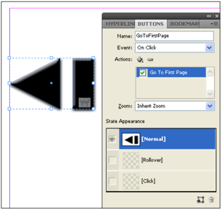

|Name          | Type                         | Req     | Description |
| ------------- |----------------------------| ------- | ------------------------------------------------------------------------------------------------------------- |
| ZoomSetting   |GoToZoomOptions_EnumValue   | no      | The zoon setting of the behavior. Can be InheritZoom, FitWindow, FitWidth, FitVisible, or ActualSize. |

The Goto URLBehavior element differs from the Behavior element in that it has an additional attribute, URL .

| Name     | Type     | Req     | Description |
| -------- | -------- | ------- | ---------------------------------- |
| URL      | string   | no      | The URL hyperlink of the button. |

The Goto Anchor  Behavior contains three attributes that are not shared with the Behavior element: Zoom Setting (described above), Anchor  Name, and File Path .

| Name         | Type     | Req     | Description |
| ------------ | -------- | ------- | -------------------------------------------------- |
| AnchorName   | string   | no      | The name of the anchor. |
| FilePath     | string   | no      | The file path to the file containing the anchor. |

The GotoNextState, GotoPreviousState, and GotoState behaviors control the display of states in a multi-state object.

**Table 93**: GotoNextStateBehavior Properties Represented as Attributes

| Name                           | Type      | Req     | Description |
| ------------------------------ | --------- | ------- | --------------------------------------------------------------------------------- |
| AssociatedMultiStateObject   | string    | no      | The animation page item, as a reference to the Self attribute of the page item. |
| LoopsToNextOrPrevious        | boolean   | no      | If true, will loop to the next or previous state of the multi-state object. |

**Table 94**: GotoPreviousStateBehavior Properties Represented as Elements

| Name     | Type     | Req     | Description |
| -------- | -------- | ------- | --------------------------------------------------------------------------------------------------- |
| State    | string   | no      | The multi-state object state to go to, as a refer- ence to the Self attribute of a State element. |

**Table 95**: GotoStateBehavior Properties Represented as Attributes

| Name                           | Type      | Req     | Description |
| ------------------------------ | --------- | ------- | ------------------------------------------------------------------------------------------- |
| AssociatedMulti StateObject   | string    | no      | The animation page item, as a reference to the Self attribute of the page item. |
| GoBackOnRollOff                | boolean   | no      | If true, will automatically go back to the prior state on roll off of the rollover event. |

**Table 96**: GotoStateBehavior Properties Represented as Attributes

| Name                           | Type      | Req     | Description |
| ------------------------------ | --------- | ------- | ------------------------------------------------------------------------------------------- |
| AssociatedMultiStateObject   | string    | no      | The animation page item, as a reference to the Self attribute of the page item. |
| GoBackOnRollOff                | boolean   | no      | If true, will automatically go back to the prior state on roll off of the rollover event. |

The AnimationBehavior element defines the display of animated page items.

**Table 97**: AnimationBehavior Properties Represented as Attributes

| Name                     | Type                                   | Req     | Description |
| ------------------------ | -------------------------------------- |------- | ---------------------------------------------------------------------------------------------- |
| AnimatedPageItem         | string                                 | no      | The animation page item, as a reference to the Self attribute of the page item. |
| AutoReverseOnRollOff   | boolean                               |no      | If true, will automatically play the animation in reverse on roll off of the rollover event. |
| Operation                | AnimationPlayOperations_EnumValue   | no      | The playback mode. Can be Play, Stop, Pause, Resume, ReversePlayback, or StopAll . |

The Movie Behavior element differs from the Behavior element in that it has two additional attributes, Movie Item and Operation .

| Name                | Type                                | Req     | Description |
| ------------------- | ----------------------------------- | ------- | ------------------------------------------------------------------------------------------------------------------------------------------------------------------------------------------------------------------------------------------------------------------------------------------------------------------------ |
| MovieItem           | string                              | no      | The path to the movie file. |
| NavigationPointID   | int                                 | no      | The id of the navigation point to play from. This corresponds to the Id attribute of a <NavigationPoint> element of the <Movie> element, whose Self attribute is defined in the pre-existing <MoviBehavior> attribute MovieItem . This property is ignored for all operations other than PlayFromNavigationPoint . |
| Operation           | MoviePlayOperations_EnumValue   | no      | Can be Play, PlayFromNavigationPoint, Stop, Pause, Resume, or StopAll . |

The Sound Behavior element differs from the Behavior element in that it has two additional attributes, Sound Item and Operation .

| Name        | Type                        |Req     | Description |
| ----------- | --------------------------- | ------- | ---------------------------------------------------- |
| SoundItem   |string                     | no      | The path to the sound file. |
| Operation   |PlayOperations_EnumValue   | no      | Can be Play, Stop, Pause, Resume, or StopAll . |

The Show Hide Fields  Behavior element has two attributes that differ from other Behavior elements, Fields To Show and Fields  To Hide .

| Name     | Type     | Req     | Description |
| -------- | -------- | ------- | --------------- |

| FieldsToShow     | list of strings as a space separated string     | no     | Alist of the fields to show, as a series of refer- ences (using the value of the Self attribute of the elements to refer to). |
| FieldsToHide     | list of strings as a space separated string     | no     | Alist of the fields to hide, as a series of references (using the value of the Self attribute of the ele- ments to refer to). |

The Open File Behavior element has an attributes that differs from the Behavior element: FilePath .

| Name       | Type     | Req     | Description |
| ---------- | -------- | ------- | ------------------------------------ |
| FilePath   | string   | no      | The file path to the file to open. |

The View Zoom Behavior element has an attributes that differs from the Behavior element: ViewZoomStyle .

| Name            | Type                       | Req     | Description |
| ViewZoomStyle   |ViewZoomStyle_EnumValue   | no      | Can be FullScreen, ZoomIn, ZoomOut, FitPage, ActualSize, FitWidth, FitVisible, SinglePage, OneColumn, or TwoColumn. |

The Goto Page Behavior element has two attributes that differ from the Behavior element: ViewZoomStyle (described above) and Page Number .

| Name         | Type     | Req     | Description |
| ------------ | -------- | ------- | ------------------------------------ |
| PageNumber   | int      | no      | The number of the page to display. |

## Multi-State Object

A multi-state object is very similar to a button, in that it contains states that control the visibility of page items stored within each state. A multi-state object differs from a button in that it can contain more than three states, and that the display of the states is controlled by an object outside the multi-state object (typically, a button).

In IDML, the <MultiStateObject> element contains <State> elements, which, as in a <Button> element, contain page items.

**Schema Example 73. MultiStateObject**

```
MultiStateObject_Object = element MultiStateObject { attribute Self { xsd:string }, attribute InitiallyHidden { xsd:boolean }?, attribute Name { xsd:string }?, attribute Description { xsd:string }?, attribute LinkResourceId { xsd:int }?, attribute ParentInterfaceChangeCount { list { xsd:int * } }?, attribute TargetInterfaceChangeCount { list { xsd:int * } }?, attribute LastUpdatedInterfaceChangeCount { list { xsd:int * } }?, attribute LinkedSourceTableId { xsd:int }?, attribute HorizontalLayoutConstraints { list { DimensionsConstraints_EnumValue,DimensionsConstraints_EnumValue,DimensionsConstraints_EnumValue } }?, attribute VerticalLayoutConstraints { list { DimensionsConstraints_EnumValue,DimensionsConstraints_EnumValue,DimensionsConstraints_EnumValue } }?, attribute AllowOverrides { xsd:boolean }?, attribute FillColor { xsd:string }?, attribute FillTint { xsd:double }?, attribute OverprintFill { xsd:boolean }?, attribute CornerRadius { xsd:double }?, attribute StrokeWeight { xsd:double }?, attribute MiterLimit { xsd:double {minInclusive="1" maxInclusive="500"} }?, attribute EndCap { EndCap_EnumValue }?, attribute EndJoin { EndJoin_EnumValue }?, attribute StrokeType { xsd:string }?, attribute StrokeCornerAdjustment { StrokeCornerAdjustment_EnumValue }?, attribute StrokeDashAndGap { list { xsd:double * } }?, attribute LeftLineEnd { ArrowHead_EnumValue }?, attribute RightLineEnd { ArrowHead_EnumValue }?, attribute StrokeColor { xsd:string }?, attribute StrokeTint { xsd:double }?, attribute GradientFillStart { UnitPointType_TypeDef }?, attribute GradientFillLength { xsd:double }?, attribute GradientFillAngle { xsd:double }?, attribute GradientStrokeStart { UnitPointType_TypeDef }?, attribute GradientStrokeLength { xsd:double }?, attribute GradientStrokeAngle { xsd:double }?, attribute OverprintStroke { xsd:boolean }?, attribute GapColor { xsd:string }?, attribute GapTint { xsd:double }?, attribute OverprintGap { xsd:boolean }?, attribute StrokeAlignment { StrokeAlignment_EnumValue }?, attribute Nonprinting { xsd:boolean }?, attribute ItemLayer { xsd:string }?, attribute Locked { xsd:boolean }?, attribute LocalDisplaySetting { DisplaySettingOptions_EnumValue }?, attribute GradientFillHiliteLength { xsd:double }?, attribute GradientFillHiliteAngle { xsd:double }?, attribute GradientStrokeHiliteLength { xsd:double }?, attribute GradientStrokeHiliteAngle { xsd:double }?, attribute AppliedObjectStyle { xsd:string }?, attribute CornerOption { CornerOptions_EnumValue }?, attribute Visible { xsd:boolean }?, attribute TopLeftCornerOption { CornerOptions_EnumValue }?, attribute TopRightCornerOption { CornerOptions_EnumValue }?, attribute BottomLeftCornerOption { CornerOptions_EnumValue }?, attribute BottomRightCornerOption { CornerOptions_EnumValue }?, attribute TopLeftCornerRadius { xsd:double }?, attribute TopRightCornerRadius { xsd:double }?, attribute BottomLeftCornerRadius { xsd:double }?, attribute BottomRightCornerRadius { xsd:double }?, attribute ItemTransform { TransformationMatrixType_TypeDef }?, element Properties { element PathBoundingBox { RectangleBoundsType_TypeDef }?& element PathGeometry { element GeometryPathType { GeometryPathType_TypeDef }* }?& element Label { element KeyValuePair { KeyValuePair_TypeDef }* }? } ?, ( TransparencySetting_Object?& AnchoredObjectSetting_Object?& TextWrapPreference_Object?& LinkedPageItemOption_Object?& State_Object*& AnimationSetting_Object?& TimingSetting_Object? ) }
```

The <MultiStateObject> element shares most of its properties with all other page items, but adds unique properties.

**Table 98**: MultiStateObject Properties Represented as Attributes

| Name              | Type      | Req     | Description |
| ----------------- | --------- | ------- | ------------------------------------------------------ |
| InitiallyHidden   | boolean   | no      | If true, the multi-state object is initially hidden. |
| Description       | string    | no      | Adescription of the multi-state object. |
| Name              | string    | no      | The name of the mult-state object. |

**Table 99**: MultiStateObject Properties Represented as Elements

| Name              | Type              | Req     | Description |
| ----------------- | ----------------- | ------- | ----------------------------------------------------------------------------------- |
| PathBoundingBox   | list of doubles   | no      | The bounding box of the multi-state object, in the form left, top, right, bottom. |

**IDML Example 38. MultiStateObject**

```xml
<MultiStateObject Self="ucc" InitiallyHidden="false" Name="Spinner" Description="" ItemLayer="ub6" Locked="false" LocalDisplaySetting="Default" AppliedObjectStyle="ObjectStyle/$ID/[None]" Visible="true" ItemTransform="1 0 0 1 5 391"> <Properties> <PathBoundingBox Left="67" Top="67" Right="139" Bottom="139"/> </Properties> <State Self="ucci9" Active="true" Enabled="true"> <Properties> <Statetype type="long">9</Statetype> </Properties> <Group Self="uce" LocalDisplaySetting="Default" AppliedObjectStyle="ObjectStyle/$ID/[None]" Visible="true" Name="Up" ItemTransform="1 0 0 1 0 0"> <Rectangle Self="ucd" ContentType="GraphicType" StoryTitle="$ID/" LocalDisplaySetting="Default" 0"eAngle="0" AppliedObjectStyle="ObjectStyle/$ID/[None]" Visible="true" Name="$ID/" ItemTransform="1 0 0 1 0 0"> <Properties> <PathGeometry> <GeometryPath PathOpen="false"> <PathPointArray> <PathPointType Anchor="67 67" LeftDirection="67 67" RightDirection="67 67"/> <PathPointType Anchor="67 139" LeftDirection="67 139" RightDirection="67 139"/> <PathPointType Anchor="139 139" LeftDirection="139 139" RightDirection="139 139"/> <PathPointType Anchor="139 67" LeftDirection="139 67" RightDirection="139 67"/> </PathPointArray> </GeometryPath> </PathGeometry> </Properties> </Rectangle> <Polygon Self="ud5" ContentType="Unassigned" StoryTitle="$ID/" FillColor="Color/DGC1_446a" StrokeWeight="0" StrokeColor="Swatch/None" LocalDisplaySetting="Default" 0"eAngle="0" AppliedObjectStyle="ObjectStyle/$ID/[Normal Graphics Frame]" Visible="true" Name="$ID/" ItemTransform="1 0 0 1 5 5.0000000000000036"> <Properties> <PathGeometry> <GeometryPath PathOpen="false"> <PathPointArray> <PathPointType Anchor="62 134" LeftDirection="62 134" RightDirection="62 134"/> <PathPointType Anchor="134 134" LeftDirection="134 134" RightDirection="134 134"/> <PathPointType Anchor="98 62" LeftDirection="98 62" RightDirection="98 62"/> </PathPointArray> </GeometryPath> </PathGeometry> </Properties> </Polygon> </Group> </State> <State Self="uccia" Active="false" Enabled="true"> <Properties> <Statetype type="long">10</Statetype> </Properties> <Group Self="ucf" LocalDisplaySetting="Default" AppliedObjectStyle="ObjectStyle/$ID/[None]" Visible="true" Name="Right" ItemTransform="1 0 0 1 0 0"> <Rectangle Self="ud0" ContentType="GraphicType" StoryTitle="$ID/" LocalDisplaySetting="Default" 0"eAngle="0" AppliedObjectStyle="ObjectStyle/$ID/[None]" Visible="true" Name="$ID/" ItemTransform="1 0 0 1 0 0"> <Properties> <PathGeometry> <GeometryPath PathOpen="false"> <PathPointArray> <PathPointType Anchor="67 67" LeftDirection="67 67" RightDirection="67 67"/> <PathPointType Anchor="67 139" LeftDirection="67 139" RightDirection="67 139"/> <PathPointType Anchor="139 139" LeftDirection="139 139" RightDirection="139 139"/> <PathPointType Anchor="139 67" LeftDirection="139 67" RightDirection="139 67"/> </PathPointArray> </GeometryPath> </PathGeometry> </Properties> </Rectangle> <Polygon Self="ud6" ContentType="Unassigned" StoryTitle="$ID/" FillColor="Color/DGC1_446b" StrokeWeight="0" StrokeColor="Swatch/None" LocalDisplaySetting="Default" 0"eAngle="0" AppliedObjectStyle="ObjectStyle/$ID/[Normal Graphics Frame]" Visible="true" Name="$ID/" ItemTransform="1 0 0 1 5 5.0000000000000036"> <Properties> <PathGeometry> <GeometryPath PathOpen="false"> <PathPointArray> <PathPointType Anchor="62 62" LeftDirection="62 62" RightDirection="62 62"/> <PathPointType Anchor="62 134" LeftDirection="62 134" RightDirection="62 134"/> <PathPointType Anchor="134 98" LeftDirection="134 98" RightDirection="134 98"/> </PathPointArray> </GeometryPath> </PathGeometry> </Properties> </Polygon> </Group> </State> <State Self="uccib" Active="false" Enabled="true"> <Properties> <Statetype type="long">11</Statetype> </Properties> <Group Self="ud1" LocalDisplaySetting="Default" AppliedObjectStyle="ObjectStyle/$ID/[None]" Visible="true" Name="Down" ItemTransform="1 0 0 1 0 0"> <Rectangle Self="ud2" ContentType="GraphicType" StoryTitle="$ID/" LocalDisplaySetting="Default" 0"eAngle="0" AppliedObjectStyle="ObjectStyle/$ID/[None]" Visible="true" Name="$ID/" ItemTransform="1 0 0 1 0 0"> <Properties> <PathGeometry> <GeometryPath PathOpen="false"> <PathPointArray> <PathPointType Anchor="67 67" LeftDirection="67 67" RightDirection="67 67"/> <PathPointType Anchor="67 139" LeftDirection="67 139" RightDirection="67 139"/> <PathPointType Anchor="139 139" LeftDirection="139 139" RightDirection="139 139"/> <PathPointType Anchor="139 67" LeftDirection="139 67" RightDirection="139 67"/> </PathPointArray> </GeometryPath> </PathGeometry> </Properties> </Rectangle> <Polygon Self="ud7" ContentType="Unassigned" StoryTitle="$ID/" FillColor="Color/DGC1_446c" StrokeWeight="0" StrokeColor="Swatch/None" LocalDisplaySetting="Default" 0"eAngle="0" AppliedObjectStyle="ObjectStyle/$ID/[Normal Graphics Frame]" Visible="true" Name="$ID/" ItemTransform="1 0 0 1 5 5.0000000000000036"> <Properties> <PathGeometry> <GeometryPath PathOpen="false"> <PathPointArray> <PathPointType Anchor="62 62" LeftDirection="62 62" RightDirection="62 62"/> <PathPointType Anchor="98 134" LeftDirection="98 134" RightDirection="98 134"/> <PathPointType Anchor="134 62" LeftDirection="134 62" RightDirection="134 62"/> </PathPointArray> </GeometryPath> </PathGeometry> </Properties> </Polygon> </Group> </State> <State Self="uccic" Active="false" Enabled="true"> <Properties> <Statetype type="long">12</Statetype> </Properties> <Group Self="ud3" LocalDisplaySetting="Default" AppliedObjectStyle="ObjectStyle/$ID/[None]" Visible="true" Name="Left" ItemTransform="1 0 0 1 0 0"> <Rectangle Self="ud4" ContentType="GraphicType" StoryTitle="$ID/" LocalDisplaySetting="Default" AppliedObjectStyle="ObjectStyle/$ID/[None]" Visible="true" Name="$ID/" ItemTransform="1 0 0 1 0 0"> <Properties> <PathGeometry> <GeometryPath PathOpen="false"> <PathPointArray> <PathPointType Anchor="67 67" LeftDirection="67 67" RightDirection="67 67"/> <PathPointType Anchor="67 139" LeftDirection="67 139" RightDirection="67 139"/> <PathPointType Anchor="139 139" LeftDirection="139 139" RightDirection="139 139"/> <PathPointType Anchor="139 67" LeftDirection="139 67" RightDirection="139 67"/> </PathPointArray> </GeometryPath></PathGeometry> </Properties> </Rectangle> <Polygon Self="ud8" ContentType="Unassigned" StoryTitle="$ID/" FillColor="Color/DGC1_446d" StrokeWeight="0" StrokeColor="Swatch/None" LocalDisplaySetting="Default" 0"eAngle="0" AppliedObjectStyle="ObjectStyle/$ID/[Normal Graphics Frame]" Visible="true" Name="$ID/" ItemTransform="1 0 0 1 5 5.0000000000000036"> <Properties> <PathGeometry> <GeometryPath PathOpen="false"> <PathPointArray> <PathPointType Anchor="134 62" LeftDirection="134 62" RightDirection="134 62"/> <PathPointType Anchor="62 98" LeftDirection="62 98" RightDirection="62 98"/> <PathPointType Anchor="134 134" LeftDirection="134 134" RightDirection="134 134"/> </PathPointArray> </GeometryPath> </PathGeometry> </Properties> </Polygon> </Group> </State> </MultiStateObject>
```

Figure 26. Multi-State Object

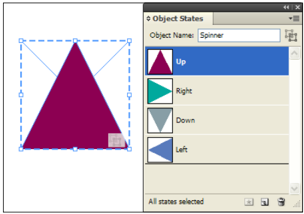

## Associating PageItems with XML Elements

Page items associated with XML elements in the XML structure of an In  Design document do not differ from page items that are not associated with the structure-what sets them apart are references from <XMLElement> elements. In an IDML package, these elements appear in the Backing  Story.xml file.

In the following example, the <XMLElement> element refers to a <Rectangle> element in the layout.

**IDML Example 39. Associating a Frame with an XML Element**

```xml
<XMLElement Self="di2" MarkupTag="XMLTag\c Root"> <XMLElement Self="di2i3" MarkupTag="XMLTag\c Frame" XMLContent="ud6"/> </XMLElement><!From Spread_ub8.xml> <Rectangle Self="ud6" .../>
```

Figure 27. Associating an XML Element with a Frame

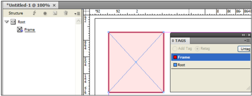

In the following example, the <XMLElement> refers to a <Story> element in the same package, and that the <TextFrame> element also refers to this <Story> . XML elements that have been associated with text appear inside the <Story> element.

**IDML Example 40. Associating a TextFrame with an XML Element**

```xml
<!From Backing Story.xml> <XMLElement Self="di2i3" MarkupTag="XMLTag\Example XMLElement" XMLContent="ucf"/> <!From Story_ucf.xml> <Story Self="ucf" ...> <!From Spread_ub8.xml> <TextFrame Self="ucd" Parent Story="ucf".../>
```

Figure 28. Associating an XML Element with a TextFrame

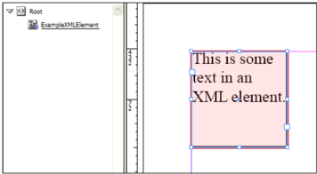

### 10.3.6 Pages

Spreads contain one or more pages. The pages in a spread are stored as <Page> elements, which properties that override document- or spread-based settings, such as trapping presets, the applied master spread, and page margin settings. Pages in a spread can be of multiple sizes, and are added to the spread based on the order in which they appear inside the <Spread> element. The location of the pages inside the spread is determined by the binding direction of the document, which is defined by the Binding  Location attribute of the <Spread> element-refer to the In  Design documentation for more information on binding direction.

The size of each page in a spread is defined by the GeometricBounds attribute of the page. The values in the GeometricBounds attribute define the upper-left and lower-right corners of the page, in the inner coordinates of the page. The ItemTransform attribute contains a transformation matrix used to position the page in the spread (for more coordinates and transformations, refer to 'Geometry in IDML'). The transformation matrix in the ItemTransform attribute is a complete transformation matrix, but only translations are supported.

Because the master page applied to each page can be of a different size than the page, InDesign provides a way to position the contents of the master page as they appear on the page. In IDML, this transformation appears as the MasterPageTransform attribute on the <Page> element. While this is a complete transformation matrix (see 'Geometry in IDML'), only translations are supported.

<Page> elements appear in the <Spread> element in the sequence in which they appear in the spread, relative to the binding direction specified by the PageBinding attribute of the <DocumentPreference> element. (In a left to right layout, subsequent pages appear to the right of the first page in the spread; in a right to left layout, pages appear to the left of the first page in the spread.)

Note: Page items do not appear as child elements of page elements, but are, instead, collected on the spread.

**Schema Example 74. Page Schema**

```
Page_Object = element Page { attribute Self { xsd:string }, attribute AppliedAlternateLayout { xsd:string }?, attribute LayoutRule { LayoutRuleOptions_EnumValue }?, attribute SnapshotBlendingMode { SnapshotBlendingModes_EnumValue }?, attribute OptionalPage { xsd:boolean }?, attribute GeometricBounds { list { xsd:double,xsd:double,xsd:double,xsd:double } }?, attribute ItemTransform { TransformationMatrixType_TypeDef }?, attribute Name { xsd:string }?, attribute AppliedTrapPreset { xsd:string }?, attribute OverrideList { list { xsd:string * } }?, attribute AppliedMaster { xsd:string }?, attribute MasterPageTransform { TransformationMatrixType_TypeDef }?, attribute TabOrder { list { xsd:string * } }?, attribute GridStartingPoint { GridStartingPointOptions_EnumValue }?, attribute UseMasterGrid { xsd:boolean }?, element Properties { element Descriptor { list_type, element ListItem { (string_type, xsd:string ) | (enum_type, PageNumberStyle_EnumValue ) | (bool_type, xsd:boolean ) | (long_type, xsd:int {minInclusive="1" maxInclusive="999999"} ) }* }?& element PageColor { (InDesignUIColorType_TypeDef ) | (enum_type, PageColorOptions_EnumValue ) }?& element Label { element KeyValuePair { KeyValuePair_TypeDef }* }? } ?, ( MarginPreference_Object?& Guide_Object*& GridDataInformation_Object? ) }
```

The following example shows a (simplified) <Spread> element containing two pages. In a left-toright layout, the first page in the spread is the left hand (verso) page; the second page is the right hand (recto).

**IDML Example 41. Pages Within a Spread**

```xml
<Spread Self="ub9" FlattenerOverride="Default" AllowPageShuffle="true" ItemTransform="1 0 0 1 0 0" ShowMasterItems="true" PageCount="3" BindingLocation="1" PageTransitionType="None" PageTransitionDirection="NotApplicable" PageTransitionDuration="Medium"> <Page Self="ube" GeometricBounds="0 0 792 612" ItemTransform="1 0 0 1 612 396" Name="2" AppliedTrapPreset="TrapPreset/$ID/kDefaultTrapStyleName" OverrideList="" AppliedMaster="uc0" MasterPageTransform="1 0 0 1 0 0" TabOrder="" GridStartingPoint="TopOutside" UseMasterGrid="true"> <Properties> <PageColor type="enumeration">UseMasterColor</PageColor> </Properties> <MarginPreference ColumnCount="1" ColumnGutter="12" Top="36" Bottom="36" Left="36" Right="36" ColumnDirection="Horizontal" ColumnsPositions="0 540"/> <GridDataInformation FontStyle="Regular" PointSize="12" CharacterAki="0" LineAki="9" HorizontalScale="100" VerticalScale="100" LineAlignment="LeftOrTopLineJustify" GridAlignment="AlignEmCenter" CharacterAlignment="AlignEmCenter"> <Properties> <AppliedFont type="string">Minion Pro</AppliedFont> </Properties> </GridDataInformation> </Page> <Page Self="uce" GeometricBounds="0 0 792 72" ItemTransform="1 0 0 1 0 396" Name="3" AppliedTrapPreset="TrapPreset/$ID/kDefaultTrapStyleName" OverrideList="" AppliedMaster="uc0" MasterPageTransform="1 0 0 1 0 0" TabOrder="" GridStartingPoint="TopOutside" UseMasterGrid="false"> <Properties> <PageColor type="enumeration">UseMasterColor</PageColor> </Properties> <MarginPreference ColumnCount="1" ColumnGutter="12" Top="0" Bottom="0" Left="0" Right="0" ColumnDirection="Horizontal" ColumnsPositions="0 72"/> <GridDataInformation FontStyle="Regular" PointSize="12" CharacterAki="0" LineAki="9" HorizontalScale="100" VerticalScale="100" LineAlignment="LeftOrTopLineJustify" GridAlignment="AlignEmCenter" CharacterAlignment="AlignEmCenter"> <Properties> <AppliedFont type="string">Minion Pro</AppliedFont> </Properties> </GridDataInformation> </Page> <Page Self="ud4" GeometricBounds="0 0 792 612" ItemTransform="1 0 0 1 72 396" Name="4" AppliedTrapPreset="TrapPreset/$ID/kDefaultTrapStyleName" OverrideList="" AppliedMaster="uc0" MasterPageTransform="1 0 0 1 0 0" TabOrder="" GridStartingPoint="TopOutside" UseMasterGrid="true"><Properties> <PageColor type="enumeration">UseMasterColor</PageColor> </Properties> <MarginPreference ColumnCount="1" ColumnGutter="12" Top="36" Bottom="36" Left="36" Right="36" ColumnDirection="Horizontal" ColumnsPositions="0 540"/> <GridDataInformation FontStyle="Regular" PointSize="12" CharacterAki="0" LineAki="9" HorizontalScale="100" VerticalScale="100" LineAlignment="LeftOrTop LineJustify" GridAlignment="AlignEmCenter" CharacterAlignment="AlignEmCenter"> <Properties> <AppliedFont type="string">Minion Pro</AppliedFont> </Properties> </GridDataInformation> </Page>
```

</Spread>

**Table 100**: Page Properties Represented as Attributes

| Attribute                 | Type                                                   | Req     | Description |
| ------------------------- | ------------------------------------------------------ | ------- | ------------------------------------------------------------------------------------------------------------------------------------------------------------------------------------------------------------------------------------------------- |
| AppliedAlternateLayout   | string                                                 | no      | The alternate layout section to which the page belongs. |
| AppliedTrapPreset         | string                                                 | no      | The name of the trapping preset applied to the page. |
| AppliedMaster             | string                                                 | no      | The master spread applied to the page. |
| GeometricBounds           | list of four doubles                                   | yes     | The bounds of the page, in the form y1, x1, y2, x2. |
| GridStartingPoint         | GridStartingPointOptions_EnumValue                   | no      | The starting point for the grid. Can be TopOutside, TopInside, BottomOutside, BottomInside, CenterVertical, CenterHorizontal, or CenterCompletely . |
| ItemTransform             | list of six doubles                                    | no      | The transformation matrix applied to the page. |
| LayoutRule                | LayoutRuleOptions_EnumValue                           | no      | The layout rule. |
| MasterPageTransform     | list of six doubles                                    | no      | The transformation matrix applied to master page items. |
| Name                      | string                                                 | no      | The name of the page. |
| OptionalPage              | boolean                                               | no      | The optional page for HTML5 pagination. |
| OverrideList              | list of strings as a space separated string           | no      | The overridden master page items on this page, as a series of references (using the value of the Self attribute of the overridden page items). For mreon overriding master page items on docu- ment pages, refer to the InDesign online help. |
| PageColor                 |PageColorOptions_EnumValue or list of three doubles   | no      | Can be Nothing (do not use the page color of the master spread), UseMasterColor (use the page color of the master spread), or a list of three doubles, each in the range 0 to 255 and repre- senting R, G, and B values. |

| Attribute               | Type                                                 | Req     | Description |
| ----------------------- | ---------------------------------------------------- | ------- | ------------------------------------------------------------------------------------------------------------------------------------------------------------------------------------------------------- |
| SnapshotBlending Mode   | SnapshotBlending Modes_EnumValue                     | no      | The snapshot blending mode. |
| TabOrder                | string list of strings as a spaceseparated string   | no      | The order in which the focus in an exported PDF moves to different form fields when the tab but- ton is pressed, as a series of references (using the value of the Self attribute of the page items). |
| UseMasterGrid           | boolean                                              | no      | If true, use the master grid. |

**Table 101**: Page Properties Represented as Elements

| Name         | Type                | Req     | Description |
| ------------ | ------------------- | ------- | ------------------------------------------------------- |
| Descriptor   | ListItem elements   | no      | Acollection of properties used by InCopy assignments. |

### 10.3.7 Columns and Margins

The columns and margins of a page are defined by the <MarginPreference> object.

**Schema Example 75. MarginPreference**

```rnc
MarginPreference_Object = element MarginPreference { attribute ColumnCount { xsd:int {minInclusive="1" maxInclusive="216"} }?, attribute Top { xsd:double }?, attribute Bottom { xsd:double }?, attribute Left { xsd:double }?, attribute Right { xsd:double }?, attribute ColumnDirection { HorizontalOrVertical_EnumValue }?, attribute ColumnsPositions { list { xsd:double * } }? attribute ColumnGutter { xsd:double {minInclusive="0" maxInclusive="1440"} }?, } 
```

**IDML Example 42. MarginPreferences** 

```xml
<MarginPreference Column Count="1" Column  Gutter="12" Top="36" Bottom="36" Left="36" Right="36" Column  Direction="Horizontal" Columns  Positions="0 540"/>
```

### 10.3.8 Guides

In addition to page items, In  Design spreads can contain guides. For more on using guides to align page items and to mark areas of the page, refer to the In  Design online help.

**Schema Example 76. Guide**

```rnc
Guide_Object = element Guide { attribute Self { xsd:string }, attribute Orientation { HorizontalOrVertical_EnumValue }?, attribute Location { xsd:double }?, attribute FitToPage { xsd:boolean }?, attribute ViewThreshold { xsd:double {minInclusive="5" maxInclusive="4000"} }?, attribute Locked { xsd:boolean }?, attribute ItemLayer { xsd:string }?, attribute PageIndex { xsd:short }?, attribute GuideType { GuideTypeOptions_EnumValue }?, attribute GuideZone { xsd:double }?, element Properties { element GuideColor { InDesignUIColorType_TypeDef }?& element Label { element KeyValuePair { KeyValuePair_TypeDef }* }? } ? } 
```

**IDML Example 43. Guide**
```xml
<Guide elf="ue4" Orientation="Horizontal" Location="72" Fit To Page="true" View Threshold="5" Locked="false" Item Layer="ub1" Page Index="1"> <Properties> <Guide olor type="enumeration">Cyan</Guide> Color> </Properties> </Guide>>
```

**Table 102**: Guide Properties Represented as Attributes

| Name            | Type                                 | Req     | Description |
| --------------- | ------------------------------------ | ------- | --------------------------------------------------------------------------------------------------------------------------------------------------------------------------- |
| FitToPage       | boolean                              | no      | If true, horizontal orientation guides stop at the edges of the specified page. If false, the guides extends across the width of the spread and into the pasteboard area. |
| ItemLayer       | string                               | no      | The layer that the guide is on. |
| Location        | double                               | no      | The location at which to place the guide relative to the current ruler zero point. |
| Locked          | boolean                             | no      | If true, the guide is locked. |
| Orientation     | HorizontalOr Vertical_EnumValue   | no      | The orientation of the guide. Can be Horizontal or Vertical . |
| PageIndex       | short                                | no      | The index of the page containing the guide. |
| ViewThreshold   | double                               | no      | The view magnification as a percentage below which guides are no longer displayed. (Range: 5.0 to 4000.0) |
| GuideType       | GuideTypeOptions _EnumValue          | no      | The type of the guide. |
| GuideZone       | double                               | no      | The zone of the guide. |

**Table 103**: Guide Properties Represented as Elements

| Name         | Type                                     | Req     | Description |
|------------ | ---------------------------------------- | ------- | -------------------------------------------------------------------------------------------------------------------------------------------------------------------------------------------|
| GuideColor   | list of doubles orUIColors_EnumValue   | no      | The color of the guide, specified either as an array of three ListItem elements, each contain- ing a value from 0 to 255 and representing R, G, and B values, or as a UIColor enumeration. |

### 10.3.9 Transparency Flattener Settings

The appearance of transparency (including the Drop Shadow, Inner Shadow, Outer Glow, Inner Glow, Bevel and Emboss, Satin, and Feather effects) when you print or export an In  Design document depends on the flattener settings for the spread and/or the document (the exact appearance of the transparent objects on the printed pages or in the exported file depends on the capabilities of the printer or file format). The flattener settings of the document apply to all objects unless the objects exist on a spread which has been assigned its own flattener settings; in that case, the flattener settings of the spread override those of the document. In IDML, these settings are represented by the <FlattenerPreference> element.

**Schema Example 77. FlattenerPreference**

```
FlattenerPreference_Object = element FlattenerPreference { attribute LineArtAndTextResolution { xsd:double }?, attribute GradientAndMeshResolution { xsd:double }?, attribute ClipComplexRegions { xsd:boolean }?, attribute ConvertAllStrokesToOutlines { xsd:boolean }?, attribute ConvertAllTextToOutlines { xsd:boolean }?, element Properties { element RasterVectorBalance { (enum_type, FlattenerLevel_EnumValue ) | (double_type, xsd:double {minInclusive="0" maxInclusive="100"} ) }? } ? }
```

The following example shows a custom flattener setting applied to a spread.

**IDML Example 44. FlattenerPreference**

```xml
<Spread Self="ub8" Flattener Override="Custom"> <FlattenerPreference Line Art And Text Resolution="300" Gradient And Mesh Resolution="150" Clip Complex Regions="true" Convert All Strokes To Outlines="true" Convert All Text To Outlines="false"> <Properties> <RasterVectorBalance type="double">75</RasterVectorBalance> </Properties> </FlattenerPreference> </Spread>
```

Figure 29. FlattenerPreference

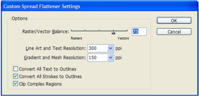
