## 10.4 Stories

A story, or 'text flow' is the basic text container in an In  Design document; all text exists inside stories. Stories are associated with at least one TextFrame or TextPath, and can span any number of linked TextFrames or TextPaths in a document. TextFrames and TextPaths are page items, and are discussed in the section 'Spreads and Master Spreads'.

In an IDML package, the XML documents representing stories are stored inside the 'Stories'. Each file contains a single <Story> element. Story files use the naming convention described in 'IDML Component Names.' The root element of a Story.xml file is the <Story> element, and each story file stores contains a single <Story> element.

The <Story> element is very complex. The schema of <Story> element describes more than 200 simple attributes and more than 40 complex attributes that can appear in the <Properties> element of the story. In addition, the <Story> element can contain other child elements, including elements corresponding to inline or anchored frames, tables, notes, hyperlinks, and footnotes.

That said, most of these attributes and elements of story are optional. You do not need to construct all of them to assemble a new story for use in an IDML package. A story can be as simple as the following example:

**IDML Example 45. Story File in an IDML Package**

```xml
<?xml version="1.0" encoding="UTF8" standalone="yes"?> 
<id Pkg:Story xmlns:id  Pkg="http://ns.adobe.com/Adobe  In Design/idml/1.0/packaging"> 
    <Story Self="ucb"> 
        <ParagraphStyleRange> 
            <CharacterStyleRange> 
                <Content>Hello World</Content> 
            </CharacterStyleRange> 
        </ParagraphStyleRange> 
    </Story> 
</id Pkg:Story>
```

A version of the same element elsewhere in an IDML package (in designmap.xml, for example) would be the same as the <Story> element in the example above.

The <Story> object can contain the default text formatting for the story. Individual instances of local text formatting (i.e., formatting which was not applied by paragraph and character styles) can also appear in the story file. This local formatting will always appear inside a <ParagraphStyleRange> or <CharacterStyleRange> element see 'Local Formatting vs. Styles.'

Paragraph and CharacterStyle formatting is applied using references to the Self attribute of <ParagraphStyle> and <CharacterStyle> elements. In an IDML package, these elements are stored in the Styles.xml file inside the Resources folder. The formatting attributes of the styles are stored within that file, not within the <Story> element (see 'Styles').

### 10.4.1 Story vs. XMLStory

The <XMLStory> element (which is in the Backing  Story.xml file in the XML folder of an IDML package) represents unplaced XML elements (i.e., an XML element in the XML structure of the In  Design document, that has not yet been placed in the layout) can have all of the same attributes and child elements that a <Story> element can have.

### 10.4.2 Story vs. AssignedStory

An <AssignedStory> element represents an In  Copy file, not a <Story> element. The <AssignedStory> element has an attribute called AssignedStory . The value of this attribute can contain a reference to a <Story> element, or to a page item element such as a <Rectangle> .

### 10.4.3 Referring to a Story

A <Story> element is referred to by its unique ID-the value of its Self attribute. <TextFrame> and <TextPath> elements refer to the story using the Parent  Story attribute, <Link> elements refer to the story using the Parent attribute. In addition, <Document> elements use the Instance List attribute to refer to an index story. Third party developers may create their own references to stories.

### 10.4.4 Adding a Story

To add a new story to a IDML file or package, you add a <Story> element. In an IDML package, this element can be stored in an XML file in the Stories folder. This file can have any valid XML file name-it does not have to match the naming convention that In  Design uses when you export IDML. A single XML file can contain multiple <Story> elements. When you refer to stories in other places in the IDML file, you use the Self attribute of the <Story> element in the file, not the file name.

When you add a story, you need to make certain that:

- One of the Spread.xml files in the IDML package contains a <TextFrame> or <TextPath> element that contains a reference to the story. If no <TextFrame> or <TextPath> element refers to the story, the story will not be imported, and will not appear in the layout.
- The paragraph styles, character styles, colors, and other references used in the story have already been defined in files in the Resources folder of the IDML package. If they have not been defined, you'll need to add these definition files to the package.

Note: In general, following the same naming scheme and storage approach as In  Design uses is good practice, but it's not required. Using the unique identifier of the story in the name of the file makes it easier to find the corresponding <Story> element, and storing a single <Story> per file makes it easier to change text content.

### 10.4.5 Local Formatting vs. Styles

In In  Design, you can use the typesetting controls (in the Control panel, Character panel, or on the Type menu, for example) to apply formatting to text without using paragraph or character styles. When you do this, you're applying local formatting. In  Design represents local formatting using attributes and elements of the <Story>, <ParagraphStyleRange>, and <CharacterStyleRange> elements.

Most of the time, it's far better to use character and paragraph styles to apply text formatting. Using styles means that the formatting definitions can be changed in one place, rather than being spread throughout the text in a file, and applying a style is much faster than applying a series of local formatting changes. In addition, character and paragraph styles can be included in object, table, and cell styles.

In the following example, the first <ParagraphStyleRange> element uses local formatting (specified as part of the <CharacterStyleRange> element); the second applies the same formatting using a paragraph style (specified as the AppliedParagraphStyle attribute). In this example, we've applied only three local formatting attributes to illustrate the point, but completely replacing the formatting applied by a paragraph style could entail the specification of more than two hundred attributes and elements. The two paragraphs have the same formatting, but the second example is a much more efficient use of IDML. Local formatting persists inside a given <ParagraphStyleRange> element until the next <ParagraphStyleRange>, and within a <CharacterStyleRange> until the next <CharacterStyleRange> or <ParagraphStyleRange> .

**IDML Example 46. Local Formatting vs. Styles**

```xml
<ParagraphStyleRange AppliedParagraphStyle="ParagraphStyle\kNormalParagraphStyle">
    <CharacterStyleRange AppliedCharacterStyle="CharacterStyle\k[No CharacterStyle]" FillColor="Color\c  Red" FontStyle="Italic" PointSize="24">        
        <Content>ABC</Content> <br/> 
    </CharacterStyleRange> 
</ParagraphStyleRange> 
<ParagraphStyleRange AppliedParagraphStyle="ParagraphStyle\cStyle1"> 
    <CharacterStyleRange AppliedCharacterStyle="CharacterStyle\k[No CharacterStyle]"> 
        <Content>ABC</Content> 
    </CharacterStyleRange> 
</ParagraphStyleRange>
```

**Figure 30**: Local Formatting vs. Styles

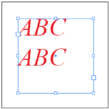

### 10.4.6 Common Text Properties

Just as all text objects in the In  Design scripting DOM share a large number of properties, all text elements in an IDML package share a large set of common attributes and elements. These attributes and properties can appear in a <Story>, <ParagraphStyleRange>, or <CharacterStyleRange> element inside a < Story> element, and in a <ParagraphStyle> or <CharacterStyle> elements.

To avoid repeating these attributes and elements in every text-related element reference in this specification, we'll describe them in this section, and refer to these descriptions from other sections.

**Table 104**: Common Text Properties Represented as Attributes

| Name                            | Type                                          | Req     | Description |
| ------------------------------- | --------------------------------------------- | ------- | ------------------------------------------------------------------------------------------------------------------------------------------------------------------------------------------------------------------------------- |
| AppliedCharacterStyle         | string                                        | no      | The CharacterStyle applied to the text. |
| AppliedConditions               | string (space separated list of conditions)   | no      | The applied conditions. |
| AppliedLanguage                 | string                                        | no      | The language of the text. Areference to the Self attribute of a language. |
| AppliedParagraphStyle         | string                                        | no      | The paragraph style applied to the text. |
| AutoLeading                     | double                                        | no      | The percent of the type size to use for auto lead- ing. (Range: 0 to 500). |
| AutoTcy                         | short                                         | no      | The number of half-width characters at or below which the characters automatically run horizon- tally in vertical text. |
| AutoTcyIncludeRoman           | boolean                                       | no      | If true, auto tcy includes Roman characters. |
| BaselineShift                   | double                                        | no      | The baseline shift applied to the text. |
| BulletsAlignment                | ListAlignment_ EnumValue                      | no      | The alignment of the bullet character. Can be LeftAlign (Align left), CenterAlign (Align center), or RightAlign (Align right). |
| BulletsAndNumberingListType   | ListTypeEnumValue                          | no      | List type for bullets and numbering. Can be NoList (No list), BulletList (Bullet list), or NumberedList (Numbered list). |
| BulletsTextAfter                | string                                        | no      | The text after string expression for bullets. |
| BunriKinshi                     | boolean                                       | no      | If true, adds the double period (..), ellipse (...), and double hyphen (--) to the selected kinsoku set. Note: Valid only when a kinsoku set is in effect. |
| Capitalization                  | Capitalization_ EnumValue                     | no      | The capitalization scheme. Can be Normal (Do not change the capitalization of the text), SmallCaps (Use small caps for lowercase let- ters), AllCaps (Use all uppercase letters), or CapToSmallCap (Use OpenType small caps). |
| CharacterAlignment            | CharacterAlignment_EnumValue              | no      | The alignment of small characters to the largest character in the line. Can be AlignBaseline (Aligns small characters in a line to the large character), AlignEmTop (Aligns small char- acters in horizontal text to the top of the em box of large characters In vertical text, aligns characters to the right of the em box), AlignEmCenter (Aligns small characters to the center of the em box of large characters), AlignEmBottom (Aligns small characters in horizontal text to the bottom of the em box of large characters In vertical text, aligns characters to the left of the em box), AlignICFTop (Aligns small characters in horizontal text to the top of the ICF of large characters In vertical text, aligns characters to the right of the ICF), or AlignICFBottom (Aligns small characters in horizontal text to the bottom of the ICF of large characters In vertical text, aligns characters to the left of the ICF). |
| CharacterDirection            | CharacterDirection_EnumValue              | no      | The direction of the character. Can be DefaultDirection (Default direction), LeftToRightDirection (Left to right direction), or RightToLeftDirection (Right to left direction). |
| CharacterRotation               | double                                        | no      | The rotation angle (in degrees) of individual characters. Note: The rotation is counterclock- wise. |
| CjkGridTracking                 | boolean                                       | no      | If true, uses grid tracking to track non-Roman characters in CJK grids. |
| Composer                        | string                                        | no      | The text composer to use to compose the text. |
| DesiredGlyph Scaling           | double                                        | no      | The desired width (as a percentage) of individual characters. (Range: 50 to 200) |
| DesiredLetter Spacing          | double                                        | no      | The desired letter spacing, specified as a per- centge of the built-in space between letters in the font. (Range: -100 to 500) |
| DesiredWord Spacing            | double                                        | no      | The desired word spacing, specified as a percent- age of the font word space value. (Range: 0 to 1000) |
| DiacriticPosition               | DiacriticPosition_EnumValue               | no      | Position of diacritical characters. Can be DefaultPosition (Default position), LoosePosition (Loose position), MediumPosition (Medium position), TightPosition (Tight position), or OpentypePosition (OpenType position). |
| DigitsType                      | DigitsType_EnumValue                        | no      | The type of digits to use. Can be DefaultDigits (Default digits), ArabicDigits (Arabic digits), HindiDigits (Hindi digits), or FarsiDigits (Farsi digits). |
| DropCapCharacters               | short                                         | no      | The number of characters to drop for a drop cap. |
| DropCapLines                    | short                                         | no      | The number of lines to drop for a drop cap. |
| DropcapDetail                   | int                                           | no      | The detailed size and positioning of the drop cap. |
| EndJoin                         | OutlineJoin_EnumValue                       | no      | The stroke join type applied to the characters of the text. Can be MiterEndJoin (Miter end join), RoundEndJoin (Rounded end join), or BevelEndJoin (Beveled end join). |
| FillColor                       | string                                        | no      | The swatch (color, gradient, tint, or mixed ink) applied to the fill of the text, as a reference to the Self attribute of the swatch. |
| FillTint                        | double                                        | no      | The tint (as a percentage) of the FillColor of the Paragraph. (To specify a tint percentage, use a number in the range of 0 to 100; to use the inherited or overridden value, use -1.) |
| FirstLineIndent                 | double                                        | no      | The amount to indent the first line. |
| FontStyle                       | string                                        | no      | The name of the FontStyle. |
| GlyphForm                       | AlternateGlyphForms_EnumValue               | no      | The glyph variant to substitute for standard glyphs. Can be None (Does not use an alternate form), TraditionalForm (Uses the traditional variant), ExpertForm (Uses the expert variant), JIS78Form (Uses the JIS78 variant), JIS83Form (Uses the JIS83 variant), MonospacedHalfWidthForm (Uses the monospaced half-width variant), ThirdWidthForm (Uses the third- width variant), QuarterWidthForm (Uses the quarter-width variant), NLCForm (Uses the NLC variant), ProportionalWidthForm (Substi- tutes proportional glyphs for half-width and full-width glyphs), FullWidthForm (Uses the full-width variant), JIS04Form (Uses the JIS04 variant), or JIS90Form (Uses the JIS90 variant). |
| GotoNextX                       | GotoNextX_EnumValue                         | no      | Abreak character that forces text to the next page or column. |
| GradientFillAngle               | double                                        | no      | The angle of a linear gradient applied to the fill of the text. (Range: -180 to 180) |
| GradientFillLength            | double                                        | no      | The length (for a linear gradient) or radius (for a radial gradient) applied to the fill of the text. |
| GradientFillStart               | UnitPointType_ TypeDef                        | no      | The starting point (in page coordinates) of a gra- dient applied to the fill of the text, in the format [x, y]. |
| GradientStroke Angle           | double                                        | no      | The angle of a linear gradient applied to the stroke of the text. (Range: -180 to 180) |
| GradientStroke Length          | double                                        | no      | The length (for a linear gradient) or radius (for a radial gradient) applied to the stroke of the text. |
| GradientStroke Start           | UnitPointType_ TypeDef                        | no      | The starting point (in page coordinates) of a gradient applied to the stroke of the text, in the format [x, y]. |
| GridAlignFirst LineOnly        | boolean                                       | no      | If true, aligns only the first line to the frame grid or baseline grid. If false, aligns all lines to the grid. |
| GridAlignment                   | GridAlignment_EnumValue                      | no      | The alignment to the frame grid or baseline grid. Can be None (Lines are not aligned to the grid), AlignBaseline (Aligns the text baseline to the grid), AlignEmTop (Aligns the top of the em box to the grid), Align EmCenter (Aligns the center of the em box to the grid), AlignEmBottom (Aligns the bot- tom of the em box to the grid), AlignICFTop (Aligns the top of the ICF box to the grid), or Align ICFBottom (Aligns the bottom of the ICF box to the grid). |
| GridGyoudori                    | short                                         | no      | The manual gyoudori setting. |
| HorizontalScale                 | double                                        | no      | The horizontal scaling applied to the text as a percentage of its current size. (Range: 1 to 1000) |
| HyphenWeight                    | short                                         | no      | The relative desirability of better spacing vs. fewer hyphens. Alower value results in greater use of hyphens. (Range: 0 to 100) |
| HyphenateAcross Columns        | boolean                                       | no      | If true, allows the last word in a text column to be hyphenated. |
| HyphenateAfter First           | short                                         | no      | The mininum number of letters at the beginning of a word that can be broken by a hyphen. |
| HyphenateBefore Last           | short                                         | no      | The minimum number of letters at the end of a word that can be broken by a hyphen. |
| Hyphenate CapitalizedWords     | boolean                                       | no      | If true, allows hyphenation of capitalized words. |
| HyphenateLadder Limit          | short                                         | no      | The maximum number of hyphens that can appear on consecutive lines. To specify unlim- ited consecutive lines, use zero. |
| HyphenateLastWord               | boolean                                       | no      | If true, allows hyphenation in the last word in a paragraph. Note: Valid only when hyphenation is true. |
| HyphenateWords LongerThan      | short                                         | no      | The minimum number of letters a word must have in order to qualify for hyphenation. |
| Hyphenation                     | boolean                                       | no      | If true, allows hyphenation. |
| HyphenationZone                 | double                                        | no      | The amount of white space allowed at the end of a line of non-justified text before hypenation begins. Note: Valid when composer is single-line composer. |
| IgnoreEdge Alignment           | boolean                                       | no      | If true, ignores optical edge alignment for the paragraph. |
| Jidori                          | short                                         | no      | The number of grid squares in which to arrange the text. |
| Justification                   | Justification_ EnumValue                      | no      | The paragraph alignment. Can be LeftAlign (Left aligns the text), CenterAlign (Center aligns the text), RightAlign (Right aligns the text), LeftJustified (Justifies the text and left aligns the last line in the paragraph), RightJustified (Justifies the text and right aligns the last line in the paragraph), Center Justified (Justifies text text and center aligns the last line in the paragraph), FullyJustified (Justifies the text, including the last line in the paragraph), ToBindingSide (Aligns text to the binding spine of the page or spread), or Away FromBindingSide (Aligns text to the side opposite the binding spine of the page). |
| Kashidas                        | Kashidas_Enum Value                          | no      | Use of Kashidas for justificationCan be DefaultKashidas (Default kashidas), or KashidasOff (Kashidas off). |
| KeepAllLines Together          | boolean                                       | no      | If true, keeps all lines of the paragraph together. If false, allows paragraphs to break across pages or columns. |
| KeepFirstLines                  | short                                         | no      | The minimum number of lines to keep together in a paragraph before allowing a page break. |
| KeepLastLines                   | short                                         | no      | The minimum number of lines to keep together in a paragraph after a page break. |
| KeepLinesTogether               | boolean                                       | no      | If true, keeps a specified number of lines togeth- er when the paragraph breaks across columns or TextFrames. |
| KeepRuleAboveIn Frame          | boolean                                       | no      | If true, forces the rule above the paragraph to remain in the frame bounds. Note: Valid only when rule above is true. |
| KeepWithNext                    | short                                         | no      | The minimum number of lines to keep with the next paragraph. |
| KeepWithPrevious                | boolean                                       | no      | If true, the first line in the paragraph should be kept with the last line of previous paragraph. |
| KentenAlignment                 | KentenAlignment_ EnumValue                    | no      | The alignment of kenten characters relative to the parent characters. Can be AlignKenten Left (Aligns kenten with the left of parent char- acters), or AlignKentenCenter (Aligns kenten with the center of parent charactrers). |
| KentenCharacter Set            | KentenCharacter Set_EnumValue                | no      | The character set used for the custom kenten character. Note: Valid only when kenten kind is custom. Can be CharacterInput (Character input), ShiftJIS (Shift JIS), JIS (JIS), Kuten (Kuten), or Unicode (Unicode). |
| KentenCustom Character         | string                                        | no      | The character used for kenten. Note: Valid only when kenten kind is custom. |
| KentenFontSize                  | double                                        | no      | The size (in points) of kenten characters. |
| KentenKind                      | KentenCharacter_ EnumValue                    | no      | The style of kenten characters. Can be None (Does not use kenten), KentenSesameDot (Uses the kenten sesame dot), KentenWhite SesameDot (Uses the kenten white sesame dot), KentenBlackCircle (Uses the kenten black circle), KentenWhiteCircle (Uses the kenten white circle), KentenBlackTriangle (Uses the kenten black triangle), KentenWhite Triangle (Uses the kenten white triangle), KentenBullseye (Uses the kenten bullseye), KentenFisheye (Uses the kenten fisheye), KentenSmallBlackCircle (Uses the kenten small black circle), KentenSmallWhiteCircle (Uses the kenten small white circle), or Custom (Uses a custom kenten style). |
| KentenOverprint Fill           | Adornment Overprint_Enum Value              | no      | The method of overprinting the kenten fill. Can be Auto (Uses auto overprint), OverprintOn (Turns on overprint), or OverprintOff (Turns off overprint). |
| KentenOverprint Stroke         | Adornment Overprint_Enum Value              | no      | The method of overprinting the kenten stroke. Can be Auto (Uses auto overprint), Overprint On (Turns on overprint), or OverprintOff (Turns off overprint). |
| KentenPlacement                 | double                                        | no      | The distance between kenten characters and their parent characters. |
| KentenPosition                  | RubyKenten Position_Enum Value              | no      | The kenten position relative to the parent char- acter. Can be AboveRight (Places kenten or ruby to the right and above the parent charac- ter), or BelowLeft (Places kenten or ruby to the left and below the parent character). |
| KentenStrokeTint                | double                                        | no      | The stroke tint (as a percentage) of kenten char- acters. (Range: 0 to 100) |
| KentenTint                      | double                                        | no      | The fill tint (as a percentage) of kenten charac- ters. (Range: 0 to 100) |
| KentenWeight                    | double                                        | no      | The stroke weight (in points) of kenten charac- ters. |
| KentenXScale                    | double                                        | no      | The horizontal size of kenten characters as a per- cent of the original size. |
| KentenYScale                    | double                                        | no      | The vertical size of kenten charachers as a per- cent of the original size. |
| KerningMethod                   | string                                        | no      | The type of pair kerning. |
| KerningValue                    | double                                        | no      | The amount of space to add or remove between characters, specified in thousands of an em. |
| KeyboardDirection               | Character Direction_Enum Value              | no      | The keyboard direction of the characterCan be DefaultDirection (Default direction), Left ToRightDirection (Left to right direction), or RightToLeftDirection (Right to left direc- tion). |
| KinsokuHangType                 | KinsokuHangTypes_ EnumValue                   | no      | The type of hanging punctuation to allow. Note: Valid only when a kinsoku set is in effect. Can be None (Disables hanging punctuation), Kinsoku HangRegular (Enables hanging punctuation and allows punctuation marks to be placed on or outside the TextFrame but allows burasagari characters to hang as little as possible Note: Dif- fers for justified and nonjustified text For infor- mation on justification, see line alignment), or KinsokuHangForce (Enables hanging punctua- tion but forces hanging punctuation outside the TextFrame and does not allow the punctuation to be placed on the TextFrame). |
| KinsokuType                     | KinsokuType_Enum Value                       | no      | The type of kinsoku processing for preventing kinsoku characters from beginning or end- ing a line. Note: Valid only when a kinsoku set is defined. Can be KinsokuPushInFirst (Attempts to move characters to the previ- ous line; if the push-in is not possible, pushes characters to the next line), KinsokuPush OutFirst (Attempts to move characters to the next line; if the push-out is not possible, pushes characters to the previous line), KinsokuPush OutOnly (Always moves characters to the next line Does not attempt a push-in), or Kinsoku PrioritizeAdjustmentAmount (The kinsoku prioritize adjustment amount). |
| LastLineIndent                  | double                                        | no      | The amount to indent the last line in the Para- graph. |
| LeadingAki                      | double                                        | no      | The amount of space before each character. |
| LeadingModel                    | LeadingModel_ EnumValue                       | no      | The point from which leading is measured from line to line. Can be LeadingModelRoman (Measures the space between type baselines), LeadingModelAkiBelow (Measures the space between lines from the aki below), Leading ModelAkiAbove (Measures the space between lines from the aki above), LeadingModel Center (Measures the space between the char- acter center points), or LeadingModelCenter Down (Center down leading model). |
| LeftIndent                      | double                                        | no      | The width of the left indent. |
| Ligatures                       | boolean                                       | no      | If true, replaces specific character combinations (e.g., fl, fi) with ligature characters. |
| LinkResourceID                  | int                                           | no      | This attribute refers to the self attribute of the parent story or XMLstory to which the child story is linked.. |
| MaximumGlyph Scaling           | double                                        | no      | The maximum width (as a percentage) of indi- vidual characters. (Range: 50 to 200) |
| MaximumLetter Spacing          | double                                        | no      | The maximum letter spacing, specified as a per- centge of the built-in space between letters in the font. (Range: -100 to 500) Note: Valid only when text is justified. |
| MaximumWord Spacing            | double                                        | no      | The maximum word spacing, specified as a per- centage of the font word space value. Note: Valid only when text is justified. (Range: 0 to 1000) |
| MinimumGlyph Scaling           | double                                        | no      | The minimum width (as a percentage) of indi- vidual characters. (Range: 50 to 200) |
| MinimumLetter Spacing          | double                                        | no      | The minimum letter spacing, specified as a per- centge of the built-in space between letters in the font. (Range: -100 to 500) Note: Valid only when text is justified. |
| MinimumWord Spacing            | double                                        | no      | The minimum word spacing, specified as a per- centage of the font word space value. Note: Valid only when text is justified. (Range: 0 to 1000) |
| MiterLimit                      | double                                        | no      | The limit of the ratio of stroke width to miter length before a miter (pointed) join becomes a bevel (squared-off) join. |
| NoBreak                         | boolean                                       | no      | If true, keeps the text on the same line. |
| Numbering Alignment            | ListAlignment_ EnumValue                      | no      | The alignment of the number. Can be Left Align (Align left), CenterAlign (Align center), or RightAlign (Align right). |
| NumberingApply RestartPolicy   | boolean                                       | no      | If true, apply the numbering restart policy. |
| NumberingContinue               | boolean                                       | no      | Continue the numbering at this level. |
| Numbering Expression           | string                                        | no      | The number string expression for numbering. |
| NumberingLevel                  | int                                           | no      | The level of the paragraph. |
| NumberingStartAt                | int                                           | no      | Determines starting number in a numbered list. |
| OTFContextual Alternate        | boolean                                       | no      | If true, uses contextual alternate forms in Open- Type fonts. |
| OTFDiscretionary Ligature      | boolean                                       | no      | If true, uses discretionary ligatures in OpenType fonts. |
| OTFFigureStyle                  | OTFFigureStyle_ EnumValue                     | no      | The figure style in OpenType fonts. Can be TabularLining (Use monspaced lining fig- ures), ProportionalOldstyle (Use proportional width oldstyle figures), ProportionalLining (Use proportional width lining figures), Tabular Oldstyle (Use monospaced oldstyle figures), or Default (Use the default figure style for the font). |
| OTFFraction                     | boolean                                       | no      | If true, uses fractions in OpenType fonts. |
| OTFHVKana                       | boolean                                       | no      | If true, switches hiragana fonts, which have dif- ferent glyphs for horizontal and vertical. |
| OTFHistorical                   | boolean                                       | no      | If true, use historical forms in OpenType fonts. |
| OTFJustification Alternate     | boolean                                       | no      | Whether to use justification alternate forms in OpenType fonts |
| OTFLocale                       | boolean                                       | no      | If true, uses localized forms in OpenType fonts. |
| OTFMark                         | boolean                                       | no      | If true, uses mark positioning in OpenType fonts. |
| OTFOrdinal                      | boolean                                       | no      | If true, uses ordinals in OpenType fonts. |
| OTFOverlapSwash                 | boolean                                       | no      | If true, use overlapping swash forms in Open- Type fonts. |
| OTFProportional Metrics        | boolean                                       | no      | If true, kerns according to proportional CJK metrics in OpenType fonts. |
| OTFRomanItalics                 | boolean                                       | no      | If true, applies italics to half-width alphanumeric characters. |
| OTFSlashedZero                  | boolean                                       | no      | If true, use a slashed zeroes in OpenType fonts. |
| OTFStretched Alternate         | boolean                                       | no      | Whether to use stretched alternate forms in OpenType fonts. |
| OTFStylistic Alternate         | boolean                                       | no      | If true, use stylistic alternate forms in OpenType fonts. |
| OTFStylisticSets                | int                                           | no      | The stylistic sets to use in OpenType fonts. |
| OTFSwash                        | boolean                                       | no      | If true, uses swash forms in OpenType fonts. |
| OTFTitling                      | boolean                                       | no      | If true, uses titling forms in OpenType fonts. |
| OverprintFill                   | boolean                                       | no      | If true, the FillColor of the characters will over- print. |
| OverprintStroke                 | boolean                                       | no      | If true, the stroke of the characters will over- print. |
| PageNumberType                  | PageNumberType_ EnumValue                     | no      | The type of the page number marker. Can be AutoPageNumber, NextPageNumber, or PreviousPageNumber . |
| Paragraph Direction            | Paragraph Direction_Enum Value              | no      | The paragraph composition direction. Can be LeftToRightDirection (Left to Right para- graph direction), or RightToLeftDirection (Right to Left paragraph direction). |
| ParagraphGyoudori               | boolean                                       | no      | If true, the gyoudori mode applies to the entire paragraph. If false, the gyoudori mode applies to each line in the paragraph. |
| Paragraph Justification        | Paragraph Justification_ EnumValue           | no      | Paragraph justificationCan be Default Justification (Default justification), ArabicJustification (Arabic justification), or NaskhJustification (Naskh justification). |
| PointSize                       | double                                        | no      | The text size. |
| Position                        | Position_Enum Value                          | no      | The text position relative to the baseline. Can be Normal (Normal position), Superscript (Superscripts the text), Subscript (Subscripts the text), OTSuperscript (For OpenType fonts, uses-if available-raised glyphs that are sized correctly relative to the surrounding characters), OTSubscript (For OpenType fonts, uses-if available-lowered glyphs that are sized cor- rectly relative to the surrounding characters), OTNumerator (For OpenType fonts, shrinks the text but keeps the top of the characters aligned with the top of the main text Note: Valid only for numeric characters), or OTDenominator (For OpenType fonts, shrinks the text but keeps text on the main text baseline Note: Valid only for |
| PositionalForm                  | PositionalForms_ EnumValue                    | no      | The OpenType positional form. Can be None (None), Calculate (Calculated forms), Initial (Initial form), Medial (Medial form), Final (Final form), or Isolated (Isolated form). |
| Rensuuji                        | boolean                                       | no      | If true, disallows line breaks in numbers. If false, lines can break between digits in multi-digit numbers. |
| RightIndent                     | double                                        | no      | The width of the right indent. |
| RotateSingleByte Characters    | boolean                                       | no      | If true, rotates Roman characters in vertical text. |
| RubyAlignment                   | RubyAlignments_ EnumValue                     | no      | The ruby alignment. Can be RubyLeft (Aligns ruby with the left-most character in the parent text), RubyCenter (Centers ruby relative to the parent text), RubyRight (Aligns ruby with the right-most character in the parent text), Ruby FullJustify (Justifies ruby across the parent text), RubyJIS (Ruby JIS), RubyEqualAki (Ruby equal aki), or Ruby1Aki (Ruby 1 aki). |
| RubyAutoAlign                   | boolean                                       | no      | If true, auto aligns ruby. |
| RubyAutoScaling                 | boolean                                       | no      | If true, automatically scales ruby to the speci- fied percent of parent text size. For information on specifying a percent, see ruby parent scaling percent. |
| RubyAutoTcyAutoScale          | boolean                                       | no      | If true, automatically scales glyphs in auto tcy (tate-chuu-yoko) in ruby to fit one em. |
| RubyAutoTcyDigits               | short                                         | no      | The number of digits included in auto tcy (tate- chuu-yoko) in ruby. |
| RubyAutoTcyIncludeRoman       | boolean                                       | no      | If true, includes Roman characters in auto tcy (tate-chuu-yoko) in ruby. |
| RubyFlag                        | int                                           | no      | If true, ruby is on. |
| RubyFontSize                    | double                                        | no      | The size (in points) of ruby characters. |
| RubyOpenTypePro                 | boolean                                       | no      | If true, uses OpenType Pro fonts for ruby. |
| RubyOverhang                    | boolean                                       | no      | If true, constrains ruby overhang to the speci- fied amount. For information on specifying an amount, see ruby parent overhang amount. |
| RubyOverprintFill               | Adornment Overprint_Enum Value              | no      | The method of overprinting the ruby fill. Can be Auto (Uses auto overprint), OverprintOn (Turns on overprint), or OverprintOff (Turns off overprint). |
| RubyOverprint Stroke           | Adornment Overprint_Enum Value              | no      | The method of overprinting the ruby stroke. Can be Auto (Uses auto overprint), OverprintOn (Turns on overprint), or OverprintOff (Turns off overprint). |
| RubyParent OverhangAmount      | RubyOverhang_ EnumValue                       | no      | The amount by which ruby characters can over- hang the parent text. Can be None (Does not allow ruby overhang), RubyOverhangOneRuby (Ruby overhang is one ruby), RubyOverhang HalfRuby (Ruby overhang is one-half ruby), RubyOverhangOneChar (Ruby overhang is the size of one character), RubyOverhangHalfChar (Ruby is overhang one-half the size of one chara- racter), or RubyOverhangNoLimit (There is no ruby overhang size limit). |
| RubyParent ScalingPercent      | double                                        | no      | The amount (as a percentage) to scale the parent text size to determine the ruby text size. |
| RubyParentSpacing               | RubyParent Spacing_EnumValue                 | no      | The ruby spacing relative to the parent text. Can be RubyParentNoAdjustment (Does not base ruby spacing on parent text), RubyParent BothSides (Ruby parent both sides), Ruby Parent121Aki (Ruby parent 121 aki), Ruby ParentEqualAki (Applies the parent text aki to the ruby characters), or RubyParentFull Justify (Justifies ruby characters to both edges of the parent text). |
| RubyPosition                    | RubyKenten Position_Enum Value              | no      | The position of ruby characters relative to the parent text. Can be AboveRight (Places kenten or ruby to the right and above the parent charac- ter), or BelowLeft (Places kenten or ruby to the left and below the parent character). |
| RubyString                      | string                                        | no      | The ruby string contents. |
| RubyStrokeTint                  | double                                        | no      | The stroke tint (as a percentage) of ruby charac- ters. |
| RubyTint                        | double                                        | no      | The tint (as a percentage) of the ruby FillColor. (Range: 0 to 100) |
| RubyType                        | RubyTypes_Enum Value                         | no      | The ruby type. Can be GroupRuby (Provides ruby for a group of characters), or Per CharacterRuby (Provides ruby for each indi- vidual character in the group). |
| RubyWeight                      | double                                        | no      | The stroke weight (in points) of ruby characters. |
| RubyXOffset                     | double                                        | no      | The amount of horizontal space between ruby and parent characters. |
| RubyXScale                      | double                                        | no      | The horizontal size of ruby characters, specified as a percent of the original size. |
| RubyYOffset                     | double                                        | no      | The amount of vertical space between ruby and parent characters. |
| RubyYScale                      | double                                        | no      | The vertical size of ruby characters, specified as a percent of the original size. |
| RuleAbove                       | boolean                                       | no      | If true, places a rule above the paragraph. |
| RuleAboveGap Overprint         | boolean                                       | no      | If true, the stroke gap of the paragraph rule above will overprint. Note: Valid only the rule above type is not solid. |
| RuleAboveGapTint                | double                                        | no      | The tint (as a percentage) of the stroke gap color of the paragraph rule. (Range: 0 to 100) Note: Valid only when the rule above type is not solid. |
| RuleAboveLeft Indent           | double                                        | no      | The distance to indent the left edge of the para- graph rule above (based on either the text width or the column width of the first line in the para- graph. |
| RuleAboveLine Weight           | double                                        | no      | The line weight of the rule above |
| RuleAboveOffset                 | double                                        | no      | The amount to offset the paragraph rule above from the baseline of the first line the paragraph. |
| RuleAbove Overprint            | boolean                                       | no      | If true, the paragraph rule above will overprint. |
| RuleAboveRight Indent          | double                                        | no      | The distance to indent the right edge of the paragraph rule above (based on either the text width or the column width of the first line in the paragraph. |
| RuleAboveTint                   | double                                        | no      | The tint (as a percentage) of the paragraph rule above. (Range: 0 to 100) |
| RuleAboveWidth                  | RuleWidth_Enum Value                         | no      | The basis (text width or column width) used to calculate the width of the paragraph rule above. Can be TextWidth (Makes the paragraph rule above the width of the first line of text in the paragraph), or ColumnWidth (Makes the rule the width of the column). |
| RuleBelow                       | boolean                                       | no      | If true, applies a paragraph rule below. |
| RuleBelowGap Overprint         | boolean                                       | no      | If true, the gap color of the rule below will over- print. |
| RuleBelowGapTint                | double                                        | no      | The tint (as a percentage) of the stroke gap color of the paragraph rule below. (Range: 0 to 100) Note: Valid only when the paragraph rule below type is not solid. |
| RuleBelowLeft Indent           | double                                        | no      | The distance to indent the left edge of the para- graph rule below (based on either the text width or the column width of the last line in the para- graph. |
| RuleBelowLine Weight           | double                                        | no      | The line weight of the rule below |
| RuleBelowOffset                 | double                                        | no      | The amount to offset the the paragraph rule below from the baseline of the last line of the paragraph. |
| RuleBelow Overprint            | boolean                                       | no      | If true, the rule below will overprint. |
| RuleBelowRight Indent          | double                                        | no      | The distance to indent the right edge of the paragraph rule below (based on either the text width or the column width of the last line in the paragraph. |
| RuleBelowTint                   | double                                        | no      | The tint (as a percentage) of the paragraph rule below. (Range: 0 to 100) |
| RuleBelowWidth                  | RuleWidth_Enum Value                         | no      | The basis (text width or column width) used to calculate the width of the paragraph rule below. Can be TextWidth (Makes the paragraph rule above the width of the first line of text in the paragraph), or ColumnWidth (Makes the rule the width of the column). |
| ScaleAffectsLine Height        | boolean                                       | no      | If true, the line changes size when characters are scaled. |
| ShataiAdjust Rotation          | boolean                                       | no      | If true, applies shatai rotation. |
| ShataiAdjustTsume               | boolean                                       | no      | If true, adjusts shatai tsume. |
| ShataiDegreeAngle               | double                                        | no      | The shatai lens angle (in degrees). |
| Shatai Magnification           | double                                        | no      | The amount (as a percentage) of shatai obliquing to apply. |
| SingleWord Justification       | SingleWord Justification_ EnumValue          | no      | The alignment to use for lines that contain a single word. Can be LeftAlign (Left aligns the word), CenterAlign (Center aligns the word), RightAlign (Right aligns the word), or Fully Justified (Fully justifies the word). |
| Skew                            | double                                        | no      | The skew angle of the text. (Range: -85 to 85) |
| SpaceAfter                      | double                                        | no      | The height of the paragraph space below. |
| SpaceBefore                     | double                                        | no      | The height of the paragraph space above. |
| SpanColumnInside Gutter        | double                                        | no      | The inside gutter if the paragraph splits columns. |
| SpanColumn OutsideGutter       | double                                        | no      | The outside gutter if the paragraph splits columns. |
| SpanColumnType                  | SpanColumnType Options_EnumValue             | no      | Whether a paragraph should be a single column, span columns or split columns. Can be SingleColumn, SpanColumns, or SplitColumns . |
| SpanSplitColumn Count          | int                                           | no      | The number of columns a paragraph spans or the number of split columns. |
| StartParagraph                  | StartParagraph_ EnumValue                     | no      | The location at which to start the paragraph. Can be Anywhere (Starts in the next available space), NextColumn (Starts at the top of the next column), NextFrame (Starts at the top of the next TextFrame in the thread), NextPage (Starts at the top of the next page), NextOddPage (Starts at the top of the next odd-numbered page), or NextEvenPage (Starts at the top of the |
| StrikeThroughGap Overprint     | boolean                                       | no      | If true, the gap color of the strikethrough stroke will overprint. Note: Valid when strike through type is not solid. |
| StrikeThroughGap Tint          | double                                        | no      | The tint (as a percentage) of the strikethrough stroke gap color. (Range: 0 to 100) Note: Valid when strike through type is not solid. |
| StrikeThrough Offset           | double                                        | no      | The amount by which to offset the strikethrough stroke from the text baseline. |
| StrikeThrough Overprint        | boolean                                       | no      | If true, the strikethrough stroke will overprint. |
| StrikeThroughTint               | double                                        | no      | The tint (as a percentage) of the strikethrough stroke. (Range: 0 to 100) |
| StrikeThrough Weight           | double                                        | no      | The stroke weight of the strikethrough stroke. |
| StrikeThru                      | boolean                                       | no      | If true, draws a strikethrough line through the text. |
| StrokeAlignment                 | TextStrokeAlign_ EnumValue                    | no      | The stroke alignment applied to the text. Can be CenterAlignment (The stroke straddles the path), or OutsideAlignment (The stroke is out- side the path, like a picture frame). |
| StrokeColor                     | string                                        | no      | The swatch (color, gradient, tint, or mixed ink) applied to the stroke of the Paragraph. |
| StrokeTint                      | double                                        | no      | The tint (as a percentage) of the stroke color of the Paragraph. (To specify a tint percentage, use a number in the range of 0 to 100; to use the inherited or overridden value, use -1.) |
| StrokeWeight                    | double                                        | no      | The stroke weight applied to the characters of the text. |
| Tatechuyoko                     | boolean                                       | no      | If true, makes the character horizontal in verti- cal text. |
| Tatechuyoko XOffset            | double                                        | no      | The horizontal offset for horizontal characters in vertical text. |
| Tatechuyoko YOffset            | double                                        | no      | The vertical offset for horizontal characters in vertical text. |
| Tracking                        | double                                        | no      | The amount by which to loosen or tighten a block of text, specified in thousands of an em. |
| TrailingAki                     | double                                        | no      | The amount of SpaceAfter each character. |
| TreatIdeographic SpaceAsSpace  | boolean                                       | no      | If true, ideographic spaces will not wrap to the next line like text characters. |
| Tsume                           | double                                        | no      | The amount of horizontal character compres- sion. |
| Underline                       | boolean                                       | no      | If true, underlines the text. |
| UnderlineGap Overprint         | boolean                                       | no      | If true, the gap color of the underline stroke will overprint. |
| UnderlineGapTint                | double                                        | no      | The tint (as a percentage) of the gap color of the underline stroke. (Range: 0 to 100) Note: Valid when underline type is not solid. |
| UnderlineOffset                 | double                                        | no      | The amount by which to offset the underline from the text baseline. |
| Underline Overprint            | boolean                                       | no      | If true, the underline stroke color will overprint. |
| UnderlineTint                   | double                                        | no      | The underline stroke tint (as a percentage). (Range: 0 to 100) |
| UnderlineWeight                 | double                                        | no      | The stroke weight of the underline stroke. |
| VerticalScale                   | double                                        | no      | The vertical scaling applied to the text as a per- centage of its current size. (Range: 1 to 1000) |
| Warichu                         | boolean                                       | no      | If true, turns on warichu. |
| WarichuAlignment                | WarichuAlignment_ EnumValue                   | no      | The warichu alignment. Can be Auto (Auto- matically aligns warichu characters), Left Align (Aligns warichu on the left side of the TextFrame), CenterAlign (Aligns warichu in the center of the TextFrame), RightAlign (Wari- chu on the rigt side of the TextFrame), Fully Justified (Justifies warichu lines and makes all lines of equal length), LeftJustified (Jus- tifies warichu lines and left aligns the last line), CenterJustified (Justifies warichu lines and center aligns the last line), or RightJustified (Justifies warichu lines and right aligns the last line). |
| WarichuChars AfterBreak        | short                                         | no      | The minimum number of characters allowed after a line break. |
| WarichuChars BeforeBreak       | short                                         | no      | The minimum number of characters allowed before a line break. |
| WarichuLine Spacing            | double                                        | no      | The gap between lines of warichu characters. |
| WarichuLines                    | short                                         | no      | The number of lines of warichu within a single normal line. |
| WarichuSize                     | double                                        | no      | The amount (as a percentage) to scale parent text size to determine warichu size. |
| XOffsetDiacritic                | double                                        | no      | The X offset for diacritic adjustment |
| YOffsetDiacritic                | double                                        | no      | The Y offset for diacritic adjustment |

**Table 105**:  Common Text Properties Represented as Elements

| Name                       | Type                                                                                      | Req     | Description |
| -------------------------  | ----------------------------------------------------------------------------              | ------- | --------------------------------------------------------------------------------------------------------------------------------------------------------------------------------------------------------------------------------------------------------------------------------------------------------------------------------------------------------------------- |
| AllGREPStyles              | ListItem                                                                                  | no      | Alist of the grep styles in the text. |
| AllLineStyles              | ListItem                                                                                  | no      | Alist of the line styles in the text. |
| AllNestedStyles            | ListItem                                                                                  | no      | Alist of the nested styles in the text. |
| AppliedFont                | string (a reference to a self attribute) or string                                        | no      | The font applied to the text, specified as either a font object or the name of font family. |
| AppliedNumbering List     | string (a reference to a self attribute) or string                                        | no      | The list to be part of. |
| BalanceRagged Lines       | boolean or BalanceLines Style_EnumValue                                                  | no      | If true or set to an enumeration value, bal- ances ragged lines in the paragraph(s) of the Paragraph. Note: Not valid with a single-line text composer. For information, see composer. Can be NoBalancing (Does not balance lines), VeeShape (Prefers shorter last lines), Fully Balanced (Balances lines equally), or Pyramid Shape (Prefers longer last lines). |
| BulletChar                 | undefined                                                                                 | no      | Bullet character. |
| BulletsCharacterStyle    | string (a reference to a self attribute) or string                                        | no      | The CharacterStyle to be used for the text after string. |
| BulletsFont                | string (a reference to a self attribute) or string or AutoEnum_Enum Value                | no      | The font used for bullet characters. |
| BulletsFontStyle           | string or NothingEnum_Enum Value or Auto Enum_EnumValue                                 | no      | The FontStyle used for bullet characters. |
| CustomGlyph                | long or string                                                                            | no      | Acustom glyph. |
| KentenFillColor            | string (a reference to a self attribute) or string                                        | no      | The swatch (color, gradient, tint, or mixed ink) applied to the fill of kenten characters. |
| KentenFont                 | string (a reference to a self attribute) or string                                        | no      | The font to use for kenten characters. |
| KentenFontStyle            | string or NothingEnum_Enum Value                                                         | no      | The FontStyle of kenten characters. |
| KentenStrokeColor          | string (a reference to a self attribute) or string                                        | no      | The swatch (color, gradient, tint, or mixed ink) applied to the stroke of kenten characters. |
| KinsokuSet                 | string (a reference to a self attribute) or Kinsoku Set_EnumValue or string              | no      | The kinsoku set that determines legitimate line breaks. Can return: KinsokuTable, KinsokuSet enumerator or String. Can be Nothing (Does not use a kinsoku set), HardKinsoku (Uses the hard or maximum kinsoku set, which includes all Japanese characters that should not begin or end a line), SoftKinsoku (Uses the soft or weak kinsoku set, which omits from the hard kinsoku set long vowel symbols and small hiragana and katakana characters), KoreanKinsoku (Uses the Korean kinsoku set), SimplifiedChinese Kinsoku (Uses the simplified Chinese kinsoku set), or TraditionalChineseKinsoku (Uses the traditional Chinese kinsoku set). |
| Leading                    | double or Leading_EnumValue                                                               | no      | The leading applied to the text. Can return: Unit or Leading enumerator. |
| Mojikumi                   | string (a reference to a self attribute) or string or MojikumiTable Defaults_Enum Value | no      | The mojikumi table. For information, see moji- kumi table defaults. Can be Nothing (Turns off mojikumi), LineEndAllOneHalfEmEnum (Uses half-width spacing for all characters), OneEm IndentLineEndUkeOneHalfEmEnum (Indents lines one space and uses line end uke one half space), OneOrOneHalfEmIndentLineEnd UkeOneHalfEmEnum (Indents lines one full or half space and uses line end uke one half space), OneOrOneHalfEmIndentLineEndAllOneEm Enum (Uses full-witdh spacing for all characters except the last character in the line, which uses either full- or half-width spacing), OneEm IndentLineEndAllOneEmEnum (Indents lines one full space and uses full-width spacing for all characters), OneEmIndentLineEndAllNo FloatEnum (Indents lines one full space and uses no float for all characters), OneEmIndent LineEndUkeNoFloatEnum (Indents lines one full space and uses line end uke no float), One OrOneHalfEmIndentLineEndUkeNoFloat Enum (Indents lines one half space or one full space and uses line end uke no float), OneEm IndentLineEndAllOneHalfEmEnum (Indents lines one full space and uses half-width spacing for all characters), LineEndAllOneEmEnum (Uses full-width spacing for all characters), LineEndUkeNoFloatEnum (Uses line end uke no float), OneOrOneHalfEmIndentLine EndPeriodOneEmEnum (Indents lines one or one-half space and uses full-width spacing for punctuation and for the last character in the line), OneEmIndentLineEndPeriodOneEmEnum (Indents lines one full space and uses full-width spacing for punctuation and for the last charac- |
| Numbering CharacterStyle  | string (a reference to a self attribute) or string                                        | no      | The CharacterStyle to be used for the number string. |
| NumberingFormat            | NumberingStyle_ EnumValue or string                                                       | no      | Numbering format options. Can be Upper Roman (Upper roman), LowerRoman (Lower roman), UpperLetters (Upper letters), Lower Letters (Lower letters), Arabic (Arabic), KatakanaModern (Katakana (a, i, u, e, o)), KatakanaTraditional (Katakana (i, ro, ha, ni)), FormatNone (Do not add characters), SingleLeadingZeros (Add single leading zeros), Kanji (Kanji), DoubleLeadingZeros (Add double leading zeros), or Triple LeadingZeros (Add triple leading zeros). |
| NumberingRestart Policies | undefined                                                                                 | no      | Numbering restart policies. |
| OpenTypeFeatures           | ListItem                                                                                  | no      | OpenType features. |
| RubyFill                   | string (a reference to a self attribute) or string                                        | no      | The swatch (color, gradient, tint, or mixed ink) applied to the fill of ruby characters. |
| RubyFont                   | string (a reference to a self attribute) or string                                        | no      | The font applied to ruby characters. |
| RubyFontStyle              | string or NothingEnum_Enum Value                                                         | no      | The FontStyle of ruby characters. |
| RubyStroke                 | string (a reference to a self attribute) or string                                        | no      | The swatch (color, gradient, tint, or mixed ink) applied to the stroke of ruby characters. |
| RuleAboveColor             | string (a reference to a self attribute) or string                                        | no      | The swatch (color, gradient, tint, or mixed ink) applied to the paragraph rule above. |
| RuleAboveGapColor          | string (a reference to a self attribute) or string                                        | no      | The swatch (color, gradient, tint, or mixed ink) applied to the stroke gap of the paragraph rule above. Note: Valid only when the paragraph rule above type is not solid. |
| RuleAboveType              | string (a reference to a self attribute) or string                                        | no      | The stroke type of the rule above the paragraph. |
| RuleBelowColor             | string (a reference to a self attribute) or string                                        | no      | The swatch (color, gradient, tint, or mixed ink) applied to the paragraph rule below. Can return: Swatch or String. |
| RuleBelowGapColor          | string (a reference to a self attribute) or string                                        | no      | The swatch (color, gradient, tint, or mixed ink) applied to the stroke gap of the paragraph rule below. Note: Valid only when the paragraph rule below type is not solid. |
| RuleBelowType              | string (a reference to a self attribute) or string                                        | no      | The stroke type of the rule below the paragraph. |
| StrikeThrough Color       | string (a reference to a self attribute) or string                                        | no      | The swatch (color, gradient, tint, or mixed ink) applied to the strikethrough stroke. |
| StrikeThroughGap Color    | string (a reference to a self attribute) or string                                        | no      | The swatch (color, gradient, tint, or mixed ink) applied to the gap of the strikethrough stroke. |
| StrikeThroughType          | string (a reference to a self attribute) or string                                        | no      | The stroke type of the strikethrough stroke. Can return: StrokeStyle or String. |
| TabList                    | ListItem                                                                                  | no      | Alist of all of the properties of all of the para- graph's tab stops. Can return: Array of Arrays of Property Name/Value Pairs. |
| UnderlineColor             | string (a reference to a self attribute) or string                                        | no      | The swatch (color, gradient, tint, or mixed ink) applied to the underline stroke. Can return: Swatch or String. |
| UnderlineGapColor          | string (a reference to a self attribute) or string                                        | no      | The swatch (color, gradient, tint, or mixed ink) applied to the gap of the underline stroke. Note: Valid when underline type is not solid. Can return: Swatch or String. |
| UnderlineType              | string (a reference to a self attribute) or string                                        | no      | The stroke type of the underline stroke. Can return: StrokeStyle or String. |

#### Attributes and Elements Related to Japanese Features

Attributes such as Ruby Font, Mojikumi, and Warichu  Lines are specific to the Japanese feature set. IDML recognizes these settings because In  Design supports a number of different platforms and locales. For example, an IDML package create by Japanese version of In  Design can be opened without error in English version of In  Design (just as a binary file created by one language version can be opened in another language version).

### 10.4.7 Story Schema

The attributes and elements of a <Story> element define text content and text formatting of the story. In  Design stories can contain page items, such as TextFrames or graphics, notes, footnotes, hyperlinks, and other objects. The <Story> element can contain everything that can appear in a story in an In  Design document.

Most of the attributes and elements defined in the schema for a story concern the text formatting defaults and preference settings of the story. Story attributes such as AppliedParagraphStyle, AppliedCharacterStyle, and FontStyle define the default text formatting of the story. They can be overridden by related attributes in text child elements that appear inside the story, such as the <ParagraphStyleRange> element.

**Schema Example**

```
Story_Object = element Story { attribute Self { xsd:string }, attribute AppliedTOCStyle { xsd:string }?, attribute FontStyle { xsd:string }?, attribute PointSize { xsd:double }?, attribute KerningMethod { xsd:string }?, attribute Tracking { xsd:double }?, attribute Capitalization { Capitalization_EnumValue }?, attribute Position { Position_EnumValue }?, attribute Underline { xsd:boolean }?, attribute StrikeThru { xsd:boolean }?, attribute Ligatures { xsd:boolean }?, attribute NoBreak { xsd:boolean }?, attribute HorizontalScale { xsd:double }?, attribute VerticalScale { xsd:double }?, attribute BaselineShift { xsd:double }?, attribute Skew { xsd:double }?, attribute FillTint { xsd:double }?, attribute StrokeTint { xsd:double }?, attribute StrokeWeight { xsd:double }?, attribute OverprintStroke { xsd:boolean }?, attribute OverprintFill { xsd:boolean }?, attribute OTFFigureStyle { OTFFigureStyle_EnumValue }?, attribute OTFOrdinal { xsd:boolean }?, attribute OTFFraction { xsd:boolean }?, attribute OTFDiscretionaryLigature { xsd:boolean }?, attribute OTFTitling { xsd:boolean }?, attribute OTFContextualAlternate { xsd:boolean }?, attribute OTFSwash { xsd:boolean }?, attribute UnderlineTint { xsd:double }?, attribute UnderlineGapTint { xsd:double }?, attribute UnderlineOverprint { xsd:boolean }?, attribute UnderlineGapOverprint { xsd:boolean }?, attribute UnderlineOffset { xsd:double }?, attribute UnderlineWeight { xsd:double }?, attribute StrikeThroughTint { xsd:double }?, attribute StrikeThroughGapTint { xsd:double }?, attribute StrikeThroughOverprint { xsd:boolean }?, attribute StrikeThroughGapOverprint { xsd:boolean }?, attribute StrikeThroughOffset { xsd:double }?, attribute StrikeThroughWeight { xsd:double }?, attribute FillColor { xsd:string }?, attribute StrokeColor { xsd:string }?, attribute AppliedLanguage { xsd:string }?, attribute ParagraphKashidaWidth { xsd:double }?, attribute FirstLineIndent { xsd:double }?, attribute LeftIndent { xsd:double }?, attribute RightIndent { xsd:double }?, attribute SpaceBefore { xsd:double }?, attribute SpaceAfter { xsd:double }?, attribute Justification { Justification_EnumValue }?, attribute SingleWordJustification { SingleWordJustification_EnumValue }?, attribute AutoLeading { xsd:double }?, attribute DropCapLines { xsd:short {minInclusive="0" maxInclusive="25"} }?, attribute DropCapCharacters { xsd:short {minInclusive="0" maxInclusive="150"} }?, attribute KeepLinesTogether { xsd:boolean }?, attribute KeepAllLinesTogether { xsd:boolean }?, attribute KeepWithNext { xsd:short {minInclusive="0" maxInclusive="5"} }?, attribute KeepFirstLines { xsd:short {minInclusive="1" maxInclusive="50"} }?, attribute KeepLastLines { xsd:short {minInclusive="1" maxInclusive="50"} }?, attribute StartParagraph { StartParagraph_EnumValue }?, attribute Composer { xsd:string }?, attribute MinimumWordSpacing { xsd:double }?, attribute MaximumWordSpacing { xsd:double }?, attribute DesiredWordSpacing { xsd:double }?, attribute MinimumLetterSpacing { xsd:double }?, attribute MaximumLetterSpacing { xsd:double }?, attribute DesiredLetterSpacing { xsd:double }?, attribute MinimumGlyphScaling { xsd:double }?, attribute MaximumGlyphScaling { xsd:double }?, attribute DesiredGlyphScaling { xsd:double }?, attribute RuleAbove { xsd:boolean }?, attribute RuleAboveOverprint { xsd:boolean }?, attribute RuleAboveLineWeight { xsd:double }?, attribute RuleAboveTint { xsd:double }?, attribute RuleAboveOffset { xsd:double }?, attribute RuleAboveLeftIndent { xsd:double }?, attribute RuleAboveRightIndent { xsd:double }?, attribute RuleAboveWidth { RuleWidth_EnumValue }?, attribute RuleAboveGapTint { xsd:double }?, attribute RuleAboveGapOverprint { xsd:boolean }?, attribute RuleBelow { xsd:boolean }?, attribute RuleBelowLineWeight { xsd:double }?, attribute RuleBelowTint { xsd:double }?, attribute RuleBelowOffset { xsd:double }?, attribute RuleBelowLeftIndent { xsd:double }?, attribute RuleBelowRightIndent { xsd:double }?, attribute RuleBelowWidth { RuleWidth_EnumValue }?, attribute RuleBelowGapTint { xsd:double }?, attribute HyphenateCapitalizedWords { xsd:boolean }?, attribute Hyphenation { xsd:boolean }?, attribute HyphenateBeforeLast { xsd:short {minInclusive="1" maxInclusive="15"} }?, attribute HyphenateAfterFirst { xsd:short {minInclusive="1" maxInclusive="15"} }?, attribute HyphenateWordsLongerThan { xsd:short {minInclusive="3" maxInclusive="25"} }?, attribute HyphenateLadderLimit { xsd:short {minInclusive="0" maxInclusive="25"} }?, attribute HyphenationZone { xsd:double }?, attribute HyphenWeight { xsd:short {minInclusive="0" maxInclusive="10"} }?, attribute AppliedParagraphStyle { xsd:string }?, attribute AppliedCharacterStyle { xsd:string }?, attribute LastLineIndent { xsd:double }?, attribute HyphenateLastWord { xsd:boolean }?, attribute OTFSlashedZero { xsd:boolean }?, attribute OTFHistorical { xsd:boolean }?, attribute OTFStylisticSets { xsd:int }?, attribute GradientFillLength { xsd:double }?, attribute GradientFillAngle { xsd:double }?, attribute GradientStrokeLength { xsd:double }?, attribute GradientStrokeAngle { xsd:double }?, attribute GradientFillStart { UnitPointType_TypeDef }?, attribute GradientStrokeStart { UnitPointType_TypeDef }?, attribute KeepWithPrevious { xsd:boolean }?, attribute SpanColumnType { SpanColumnTypeOptions_EnumValue }?, attribute SplitColumnInsideGutter { xsd:double }?, attribute SplitColumnOutsideGutter { xsd:double }?, attribute SpanColumnMinSpaceBefore { xsd:double }?, attribute SpanColumnMinSpaceAfter { xsd:double }?, attribute RuleBelowOverprint { xsd:boolean }?, attribute RuleBelowGapOverprint { xsd:boolean }?, attribute DropcapDetail { xsd:int }?, attribute HyphenateAcrossColumns { xsd:boolean }?, attribute KeepRuleAboveInFrame { xsd:boolean }?, attribute IgnoreEdgeAlignment { xsd:boolean }?, attribute OTFMark { xsd:boolean }?, attribute OTFLocale { xsd:boolean }?, attribute PositionalForm { PositionalForms_EnumValue }?, attribute ParagraphDirection { ParagraphDirectionOptions_EnumValue }?, attribute ParagraphJustification { ParagraphJustificationOptions_EnumValue }?, attribute MiterLimit { xsd:double {minInclusive="0" maxInclusive="1000"} }?, attribute StrokeAlignment { TextStrokeAlign_EnumValue }?, attribute EndJoin { OutlineJoin_EnumValue }?, attribute OTFOverlapSwash { xsd:boolean }?, attribute OTFStylisticAlternate { xsd:boolean }?, attribute OTFJustificationAlternate { xsd:boolean }?, attribute OTFStretchedAlternate { xsd:boolean }?, attribute CharacterDirection { CharacterDirectionOptions_EnumValue }?, attribute KeyboardDirection { CharacterDirectionOptions_EnumValue }?, attribute DigitsType { DigitsTypeOptions_EnumValue }?, attribute Kashidas { KashidasOptions_EnumValue }?, attribute DiacriticPosition { DiacriticPositionOptions_EnumValue }?, attribute XOffsetDiacritic { xsd:double }?, attribute YOffsetDiacritic { xsd:double }?, attribute ParagraphBreakType { ParagraphBreakTypes_EnumValue }?, attribute PageNumberType { PageNumberTypes_EnumValue }?, attribute LinkResourceId { xsd:int }?, attribute TrackChanges { xsd:boolean }?, attribute StoryTitle { xsd:string }?, attribute AppliedNamedGrid { xsd:string }?, attribute GridAlignFirstLineOnly { xsd:boolean }?, attribute GridAlignment { GridAlignment_EnumValue }?, attribute GridGyoudori { xsd:short }?, attribute AutoTcy { xsd:short }?, attribute AutoTcyIncludeRoman { xsd:boolean }?, attribute KinsokuType { KinsokuType_EnumValue }?, attribute KinsokuHangType { KinsokuHangTypes_EnumValue }?, attribute BunriKinshi { xsd:boolean }?, attribute Rensuuji { xsd:boolean }?, attribute RotateSingleByteCharacters { xsd:boolean }?, attribute LeadingModel { LeadingModel_EnumValue }?, attribute CharacterAlignment { CharacterAlignment_EnumValue }?, attribute Tsume { xsd:double }?, attribute LeadingAki { xsd:double }?, attribute TrailingAki { xsd:double }?, attribute CharacterRotation { xsd:double }?, attribute Jidori { xsd:short }?, attribute ShataiMagnification { xsd:double }?, attribute ShataiDegreeAngle { xsd:double }?, attribute ShataiAdjustRotation { xsd:boolean }?, attribute ShataiAdjustTsume { xsd:boolean }?, attribute Tatechuyoko { xsd:boolean }?, attribute TatechuyokoXOffset { xsd:double }?, attribute TatechuyokoYOffset { xsd:double }?, attribute KentenTint { xsd:double }?, attribute KentenStrokeTint { xsd:double }?, attribute KentenWeight { xsd:double }?, attribute KentenOverprintFill { AdornmentOverprint_EnumValue }?, attribute KentenOverprintStroke { AdornmentOverprint_EnumValue }?, attribute KentenKind { KentenCharacter_EnumValue }?, attribute KentenPlacement { xsd:double }?, attribute KentenAlignment { KentenAlignment_EnumValue }?, attribute KentenPosition { RubyKentenPosition_EnumValue }?, attribute KentenFontSize { xsd:double }?, attribute KentenXScale { xsd:double }?, attribute KentenYScale { xsd:double }?, attribute KentenCustomCharacter { xsd:string }?, attribute KentenCharacterSet { KentenCharacterSet_EnumValue }?, attribute RubyTint { xsd:double }?, attribute RubyWeight { xsd:double }?, attribute RubyOverprintFill { AdornmentOverprint_EnumValue }?, attribute RubyOverprintStroke { AdornmentOverprint_EnumValue }?, attribute RubyStrokeTint { xsd:double }?, attribute RubyFontSize { xsd:double }?, attribute RubyOpenTypePro { xsd:boolean }?, attribute RubyXScale { xsd:double }?, attribute RubyYScale { xsd:double }?, attribute RubyType { RubyTypes_EnumValue }?, attribute RubyAlignment { RubyAlignments_EnumValue }?, attribute RubyPosition { RubyKentenPosition_EnumValue }?, attribute RubyXOffset { xsd:double }?, attribute RubyYOffset { xsd:double }?, attribute RubyParentSpacing { RubyParentSpacing_EnumValue }?, attribute RubyAutoAlign { xsd:boolean }?, attribute RubyOverhang { xsd:boolean }?, attribute RubyAutoScaling { xsd:boolean }?, attribute RubyParentScalingPercent { xsd:double }?, attribute RubyParentOverhangAmount { RubyOverhang_EnumValue }?, attribute Warichu { xsd:boolean }?, attribute WarichuSize { xsd:double }?, attribute WarichuLines { xsd:short }?, attribute WarichuLineSpacing { xsd:double }?, attribute WarichuAlignment { WarichuAlignment_EnumValue }?, attribute WarichuCharsAfterBreak { xsd:short }?, attribute WarichuCharsBeforeBreak { xsd:short }?, attribute OTFProportionalMetrics { xsd:boolean }?, attribute OTFHVKana { xsd:boolean }?, attribute OTFRomanItalics { xsd:boolean }?, attribute ScaleAffectsLineHeight { xsd:boolean }?, attribute CjkGridTracking { xsd:boolean }?, attribute GlyphForm { AlternateGlyphForms_EnumValue }?, attribute RubyFlag { xsd:int }?, attribute RubyString { xsd:string }?, attribute ParagraphGyoudori { xsd:boolean }?, attribute RubyAutoTcyDigits { xsd:short }?, attribute RubyAutoTcyIncludeRoman { xsd:boolean }?, attribute RubyAutoTcyAutoScale { xsd:boolean }?, attribute TreatIdeographicSpaceAsSpace { xsd:boolean }?, attribute AllowArbitraryHyphenation { xsd:boolean }?, attribute BulletsAndNumberingListType { ListType_EnumValue }?, attribute NumberingExpression { xsd:string }?, attribute BulletsTextAfter { xsd:string }?, attribute NumberingLevel { xsd:int }?, attribute NumberingContinue { xsd:boolean }?, attribute NumberingStartAt { xsd:int }?, attribute NumberingApplyRestartPolicy { xsd:boolean }?, attribute BulletsAlignment { ListAlignment_EnumValue }?, attribute NumberingAlignment { ListAlignment_EnumValue }?, element Properties { element ExcelImportPreferences { list_type, element ListItem { (enum_type, AlignmentStyleOptions_EnumValue ) | (long_type, xsd:int ) | (bool_type, xsd:boolean ) | (enum_type, TableFormattingOptions_EnumValue ) | (string_type, xsd:string ) }* }?& element WordRTFImportPreferences { list_type, element ListItem { (bool_type, xsd:boolean ) | (enum_type, ConvertPageBreaks_EnumValue ) | (enum_type, ConvertTablesOptions_EnumValue ) | (enum_type, ResolveStyleClash_EnumValue ) | (long_type, xsd:int ) }* }?& element TextImportPreferences { list_type, element ListItem { (bool_type, xsd:boolean ) | (long_type, xsd:int ) | (enum_type, TextImportCharacterSet_EnumValue ) | (enum_type, ImportPlatform_EnumValue ) | (short_type, xsd:short ) }* }?& element StyleMappingPreferences { list_type, element ListItem { list_type, element ListItem { string_type, xsd:string }* }, element ListItem { list_type, element ListItem { string_type, xsd:string }* } }?& element AppliedFont { (object_type, xsd:string ) | (string_type, xsd:string ) }?& element Leading { (unit_type, xsd:double ) | (enum_type, Leading_EnumValue ) }?& element UnderlineColor { (object_type, xsd:string ) | (string_type, xsd:string ) }?& element UnderlineGapColor { (object_type, xsd:string ) | (string_type, xsd:string ) }?& element UnderlineType { (object_type, xsd:string ) | (string_type, xsd:string ) }?& element StrikeThroughColor { (object_type, xsd:string ) | (string_type, xsd:string ) }?& element StrikeThroughGapColor { (object_type, xsd:string ) | (string_type, xsd:string ) }?& element StrikeThroughType { (object_type, xsd:string ) | (string_type, xsd:string ) }?& element BalanceRaggedLines { (bool_type, xsd:boolean ) | (enum_type, BalanceLinesStyle_EnumValue ) }?& element RuleAboveColor { (object_type, xsd:string ) | (string_type, xsd:string ) }?& element RuleAboveGapColor { (object_type, xsd:string ) | (string_type, xsd:string ) }?& element RuleAboveType { (object_type, xsd:string ) | (string_type, xsd:string ) }?& element RuleBelowColor { (object_type, xsd:string ) | (string_type, xsd:string ) }?& element RuleBelowGapColor { (object_type, xsd:string ) | (string_type, xsd:string ) }?& element RuleBelowType { (object_type, xsd:string ) | (string_type, xsd:string ) }?& element SpanSplitColumnCount { (short_type, xsd:short {minInclusive="1" maxInclusive="40"} ) | (enum_type, SpanColumnCountOptions_EnumValue ) }?& element AllLineStyles { list_type, element ListItem { record_type, ( element AppliedCharacterStyle { object_type, xsd:string }& element LineCount { long_type, xsd:int }& element RepeatLast { long_type, xsd:int }) }* }?& element AllGREPStyles { list_type, element ListItem { record_type, ( element AppliedCharacterStyle { object_type, xsd:string }& element GrepExpression { string_type, xsd:string }) }* }?& element AllNestedStyles { list_type, element ListItem { record_type, ( element AppliedCharacterStyle { object_type, xsd:string }& element Delimiter { (string_type, xsd:string ) | (enum_type, NestedStyleDelimiters_EnumValue ) }& element Repetition { long_type, xsd:int }& element Inclusive { bool_type, xsd:boolean }) }* }?& element TabList { list_type, element ListItem { record_type, ( element Alignment { enum_type, TabStopAlignment_EnumValue }& element AlignmentCharacter { string_type, xsd:string }& element Leader { string_type, xsd:string }& element Position { unit_type, xsd:double }) }* }?& element OpenTypeFeatures { list_type, element ListItem { list_type, element ListItem { (string_type, xsd:string ) | (long_type, xsd:int ) }, element ListItem { (string_type, xsd:string ) | (long_type, xsd:int ) } }* }?& element KinsokuSet { (object_type, xsd:string ) | (enum_type, KinsokuSet_EnumValue ) | (string_type, xsd:string ) }?& element Mojikumi { (object_type, xsd:string ) | (string_type, xsd:string ) | (enum_type, MojikumiTableDefaults_EnumValue ) }?& element KentenFillColor { (object_type, xsd:string ) | (string_type, xsd:string ) }?& element KentenStrokeColor { (object_type, xsd:string ) | (string_type, xsd:string ) }?& element KentenFont { (object_type, xsd:string ) | (string_type, xsd:string ) }?& element KentenFontStyle { (string_type, xsd:string ) | (enum_type, NothingEnum_EnumValue ) }?& element RubyFill { (object_type, xsd:string ) | (string_type, xsd:string ) }?& element RubyStroke { (object_type, xsd:string ) | (string_type, xsd:string ) }?& element RubyFont { (object_type, xsd:string ) | (string_type, xsd:string ) }?& element RubyFontStyle { (string_type, xsd:string ) | (enum_type, NothingEnum_EnumValue ) }?& element BulletChar { attribute BulletCharacterType { BulletCharacterType_EnumValue }, attribute BulletCharacterValue { xsd:int } }?& element BulletsFont { (object_type, xsd:string ) | (string_type, xsd:string ) | (enum_type, AutoEnum_EnumValue ) }?& element BulletsFontStyle { (string_type, xsd:string ) | (enum_type, NothingEnum_EnumValue ) | (enum_type, AutoEnum_EnumValue ) }?& element BulletsCharacterStyle { (object_type, xsd:string ) | (string_type, xsd:string ) }?& element NumberingCharacterStyle { (object_type, xsd:string ) | (string_type, xsd:string ) }?& element AppliedNumberingList { (object_type, xsd:string ) | (string_type, xsd:string ) }?& element NumberingFormat { (enum_type, NumberingStyle_EnumValue ) | (string_type, xsd:string ) }?& element NumberingRestartPolicies { attribute RestartPolicy { RestartPolicy_EnumValue }, attribute LowerLevel { xsd:int }, attribute UpperLevel { xsd:int } }?& element Label { element KeyValuePair { KeyValuePair_TypeDef }* }? } ?, ( StoryPreference_Object?, GridDataInformation_Object?, (MetadataPacketPreference_Object?& InCopyExportOption_Object?), (GaijiOwnedItemObject_Object*& Footnote_Object*& TextVariableInstance_Object*& ParagraphStyleRange_Object*& CharacterStyleRange_Object*& XMLElement_Object*& Table_Object*& ParaStyleMapping_Object*& CharStyleMapping_Object*& TableStyleMapping_Object*& CellStyleMapping_Object*& Link_Object*& Note_Object*& Change_Object*& Button_Object*& HiddenText_Object*& element Content {text}*& element Br {empty}*) ) }
```

Most of the properties of a story that are expressed as attributes can be found in the listing of common text element attributes (see 'Common Text Properties').

**Table 106**: Story Properties Represented as Attributes

| Name               | Type      | Req     | Description |
| ------------------ | --------- | ------- | -------------------------------------- |
| AppliedNamedGrid   | string    | no      | The named grid in use. |
| AppliedTOCStyle    | string    | no      | The applied TOC style. |
| StoryTitle         | string    | no      | Title for this story |
| TrackChanges       | boolean   | no      | If true, TrackChanges is turned on. |

Most of the properties of a story that are expressed as elements can be found in the listing of common text properties elements (see 'Common Text Properties'). Stories can also contain a number of elements that are unique to the <Story> element. These elements are described in the following table.

**Table 107**:  Story Properties Represented as Elements

| Name                       | Type       | Req     | Description |
| -------------------------- | ---------- | ------- | ------------------------------------------------------------------------------------------------------------------------------------------------------------------------------------------------------------------------------------------------------------------- |
| ExcelImport Preferences   | ListItem   | no      | Aseries of ListItem elements defining the properties of the Excel import preferences. InDesign exports these properties to maintain round-trip accuracy of the data in the IDML document; there is no need to include them in IDML documents you create yourself. |
| StyleMapping Preferences  | ListItem   | no      | Aseries of ListItem elements defining the properties of the style mapping import prefer- ences. InDesign exports these properties to maintain round-trip accuracy of the data in the IDML document; there is no need to include them in IDML documents you create yourself. |
| TextImport Preferences    | ListItem   | no      | Aseries of ListItem elements defining the properties of the text import preferences. InDe- sign exports these properties to maintain round- trip accuracy of the data in the IDML document; there is no need to include them in IDML docu- ments you create yourself. |
| WordRTFImport Preferences | ListItem   | no      | Aseries of ListItem elements defining the properties of the Word/RTF import preferences. InDesign exports these properties to maintain round-trip accuracy of the data in the IDML document; there is no need to include them in IDML documents you create yourself. |

### 10.4.8 Text Child Elements

Text child elements represent unique objects within the story, such as ranges of text, inline or anchored objects (groups or frames), notes, tables, and hyperlinks. These fall into two categories based on their representation in the IDML format: inline elements or text range elements.

Some inline text child elements may contain text content themselves-a note, for example, will contain further <ParagraphStyleRange> and <CharacterStyleRange> elements, which, in turn, can also contain anchored or inline items. An anchored TextFrame will contain a reference to another <Story> element, which, in turn, can contain <ParagraphStyleRange> and <CharacterStyleRange> elements and text child elements of its own.

## Text Range Elements

Text range elements are the XML elements that define a range of text in a story. In general, a text range element contains a continuous 'run' of text formatting. These objects are further broken up into <ParagraphStyleRange> elements, which contain ranges of continuous paragraph formatting. <ParagraphStyleRange> elements contain <CharacterStyleRange> elements, which define a continuous range of character formatting. All of the text in a <Story> element is contained inside <Content> elements within <CharacterStyleRange> elements.

**Schema Example 79. Paragraph  Style  Range**

```
ParagraphStyleRange_Object = element ParagraphStyleRange { attribute KerningValue { xsd:double }?, attribute FontStyle { xsd:string }?, attribute PointSize { xsd:double }?, attribute KerningMethod { xsd:string }?, attribute Tracking { xsd:double }?, attribute Capitalization { Capitalization_EnumValue }?, attribute Position { Position_EnumValue }?, attribute Underline { xsd:boolean }?, attribute StrikeThru { xsd:boolean }?, attribute Ligatures { xsd:boolean }?, attribute NoBreak { xsd:boolean }?, attribute HorizontalScale { xsd:double }?, attribute VerticalScale { xsd:double }?, attribute BaselineShift { xsd:double }?, attribute Skew { xsd:double }?, attribute FillTint { xsd:double }?, attribute StrokeTint { xsd:double }?, attribute StrokeWeight { xsd:double }?, attribute OverprintStroke { xsd:boolean }?, attribute OverprintFill { xsd:boolean }?, attribute OTFFigureStyle { OTFFigureStyle_EnumValue }?, attribute OTFOrdinal { xsd:boolean }?, attribute OTFFraction { xsd:boolean }?, attribute OTFDiscretionaryLigature { xsd:boolean }?, attribute OTFTitling { xsd:boolean }?, attribute OTFContextualAlternate { xsd:boolean }?, attribute OTFSwash { xsd:boolean }?, attribute UnderlineTint { xsd:double }?, attribute UnderlineGapTint { xsd:double }?, attribute UnderlineOverprint { xsd:boolean }?, attribute UnderlineGapOverprint { xsd:boolean }?, attribute UnderlineOffset { xsd:double }?, attribute UnderlineWeight { xsd:double }?, attribute StrikeThroughTint { xsd:double }?, attribute StrikeThroughGapTint { xsd:double }?, attribute StrikeThroughOverprint { xsd:boolean }?, attribute StrikeThroughGapOverprint { xsd:boolean }?, attribute StrikeThroughOffset { xsd:double }?, attribute StrikeThroughWeight { xsd:double }?, attribute FillColor { xsd:string }?, attribute StrokeColor { xsd:string }?, attribute AppliedLanguage { xsd:string }?, attribute ParagraphKashidaWidth { xsd:double }?, attribute FirstLineIndent { xsd:double }?, attribute LeftIndent { xsd:double }?, attribute RightIndent { xsd:double }?, attribute SpaceBefore { xsd:double }?, attribute SpaceAfter { xsd:double }?, attribute Justification { Justification_EnumValue }?, attribute SingleWordJustification { SingleWordJustification_EnumValue }?, attribute AutoLeading { xsd:double }?, attribute DropCapLines { xsd:short {minInclusive="0" maxInclusive="25"} }?, attribute DropCapCharacters { xsd:short {minInclusive="0" maxInclusive="150"} }?, attribute KeepLinesTogether { xsd:boolean }?, attribute KeepAllLinesTogether { xsd:boolean }?, attribute KeepWithNext { xsd:short {minInclusive="0" maxInclusive="5"} }?, attribute KeepFirstLines { xsd:short {minInclusive="1" maxInclusive="50"} }?, attribute KeepLastLines { xsd:short {minInclusive="1" maxInclusive="50"} }?, attribute StartParagraph { StartParagraph_EnumValue }?, attribute Composer { xsd:string }?, attribute MinimumWordSpacing { xsd:double }?, attribute MaximumWordSpacing { xsd:double }?, attribute DesiredWordSpacing { xsd:double }?, attribute MinimumLetterSpacing { xsd:double }?, attribute MaximumLetterSpacing { xsd:double }?, attribute DesiredLetterSpacing { xsd:double }?, attribute MinimumGlyphScaling { xsd:double }?, attribute MaximumGlyphScaling { xsd:double }?, attribute DesiredGlyphScaling { xsd:double }?, attribute RuleAbove { xsd:boolean }?, attribute RuleAboveOverprint { xsd:boolean }?, attribute RuleAboveLineWeight { xsd:double }?, attribute RuleAboveTint { xsd:double }?, attribute RuleAboveOffset { xsd:double }?, attribute RuleAboveLeftIndent { xsd:double }?, attribute RuleAboveRightIndent { xsd:double }?, attribute RuleAboveWidth { RuleWidth_EnumValue }?, attribute RuleAboveGapTint { xsd:double }?, attribute RuleAboveGapOverprint { xsd:boolean }?, attribute RuleBelow { xsd:boolean }?, attribute RuleBelowLineWeight { xsd:double }?, attribute RuleBelowTint { xsd:double }?, attribute RuleBelowOffset { xsd:double }?, attribute RuleBelowLeftIndent { xsd:double }?, attribute RuleBelowRightIndent { xsd:double }?, attribute RuleBelowWidth { RuleWidth_EnumValue }?, attribute RuleBelowGapTint { xsd:double }?, attribute HyphenateCapitalizedWords { xsd:boolean }?, attribute Hyphenation { xsd:boolean }?, attribute HyphenateBeforeLast { xsd:short {minInclusive="1" maxInclusive="15"} }?, attribute HyphenateAfterFirst { xsd:short {minInclusive="1" maxInclusive="15"} }?, attribute HyphenateWordsLongerThan { xsd:short {minInclusive="3" maxInclusive="25"} }?, attribute HyphenateLadderLimit { xsd:short {minInclusive="0" maxInclusive="25"} }?, attribute HyphenationZone { xsd:double }?, attribute HyphenWeight { xsd:short {minInclusive="0" maxInclusive="10"} }?, attribute AppliedParagraphStyle { xsd:string }?, attribute AppliedCharacterStyle { xsd:string }?, attribute LastLineIndent { xsd:double }?, attribute HyphenateLastWord { xsd:boolean }?, attribute OTFSlashedZero { xsd:boolean }?, attribute OTFHistorical { xsd:boolean }?, attribute OTFStylisticSets { xsd:int }?, attribute GradientFillLength { xsd:double }?, attribute GradientFillAngle { xsd:double }?, attribute GradientStrokeLength { xsd:double }?, attribute GradientStrokeAngle { xsd:double }?, attribute GradientFillStart { UnitPointType_TypeDef }?, attribute GradientStrokeStart { UnitPointType_TypeDef }?, attribute KeepWithPrevious { xsd:boolean }?, attribute SpanColumnType { SpanColumnTypeOptions_EnumValue }?, attribute SplitColumnInsideGutter { xsd:double }?, attribute SplitColumnOutsideGutter { xsd:double }?, attribute SpanColumnMinSpaceBefore { xsd:double }?, attribute SpanColumnMinSpaceAfter { xsd:double }?, attribute RuleBelowOverprint { xsd:boolean }?, attribute RuleBelowGapOverprint { xsd:boolean }?, attribute DropcapDetail { xsd:int }?, attribute HyphenateAcrossColumns { xsd:boolean }?, attribute KeepRuleAboveInFrame { xsd:boolean }?, attribute IgnoreEdgeAlignment { xsd:boolean }?, attribute OTFMark { xsd:boolean }?, attribute OTFLocale { xsd:boolean }?, attribute PositionalForm { PositionalForms_EnumValue }?, attribute ParagraphDirection { ParagraphDirectionOptions_EnumValue }?, attribute ParagraphJustification { ParagraphJustificationOptions_EnumValue }?, attribute MiterLimit { xsd:double {minInclusive="0" maxInclusive="1000"} }?, attribute StrokeAlignment { TextStrokeAlign_EnumValue }?, attribute EndJoin { OutlineJoin_EnumValue }?, attribute OTFOverlapSwash { xsd:boolean }?, attribute OTFStylisticAlternate { xsd:boolean }?, attribute OTFJustificationAlternate { xsd:boolean }?, attribute OTFStretchedAlternate { xsd:boolean }?, attribute CharacterDirection { CharacterDirectionOptions_EnumValue }?, attribute KeyboardDirection { CharacterDirectionOptions_EnumValue }?, attribute DigitsType { DigitsTypeOptions_EnumValue }?, attribute Kashidas { KashidasOptions_EnumValue }?, attribute DiacriticPosition { DiacriticPositionOptions_EnumValue }?, attribute XOffsetDiacritic { xsd:double }?, attribute YOffsetDiacritic { xsd:double }?, attribute ParagraphBreakType { ParagraphBreakTypes_EnumValue }?, attribute PageNumberType { PageNumberTypes_EnumValue }?, attribute AppliedConditions { list { xsd:string * } }?, attribute GridAlignFirstLineOnly { xsd:boolean }?, attribute GridAlignment { GridAlignment_EnumValue }?, attribute GridGyoudori { xsd:short }?, attribute AutoTcy { xsd:short }?, attribute AutoTcyIncludeRoman { xsd:boolean }?, attribute KinsokuType { KinsokuType_EnumValue }?, attribute KinsokuHangType { KinsokuHangTypes_EnumValue }?, attribute BunriKinshi { xsd:boolean }?, attribute Rensuuji { xsd:boolean }?, attribute RotateSingleByteCharacters { xsd:boolean }?, attribute LeadingModel { LeadingModel_EnumValue }?, attribute CharacterAlignment { CharacterAlignment_EnumValue }?, attribute Tsume { xsd:double }?, attribute LeadingAki { xsd:double }?, attribute TrailingAki { xsd:double }?, attribute CharacterRotation { xsd:double }?, attribute Jidori { xsd:short }?, attribute ShataiMagnification { xsd:double }?, attribute ShataiDegreeAngle { xsd:double }?, attribute ShataiAdjustRotation { xsd:boolean }?, attribute ShataiAdjustTsume { xsd:boolean }?, attribute Tatechuyoko { xsd:boolean }?, attribute TatechuyokoXOffset { xsd:double }?, attribute TatechuyokoYOffset { xsd:double }?, attribute KentenTint { xsd:double }?, attribute KentenStrokeTint { xsd:double }?, attribute KentenWeight { xsd:double }?, attribute KentenOverprintFill { AdornmentOverprint_EnumValue }?, attribute KentenOverprintStroke { AdornmentOverprint_EnumValue }?, attribute KentenKind { KentenCharacter_EnumValue }?, attribute KentenPlacement { xsd:double }?, attribute KentenAlignment { KentenAlignment_EnumValue }?, attribute KentenPosition { RubyKentenPosition_EnumValue }?, attribute KentenFontSize { xsd:double }?, attribute KentenXScale { xsd:double }?, attribute KentenYScale { xsd:double }?, attribute KentenCustomCharacter { xsd:string }?, attribute KentenCharacterSet { KentenCharacterSet_EnumValue }?, attribute RubyTint { xsd:double }?, attribute RubyWeight { xsd:double }?, attribute RubyOverprintFill { AdornmentOverprint_EnumValue }?, attribute RubyOverprintStroke { AdornmentOverprint_EnumValue }?, attribute RubyStrokeTint { xsd:double }?, attribute RubyFontSize { xsd:double }?, attribute RubyOpenTypePro { xsd:boolean }?, attribute RubyXScale { xsd:double }?, attribute RubyYScale { xsd:double }?, attribute RubyType { RubyTypes_EnumValue }?, attribute RubyAlignment { RubyAlignments_EnumValue }?, attribute RubyPosition { RubyKentenPosition_EnumValue }?, attribute RubyXOffset { xsd:double }?, attribute RubyYOffset { xsd:double }?, attribute RubyParentSpacing { RubyParentSpacing_EnumValue }?, attribute RubyAutoAlign { xsd:boolean }?, attribute RubyOverhang { xsd:boolean }?, attribute RubyAutoScaling { xsd:boolean }?, attribute RubyParentScalingPercent { xsd:double }?, attribute RubyParentOverhangAmount { RubyOverhang_EnumValue }?, attribute Warichu { xsd:boolean }?, attribute WarichuSize { xsd:double }?, attribute WarichuLines { xsd:short }?, attribute WarichuLineSpacing { xsd:double }?, attribute WarichuAlignment { WarichuAlignment_EnumValue }?, attribute WarichuCharsAfterBreak { xsd:short }?, attribute WarichuCharsBeforeBreak { xsd:short }?, attribute OTFProportionalMetrics { xsd:boolean }?, attribute OTFHVKana { xsd:boolean }?, attribute OTFRomanItalics { xsd:boolean }?, attribute ScaleAffectsLineHeight { xsd:boolean }?, attribute CjkGridTracking { xsd:boolean }?, attribute GlyphForm { AlternateGlyphForms_EnumValue }?, attribute RubyFlag { xsd:int }?, attribute RubyString { xsd:string }?, attribute ParagraphGyoudori { xsd:boolean }?, attribute RubyAutoTcyDigits { xsd:short }?, attribute RubyAutoTcyIncludeRoman { xsd:boolean }?, attribute RubyAutoTcyAutoScale { xsd:boolean }?, attribute TreatIdeographicSpaceAsSpace { xsd:boolean }?, attribute AllowArbitraryHyphenation { xsd:boolean }?, attribute BulletsAndNumberingListType { ListType_EnumValue }?, attribute NumberingExpression { xsd:string }?, attribute BulletsTextAfter { xsd:string }?, attribute NumberingLevel { xsd:int }?, attribute NumberingContinue { xsd:boolean }?, attribute NumberingStartAt { xsd:int }?, attribute NumberingApplyRestartPolicy { xsd:boolean }?, attribute BulletsAlignment { ListAlignment_EnumValue }?, attribute NumberingAlignment { ListAlignment_EnumValue }?, element Properties { element AppliedFont { (object_type, xsd:string ) | (string_type, xsd:string ) }?& element Leading { (unit_type, xsd:double ) | (enum_type, Leading_EnumValue ) }?& element UnderlineColor { (object_type, xsd:string ) | (string_type, xsd:string ) }?& element UnderlineGapColor { (object_type, xsd:string ) | (string_type, xsd:string ) }?& element UnderlineType { (object_type, xsd:string ) | (string_type, xsd:string ) }?& element StrikeThroughColor { (object_type, xsd:string ) | (string_type, xsd:string ) }?& element StrikeThroughGapColor { (object_type, xsd:string ) | (string_type, xsd:string ) }?& element StrikeThroughType { (object_type, xsd:string ) | (string_type, xsd:string ) }?& element CustomGlyph { (long_type, xsd:int ) | (string_type, xsd:string ) }?& element BalanceRaggedLines { (bool_type, xsd:boolean ) | (enum_type, BalanceLinesStyle_EnumValue ) }?& element RuleAboveColor { (object_type, xsd:string ) | (string_type, xsd:string ) }?& element RuleAboveGapColor { (object_type, xsd:string ) | (string_type, xsd:string ) }?& element RuleAboveType { (object_type, xsd:string ) | (string_type, xsd:string ) }?& element RuleBelowColor { (object_type, xsd:string ) | (string_type, xsd:string ) }?& element RuleBelowGapColor { (object_type, xsd:string ) | (string_type, xsd:string ) }?& element RuleBelowType { (object_type, xsd:string ) | (string_type, xsd:string ) }?& element SpanSplitColumnCount { (short_type, xsd:short {minInclusive="1" maxInclusive="40"} ) | (enum_type, SpanColumnCountOptions_EnumValue ) }?& element AllLineStyles { list_type, element ListItem { record_type, ( element AppliedCharacterStyle { object_type, xsd:string }& element LineCount { long_type, xsd:int }& element RepeatLast { long_type, xsd:int }) }* }?& element AllGREPStyles { list_type, element ListItem { record_type, ( element AppliedCharacterStyle { object_type, xsd:string }& element GrepExpression { string_type, xsd:string }) }* }?& element AllNestedStyles { list_type, element ListItem { record_type, ( element AppliedCharacterStyle { object_type, xsd:string }& element Delimiter { (string_type, xsd:string ) | (enum_type, NestedStyleDelimiters_EnumValue ) }& element Repetition { long_type, xsd:int }& element Inclusive { bool_type, xsd:boolean }) }* }?& element TabList { list_type, element ListItem { record_type, ( element Alignment { enum_type, TabStopAlignment_EnumValue }& element AlignmentCharacter { string_type, xsd:string }& element Leader { string_type, xsd:string }& element Position { unit_type, xsd:double }) }* }?& element OpenTypeFeatures { list_type, element ListItem { list_type, element ListItem { (string_type, xsd:string ) | (long_type, xsd:int ) }, element ListItem { (string_type, xsd:string ) | (long_type, xsd:int ) } }* }?& element KinsokuSet { (object_type, xsd:string ) | (enum_type, KinsokuSet_EnumValue ) | (string_type, xsd:string ) }?& element Mojikumi { (object_type, xsd:string ) | (string_type, xsd:string ) | (enum_type, MojikumiTableDefaults_EnumValue ) }?& element KentenFillColor { (object_type, xsd:string ) | (string_type, xsd:string ) }?& element KentenStrokeColor { (object_type, xsd:string ) | (string_type, xsd:string ) }?& element KentenFont { (object_type, xsd:string ) | (string_type, xsd:string ) }?& element KentenFontStyle { (string_type, xsd:string ) | (enum_type, NothingEnum_EnumValue ) }?& element RubyFill { (object_type, xsd:string ) | (string_type, xsd:string ) }?& element RubyStroke { (object_type, xsd:string ) | (string_type, xsd:string ) }?& element RubyFont { (object_type, xsd:string ) | (string_type, xsd:string ) }?& element RubyFontStyle { (string_type, xsd:string ) | (enum_type, NothingEnum_EnumValue ) }?& element BulletChar { attribute BulletCharacterType { BulletCharacterType_EnumValue }, attribute BulletCharacterValue { xsd:int } }?& element BulletsFont { (object_type, xsd:string ) | (string_type, xsd:string ) | (enum_type, AutoEnum_EnumValue ) }?& element BulletsFontStyle { (string_type, xsd:string ) | (enum_type, NothingEnum_EnumValue ) | (enum_type, AutoEnum_EnumValue ) }?& element BulletsCharacterStyle { (object_type, xsd:string ) | (string_type, xsd:string ) }?& element NumberingCharacterStyle { (object_type, xsd:string ) | (string_type, xsd:string ) }?& element AppliedNumberingList { (object_type, xsd:string ) | (string_type, xsd:string ) }?& element NumberingFormat { (enum_type, NumberingStyle_EnumValue ) | (string_type, xsd:string ) }?& element NumberingRestartPolicies { attribute RestartPolicy { RestartPolicy_EnumValue }, attribute LowerLevel { xsd:int }, attribute UpperLevel { xsd:int } }? } ?, ( Footnote_Object*& GaijiOwnedItemObject_Object*& Note_Object*& Table_Object*& TextVariableInstance_Object*& HyperlinkTextDestination_Object*& Change_Object*& HiddenText_Object*& XMLElement_Object*& XMLComment_Object*& XMLInstruction_Object*& DTD_Object*& Oval_Object*& Rectangle_Object*& GraphicLine_Object*& Polygon_Object*& Group_Object*& TextFrame_Object*& Button_Object*& FormField_Object*& MultiStateObject_Object*& EPSText_Object*& CharacterStyleRange_Object*& HyperlinkTextSource_Object*& PageReference_Object*& ParagraphDestination_Object*& CrossReferenceSource_Object*& element Content {text}*& element Br {empty}* ) }
```

## Paragraph  Style  Range Attributes

The properties of a <ParagraphStyleRange> that are expressed as attributes can be found in the listing of common text element attributes (see 'Common Text Properties').

## Paragraph  Style  Range Elements

The properties of a <ParagraphStyleRange> that are expressed as elements can be found in the listing of common text elements (see 'Common Text Properties').

## CharacterStyleRange

Inside a <ParagraphStyleRange> element, you'll find one or more <CharacterStyleRange> elements. <CharacterStyleRange> elements represent a continuous run of text formatting.

**Schema Example 80. CharacterStyleRange**

```
CharacterStyleRange_Object = element CharacterStyleRange { attribute KerningValue { xsd:double }?, attribute FontStyle { xsd:string }?, attribute PointSize { xsd:double }?, attribute KerningMethod { xsd:string }?, attribute Tracking { xsd:double }?, attribute Capitalization { Capitalization_EnumValue }?, attribute Position { Position_EnumValue }?, attribute Underline { xsd:boolean }?, attribute StrikeThru { xsd:boolean }?, attribute Ligatures { xsd:boolean }?, attribute NoBreak { xsd:boolean }?, attribute HorizontalScale { xsd:double }?, attribute VerticalScale { xsd:double }?, attribute BaselineShift { xsd:double }?, attribute Skew { xsd:double }?, attribute FillTint { xsd:double }?, attribute StrokeTint { xsd:double }?, attribute StrokeWeight { xsd:double }?, attribute OverprintStroke { xsd:boolean }?, attribute OverprintFill { xsd:boolean }?, attribute OTFFigureStyle { OTFFigureStyle_EnumValue }?, attribute OTFOrdinal { xsd:boolean }?, attribute OTFFraction { xsd:boolean }?, attribute OTFDiscretionaryLigature { xsd:boolean }?, attribute OTFTitling { xsd:boolean }?, attribute OTFContextualAlternate { xsd:boolean }?, attribute OTFSwash { xsd:boolean }?, attribute UnderlineTint { xsd:double }?, attribute UnderlineGapTint { xsd:double }?, attribute UnderlineOverprint { xsd:boolean }?, attribute UnderlineGapOverprint { xsd:boolean }?, attribute UnderlineOffset { xsd:double }?, attribute UnderlineWeight { xsd:double }?, attribute StrikeThroughTint { xsd:double }?, attribute StrikeThroughGapTint { xsd:double }?, attribute StrikeThroughOverprint { xsd:boolean }?, attribute StrikeThroughGapOverprint { xsd:boolean }?, attribute StrikeThroughOffset { xsd:double }?, attribute StrikeThroughWeight { xsd:double }?, attribute FillColor { xsd:string }?, attribute StrokeColor { xsd:string }?, attribute AppliedLanguage { xsd:string }?, attribute ParagraphKashidaWidth { xsd:double }?, attribute FirstLineIndent { xsd:double }?, attribute LeftIndent { xsd:double }?, attribute RightIndent { xsd:double }?, attribute SpaceBefore { xsd:double }?, attribute SpaceAfter { xsd:double }?, attribute Justification { Justification_EnumValue }?, attribute SingleWordJustification { SingleWordJustification_EnumValue }?, attribute AutoLeading { xsd:double }?, attribute DropCapLines { xsd:short {minInclusive="0" maxInclusive="25"} }?, attribute DropCapCharacters { xsd:short {minInclusive="0" maxInclusive="150"} }?, attribute KeepLinesTogether { xsd:boolean }?, attribute KeepAllLinesTogether { xsd:boolean }?, attribute KeepWithNext { xsd:short {minInclusive="0" maxInclusive="5"} }?, attribute KeepFirstLines { xsd:short {minInclusive="1" maxInclusive="50"} }?, attribute KeepLastLines { xsd:short {minInclusive="1" maxInclusive="50"} }?, attribute StartParagraph { StartParagraph_EnumValue }?, attribute Composer { xsd:string }?, attribute MinimumWordSpacing { xsd:double }?, attribute MaximumWordSpacing { xsd:double }?, attribute DesiredWordSpacing { xsd:double }?, attribute MinimumLetterSpacing { xsd:double }?, attribute MaximumLetterSpacing { xsd:double }?, attribute DesiredLetterSpacing { xsd:double }?, attribute MinimumGlyphScaling { xsd:double }?, attribute MaximumGlyphScaling { xsd:double }?, attribute DesiredGlyphScaling { xsd:double }?, attribute RuleAbove { xsd:boolean }?, attribute RuleAboveOverprint { xsd:boolean }?, attribute RuleAboveLineWeight { xsd:double }?, attribute RuleAboveTint { xsd:double }?, attribute RuleAboveOffset { xsd:double }?, attribute RuleAboveLeftIndent { xsd:double }?, attribute RuleAboveRightIndent { xsd:double }?, attribute RuleAboveWidth { RuleWidth_EnumValue }?, attribute RuleAboveGapTint { xsd:double }?, attribute RuleAboveGapOverprint { xsd:boolean }?, attribute RuleBelow { xsd:boolean }?, attribute RuleBelowLineWeight { xsd:double }?, attribute RuleBelowTint { xsd:double }?, attribute RuleBelowOffset { xsd:double }?, attribute RuleBelowLeftIndent { xsd:double }?, attribute RuleBelowRightIndent { xsd:double }?, attribute RuleBelowWidth { RuleWidth_EnumValue }?, attribute RuleBelowGapTint { xsd:double }?, attribute HyphenateCapitalizedWords { xsd:boolean }?, attribute Hyphenation { xsd:boolean }?, attribute HyphenateBeforeLast { xsd:short {minInclusive="1" maxInclusive="15"} }?, attribute HyphenateAfterFirst { xsd:short {minInclusive="1" maxInclusive="15"} }?, attribute HyphenateWordsLongerThan { xsd:short {minInclusive="3" maxInclusive="25"} }?, attribute HyphenateLadderLimit { xsd:short {minInclusive="0" maxInclusive="25"} }?, attribute HyphenationZone { xsd:double }?, attribute HyphenWeight { xsd:short {minInclusive="0" maxInclusive="10"} }?, attribute AppliedParagraphStyle { xsd:string }?, attribute AppliedCharacterStyle { xsd:string }?, attribute LastLineIndent { xsd:double }?, attribute HyphenateLastWord { xsd:boolean }?, attribute OTFSlashedZero { xsd:boolean }?, attribute OTFHistorical { xsd:boolean }?, attribute OTFStylisticSets { xsd:int }?, attribute GradientFillLength { xsd:double }?, attribute GradientFillAngle { xsd:double }?, attribute GradientStrokeLength { xsd:double }?, attribute GradientStrokeAngle { xsd:double }?, attribute GradientFillStart { UnitPointType_TypeDef }?, attribute GradientStrokeStart { UnitPointType_TypeDef }?, attribute KeepWithPrevious { xsd:boolean }?, attribute SpanColumnType { SpanColumnTypeOptions_EnumValue }?, attribute SplitColumnInsideGutter { xsd:double }?, attribute SplitColumnOutsideGutter { xsd:double }?, attribute SpanColumnMinSpaceBefore { xsd:double }?, attribute SpanColumnMinSpaceAfter { xsd:double }?, attribute RuleBelowOverprint { xsd:boolean }?, attribute RuleBelowGapOverprint { xsd:boolean }?, attribute DropcapDetail { xsd:int }?, attribute HyphenateAcrossColumns { xsd:boolean }?, attribute KeepRuleAboveInFrame { xsd:boolean }?, attribute IgnoreEdgeAlignment { xsd:boolean }?, attribute OTFMark { xsd:boolean }?, attribute OTFLocale { xsd:boolean }?, attribute PositionalForm { PositionalForms_EnumValue }?, attribute ParagraphDirection { ParagraphDirectionOptions_EnumValue }?, attribute ParagraphJustification { ParagraphJustificationOptions_EnumValue }?, attribute MiterLimit { xsd:double {minInclusive="0" maxInclusive="1000"} }?, attribute StrokeAlignment { TextStrokeAlign_EnumValue }?, attribute EndJoin { OutlineJoin_EnumValue }?, attribute OTFOverlapSwash { xsd:boolean }?, attribute OTFStylisticAlternate { xsd:boolean }?, attribute OTFJustificationAlternate { xsd:boolean }?, attribute OTFStretchedAlternate { xsd:boolean }?, attribute CharacterDirection { CharacterDirectionOptions_EnumValue }?, attribute KeyboardDirection { CharacterDirectionOptions_EnumValue }?, attribute DigitsType { DigitsTypeOptions_EnumValue }?, attribute Kashidas { KashidasOptions_EnumValue }?, attribute DiacriticPosition { DiacriticPositionOptions_EnumValue }?, attribute XOffsetDiacritic { xsd:double }?, attribute YOffsetDiacritic { xsd:double }?, attribute ParagraphBreakType { ParagraphBreakTypes_EnumValue }?, attribute PageNumberType { PageNumberTypes_EnumValue }?, attribute AppliedConditions { list { xsd:string * } }?, attribute GridAlignFirstLineOnly { xsd:boolean }?, attribute GridAlignment { GridAlignment_EnumValue }?, attribute GridGyoudori { xsd:short }?, attribute AutoTcy { xsd:short }?, attribute AutoTcyIncludeRoman { xsd:boolean }?, attribute KinsokuType { KinsokuType_EnumValue }?, attribute KinsokuHangType { KinsokuHangTypes_EnumValue }?, attribute BunriKinshi { xsd:boolean }?, attribute Rensuuji { xsd:boolean }?, attribute RotateSingleByteCharacters { xsd:boolean }?, attribute LeadingModel { LeadingModel_EnumValue }?, attribute CharacterAlignment { CharacterAlignment_EnumValue }?, attribute Tsume { xsd:double }?, attribute LeadingAki { xsd:double }?, attribute TrailingAki { xsd:double }?, attribute CharacterRotation { xsd:double }?, attribute Jidori { xsd:short }?, attribute ShataiMagnification { xsd:double }?, attribute ShataiDegreeAngle { xsd:double }?, attribute ShataiAdjustRotation { xsd:boolean }?, attribute ShataiAdjustTsume { xsd:boolean }?, attribute Tatechuyoko { xsd:boolean }?, attribute TatechuyokoXOffset { xsd:double }?, attribute TatechuyokoYOffset { xsd:double }?, attribute KentenTint { xsd:double }?, attribute KentenStrokeTint { xsd:double }?, attribute KentenWeight { xsd:double }?, attribute KentenOverprintFill { AdornmentOverprint_EnumValue }?, attribute KentenOverprintStroke { AdornmentOverprint_EnumValue }?, attribute KentenKind { KentenCharacter_EnumValue }?, attribute KentenPlacement { xsd:double }?, attribute KentenAlignment { KentenAlignment_EnumValue }?, attribute KentenPosition { RubyKentenPosition_EnumValue }?, attribute KentenFontSize { xsd:double }?, attribute KentenXScale { xsd:double }?, attribute KentenYScale { xsd:double }?, attribute KentenCustomCharacter { xsd:string }?, attribute KentenCharacterSet { KentenCharacterSet_EnumValue }?, attribute RubyTint { xsd:double }?, attribute RubyWeight { xsd:double }?, attribute RubyOverprintFill { AdornmentOverprint_EnumValue }?, attribute RubyOverprintStroke { AdornmentOverprint_EnumValue }?, attribute RubyStrokeTint { xsd:double }?, attribute RubyFontSize { xsd:double }?, attribute RubyOpenTypePro { xsd:boolean }?, attribute RubyXScale { xsd:double }?, attribute RubyYScale { xsd:double }?, attribute RubyType { RubyTypes_EnumValue }?, attribute RubyAlignment { RubyAlignments_EnumValue }?, attribute RubyPosition { RubyKentenPosition_EnumValue }?, attribute RubyXOffset { xsd:double }?, attribute RubyYOffset { xsd:double }?, attribute RubyParentSpacing { RubyParentSpacing_EnumValue }?, attribute RubyAutoAlign { xsd:boolean }?, attribute RubyOverhang { xsd:boolean }?, attribute RubyAutoScaling { xsd:boolean }?, attribute RubyParentScalingPercent { xsd:double }?, attribute RubyParentOverhangAmount { RubyOverhang_EnumValue }?, attribute Warichu { xsd:boolean }?, attribute WarichuSize { xsd:double }?, attribute WarichuLines { xsd:short }?, attribute WarichuLineSpacing { xsd:double }?, attribute WarichuAlignment { WarichuAlignment_EnumValue }?, attribute WarichuCharsAfterBreak { xsd:short }?, attribute WarichuCharsBeforeBreak { xsd:short }?, attribute OTFProportionalMetrics { xsd:boolean }?, attribute OTFHVKana { xsd:boolean }?, attribute OTFRomanItalics { xsd:boolean }?, attribute ScaleAffectsLineHeight { xsd:boolean }?, attribute CjkGridTracking { xsd:boolean }?, attribute GlyphForm { AlternateGlyphForms_EnumValue }?, attribute RubyFlag { xsd:int }?, attribute RubyString { xsd:string }?, attribute ParagraphGyoudori { xsd:boolean }?, attribute RubyAutoTcyDigits { xsd:short }?, attribute RubyAutoTcyIncludeRoman { xsd:boolean }?, attribute RubyAutoTcyAutoScale { xsd:boolean }?, attribute TreatIdeographicSpaceAsSpace { xsd:boolean }?, attribute AllowArbitraryHyphenation { xsd:boolean }?, attribute BulletsAndNumberingListType { ListType_EnumValue }?, attribute NumberingExpression { xsd:string }?, attribute BulletsTextAfter { xsd:string }?, attribute NumberingLevel { xsd:int }?, attribute NumberingContinue { xsd:boolean }?, attribute NumberingStartAt { xsd:int }?, attribute NumberingApplyRestartPolicy { xsd:boolean }?, attribute BulletsAlignment { ListAlignment_EnumValue }?, attribute NumberingAlignment { ListAlignment_EnumValue }?, element Properties { element AppliedFont { (object_type, xsd:string ) | (string_type, xsd:string ) }?& element Leading { (unit_type, xsd:double ) | (enum_type, Leading_EnumValue ) }?& element UnderlineColor { (object_type, xsd:string ) | (string_type, xsd:string ) }?& element UnderlineGapColor { (object_type, xsd:string ) | (string_type, xsd:string ) }?& element UnderlineType { (object_type, xsd:string ) | (string_type, xsd:string ) }?& element StrikeThroughColor { (object_type, xsd:string ) | (string_type, xsd:string ) }?& element StrikeThroughGapColor { (object_type, xsd:string ) | (string_type, xsd:string ) }?& element StrikeThroughType { (object_type, xsd:string ) | (string_type, xsd:string ) }?& element CustomGlyph { (long_type, xsd:int ) | (string_type, xsd:string ) }?& element BalanceRaggedLines { (bool_type, xsd:boolean ) | (enum_type, BalanceLinesStyle_EnumValue ) }?& element RuleAboveColor { (object_type, xsd:string ) | (string_type, xsd:string ) }?& element RuleAboveGapColor { (object_type, xsd:string ) | (string_type, xsd:string ) }?& element RuleAboveType { (object_type, xsd:string ) | (string_type, xsd:string ) }?& element RuleBelowColor { (object_type, xsd:string ) | (string_type, xsd:string ) }?& element RuleBelowGapColor { (object_type, xsd:string ) | (string_type, xsd:string ) }?& element RuleBelowType { (object_type, xsd:string ) | (string_type, xsd:string ) }?& element SpanSplitColumnCount { (short_type, xsd:short {minInclusive="1" maxInclusive="40"} ) | (enum_type, SpanColumnCountOptions_EnumValue ) }?& element AllLineStyles { list_type, element ListItem { record_type, ( element AppliedCharacterStyle { object_type, xsd:string }& element LineCount { long_type, xsd:int }& element RepeatLast { long_type, xsd:int }) }* }?& element AllGREPStyles { list_type, element ListItem { record_type, ( element AppliedCharacterStyle { object_type, xsd:string }& element GrepExpression { string_type, xsd:string }) }* }?& element AllNestedStyles { list_type, element ListItem { record_type, ( element AppliedCharacterStyle { object_type, xsd:string }& element Delimiter { (string_type, xsd:string ) | (enum_type, NestedStyleDelimiters_EnumValue ) }& element Repetition { long_type, xsd:int }& element Inclusive { bool_type, xsd:boolean }) }* }?& element TabList { list_type, element ListItem { record_type, ( element Alignment { enum_type, TabStopAlignment_EnumValue }& element AlignmentCharacter { string_type, xsd:string }& element Leader { string_type, xsd:string }& element Position { unit_type, xsd:double }) }* }?& element OpenTypeFeatures { list_type, element ListItem { list_type, element ListItem { (string_type, xsd:string ) | (long_type, xsd:int ) }, element ListItem { (string_type, xsd:string ) | (long_type, xsd:int ) } }* }?& element KinsokuSet { (object_type, xsd:string ) | (enum_type, KinsokuSet_EnumValue ) | (string_type, xsd:string ) }?& element Mojikumi { (object_type, xsd:string ) | (string_type, xsd:string ) | (enum_type, MojikumiTableDefaults_EnumValue ) }?& element KentenFillColor { (object_type, xsd:string ) | (string_type, xsd:string ) }?& element KentenStrokeColor { (object_type, xsd:string ) | (string_type, xsd:string ) }?& element KentenFont { (object_type, xsd:string ) | (string_type, xsd:string ) }?& element KentenFontStyle { (string_type, xsd:string ) | (enum_type, NothingEnum_EnumValue ) }?& element RubyFill { (object_type, xsd:string ) | (string_type, xsd:string ) }?& element RubyStroke { (object_type, xsd:string ) | (string_type, xsd:string ) }?& element RubyFont { (object_type, xsd:string ) | (string_type, xsd:string ) }?& element RubyFontStyle { (string_type, xsd:string ) | (enum_type, NothingEnum_EnumValue ) }?& element BulletChar { attribute BulletCharacterType { BulletCharacterType_EnumValue }, attribute BulletCharacterValue { xsd:int } }?& element BulletsFont { (object_type, xsd:string ) | (string_type, xsd:string ) | (enum_type, AutoEnum_EnumValue ) }?& element BulletsFontStyle { (string_type, xsd:string ) | (enum_type, NothingEnum_EnumValue ) | (enum_type, AutoEnum_EnumValue ) }?& element BulletsCharacterStyle { (object_type, xsd:string ) | (string_type, xsd:string ) }?& element NumberingCharacterStyle { (object_type, xsd:string ) | (string_type, xsd:string ) }?& element AppliedNumberingList { (object_type, xsd:string ) | (string_type, xsd:string ) }?& element NumberingFormat { (enum_type, NumberingStyle_EnumValue ) | (string_type, xsd:string ) }?& element NumberingRestartPolicies { attribute RestartPolicy { RestartPolicy_EnumValue }, attribute LowerLevel { xsd:int }, attribute UpperLevel { xsd:int } }? } ?, ( Footnote_Object*& GaijiOwnedItemObject_Object*& Note_Object*& Table_Object*& TextVariableInstance_Object*& HyperlinkTextDestination_Object*& Change_Object*& HiddenText_Object*& XMLElement_Object*& XMLComment_Object*& XMLInstruction_Object*& DTD_Object*& Oval_Object*& Rectangle_Object*& GraphicLine_Object*& Polygon_Object*& Group_Object*& TextFrame_Object*& Button_Object*& FormField_Object*& MultiStateObject_Object*& EPSText_Object*& PageReference_Object*& HyperlinkTextSource_Object*& ParagraphDestination_Object*& CrossReferenceSource_Object*& element Content {text}*& element Br {empty}* ) }
```

#### CharacterStyleRange Attributes

The properties of a <CharacterStyleRange> that are expressed as attributes can be found in the listing of common text element attributes (see 'Common Text Properties').

#### CharacterStyleRange Elements

Most of the properties of a <CharacterStyleRange> that are expressed as elements can be found in the listing of common text elements (see 'Common Text Properties'). A <CharacterStyleRange> can also contain an element that is unique. This element is described in the following table.

**Table 108**: CharacterStyleRange Elements

| Name      | Type     | Req     | Description |
| --------- | -------- | ------- | ---------------------------------------------------------------------------------------------------------- |
| Content   | string   | yes     | The content of the <CharacterStyleRange> . Can be a string of text, or a reference to an inline element. |

In the following example, the story contains three characters, 'A,' 'B', and 'C.' The middle character has slightly different formatting than the surrounding characters (it's been formatted using the FontStyle 'Italic'), and so occupies a different CharacterStyleRange. The story has only one <ParagraphStyleRange>, and three <CharacterStyleRange> elements.

**IDML Example 47. ParagraphStyleRange and CharacterStyleRange**

```xml
<Story Self="ucb" AppliedTOCStyle="n" TrackChanges="false" StoryTitle="$ID/" AppliedNamedGrid="n"> <StoryPreference Self="ucb  StoryPreference1" OpticalMarginAlignment="false" OpticalMarginSize="12" FrameType="TextFrame Type" StoryOrientation="Horizontal" StoryDirection="Left  To Right Direction"/> <ParagraphStyleRange AppliedParagraphStyle= "Paragraph  Style\k Normal  Paragraph  Style"> <CharacterStyleRange AppliedCharacterStyle= "CharacterStyle\k[No CharacterStyle]"> <Content>A</Content> </CharacterStyleRange> <CharacterStyleRange AppliedCharacterStyle= "CharacterStyle\k[No CharacterStyle]" FontStyle="Italic"> <Content>B</Content> </CharacterStyleRange> <CharacterStyleRange AppliedCharacterStyle= "CharacterStyle\k[No CharacterStyle]"> <Content>C</Content> </CharacterStyleRange> </ParagraphStyleRange> </Story>
```

Figure 31. Minimal Story with Multiple Character Formats

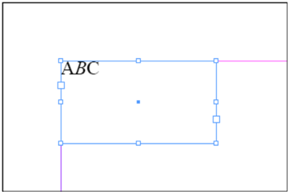

Multiple paragraphs can appear in a single <ParagraphStyleRange> . The following example shows how the text in the single <CharacterStyleRange> in a <ParagraphStyleRange> is broken into separate <Content> elements using the <br/> element. An empty <br/> element represents a return character; optional attributes attached to the element can specify other break characters. We've omitted the minimal <Story> element in this example.

**IDML Example 48. ParagrapBreaksn a CharacterStyleRange**

```xml
<ParagraphStyleRange AppliedParagraphStyle="ParagraphStyle\NormalParagraphStyle"> <CharacterStyleRange AppliedCharacterStyle="CharacterStyle\[No CharacterStyle]"> <Content>ABC</Content> <br/> <Content>DEF</Content> <br/> <Content>GHI</Content> </CharacterStyleRange> </ParagraphStyleRange>
```

**Figure 32**: Breaking <Content> elements with <br/>

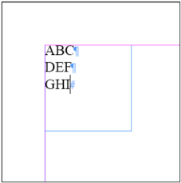

The following example demonstrates the use of special 'break' characters in a <CharacterRange> element. We've inserted a column break after the third example paragraph ('GHI'), which forces the fourth paragraph ('JKL') to the next column or TextFrame. The break character is applied as an attribute of the <CharacterStyleRange> element. The <Content> element of that <CharacterStyleRange> element contains only a <br/> element.

The meaning of the <br/> element is defined by the Go To Next X attribute of the <CharacterStyleRange> element. This attribute can be Anywhere (the default, which can be omitted), Next Column, Next Frame, Next Page, Next Odd Page, or Next Even Page .

**IDML Example 49. ParagraphStyleRange Elements and Column Breaks**

```xml
<ParagraphStyleRange AppliedParagraphStyle="Paragraph  Style\Normal Paragraph  Style"> <CharacterStyleRange AppliedCharacterStyle="CharacterStyle\[No CharacterStyle]"> <Content>ABC</Content> <br/> <Content>DEF</Content> <br/> <Content>GHI</Content> </CharacterStyleRange> <CharacterStyleRange AppliedCharacterStyle="CharacterStyle\[No CharacterStyle]" GotoNextX="Next  Column"> <br/> </CharacterStyleRange> <CharacterStyleRange AppliedCharacterStyle="CharacterStyle\[No CharacterStyle]"> <Content>JKL</Content> </CharacterStyleRange> </ParagraphStyleRange>
```

Figure 33. Column Break

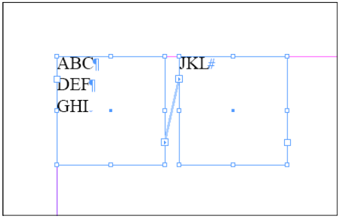

Note: In general, it is better to use paragraph style properties (the Start Paragraph attribute of the <ParagraphStyle> element) to force paragraphs to new columns or pages instead of using break characters.

The following example shows an example of multiple <ParagraphStyleRange> elements. In this example, the second paragraph ('DEF') has different formatting from the first ('ABC') and third ('GHI') paragraphs-it has a paragraph style named 'Heading' applied to it.

**IDML Example 50. Multiple Paragraph  Style  Range Elements**

```xml
<ParagraphStyleRange AppliedParagraphStyle="Paragraph  Style\Normal Paragraph  Style"> <CharacterStyleRange AppliedCharacterStyle= "CharacterStyle\[No CharacterStyle]"> <Content>ABC</Content> <br/> </CharacterStyleRange> </Paragraph  Style Range> <ParagraphStyleRange AppliedParagraphStyle="Paragraph  Style\Heading"> <CharacterStyleRange AppliedCharacterStyle="CharacterStyle\[No CharacterStyle]"> <Content>DEF</Content> <br/> </CharacterStyleRange> </Paragraph  Style Range> <ParagraphStyleRange AppliedParagraphStyle="Paragraph  Style\Normal Paragraph  Style"> <CharacterStyleRange AppliedCharacterStyle="CharacterStyle\[No CharacterStyle]"> <Content>GHI</Content> </CharacterStyleRange> </Paragraph  Style Range>
```

Figure 34. Minimal Story with Multiple <ParagraphStyleRange> Elements

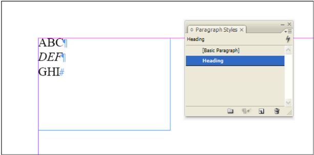

**IDML Example 51. Multi-Column ('Straddle') Paragraphs**

```xml
<ParagraphStyleRange AppliedParagraphStyle="ParagraphStyle/$ID/
NormalParagraphStyle" SpaceAfter="12" SpanColumnType="SpanColumns">
<Properties>
<SpanSplitColumnCount type="short">2</SpanSplitColumnCount>
</Properties>
<CharacterStyleRange AppliedCharacterStyle="CharacterStyle/$ID/[No character
style]" FontStyle="Bold Condensed" PointSize="20">
<Properties>
<Leading type="unit">24</Leading>
<AppliedFont type="string">Myriad Pro</AppliedFont>
</Properties>
<Content>Multi-Column Headline</Content>
<Br/>
</CharacterStyleRange>
</ParagraphStyleRange>
<ParagraphStyleRange AppliedParagraphStyle="ParagraphStyle/$ID/
NormalParagraphStyle">
<CharacterStyleRange AppliedCharacterStyle="CharacterStyle/$ID/[No character
style]">
<Properties>
<Leading type="unit">12</Leading>
</Properties>
<Content>Ris curenat, quament. Besuam inatus nimum imorterra tam inum sid
senimum med C. Scivis a re, noverraverce iae elinterei ca pre hil consupicae dica;
noc, seniamdit. As cres ac ta invo, Palis rei si propost quit publicauro visses
cur us, senaritimmor quam deesilis addum se nulem hiculi prae, caelicae ta, nos
consum nem auconvo, molis hos co poensuludem et di poeris satquam mo</Content>
</CharacterStyleRange>
</ParagraphStyleRange>
```

**IDML Example 52. XML Element**

```xml
<Story Self="ud8">
<XMLElement Self="di2i3" MarkupTag="
XMLTag\cStory"
XMLContent="ud8">
<ParagraphStyleRange
AppliedParagraphStyle="
ParagraphStyle\
cheading 1">
<CharacterStyleRange
AppliedCharacterStyle=
"CharacterStyle\
k[No character style]"/>
</ParagraphStyleRange>
<XMLElement Self="di2i3i6" MarkupTag="
XMLTag\cheading_1">
<ParagraphStyleRange
AppliedParagraphStyle="
ParagraphStyle\
cheading 1">
<CharacterStyleRange
AppliedCharacterStyle=
"CharacterStyle\
k[No character style]">
<Content>Heading 1</Content>
<br/>
</CharacterStyleRange>
</ParagraphStyleRange>
</XMLElement>
<ParagraphStyleRange
AppliedParagraphStyle="
ParagraphStyle\
cpara 1">
<CharacterStyleRange
AppliedCharacterStyle=
"CharacterStyle\
k[No character style]"/>
</ParagraphStyleRange>
<XMLElement Self="di2i3i5" MarkupTag="
XMLTag\cpara_1">
<ParagraphStyleRange
AppliedParagraphStyle="
ParagraphStyle\
cpara 1">
<CharacterStyleRange
AppliedCharacterStyle=
"CharacterStyle\
k[No character style]">
<Content>This is the first paragraph in the article.</Content>
<br/>
</CharacterStyleRange>
</ParagraphStyleRange>
</XMLElement>
<ParagraphStyleRange
AppliedParagraphStyle="
ParagraphStyle\
cbody text">
<CharacterStyleRange
AppliedCharacterStyle=
"CharacterStyle\
k[No character style]"/>
</ParagraphStyleRange>
<XMLElement Self="di2i3i4" MarkupTag="
XMLTag\cbody_text">
<ParagraphStyleRange
AppliedParagraphStyle="
ParagraphStyle\
cbody text">
<CharacterStyleRange
AppliedCharacterStyle=
"CharacterStyle\
k[No character style]">
<Content>This is the second paragraph in the article.</Content>
<br/>
</CharacterStyleRange>
</ParagraphStyleRange>
</XMLElement>
<ParagraphStyleRange
AppliedParagraphStyle="
ParagraphStyle\
cheading 2">
<CharacterStyleRange
AppliedCharacterStyle=
"CharacterStyle\
k[No character style]"/>
</ParagraphStyleRange>
<XMLElement Self="di2i3i3" MarkupTag="
XMLTag\cheading_2">
<ParagraphStyleRange
AppliedParagraphStyle="
ParagraphStyle\
cheading 2">
<CharacterStyleRange
AppliedCharacterStyle=
"CharacterStyle\
k[No character style]">
<Content>Heading 2</Content>
<br/>
</CharacterStyleRange>
</ParagraphStyleRange>
</XMLElement>
<ParagraphStyleRange
AppliedParagraphStyle="
ParagraphStyle\
cpara 1">
<CharacterStyleRange
AppliedCharacterStyle=
"CharacterStyle\
k[No character style]"/>
</ParagraphStyleRange>
<XMLElement Self="di2i3i2" MarkupTag="
XMLTag\cpara_1">
<ParagraphStyleRange
AppliedParagraphStyle="
ParagraphStyle\
cpara 1">
<CharacterStyleRange
AppliedCharacterStyle=
"CharacterStyle\
k[No character style]">
<Content>This is the first paragraph following the subhead.</Content>
<br/>
</CharacterStyleRange>
</ParagraphStyleRange>
</XMLElement>
<ParagraphStyleRange
AppliedParagraphStyle="
ParagraphStyle\
cbody text">
<CharacterStyleRange
AppliedCharacterStyle=
"CharacterStyle\
k[No character style]">
<XMLElement Self="di2i3i1" MarkupTag="
XMLTag\cbody_text">
<Content>This is the second paragraph following the subhead.</Content>
<br/>
</XMLElement>
</CharacterStyleRange>
</ParagraphStyleRange>
</XMLElement>
</Story
```

Figure 35. Multi-Column Paragraph

#### Multi-Column Headline

Ris curenat, quament. Besuam inatus nimum-imorterra tam inum sid senimum med C. Scivis a re, noverraverce

### 10.4.9 XML Elements in Text

All XML text elements that have been placed in an In  Design layout appear as text ranges in the <Story> element they are associated with. Only unplaced XML elements (i.e., XML elements that have not been associated with a page item or story) appear in the Backing  Story.xml file in the XML folder in the IDML package.

The text in <XMLElement> elements is contained by <ParagraphStyleRange> elements and <CharacterStyleRange> elements inside the <XMLElement> elements. For more on the <XMLElement> element, refer to the'XML.'

**XML Element**

```xml
<Story Self="ud8"> <XMLElement Self="di2i3" MarkupTag="XMLTag\c  Story" XMLContent="ud8"> <ParagraphStyleRange AppliedParagraphStyle="Paragraph  Style\cheading 1">
iae elinterei ca. pre hil consupicae dica; noc, seniamdit.As cres ac ta invo, Palis rei si propost quit publicauro visses cur us, senaritimmor quam deesilis addum se nulem hiculi prae, caelicae ta, nos consum nem-auconvo, molis hos co. poensuludem et di poeris satquam mo#
<CharacterStyleRange AppliedCharacterStyle= "CharacterStyle\k[No CharacterStyle]"/> </Paragraph  Style Range> <XMLElement Self="di2i3i6" MarkupTag="XMLTag\cheading_1"> <ParagraphStyleRange AppliedParagraphStyle="Paragraph  Style\cheading 1"> <CharacterStyleRange AppliedCharacterStyle= "CharacterStyle\k[No CharacterStyle]"> <Content>Heading 1</Content> <br/> </CharacterStyleRange> </Paragraph  Style Range> </XMLElement> <ParagraphStyleRange AppliedParagraphStyle="Paragraph  Style\cpara 1"> <CharacterStyleRange AppliedCharacterStyle= "CharacterStyle\k[No CharacterStyle]"/> </Paragraph  Style Range> <XMLElement Self="di2i3i5" MarkupTag="XMLTag\cpara_1"> <ParagraphStyleRange AppliedParagraphStyle="Paragraph  Style\cpara 1"> <CharacterStyleRange AppliedCharacterStyle= "CharacterStyle\k[No CharacterStyle]"> <Content>This is the first paragraph in the article.</Content> <br/> </CharacterStyleRange> </Paragraph  Style Range> </XMLElement> <ParagraphStyleRange AppliedParagraphStyle="Paragraph  Style\cbody text"> <CharacterStyleRange AppliedCharacterStyle= "CharacterStyle\k[No CharacterStyle]"/> </Paragraph  Style Range> <XMLElement Self="di2i3i4" MarkupTag="XMLTag\cbody_text"> <ParagraphStyleRange AppliedParagraphStyle="Paragraph  Style\cbody text"> <CharacterStyleRange AppliedCharacterStyle= "CharacterStyle\k[No CharacterStyle]"> <Content>This is the second paragraph in the article.</Content> <br/> </CharacterStyleRange> </Paragraph  Style Range> </XMLElement> <ParagraphStyleRange AppliedParagraphStyle="Paragraph  Style\cheading 2"> <CharacterStyleRange AppliedCharacterStyle= "CharacterStyle\k[No CharacterStyle]"/> </Paragraph  Style Range> <XMLElement Self="di2i3i3" MarkupTag="XMLTag\cheading_2"> <ParagraphStyleRange AppliedParagraphStyle="Paragraph  Style\cheading 2"> <CharacterStyleRange AppliedCharacterStyle= "CharacterStyle\k[No CharacterStyle]"> <Content>Heading 2</Content> <br/> </CharacterStyleRange> </Paragraph  Style Range> </XMLElement> <ParagraphStyleRange AppliedParagraphStyle="Paragraph  Style\cpara 1"> <CharacterStyleRange AppliedCharacterStyle= "CharacterStyle\k[No CharacterStyle]"/></Paragraph  Style Range> <XMLElement Self="di2i3i2" MarkupTag="XMLTag\cpara_1"> <ParagraphStyleRange AppliedParagraphStyle="Paragraph  Style\cpara 1"> <CharacterStyleRange AppliedCharacterStyle= "CharacterStyle\k[No CharacterStyle]"> <Content>This is the first paragraph following the subhead.</Content> <br/> </CharacterStyleRange> </Paragraph  Style Range> </XMLElement> <ParagraphStyleRange AppliedParagraphStyle="Paragraph  Style\cbody text"> <CharacterStyleRange AppliedCharacterStyle= "CharacterStyle\k[No CharacterStyle]"> <XMLElement Self="di2i3i1" MarkupTag="XMLTag\cbody_text"> <Content>This is the second paragraph following the subhead.</Content> <br/> </XMLElement> </CharacterStyleRange> </ParagraphStyleRange> </XMLElement> </Story
```

**Figure 36**: XML Elements in Text

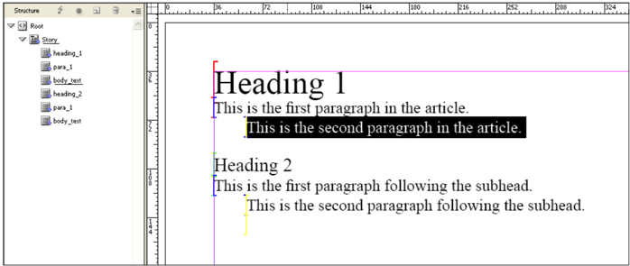

### 10.4.10 Rules for Breaking Text Range Elements

In a complex In  Design layout, situations can arise in which the logical boundaries for creating text range elements overlap. What happens when an <XMLElement> element overlaps a <CharacterStyleRange> element? Or when a <CharacterStyleRange> element apppears in the middle of a <HyperlinkTextSource> element?

In  Design relies on a hierarchy of rules for deciding where to break text style ranges as it exports IDML. The following list shows the order in which In  Design will break text style range elements, from strongest (never break) to weakest.

```xml
1. <XML> 
2. <Hyperlink>
3. <ChangedText>
4. <ParagraphStyleRange> 
5. <CharacterStyleRange> 
6. <Content>
```

## 6.4.1 Inline Elements

In  Design stories can contain page items, such as rectangles containing imported graphics or TextFrames containing text. Tables, footnotes and form fields are other examples of inline objects. These inline (or anchored) element are represented as text child elements of a <CharacterStyleRange> element, and appear as siblings of the <Content> element. The following sections discuss the different types of inline elements that can appear as text child elements of a <CharacterStyleRange> element.

#### Tables

In  Design tables contain rows, columns, and cells, and each cell can contain text, imported graphics, or another table. In IDML, the <Table> element contains <Row>, <Column>, and <Cell> elements, which can, in turn, contain other elements. For more on In  Design tables, refer to the online help.

**Schema Example 81. Table**

```
Table_Object = element Table { attribute Self { xsd:string }, attribute HeaderRowCount { xsd:int {minInclusive="0" maxInclusive="25"} }?, attribute FooterRowCount { xsd:int {minInclusive="0" maxInclusive="25"} }?, attribute TopBorderStrokeWeight { xsd:double }?, attribute TopBorderStrokeType { xsd:string }?, attribute TopBorderStrokeColor { xsd:string }?, attribute TopBorderStrokeTint { xsd:double }?, attribute TopBorderStrokeOverprint { xsd:boolean }?, attribute TopBorderStrokeGapColor { xsd:string }?, attribute TopBorderStrokeGapTint { xsd:double }?, attribute TopBorderStrokeGapOverprint { xsd:boolean }?, attribute LeftBorderStrokeWeight { xsd:double }?, attribute LeftBorderStrokeType { xsd:string }?, attribute LeftBorderStrokeColor { xsd:string }?, attribute LeftBorderStrokeTint { xsd:double }?, attribute LeftBorderStrokeOverprint { xsd:boolean }?, attribute LeftBorderStrokeGapColor { xsd:string }?, attribute LeftBorderStrokeGapTint { xsd:double }?, attribute LeftBorderStrokeGapOverprint { xsd:boolean }?, attribute BottomBorderStrokeWeight { xsd:double }?, attribute BottomBorderStrokeType { xsd:string }?, attribute BottomBorderStrokeColor { xsd:string }?, attribute BottomBorderStrokeTint { xsd:double }?, attribute BottomBorderStrokeOverprint { xsd:boolean }?, attribute BottomBorderStrokeGapColor { xsd:string }?, attribute BottomBorderStrokeGapTint { xsd:double }?, attribute BottomBorderStrokeGapOverprint { xsd:boolean }?, attribute RightBorderStrokeWeight { xsd:double }?, attribute RightBorderStrokeType { xsd:string }?, attribute RightBorderStrokeColor { xsd:string }?, attribute RightBorderStrokeTint { xsd:double }?, attribute RightBorderStrokeOverprint { xsd:boolean }?, attribute RightBorderStrokeGapColor { xsd:string }?, attribute RightBorderStrokeGapTint { xsd:double }?, attribute RightBorderStrokeGapOverprint { xsd:boolean }?, attribute SpaceBefore { xsd:double }?, attribute SpaceAfter { xsd:double }?, attribute SkipFirstAlternatingStrokeRows { xsd:int }?, attribute SkipLastAlternatingStrokeRows { xsd:int }?, attribute StartRowStrokeCount { xsd:int }?, attribute StartRowStrokeColor { xsd:string }?, attribute StartRowStrokeWeight { xsd:double }?, attribute StartRowStrokeType { xsd:string }?, attribute StartRowStrokeTint { xsd:double }?, attribute StartRowStrokeGapOverprint { xsd:boolean }?, attribute StartRowStrokeGapColor { xsd:string }?, attribute StartRowStrokeGapTint { xsd:double }?, attribute StartRowStrokeOverprint { xsd:boolean }?, attribute EndRowStrokeCount { xsd:int }?, attribute EndRowStrokeColor { xsd:string }?, attribute EndRowStrokeWeight { xsd:double }?, attribute EndRowStrokeType { xsd:string }?, attribute EndRowStrokeTint { xsd:double }?, attribute EndRowStrokeOverprint { xsd:boolean }?, attribute EndRowStrokeGapColor { xsd:string }?, attribute EndRowStrokeGapTint { xsd:double }?, attribute EndRowStrokeGapOverprint { xsd:boolean }?, attribute SkipFirstAlternatingStrokeColumns { xsd:int }?, attribute SkipLastAlternatingStrokeColumns { xsd:int }?, attribute StartColumnStrokeCount { xsd:int }?, attribute StartColumnStrokeColor { xsd:string }?, attribute StartColumnStrokeWeight { xsd:double }?, attribute StartColumnStrokeType { xsd:string }?, attribute StartColumnStrokeTint { xsd:double }?, attribute StartColumnStrokeOverprint { xsd:boolean }?, attribute StartColumnStrokeGapColor { xsd:string }?, attribute StartColumnStrokeGapTint { xsd:double }?, attribute StartColumnStrokeGapOverprint { xsd:boolean }?, attribute EndColumnStrokeCount { xsd:int }?, attribute EndColumnStrokeColor { xsd:string }?, attribute EndColumnStrokeWeight { xsd:double }?, attribute EndColumnLineStyle { xsd:string }?, attribute EndColumnStrokeTint { xsd:double }?, attribute EndColumnStrokeOverprint { xsd:boolean }?, attribute EndColumnStrokeGapColor { xsd:string }?, attribute EndColumnStrokeGapTint { xsd:double }?, attribute EndColumnStrokeGapOverprint { xsd:boolean }?, attribute ColumnFillsPriority { xsd:boolean }?, attribute SkipFirstAlternatingFillRows { xsd:int }?, attribute SkipLastAlternatingFillRows { xsd:int }?, attribute StartRowFillColor { xsd:string }?, attribute StartRowFillCount { xsd:int }?, attribute StartRowFillTint { xsd:double }?, attribute StartRowFillOverprint { xsd:boolean }?, attribute EndRowFillCount { xsd:int }?, attribute EndRowFillColor { xsd:string }?, attribute EndRowFillTint { xsd:double }?, attribute EndRowFillOverprint { xsd:boolean }?, attribute SkipFirstAlternatingFillColumns { xsd:int }?, attribute SkipLastAlternatingFillColumns { xsd:int }?, attribute StartColumnFillCount { xsd:int }?, attribute StartColumnFillColor { xsd:string }?, attribute StartColumnFillTint { xsd:double }?, attribute StartColumnFillOverprint { xsd:boolean }?, attribute EndColumnFillCount { xsd:int }?, attribute EndColumnFillColor { xsd:string }?, attribute EndColumnFillTint { xsd:double }?, attribute EndColumnFillOverprint { xsd:boolean }?, attribute BreakHeaders { HeaderFooterBreakTypes_EnumValue }?, attribute BreakFooters { HeaderFooterBreakTypes_EnumValue }?, attribute SkipFirstHeader { xsd:boolean }?, attribute SkipLastFooter { xsd:boolean }?, attribute StrokeOrder { StrokeOrderTypes_EnumValue }?, attribute TopInset { xsd:double }?, attribute LeftInset { xsd:double }?, attribute BottomInset { xsd:double }?, attribute RightInset { xsd:double }?, attribute FillColor { xsd:string }?, attribute FillTint { xsd:double }?, attribute OverprintFill { xsd:boolean }?, attribute TopLeftDiagonalLine { xsd:boolean }?, attribute TopRightDiagonalLine { xsd:boolean }?, attribute DiagonalLineInFront { xsd:boolean }?, attribute DiagonalLineStrokeWeight { xsd:double }?, attribute DiagonalLineStrokeType { xsd:string }?, attribute DiagonalLineStrokeColor { xsd:string }?, attribute DiagonalLineStrokeTint { xsd:double }?, attribute DiagonalLineStrokeOverprint { xsd:boolean }?, attribute DiagonalLineStrokeGapColor { xsd:string }?, attribute DiagonalLineStrokeGapTint { xsd:double }?, attribute DiagonalLineStrokeGapOverprint { xsd:boolean }?, attribute ClipContentToCell { xsd:boolean }?, attribute FirstBaselineOffset { FirstBaseline_EnumValue }?, attribute VerticalJustification { VerticalJustification_EnumValue }?, attribute ParagraphSpacingLimit { xsd:double }?, attribute MinimumFirstBaselineOffset { xsd:double {minInclusive="0" maxInclusive="8640"} }?, attribute RotationAngle { xsd:double }?, attribute WritingDirection { xsd:boolean }?, attribute MinimumHeight { xsd:double }?, attribute MaximumHeight { xsd:double }?, attribute KeepWithNextRow { xsd:boolean }?, attribute StartRow { StartParagraph_EnumValue }?, attribute AutoGrow { xsd:boolean }?, attribute DefaultRowStrokeWeight { xsd:double }?, attribute DefaultRowStrokeType { xsd:string }?, attribute DefaultRowStrokeColor { xsd:string }?, attribute DefaultRowStrokeTint { xsd:double }?, attribute DefaultRowStrokeOverprint { xsd:boolean }?, attribute DefaultRowStrokeGapColor { xsd:string }?, attribute DefaultRowStrokeGapTint { xsd:double }?, attribute DefaultRowStrokeGapOverprint { xsd:boolean }?, attribute DefaultColumnStrokeWeight { xsd:double }?, attribute DefaultColumnStrokeType { xsd:string }?, attribute DefaultColumnStrokeColor { xsd:string }?, attribute DefaultColumnStrokeTint { xsd:double }?, attribute DefaultColumnStrokeOverprint { xsd:boolean }?, attribute DefaultColumnStrokeGapColor { xsd:string }?, attribute DefaultColumnStrokeGapTint { xsd:double }?, attribute DefaultColumnStrokeGapOverprint { xsd:boolean }?, attribute BodyRowCount { xsd:int {minInclusive="1" maxInclusive="10000"} }?, attribute ColumnCount { xsd:int {minInclusive="1" maxInclusive="200"} }?, attribute SingleRowHeight { xsd:double }?, attribute SingleColumnWidth { xsd:double }?, attribute AppliedTableStyle { xsd:string }?, attribute TableDirection { TableDirectionOptions_EnumValue }?, attribute DisplayCollapsed { xsd:boolean }?, attribute DisplayOrder { DisplayOrderOptions_EnumValue }?, element Properties { element Label { element KeyValuePair { KeyValuePair_TypeDef }* }? } ?, ( Cell_Object*& Row_Object*& Column_Object* ) }
```

**Table 109**:  Table Properties Represented as Attributes

| Name                                  | Type                                 | Req     | Description |
| ------------------------------------  | ---------                            | ------- | -------------------------------------------------------------------------------------------------------------------------------------------------------------------------- |
| AppliedTableStyle                     | string                               | no      | The table style applied to the table. |
| AutoGrow                              | boolean                              | no      | If true, increase the height of a cell to fit the con- tent of the cell. |
| BodyRowCount                          | int                                  | no      | The number of body rows. |
| BottomBorderStrokeColor             | string                               | no      | The color, specified as a swatch (color, gradient, tint, or mixed ink), of the bottom border stroke. |
| BottomBorderStrokeGapColor          | string                               | no      | The gap color, specified as a swatch (color, gradi- ent, tint, or mixed ink), of the bottom border stroke. Note: Valid only when bottom border stroke type is not solid. |
| BottomBorderStrokeGapOverprint    | boolean                              | no      | If true, the gap of the bottom border stroke will overprint. Note: Valid only when bottom border stroke type is not solid. |
| BottomBorderStrokeGapTint           | double                               | no      | The tint (as a percentage) of the gap color of the bottom border stroke. (Range: 0 to 100) Note: Valid only when bottom border stroke type is not solid. |
| BottomBorderStrokeOverprint         | boolean                              | no      | If true, the bottom border stroke will overprint. |
| BottomBorderStrokeTint              | double                               | no      | The tint (as a percentage) of the bottom border stroke. (Range: 0 to 100) |
| BottomBorderStrokeType              | string                               | no      | The stroke type of the bottom border. |
| BottomBorderStrokeWeight            | double                               | no      | The stroke weight of the bottom border stroke. |
| BreakFooters                          | HeaderFooter BreakTypes_Enum Value | no      | The footer placement. Can be InAllText Columns (Places headers or footers in each text column), OncePerTextFrame (Repeats headers or footers in each TextFrame), or OncePerPage (Places one instance of headers or footers per page). |
| BreakHeaders                          | HeaderFooter BreakTypes_Enum Value | no      | The header placement. Can be InAllText Columns (Places headers or footers in each text column), OncePerTextFrame (Repeats headers or footers in each TextFrame), or OncePerPage (Places one instance of headers or footers per page). |
| ColumnCount                           | int                                  | no      | The number of columns. |
| ColumnFills Priority                 | boolean                              | no      | If true, hides alternating row fills. If false, hides alternating column fills. |
| DefaultColumn StrokeColor            | string                               | no      | The default stroke color for cells in new col- umns. |
| DefaultColumn StrokeGapColor         | string                               | no      | The default stroke gap color for cells in new col- umns. |
| DefaultColumn StrokeGap Overprint   | boolean                              | no      | The default stroke gap overprint setting for cells in new columns. |
| DefaultColumn StrokeGapTint          | double                               | no      | The default stroke gap tint for cells in new col- umns. |
| DefaultColumn StrokeOverprint        | boolean                              | no      | The default stroke overprint setting for cells in new columns. |
| DefaultColumn StrokeTint             | double                               | no      | The default stroke tint for cells in new columns. |
| DefaultColumn StrokeType             | string                               | no      | The default stroke type for cells in new columns. |
| DefaultColumn StrokeWeight           | double                               | no      | The default stroke weight for cells in new col- umns. |
| DefaultRowStroke Color               | string                               | no      | The default stroke color for cells in new rows. |
| DefaultRowStroke GapColor            | string                               | no      | The default stroke gap color for cells in new rows. |
| DefaultRowStroke GapOverprint        | boolean                              | no      | The default stroke gap overprint setting for cells in new rows. |
| DefaultRowStroke GapTint             | double                               | no      | The default stroke gap tint for cells in new rows. |
| DefaultRowStroke Overprint           | boolean                              | no      | The default stroke overprint setting for cells in new rows. |
| DefaultRowStroke Tint                | double                               | no      | The default stroke tint for cells in new rows. |
| DefaultRowStroke Type                | string                               | no      | The default stroke type for cells in new rows. |
| DefaultRowStroke Weight              | double                               | no      | The default stroke weight for cells in new col- umns. |
| DisplayCollapsed                      | boolean                              | no      | If true, then the table will show collapsed in story and galley views. |
| DisplayOrder                          | DisplayOrder Options_EnumValue      | no      | Specifies the order the table cells will display in when viewing in story and galley views. Can be OrderByRows (Order by rows), or OrderBy Columns (Order by columns). |
| EndColumnFill Color                  | string                               | no      | The FillColor, specified as a swatch (color, gra- dient, tint, or mixed ink), of columns in the second alternating fill group. Note: Valid when alternating fills are defined for table columns. |
| EndColumnFill Count                  | int                                  | no      | The number of columns in the second alternat- ing fills group. Note: Valid when alternating fills are defined for table columns. |
| EndColumnFill Overprint              | boolean                              | no      | If true, the columns in the second alternating fills group will overprint. Note: Valid when alternating fills are defined for table columns. |
| EndColumnFillTint                     | double                               | no      | The tint (as a percentage) of the columns in the second alternating fills group. (Range: 0 to 100) Note: Valid when alternating fills are defined for table columns. |
| EndColumnLine Style                  | string                               | no      | The stroke type of columns in the second alter- nating strokes group. |
| EndColumnStroke Color                | string                               | no      | The stroke color, specified as a swatch (color, gradient, tint, or mixed ink), of column borders in the second alternating column strokes group. Note: Valid when end column stroke count is 1 or greater. |
| EndColumnStroke Count                | int                                  | no      | The number of columns in the second alternat- ing column strokes group. |
| EndColumnStroke GapColor             | string                               | no      | The stroke gap color, specified as a swatch (color, gradient, tint, or mixed ink), of column borders in the second alternating column strokes group. Note: Valid when end column stroke count is 1 or greater. |
| EndColumnStroke GapOverprint         | boolean                              | no      | If true, the gap of the column border stroke in the second alternating column strokes group will overprint. Note: Valid when end column stroke count is 1 or greater. |
| EndColumnStroke GapTint              | double                               | no      | The tint (as a percentage) of the gap color of col- umn borders in the second alternating column strokes group. (Range: 0 to 100) Note: Valid when end column stroke count is 1 or greater. |
| EndColumnStroke Overprint            | boolean                              | no      | If true, the column borders in the second alter- nating column strokes group will overprint. Note: Valid when end column stroke count is 1 or greater. |
| EndColumnStroke Tint                 | double                               | no      | The tint (as a percentage) of column borders in the second alternating column strokes group. (Range: 0 to 100) Note: Valid when end column stroke count is 1 or greater. |
| EndColumnStroke Weight               | double                               | no      | The stroke weight of column borders in the second alternating column strokes group. Note: Valid when end column stroke count is 1 or greater. |
| EndRowFillColor                       | string                               | no      | The FillColor, specified as a swatch (color, gradi- ent, tint, or mixed ink), of rows in the second alternating fills group. Note: Valid when alter- nating fills are defined for table rows. |
| EndRowFillCount                       | int                                  | no      | The number of rows in the second alternating fills group. Note: Valid when alternating fills are defined for table rows. |
| EndRowFill Overprint                 | boolean                              | no      | If true, the rows in the second alternating fills group will overprint. Note: Valid when alternat- ing fills are defined for table rows. |
| EndRowFillTint                        | double                               | no      | The tint (as a percentage) of the rows in the second alternating fills group. (Range: 0 to 100) Note: Valid when alternating fills are defined for table rows. |
| EndRowStrokeColor                     | string                               | no      | The stroke color, specified as a swatch (color, gradient, tint, or mixed ink), of row borders in the second alternating row strokes group. Note: Valid when end row stroke count is 1 or greater. |
| EndRowStrokeCount                     | int                                  | no      | The number of rows in the second alternating row strokes group. |
| EndRowStrokeGapColor                | string                               | no      | The gap color, specified as a swatch (color, gradi- ent, tint, or mixed ink), of row borders in the second alternating rows group. Note: Valid when end row stroke count is 1 or greater. |
| EndRowStrokeGapOverprint            | boolean                              | no      | If true, the gap of the row borders in the second alternating rows group will overprint. Note: Valid when end row stroke count is 1 or greater. |
| EndRowStrokeGapTint                 | double                               | no      | The tint (as a percentage) of the gap color of rows in the second alternating strokes group. (Range: 0 to 100) Note: Valid when end row stroke count is 1 or greater and end row stroke type is not solid. |
| EndRowStrokeOverprint               | boolean                              | no      | If true, the rows in the second alternating rows group will overprint. Note: Valid when end row stroke count is 1 or greater. |
| EndRowStrokeTint                      | double                               | no      | The tint (as a percentage) of the row borders in the second alternating strokes group. (Range: 0 to 100) Note: Valid when end row stroke count is 1 or greater. |
| EndRowStrokeType                      | string                               | no      | The stroke type of rows in the second alternating strokes group. |
| EndRowStrokeWeight                  | double                               | no      | The stroke weight of row borders in the second alternating row strokes group. Note: Valid when end row stroke count is 1 or greater. |
| FooterRowCount                        | int                                  | no      | The number of footer rows. |
| HeaderRowCount                        | int                                  | no      | The number of header rows. |
| KeepWithNextRow                       | boolean                              | no      | If true, keep the row with the next row. |
| LeftBorderStrokeColor               | string                               | no      | The color, specified as a swatch (color, gradient, tint, or mixed ink), of the left border stroke. |
| LeftBorderStrokeGapColor            | string                               | no      | The gap color, specified as a swatch (color, gradi- ent, tint, or mixed ink), of the left border stroke. Note: Valid only when left border stroke type is not solid. |
| LeftBorderStrokeGapOverprint        | boolean                              | no      | If true, the gap of the left border stroke will overprint. Note: Valid only when left border stroke type is not solid. |
| LeftBorderStrokeGapTint             | double                               | no      | The tint (as a percentage) of the gap color of the left border stroke. (Range: 0 to 100) Note: Valid only when left border stroke type is not solid. |
| LeftBorderStrokeOverprint           | boolean                              | no      | If true, the left border stroke will overprint. |
| LeftBorderStrokeTint                | double                               | no      | The tint (as a percentage) of the left border stroke. (Range: 0 to 100) |
| LeftBorderStrokeType                | string                               | no      | The stroke type of the left border. |
| LeftBorderStrokeWeight              | double                               | no      | The stroke weight of the left border stroke. |
| MaximumHeight                         | double                               | no      | The maximum height of the cell. |
| MinimumHeight                         | double                               | no      | The minimum height of the cell. |
| RightBorderStrokeColor              | string                               | no      | The color, specified as a swatch (color, gradient, tint, or mixed ink), of the right border stroke. |
| RightBorderStrokeGapColor           | string                               | no      | The gap color, specified as a swatch (color, gra- dient, tint, or mixed ink), of the right border stroke. Note: Valid only when right border stroke type is not solid. |
| RightBorderStrokeGapOverprint     | boolean                              | no      | If true, the gap color of the right border stroke will overprint. Note: Valid only when right bor- der stroke type is not solid. |
| RightBorderStrokeGapTint            | double                               | no      | The tint (as a percentage) of the gap color of the right border stroke. (Range: 0 to 100) Note: Valid only when right border stroke type is not solid. |
| RightBorderStrokeOverprint          | boolean                              | no      | If true, the right border stroke will overprint. |
| RightBorderStrokeTint               | double                               | no      | The tint (as a percentage) of the right border stroke. (Range: 0 to 100) |
| RightBorderStrokeType               | string                               | no      | The stroke type of the right border. |
| RightBorderStrokeWeight             | double                               | no      | The stroke weight of the right border stroke. |
| SingleColumnWidth                     | double                               | no      | The width of a column. |
| SingleRowHeight                       | double                               | no      | The height of a row. |
| SkipFirst AlternatingFill Columns   | int                                  | no      | The number of columns on the left side of the table to skip before applying the column fill col- or. Note: Valid when alternating fills are defined for table columns. |
| SkipFirst AlternatingFill Rows      | int                                  | no      | The number of body rows at the beginning of the table to skip before applying the row FillColor. Note: Valid when alternating fills are defined for table rows. |
| SkipFirst Alternating StrokeColumns | int                                  | no      | The number of columns on the left of the table in which to skip border stroke formatting. Note: Valid when start column stroke count is 1 or greater and/or end column stroke count is 1 or greater. |
| SkipFirst Alternating StrokeRows    | int                                  | no      | The number of body rows at the beginning of the table in which to skip border stroke format- ting. Note: Valid when start row stroke count is 1 or greater and/or end row stroke count is 1 or greater. |
| SkipFirstHeader                       | boolean                              | no      | If true, skips the first occurrence of header rows. |
| SkipLast AlternatingFill Columns    | int                                  | no      | The number columns on the right side of the table in which to not apply the column FillColor. Note: Valid when alternating fills are defined for table columns. |
| SkipLast AlternatingFill Rows       | int                                  | no      | The number of body rows at the end of the table in which to not apply the row FillColor. Note: Valid when alternating fills are defined for table rows. |
| SkipLast Alternating StrokeColumns  | int                                  | no      | The number of columns on the right side of the table in which to skip border stroke formatting. Note: Valid when start column stroke count is 1 or greater and/or end column stroke count is 1 or greater. |
| SkipLast Alternating StrokeRows     | int                                  | no      | The number of body rows at the end of the table in which to skip border stroke formatting. Note: Valid when start row stroke count is 1 or greater and/or end row stroke count is 1 or greater. |
| SkipLastFooter                        | boolean                              | no      | If true, skips the last occurrence of footer rows. |
| SpaceAfter                            | double                               | no      | The space below the table. |
| SpaceBefore                           | double                               | no      | The space above the table. |
| StartColumnFill Color                | string                               | no      | The FillColor, specified as a swatch (color, gradi- ent, tint, or mixed ink), of columns in the first alternating fills group. Note: Valid when alter- nating fills are defined for table columns. |
| StartColumnFill Count                | int                                  | no      | The number of columns in the first alternating fills group. Note: Valid when alternating fills are defined for table columns. |
| StartColumnFill Overprint            | boolean                              | no      | If true, the columns in the first alternating fills group will overprint. Note: Valid when alternat- ing fills are defined for table columns. |
| StartColumnFill Tint                 | double                               | no      | The tint (as a percentage) of the columns in the first alternating fills group. (Range: 0 to 100) Note: Valid when alternating fills are defined for table columns. |
| StartColumn StrokeColor              | string                               | no      | The stroke color, specified as a swatch (color, gradient, tint, or mixed ink), of column borders in the first alternating column strokes group. |
| StartColumn StrokeCount              | int                                  | no      | The number of columns in the first alternating column strokes group. |
| StartColumn StrokeGapColor           | string                               | no      | The stroke gap color, specified as a swatch (color, gradient, tint, or mixed ink), of column borders in the first alternating column strokes group. Note: Valid when start column stroke count is 1 or greater. |
| StartColumn StrokeGap Overprint     | boolean                              | no      | If true, the gap of the column borders in the first alternating column strokes group will overprint. Note: Valid when start column stroke count is 1 or greater. |
| StartColumn StrokeGapTint            | double                               | no      | The tint (as a percentage) of the gap color of column borders in the first alternating column strokes group. (Range: 0 to 100) Note: Valid when start column stroke count is 1 or greater. |
| StartColumn StrokeOverprint          | boolean                              | no      | If true, the column borders in the first alternat- ing column strokes group will overprint. Note: Valid when start column stroke count is 1 or greater. |
| StartColumn StrokeTint               | double                               | no      | The tint (as a percentage) of column borders in the first alternating column strokes group. (Range: 0 to 100) Note: Valid when start column stroke count is 1 or greater. |
| StartColumn StrokeType               | string                               | no      | The stroke type of columns in the first alternat- ing strokes group. |
| StartColumn StrokeWeight             | double                               | no      | The stroke weight of column borders in the first alternating column strokes group. Note: Valid when start column stroke count is 1 or greater. |
| StartRow                              | StartParagraph_ EnumValue            | no      | Can be Anywhere (Starts in the next available space), NextColumn (Starts at the top of the next column), NextFrame (Starts at the top of the next TextFrame in the thread), NextPage (Starts at the top of the next page), NextOddPage (Starts at the top of the next odd-numbered page), or NextEvenPage (Starts at the top of the next even-numbered page). |
| StartRowFillColor                     | string                               | no      | The FillColor, specified as a swatch (color, gradi- ent, tint, or mixed ink), of rows in the first alter- nating fills group. Note: Valid when alternating fills are defined for table rows. |
| StartRowFillCount                     | int                                  | no      | The number of rows in the first alternating fills group. Note: Valid when alternating fills are defined for table rows. |
| StartRowFill Overprint               | boolean                              | no      | If true, the rows in the first alternating fills group will overprint. Note: Valid when alternat- ing fills are defined for table rows. |
| StartRowFillTint                      | double                               | no      | The tint (as a percentage) of the rows in the first alternating fills group. (Range: 0 to 100) Note: Valid when alternating fills are defined for table rows. |
| StartRowStrokeColor                 | string                               | no      | The color, specified as a swatch (color, gradient, tint, or mixed ink), of row borders in the first alternating row strokes group. Note: Valid when start row stroke count is 1 or greater. |
| StartRowStroke Count                 | int                                  | no      | The number of rows in the first alternating row strokes group. |
| StartRowStrokeGapColor              | string                               | no      | The stroke gap color of row borders in the first alternating row strokes group, specified as a swatch (color, gradient, tint, or mixed ink). Note: Valid when start row stroke count is 1 or greater. |
| StartRowStroke GapOverprint          | boolean                              | no      | If true, the gap color of the row border stroke in the first alternating row strokes group will over- print. Note: Valid when start row stroke count is 1 or greater. |
| StartRowStrokeGapTint               | double                               | no      | The tint (as a percentage) of the gap color of row borders in the first alternating rows group. (Range: 0 to 100) Note: Valid when start row stroke count is 1 or greater. |
| StartRowStrokeOverprint             | boolean                              | no      | If true, the row borders in the first alternating row strokes group will overprint. Note: Valid when start row stroke count is 1 or greater. |
| StartRowStrokeTint                  | double                               | no      | The tint (as a percentage) of the borders in the first alternating row strokes group. (Range: 0 to 100) Note: Valid when start row stroke count is 1 or greater. |
| StartRowStrokeType                  | string                               | no      | The stroke type of rows in the first alternating strokes group. |
| StartRowStrokeWeight                | double                               | no      | The stroke weight of row borders in the first alternating row strokes group. Note: Valid when start row stroke count is 1 or greater. |
| StrokeOrder                           | StrokeOrderTypes_ EnumValue          | no      | The order in which to display row and column strokes at corners. Can be RowOnTop (Places row strokes in front of column strokes), Column OnTop (Places column strokes in front of row strokes), BestJoins (Places row strokes in front of column strokes when row and col- umn strokes are different colors; joins striped strokes and connects crossing points), or Indesign2Compatibility (Places row strokes in front when row and column strokes are dif- ferent colors; joins striped strokes only at points where strokes cross in a T-shape). |
| TableDirection                        | TableDirection_ EnumValue            | no      | The direction of the the table. Can be LeftTo RightDirection (Set left to right table direc- tion), or RightToLeftDirection (Set right to left table direction). |
| TopBorderStrokeColor                | string                               | no      | The color, specified as a swatch (color, gradi- ent, tint, or mixed ink), of the table's top border stroke. |
| TopBorderStrokeGapColor             | string                               | no      | The gap color, specified as a swatch (color, gradi- ent, tint, or mixed ink), of the table's top border stroke. Note: Valid only when top border stroke type is not solid. |
| TopBorderStrokeGapOverprint         | boolean                              | no      | If true, the gap of the top border stroke will overprint. Note: Valid only when top border stroke type is not solid. |
| TopBorderStrokeGapTint              | double                               | no      | The tint (as a percentage) of the gap color of the table's top border stroke. (Range: 0 to 100) Note: Valid only when top border stroke type is not solid. |
| TopBorderStrokeOverprint            | boolean                              | no      | If true, the top border strokes will overprint. |
| TopBorderStrokeTint                 | double                               | no      | The tint (as a percentage) of the table's top bor- der stroke. (Range: 0 to 100) |
| TopBorderStrokeType                 | string                               | no      | The stroke type of the top border. |
| TopBorderStrokeWeight               | double                               | no      | The stroke weight of the table's top border stroke. |

A simple table (one row, three columns) would appear as follows (again, we've omitted the details of the <Story> element for clarity). Note that the <Cell> elements contain <ParagraphStyleRange> and <CharacterStyleRange> elements that follow the same pattern as they do in the body of the <Story> element.

**IDML Example 53. Table**

```xml
<ParagraphStyleRange AppliedParagraphStyle="Paragraph  Style\Normal Paragraph  Style"> <CharacterStyleRange AppliedCharacterStyle= "CharacterStyle\[No CharacterStyle]"> <Table Self="uddie2" Story  Offset="ucb Insertion  Point0" Header Row Count="0" Footer  Row Count="0" Body  Row Count="1" Column  Count="3" AppliedTable Style="Table  Style\[Basic Table]" Table Direction="Left  To Right Direction"> <Row Self="uddie2Row0" Name="0" Single  Row Height="16.3203125"/> <Column Self="uddie2Column0" Name="0" Single  Column  Width="180"/> <Column Self="uddie2Column1" Name="1" Single  Column  Width="180"/> <Column Self="uddie2Column2" Name="2" Single  Column  Width="180"/> <Cell Self="uddie2i0" Name="0:0" Row  Span="1" Column  Span="1" Applied  Cell Style="Cell  Style\[None]" Applied  Cell Style Priority="0"> <ParagraphStyleRange AppliedParagraph Style= "Paragraph  Style\Normal Paragraph  Style"> <CharacterStyleRange AppliedCharacterStyle= "CharacterStyle\[No CharacterStyle]"> <Content>ABC</Content> </CharacterStyleRange> </Paragraph  Style Range> </Cell> <Cell Self="uddie2i1" Name="1:0" Row  Span="1" Column  Span="1" Applied  Cell Style="Cell  Style\[None]" Applied  Cell Style Priority="0"> <ParagraphStyleRange AppliedParagraph Style= "Paragraph  Style\Normal Paragraph  Style"> <CharacterStyleRange AppliedCharacterStyle= "CharacterStyle\[No CharacterStyle]"> <Content>DEF</Content> </CharacterStyleRange> </Paragraph  Style Range> </Cell> <Cell Self="uddie2i2" Name="2:0" Row  Span="1" Column  Span="1" Applied  Cell Style="Cell  Style\[None]" Applied  Cell Style Priority="0"> <ParagraphStyleRange AppliedParagraph Style= "Paragraph  Style\Normal Paragraph  Style"> <CharacterStyleRange AppliedCharacterStyle= "CharacterStyle\[No CharacterStyle]"> <Content>GHI</Content> </CharacterStyleRange> </Paragraph  Style Range> </Cell> </Table> </CharacterStyleRange>
</ParagraphStyleRange>
```

## Cell

**Schema Example 82. Cell**

```
Cell_Object = element Cell { attribute Self { xsd:string }, attribute Name { xsd:string }, attribute RowSpan { xsd:int }?, attribute ColumnSpan { xsd:int }?, attribute TopInset { xsd:double }?, attribute LeftInset { xsd:double }?, attribute BottomInset { xsd:double }?, attribute RightInset { xsd:double }?, attribute FillColor { xsd:string }?, attribute FillTint { xsd:double }?, attribute OverprintFill { xsd:boolean }?, attribute TopLeftDiagonalLine { xsd:boolean }?, attribute TopRightDiagonalLine { xsd:boolean }?, attribute DiagonalLineInFront { xsd:boolean }?, attribute DiagonalLineStrokeWeight { xsd:double }?, attribute DiagonalLineStrokeType { xsd:string }?, attribute DiagonalLineStrokeColor { xsd:string }?, attribute DiagonalLineStrokeTint { xsd:double }?, attribute DiagonalLineStrokeOverprint { xsd:boolean }?, attribute DiagonalLineStrokeGapColor { xsd:string }?, attribute DiagonalLineStrokeGapTint { xsd:double }?, attribute DiagonalLineStrokeGapOverprint { xsd:boolean }?, attribute ClipContentToCell { xsd:boolean }?, attribute FirstBaselineOffset { FirstBaseline_EnumValue }?, attribute VerticalJustification { VerticalJustification_EnumValue }?, attribute ParagraphSpacingLimit { xsd:double }?, attribute MinimumFirstBaselineOffset { xsd:double {minInclusive="0" maxInclusive="8640"} }?, attribute RotationAngle { xsd:double }?, attribute LeftEdgeStrokeWeight { xsd:double }?, attribute LeftEdgeStrokeType { xsd:string }?, attribute LeftEdgeStrokeColor { xsd:string }?, attribute LeftEdgeStrokeTint { xsd:double }?, attribute LeftEdgeStrokeOverprint { xsd:boolean }?, attribute LeftEdgeStrokeGapColor { xsd:string }?, attribute LeftEdgeStrokeGapTint { xsd:double }?, attribute LeftEdgeStrokeGapOverprint { xsd:boolean }?, attribute TopEdgeStrokeWeight { xsd:double }?, attribute TopEdgeStrokeType { xsd:string }?, attribute TopEdgeStrokeColor { xsd:string }?, attribute TopEdgeStrokeTint { xsd:double }?, attribute TopEdgeStrokeOverprint { xsd:boolean }?, attribute TopEdgeStrokeGapColor { xsd:string }?, attribute TopEdgeStrokeGapTint { xsd:double }?, attribute TopEdgeStrokeGapOverprint { xsd:boolean }?, attribute RightEdgeStrokeWeight { xsd:double }?, attribute RightEdgeStrokeType { xsd:string }?, attribute RightEdgeStrokeColor { xsd:string }?, attribute RightEdgeStrokeTint { xsd:double }?, attribute RightEdgeStrokeOverprint { xsd:boolean }?, attribute RightEdgeStrokeGapColor { xsd:string }?, attribute RightEdgeStrokeGapTint { xsd:double }?, attribute RightEdgeStrokeGapOverprint { xsd:boolean }?, attribute BottomEdgeStrokeWeight { xsd:double }?, attribute BottomEdgeStrokeType { xsd:string }?, attribute BottomEdgeStrokeColor { xsd:string }?, attribute BottomEdgeStrokeTint { xsd:double }?, attribute BottomEdgeStrokeOverprint { xsd:boolean }?, attribute BottomEdgeStrokeGapColor { xsd:string }?, attribute BottomEdgeStrokeGapTint { xsd:double }?, attribute BottomEdgeStrokeGapOverprint { xsd:boolean }?, attribute InnerRowStrokeWeight { xsd:double }?, attribute InnerRowStrokeType { xsd:string }?, attribute InnerRowStrokeColor { xsd:string }?, attribute InnerRowStrokeTint { xsd:double }?, attribute InnerRowStrokeOverprint { xsd:boolean }?, attribute InnerRowStrokeGapColor { xsd:string }?, attribute InnerRowStrokeGapTint { xsd:double }?, attribute InnerRowStrokeGapOverprint { xsd:boolean }?, attribute InnerColumnStrokeWeight { xsd:double }?, attribute InnerColumnStrokeType { xsd:string }?, attribute InnerColumnStrokeColor { xsd:string }?, attribute InnerColumnStrokeTint { xsd:double }?, attribute InnerColumnStrokeOverprint { xsd:boolean }?, attribute InnerColumnStrokeGapColor { xsd:string }?, attribute InnerColumnStrokeGapTint { xsd:double }?, attribute InnerColumnStrokeGapOverprint { xsd:boolean }?, attribute TopEdgeStrokePriority { xsd:int }?, attribute LeftEdgeStrokePriority { xsd:int }?, attribute BottomEdgeStrokePriority { xsd:int }?, attribute RightEdgeStrokePriority { xsd:int }?, attribute AppliedCellStyle { xsd:string }?, attribute WritingDirection { xsd:boolean }?, attribute AppliedCellStylePriority { xsd:int }?, element Properties { element AllCellGradientAttrList { list_type, element ListItem { (double_type, xsd:double ) | (list_type, element ListItem { unit_type, xsd:double }, element ListItem { unit_type, xsd:double }) }* }?& element Label { list_type, element ListItem { list_type, element ListItem { string_type, xsd:string }, element ListItem { string_type, xsd:string } }* }? } ?, ( GaijiOwnedItemObject_Object*& TextVariableInstance_Object*& Table_Object*& ParagraphStyleRange_Object*& CharacterStyleRange_Object*& Change_Object*& Note_Object*& Button_Object*& HiddenText_Object* ) }
```

**Table 110.**  Cell Properties Represented as Attributes

| Name                             | Type      | Req     | Description |
| -------------------------------- | --------- | ------- | -------------------------------------------------------------------------------------------------------------------------------------------------------------- |
| AppliedCellStyle                 | string    | no      | The cell style applied to the cell. |
| AppliedCellStyle Priority       | int       | no      |  |
| BottomEdgeStrokeColor          | string    | no      | The swatch (color, gradient, tint, or mixed ink) applied to the bottom edge border stroke. |
| BottomEdgeStrokeGapColor       | string    | no      | The swatch (color, gradient, tint, or mixed ink) applied to the gap of the bottom edge border stroke. Note: Not valid when bottom edge stroke type is solid. |
| BottomEdgeStrokeGapOverprint   | boolean   | no      | If true, the gap color of the bottom edge border stroke will overprint. Note: Not valid when bot- tom edge stroke type is solid. |
| BottomEdgeStrokeGapTint        | double    | no      | The tint (as a percentage) of the bottom edge border stroke gap color. (Range: 0 to 100) Note: Not valid when bottom edge stroke type is solid. |
| BottomEdgeStrokeOverprint      | boolean   | no      | If true, the bottom edge border stroke will over- print. |
| BottomEdgeStrokePriority       | int       | no      | The priority of a stroke determines the order in which it will be drawn, relative to the other strokes on the cell. Higher values equal higher priority. |
| BottomEdgeStrokeTint           | double    | no      | The tint (as a percentage) of the bottom edge border stroke. |
| BottomEdgeStrokeType           | string    | no      | The stroke type of the bottom edge. |
| BottomEdgeStrokeWeight         | double    | no      | The stroke weight of the bottom edge border stroke. |
| BottomInset                          | double                     | no      | The bottom inset of the cell. |
| ClipContentToCell                    | boolean                    | no      | If true, clips the cell's content to width and height of the cell. |
| ColumnSpan                           | int                        | no      | The number of columns that the cell spans. |
| DiagonalLineIn Front                | boolean                    | no      | If true, draws the diagonal line in front of cell contents. |
| DiagonalLine StrokeColor            | string                     | no      | The diagonal line color, specified as a swatch. |
| DiagonalLine StrokeGapColor         | string                     | no      | The swatch (color, gradient, tint, or mixed ink) applied to the gap of the diagonal line stroke. Note: Not valid when diagonal line stroke type is solid. |
| DiagonalLine StrokeGap Overprint   | boolean                    | no      | If true, the stroke gap of the diagonal line will overprint. Note: Not valid when diagonal line stroke type is solid. |
| DiagonalLine StrokeGapTint          | double                     | no      | The tint (as a percentage) of the diagonal line stroke gap color. Note: Not valid when diagonal line stroke type is solid. |
| DiagonalLine StrokeOverprint        | boolean                    | no      | If true, the diagonal line stroke will overprint. |
| DiagonalLine StrokeTint             | double                     | no      | The diagonal line tint (as a percentage). (Range: 0 to 100) |
| DiagonalLine StrokeType             | string                     | no      | The stroke type of the diagonal line(s). |
| DiagonalLine StrokeWeight           | double                     | no      | The diagonal line stroke weight. |
| FillColor                            | string                     | no      | The swatch (color, gradient, tint, or mixed ink) applied to the fill of the cell. |
| FillTint                             | double                     | no      | The tint (as a percentage) of the fill of the cell. |
| FirstBaseline Offset                | FirstBaseline_ EnumValue   | no      | The distance between the baseline of the text and the top inset of the cell. Can be Ascent Offset (The tallest character in the font falls below the top inset of the object), CapHeight (The tops of upper case letters touch the top inset of the object), LeadingOffset (The text leading value defines the distance between the baseline of the text and the top inset of the object), EmboxHeight (The text em box height is the distance between the baseline of the text and the top inset of the object), XHeight (The tops of lower case letters touch the top inset of the object), or FixedHeight (Uses the value specified for minimum first baseline offset as the distance between the baseline of the text and the top inset of the object). |
| InnerColumn StrokeColor             | string                     | no      | The color, specified as a swatch, of the inner col- umn border stroke. |
| InnerColumn StrokeGapColor         | string    | no      | The swatch (color, gradient, tint, or mixed ink) applied to the gap of the inner column border stroke. Note: Not valid when inner column stroke type is solid. |
| InnerColumn StrokeGap Overprint   | boolean   | no      | If true, the gap color of the inner column bor- der stroke will overprint. Note: Not valid when inner column stroke type is solid. |
| InnerColumn StrokeGapTint          | double    | no      | The tint (as a percentage) of the inner column border stroke gap color. (Range: 0 to 100) Note: Not valid when inner column stroke type is solid. |
| InnerColumn StrokeOverprint        | boolean   | no      | If true, the inner column border stroke will overprint. |
| InnerColumn StrokeTint             | double    | no      | The tint (as a percentage) of the inner column border stroke. (Range: 0 to 100) |
| InnerColumn StrokeType             | string    | no      | The stroke type of the inner column. |
| InnerColumn StrokeWeight           | double    | no      | The stroke weight of the inner column border stroke. |
| InnerRowStroke Color               | string    | no      | The color, specified as a swatch, of the inner row border stroke. |
| InnerRowStroke GapColor            | string    | no      | The swatch (color, gradient, tint, or mixed ink) applied to the gap of the inner row border stroke. Note: Not valid when inner row stroke type is solid. |
| InnerRowStroke GapOverprint        | boolean   | no      | If true, the gap color of the inner row border stroke will overprint. Note: Not valid when inner row stroke type is solid. |
| InnerRowStroke GapTint             | double    | no      | The tint (as a percentage) of the inner row border stroke. (Range: 0 to 100) Note: Not valid when inner row stroke type is solid. |
| InnerRowStroke Overprint           | boolean   | no      | If true, the inner row border stroke will over- print. |
| InnerRowStroke Tint                | double    | no      | The tint (as a percentage) of the inner row border stroke. (Range: 0 to 100) |
| InnerRowStroke Type                | string    | no      | The stroke type of the inner row. |
| InnerRowStroke Weight              | double    | no      | The stroke weight of the inner row border strokes. |
| LeftEdgeStrokeColor               | string    | no      | The swatch (color, gradient, tint, or mixed ink) applied to the left edge border stroke. |
| LeftEdgeStrokeGapColor            | string    | no      | The swatch (color, gradient, tint, or mixed ink) applied to the gap of the left edge border stroke. Note: Not valid when left edge stroke type is solid. |
| LeftEdgeStrokeGapOverprint    | boolean                            | no      | If true, the gap color of the left edge border stroke will overprint. Note: Not valid when left edge stroke type is solid. |
| LeftEdgeStrokeGapTint         | double                             | no      | The tint (as a percentage) of the left edge border stroke gap color. (Range: 0 to 100) Note: Not valid when left edge stroke type is solid. |
| LeftEdgeStrokeOverprint       | boolean                            | no      | If true, the left edge border stroke will overprint. |
| LeftEdgeStrokePriority        | int                                | no      | The priority of a stroke determines the order in which it will be drawn, relative to the other strokes on the cell. Higher values equal higher priority. |
| LeftEdgeStrokeTint            | double                             | no      | The tint (as a percentage) of the left edge border stroke. (Range: 0 to 100) |
| LeftEdgeStrokeType            | string                             | no      | The stroke type of the left edge. |
| LeftEdgeStrokeWeight          | double                             | no      | The stroke weight of the left edge border stroke. |
| LeftInset                       | double                             | no      | The left inset of the cell. |
| MinimumFirst BaselineOffset    | double                             | no      | The space between the baseline of the text and the top inset of the frame or cell. |
| OverprintFill                   | boolean                            | no      | If true, the fill of the cell will overprint. |
| ParagraphSpacing Limit         | double                             | no      | The maximum space that can be added between paragraphs in a cell. Note: Valid only when ver- tical justification is justified. |
| RightEdgeStrokeColor          | string                             | no      | The color, specified as a swatch, of the right edge border stroke. |
| RightEdgeStrokeGapColor       | string                             | no      | The swatch (color, gradient, tint, or mixed ink) applied to the gap of the right edge border stroke. Note: Not valid when right edge stroke type is solid. |
| RightEdgeStrokeGapOverprint   | boolean                            | no      | If true, the gap color of the right edge border stroke will overprint. Note: Not valid when right edge stroke type is solid. |
| RightEdgeStrokeGapTint        | double                             | no      | The tint (as a percentage) of the right edge bor- der stroke gap color. (Range: 0 to 100) Note: Not valid when right edge stroke type is solid. |
| RightEdgeStrokeOverprint      | boolean                            | no      | If true, the right edge border stroke will over- print. |
| RightEdgeStrokePriority       | int                                | no      | The priority of a stroke determines the order in which it will be drawn, relative to the other strokes on the cell. Higher values equal higher priority. |
| RightEdgeStrokeTint           | double                             | no      | The tint (as a percentage) of the right edge bor- der stroke. (Range: 0 to 100) |
| RightEdgeStrokeType           | string                             | no      | The stroke type of the right edge. |
| RightEdgeStrokeWeight         | double                             | no      | The stroke weight of the right edge border stroke. |
| RightInset                      | double                             | no      | The right inset of the cell. |
| RotationAngle                   | double                             | no      | The rotation angle (in degrees) of the cell, speci- fied as one of the following values: 0, 90, 180, or 270. |
| RowSpan                         | int                                | no      | The number of rows that the cell spans. |
| TopEdgeStrokeColor            | string                             | no      | The swatch (color, gradient, tint, or mixed ink) applied to the top edge border stroke. |
| TopEdgeStrokeGapColor         | string                             | no      | The swatch (color, gradient, tint, or mixed ink) applied to the gap of the top edge border stroke. Note: Not valid when top edge stroke type is solid. |
| TopEdgeStrokeGapOverprint     | boolean                            | no      | If true, the gap color of the top edge border stroke will overprint. Note: Not valid when top edge stroke type is solid. |
| TopEdgeStrokeGapTint          | double                             | no      | The tint (as a percentage) of the top edge border stroke gap color. (Range: 0 to 100) Note: Not valid when top edge stroke type is solid. |
| TopEdgeStrokeOverprint        | boolean                            | no      | If true, the top edge border stroke will overprint. |
| TopEdgeStrokePriority         | int                                | no      | The priority of a stroke determines the order in which it will be drawn, relative to the other strokes on the cell. Higher values equal higher priority. |
| TopEdgeStrokeTint               | double                             | no      | The tint (as a percentage) of the top edge border stroke. (Range: 0 to 100) |
| TopEdgeStrokeType               | string                             | no      | The stroke type of the top edge. |
| TopEdgeStrokeWeight           | double                             | no      | The stroke weight of the top edge border stroke. |
| TopInset                        | double                             | no      | The top inset of the cell. |
| TopLeftDiagonal Line           | boolean                            | no      | If true, draws a diagonal line starting from the top left. |
| TopRightDiagonal Line          | boolean                            | no      | If true, draws a diagonal line starting from the top right. |
| Vertical Justification         | Vertical Justification_ EnumValue | no      | The vertical alignment of cell. Can be Top Align (Text is aligned at the top of the object), CenterAlign (Text is center aligned vertically in the object), BottomAlign (Text is aligned at the bottom of the object), or JustifyAlign (Lines of text are evenly distributed vertically between the top and bottom of the object). |
| WritingDirection                | boolean                            | no      | The direction of the text in the cell. |

**Table 111**: Cell Properties Represented as Elements

| AllCellGradient     | ListItem or     | no |
| -------------------- | --------------- | ------ |
| AttrList             | double          |  |

## Column

**Schema Example 83. Column**

```
Column_Object = element Column { attribute Self { xsd:string }, attribute Name { xsd:string }, attribute TopInset { xsd:double }?, attribute LeftInset { xsd:double }?, attribute BottomInset { xsd:double }?, attribute RightInset { xsd:double }?, attribute FillColor { xsd:string }?, attribute FillTint { xsd:double }?, attribute OverprintFill { xsd:boolean }?, attribute TopLeftDiagonalLine { xsd:boolean }?, attribute TopRightDiagonalLine { xsd:boolean }?, attribute DiagonalLineInFront { xsd:boolean }?, attribute DiagonalLineStrokeWeight { xsd:double }?, attribute DiagonalLineStrokeType { xsd:string }?, attribute DiagonalLineStrokeColor { xsd:string }?, attribute DiagonalLineStrokeTint { xsd:double }?, attribute DiagonalLineStrokeOverprint { xsd:boolean }?, attribute DiagonalLineStrokeGapColor { xsd:string }?, attribute DiagonalLineStrokeGapTint { xsd:double }?, attribute DiagonalLineStrokeGapOverprint { xsd:boolean }?, attribute ClipContentToCell { xsd:boolean }?, attribute FirstBaselineOffset { FirstBaseline_EnumValue }?, attribute VerticalJustification { VerticalJustification_EnumValue }?, attribute ParagraphSpacingLimit { xsd:double }?, attribute MinimumFirstBaselineOffset { xsd:double {minInclusive="0" maxInclusive="8640"} }?, attribute RotationAngle { xsd:double }?, attribute WritingDirection { xsd:boolean }?, attribute SingleColumnWidth { xsd:double }? }
```

Table 112. Column Properties Represented as Attributes

| Name                               | Type                     | Req     | Description |
| ---------------------------        | ---------                | ------- | -------------------------------------------------------------------- |
| BottomInset                        | double                   | no      | The bottom inset of the cell. |
| ClipContentToCell                  | boolean                  | no      | If true, clips the cell's content to width and height of the cell. |
| DiagonalLineIn Front              | boolean                  | no      | If true, draws the diagonal line in front of cell contents. |
| DiagonalLine StrokeColor          | string                   | no      | The diagonal line color, specified as a swatch. |
| DiagonalLine StrokeGapColor       | string                   | no      | The swatch (color, gradient, tint, or mixed ink) applied to the gap of the diagonal line stroke. Note: Not valid when diagonal line stroke type is solid. |
| DiagonalLine StrokeGap Overprint | boolean                  | no      | If true, the stroke gap of the diagonal line will overprint. Note: Not valid when diagonal line stroke type is solid. |
| DiagonalLine StrokeGapTint        | double                   | no      | The tint (as a percentage) of the diagonal line stroke gap color. Note: Not valid when diagonal line stroke type is solid. |
| DiagonalLine StrokeOverprint      | boolean                  | no      | If true, the diagonal line stroke will overprint. |
| DiagonalLine StrokeTint           | double                   | no      | The diagonal line tint (as a percentage). (Range: 0 to 100) |
| DiagonalLine StrokeType           | string                   | no      | The stroke type of the diagonal line(s). |
| DiagonalLine StrokeWeight         | double                   | no      | The diagonal line stroke weight. |
| FillColor                          | string                   | no      | The swatch (color, gradient, tint, or mixed ink) applied to the fill of the Column. |
| FillTint                           | double                   | no      | The tint (as a percentage) of the fill of the Col- umn. |
| FirstBaseline Offset              | FirstBaseline_ EnumValue | no      | The distance between the baseline of the text and the top inset of the cell. Can be Ascent Offset (The tallest character in the font falls below the top inset of the object), CapHeight (The tops of upper case letters touch the top inset of the object), LeadingOffset (The text leading value defines the distance between the baseline of the text and the top inset of the object), EmboxHeight (The text em box height is the distance between the baseline of the text and the top inset of the object), XHeight (The tops of lower case letters touch the top inset of the object), or FixedHeight (Uses the value specified for minimum first baseline offset as the distance between the baseline of the text and the top inset of the object). |
| LeftInset                          | double                   | no      | The left inset of the cell. |
| MinimumFirst BaselineOffset       | double                   | no      | The space between the baseline of the text and the top inset of the frame or cell. |
| Name                               | string                   | yes     | The name of the column. |
| OverprintFill                      | boolean                  | no      | If true, the fill of the Column will overprint. |
| ParagraphSpacing Limit            | double                   | no      | The maximum space that can be added between paragraphs in a cell. Note: Valid only when ver- tical justification is justified. |
| RightInset                         | double                   | no      | The right inset of the cell. |
| RotationAngle             | double                               | no      | The rotation angle (in degrees) of the cell, speci- fied as one of the following values: 0, 90, 180, or 270. |
| SingleColumnWidth         | double                               | no      | The width of a single column. |
| TopInset                  | double                               | no      | The top inset of the cell. |
| TopLeftDiagonal Line     | boolean                              | no      | If true, draws a diagonal line starting from the top left. |
| TopRightDiagonal Line    | boolean                              | no      | If true, draws a diagonal line starting from the top right. |
| Vertical Justification   | Vertical Justification_ EnumValue   | no      | The vertical alignment of cell. Can be Top Align (Text is aligned at the top of the object), CenterAlign (Text is center aligned vertically in the object), BottomAlign (Text is aligned at the bottom of the object), or JustifyAlign (Lines of text are evenly distributed vertically between the top and bottom of the object). |
| WritingDirection          | boolean                              | no      | The direction of the text in the cell. |

## Row

**Schema Example 84. Row**

```
Row_Object = element Row { attribute Self { xsd:string }, attribute Name { xsd:string }, attribute TopInset { xsd:double }?, attribute LeftInset { xsd:double }?, attribute BottomInset { xsd:double }?, attribute RightInset { xsd:double }?, attribute FillColor { xsd:string }?, attribute FillTint { xsd:double }?, attribute OverprintFill { xsd:boolean }?, attribute TopLeftDiagonalLine { xsd:boolean }?, attribute TopRightDiagonalLine { xsd:boolean }?, attribute DiagonalLineInFront { xsd:boolean }?, attribute DiagonalLineStrokeWeight { xsd:double }?, attribute DiagonalLineStrokeType { xsd:string }?, attribute DiagonalLineStrokeColor { xsd:string }?, attribute DiagonalLineStrokeTint { xsd:double }?, attribute DiagonalLineStrokeOverprint { xsd:boolean }?, attribute DiagonalLineStrokeGapColor { xsd:string }?, attribute DiagonalLineStrokeGapTint { xsd:double }?, attribute DiagonalLineStrokeGapOverprint { xsd:boolean }?, attribute ClipContentToCell { xsd:boolean }?, attribute FirstBaselineOffset { FirstBaseline_EnumValue }?, attribute VerticalJustification { VerticalJustification_EnumValue }?, attribute ParagraphSpacingLimit { xsd:double }?, attribute MinimumFirstBaselineOffset { xsd:double {minInclusive="0" maxInclusive="8640"} }?, attribute RotationAngle { xsd:double }?, attribute MinimumHeight { xsd:double }?, attribute MaximumHeight { xsd:double }?, attribute KeepWithNextRow { xsd:boolean }?, attribute StartRow { StartParagraph_EnumValue }?, attribute AutoGrow { xsd:boolean }?, attribute WritingDirection { xsd:boolean }?, attribute SingleRowHeight { xsd:double }? }
```

Table 113. Row Properties Represented as Attributes

| Name                                 | Type                               | Req     | Description |
| ------------------------------------ | ---------                          | ------- | ---------------------------------------------------------------------------------------------------------------------------------------------------------------------------------------------------------- |
| AutoGrow                             | boolean                            | no      | If true, the height of the cell or the cells in the Row can increase or decrease automatically to fit cell content. Note: Allows cells to grow or shrink to the maximum or minimum height, if specified. |
| BottomInset                          | double                             | no      | The bottom inset of the cell. |
| ClipContentToCell                    | boolean                            | no      | If true, clips the cell's content to width and height of the cell. |
| DiagonalLineIn Front                | boolean                            | no      | If true, draws the diagonal line in front of cell contents. |
| DiagonalLine StrokeColor            | string                             | no      | The diagonal line color, specified as a swatch. |
| DiagonalLine StrokeGapColor         | string                             | no      | The swatch (color, gradient, tint, or mixed ink) applied to the gap of the diagonal line stroke. Note: Not valid when diagonal line stroke type is solid. |
| DiagonalLine StrokeGap Overprint   | boolean                            | no      | If true, the stroke gap of the diagonal line will overprint. Note: Not valid when diagonal line stroke type is solid. |
| DiagonalLine StrokeGapTint          | double                             | no      | The tint (as a percentage) of the diagonal line stroke gap color. Note: Not valid when diagonal line stroke type is solid. |
| DiagonalLine StrokeOverprint        | boolean                            | no      | If true, the diagonal line stroke will overprint. |
| DiagonalLine StrokeTint             | double                             | no      | The diagonal line tint (as a percentage). (Range: 0 to 100) |
| DiagonalLine StrokeType             | string                             | no      | The stroke type of the diagonal line(s). |
| DiagonalLine StrokeWeight           | double                             | no      | The diagonal line stroke weight. |
| FillColor                            | string                             | no      | The swatch (color, gradient, tint, or mixed ink) applied to the fill of the Row. |
| FillTint                             | double                             | no      | The tint (as a percentage) of the fill of the Row. |
| FirstBaseline Offset                | FirstBaseline_ EnumValue           | no      | The distance between the baseline of the text and the top inset of the cell. Can be Ascent Offset (The tallest character in the font falls below the top inset of the object), CapHeight (The tops of upper case letters touch the top inset of the object), LeadingOffset (The text leading value defines the distance between the baseline of the text and the top inset of the object), EmboxHeight (The text em box height is the distance between the baseline of the text and the top inset of the object), XHeight (The tops of lower case letters touch the top inset of the object), or FixedHeight (Uses the value specified for minimum first baseline offset as the distance between the baseline of the text and the top inset of the object). |
| KeepWithNextRow                      | boolean                            | no      | If true, keeps the row with the next row when the table is split across TextFrames or pages. |
| LeftInset                            | double                             | no      | The left inset of the cell. |
| MaximumHeight                        | double                             | no      | The maximum height to which the row or the column's rows may grow. Note: The maximum height cannot be exceeded even when auto grow is set to true. Also, the maximum height can affect redistribution. For information, see redis- tribute. |
| MinimumFirst BaselineOffset         | double                             | no      | The space between the baseline of the text and the top inset of the frame or cell. |
| MinimumHeight                        | double                             | no      | The minimum height that the cell or the Row's cells are allowed to be. Note: When auto grow is true, cells can automatically grow larger than this amount when content is added. Also, the minimum height can affect redistribution. For information, see redistribute. |
| Name                                 | string                             | yes     | The name of the row. |
| OverprintFill                        | boolean                            | no      | If true, the fill of the Row will overprint. |
| ParagraphSpacing Limit              | double                             | no      | The maximum space that can be added between paragraphs in a cell. Note: Valid only when ver- tical justification is justified. |
| RightInset                           | double                             | no      | The right inset of the cell. |
| RotationAngle                        | double                             | no      | The rotation angle (in degrees) of the cell, speci- fied as one of the following values: 0, 90, 180, or 270. |
| SingleRowHeight                      | double                             | no      | The maximum height of a single row. |
| StartRow                             | StartParagraph_ EnumValue          | no      | Indicates where to start the row. Can be Anywhere (Starts in the next available space), NextColumn (Starts at the top of the next col- umn), NextFrame (Starts at the top of the next TextFrame in the thread), NextPage (Starts at the top of the next page), NextOddPage (Starts at the top of the next odd-numbered page), or NextEvenPage (Starts at the top of the next even-numbered page). |
| TopInset                             | double                             | no      | The top inset of the cell. |
| TopLeftDiagonal Line                | boolean                            | no      | If true, draws a diagonal line starting from the top left. |
| TopRightDiagonal Line               | boolean                            | no      | If true, draws a diagonal line starting from the top right. |
| Vertical Justification              | Vertical Justification_ EnumValue | no      | The vertical alignment of cell. Can be Top Align (Text is aligned at the top of the object), CenterAlign (Text is center aligned vertically in the object), BottomAlign (Text is aligned at the bottom of the object), or JustifyAlign (Lines of text are evenly distributed vertically between the top and bottom of the object). |
| WritingDirection                     | boolean                            | no      | The direction of the text in the cell. |

## Footnotes

Footnotes are another example of an element that can appear in a <CharacterStyleRange> element.

**Schema Example 85. Footnote**

```
Footnote_Object = element Footnote { element Properties { element Label { element KeyValuePair { KeyValuePair_TypeDef }* }? } ?, ( Table_Object*& GaijiOwnedItemObject_Object*& TextVariableInstance_Object*& ParagraphStyleRange_Object*& CharacterStyleRange_Object*& HiddenText_Object* ) }
```

The following example shows a very simple example footnote (again, we've omitted the <Story> element for clarity):

**IDML Example 54. Footnote**
```xml
<ParagraphStyleRange AppliedParagraphStyle="ParagraphStyle\kNormalParagraph Style">
<CharacterStyleRange AppliedCharacterStyle= "CharacterStyle\k[No CharacterStyle]"> 
<Content>This is body text.</Content> 
</CharacterStyleRange> 
<CharacterStyleRange AppliedCharacterStyle= "CharacterStyle\k[No CharacterStyle]" Position="Superscript"> 
<Footnote> 
<ParagraphStyleRange AppliedParagraphStyle="ParagraphStyle\kNormalParagraphStyle"> <CharacterStyleRange AppliedCharacterStyle= "CharacterStyle\k[No CharacterStyle]"> <Content><?ACE 4?>  This is footnote text.</Content> </CharacterStyleRange> </ParagraphStyleRange> </Footnote> </CharacterStyleRange> </ParagraphStyleRange>
```

**Figure 38**: Footnote

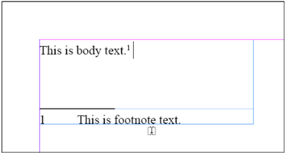

#### Notes

In  Design stories can contain non-printing notes. Notes in IDML are supported just like the other inline objects-they appear as child elements of a <CharacterStyleRange> object:

**Schema Example 86. Note**

```
Note_Object = element Note { attribute Collapsed { xsd:boolean }?, attribute CreationDate { xsd:dateTime }?, attribute ModificationDate { xsd:dateTime }?, attribute UserName { xsd:string }?, attribute AppliedDocumentUser { xsd:string }?, element Properties { element Label { element KeyValuePair { KeyValuePair_TypeDef }* }? } ?, ( Footnote_Object*& GaijiOwnedItemObject_Object*& TextVariableInstance_Object*& Table_Object*& 
ParagraphStyleRange_Object*& CharacterStyleRange_Object*& HiddenText_Object* ) }
```

**IDML Example 55. Note**

```xml
<ParagraphStyleRange AppliedParagraphStyle="Paragraph  Style\k Normal  Paragraph  Style"> <CharacterStyleRange AppliedCharacterStyle= "CharacterStyle\k[No CharacterStyle]"> <Content>This is an example paragraph. At the end of the second sentence,we've inserted a note.</Content> <Note Collapsed="false" CreationDate="20080224T23:12:55" ModificationDate="20080224T23:16:44" UserName="Unknown UserName" AppliedDocumentUser="d  Document  User1"> <ParagraphStyleRange AppliedParagraphStyle= "Paragraph  Style\k[No paragraph style]"> <CharacterStyleRange AppliedCharacterStyle= "CharacterStyle\k[No CharacterStyle]"> <Content>This is a note.</Content> </CharacterStyleRange> </Paragraph  Style Range> </Note> <br/> <Content>This is a paragraph following the note.</Content> </CharacterStyleRange> </Paragraph  Style Range>
```

Figure 39. Note

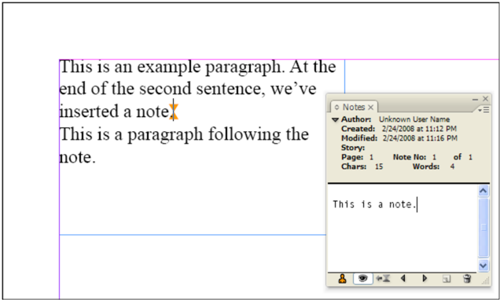

## Anchored Frames

In  Design documents often feature page items that have been embedded in text. These frames move with the text as the composition and layout of the text changes. These embedded frames are referred to as anchored frames . Anchored frames are also sometimes called inline frames -in IDML, an inline frame is a special case of an anchored frame.

The content of the inline TextFrame itself does not appear in the <Story> containing the frame, as shown in the following example. Instead, the Parent  Story attribute inside the anchored <TextFrame> element includes a reference to another <Story> element in the same IDML package (in this example inside the, Story\_u109.xml file). The <Story> element in that file contains the text elements that appear in the inline TextFrame.

The position of the anchored frame on the page is determined by the composition of the text surrounding the frame and preceding it in its parent <Story> element, and by the contents of the <AnchoredObjectSetting> element associated with the inline frame. The frame may 'float' on the page, or may be positioned at points on the page determined by the contents of its <AnchoredObjectSetting> . You can change the shape and size of an anchored frame (in its inner coordinates) using its <PathGeometry> element, but you cannot transform the frame to a specific location in spread coordinates using the ItemTransform attribute of the frame (as you can when the frame is an independent page item).

For more on positioning anchored objects in text, refer to the In  Design online help.

**Schema Example 87. Anchored  Object  Settings**

```
AnchoredObjectSetting_Object = element AnchoredObjectSetting { attribute AnchoredPosition { AnchorPosition_EnumValue }?, attribute SpineRelative { xsd:boolean }?, attribute LockPosition { xsd:boolean }?, attribute PinPosition { xsd:boolean }?, attribute AnchorPoint { AnchorPoint_EnumValue }?, attribute HorizontalAlignment { HorizontalAlignment_EnumValue }?, attribute HorizontalReferencePoint { AnchoredRelativeTo_EnumValue }?, attribute VerticalAlignment { VerticalAlignment_EnumValue }?, attribute VerticalReferencePoint { VerticallyRelativeTo_EnumValue }?, attribute AnchorXoffset { xsd:double }?, attribute AnchorYoffset { xsd:double }?, attribute AnchorSpaceAbove { xsd:double }? }
```

Table 114. Anchored  Object  Setting Properties Represented as Attributes

| Name               | Type                        | Req     | Description |
| ------------------ | --------------------------- | ------- | ----------------------------------------------------------------------------------------------------------------------------------------------------------------------------------------------------------------------------------- |
| AnchorPoint        | AnchorPoint_Enum Value     | no      | The point in the anchored object to posi- tion. Can be TopLeftAnchor, TopCenter Anchor, TopRightAnchor, LeftCenter Anchor, CenterAnchor, RightCenterAnchor, BottomLeftAnchor, BottomCenterAnchor, or BottomRightAnchor. |
| AnchorSpaceAbove   | double                      | no      | The space above an anchored object. Valid only when AnchoredPosition is AboveLine . |
| AnchorXoffset      | double                      | no      | The horizontal (x) offset of the anchored object. |
| AnchorYoffset      | double                      | no      | The vertical (y) offset of the anchored object. |
| AnchoredPosition   | AnchorPosition_ EnumValue   | no      | The position of the anchored object relative to the anchor. Can be InlinePosition, Above Line, or Anchored . |
| Horizontal Alignment        | Horizontal Alignment_Enum Value    | no      | When AnchoredPosition is AboveLine, the position of the anchored object is relative to the text area. Can be RightAlign, LeftAlign, CenterAlign, or TextAlign. Not valid when anchored position is InlinePosition. Can be |
| Horizontal ReferencePoint   | AnchoredRelative To_EnumValue       | no      | The horizontal reference point on the page. Valid only when AnchoredPosition is Anchored Position . |
| LockPosition                 | boolean                              | no      | If true, prevents manual positioning of the anchored object. |
| PinPosition                  | boolean                              | no      | If true, pins the position of the anchored object within the TextFrame top and bottom. |
| SpineRelative                | boolean                              | no      | If true, the position of the anchored object is rel- ative to the binding spine of the page or spread. |
| VerticalAlignment            | Vertical Alignment_Enum Value      | no      | The vertical alignment of the anchored object reference point with the vertical reference point on the page. Can be TopAlign, BottomAlign, or CenterAlign . Valid only when Anchored Position is AnchoredPosition . |
| Vertical ReferencePoint     | Vertically RelativeTo_Enum Value   | no      | The vertical reference point on the page. Valid only when AnchoredPosition is Anchored Position . |

**IDML Example 56. Anchored TextFrame**

```xml
<ParagraphStyleRange SpaceAfter="12"> <CharacterStyleRange> <Content>This is an example paragraph. We've inserted an inline TextFrame in the second paragraph.</Content> <br/> </CharacterStyleRange> </Paragraph  Style Range> <ParagraphStyleRange SpaceAfter="12" Justification="Center  Align"> <CharacterStyleRange AppliedCharacterStyle= "CharacterStyle\k[No CharacterStyle]"> <TextFrame Self="u106" Parent  Story="u109" Item  Transform= "1 0 0 1 0 0"> <Properties> <PathGeometry> <GeometryPath Path  Open="false"> <PathPointArray> <PathPointType Anchor="97.2685546875 225.5" Left  Direction="97.2685546875 225.5" Right  Direction="97.2685546875 225.5"/> <PathPointType Anchor="97.2685546875 202" Left  Direction="97.2685546875 202" Right  Direction="97.2685546875 202"/> <PathPointType Anchor="183.5 202" Left  Direction="183.5 202" Right  Direction="183.5 202"/> <PathPointType Anchor="183.5 225.5" Left  Direction="183.5 225.5" Right  Direction="183.5 225.5"/>
</GeometryPath> </PathGeometry> </Properties> <AnchoredObjectSetting Self="u106Anchored  Object  Setting1" Anchored  Position="Inline Position" Spine  Relative="false" Lock Position="false" Pin  Position="true" Anchor Point="Bottom  Right Anchor" Horizontal  Alignment="Left Align" Horizontal  Reference  Point= "TextFrame" Vertical  Alignment="Top  Align" Vertical  Reference Point="Line  Baseline" Anchor  Xoffset="0" Anchor  Yoffset="0" Anchor  Space Above="0"/> </TextFrame> <br/> </CharacterStyleRange> </Paragraph  Style Range> <ParagraphStyle Rangr SpaceAfter="12"> <CharacterStyleRange AppliedCharacterStyle= "CharacterStyle\k[No CharacterStyle]"> <Content>This is a paragraph following the inline TextFrame.</Content> </CharacterStyleRange> </Paragraph  Style Range>
```

Figure 40. Anchored TextFrame

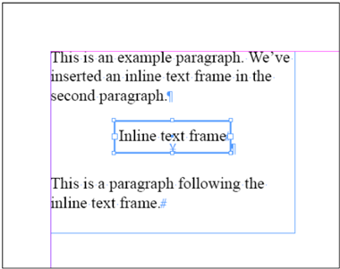

## Anchored Graphics

Another type of anchored frame is a frame containing a graphic. These frames follow the same rules as anchored TextFrames, as discussed in the previous section.

**IDML Example 57. Anchored Graphic**

```xml
<Story Self="uce"> <ParagraphStyleRange SpaceAfter="12"> <CharacterStyleRange> <Content>This is an example paragraph. We've ve inserted an anchored frame containing a graphic in the second paragraph.</Content> <Br/> </CharacterStyleRange> </Paragraph  Style Range> <ParagraphStyleRange Justification="Center  Align"> <CharacterStyleRange> <Rectangle Self="uec" Item  Transform="1 0 0 1 0 0"><Properties> <PathGeometry> <GeometryPath Path  Open="false"> <PathPointArray> <PathPointType Anchor="72 78.72" Left  Direction="72 78.72" Right  Direction="72 78.72"/> <PathPointType Anchor="72 78.72" Left  Direction="72 78.72" Right  Direction="72 78.72"/> <PathPointType Anchor="72 78.72" Left  Direction="72 78.72" Right  Direction="72 78.72"/> <PathPointType Anchor="72 78.72" Left  Direction="72 78.72" Right  Direction="72 78.72"/> </PathPointArray> </GeometryPath> </PathGeometry> </Properties> <Image Self="ue6" Space="$ID/#Links_RGB" Actual  Ppi="300 300" Effective  Ppi="300 300" Image Rendering  Intent="Use Color  Settings" Local Display  Setting="Default" Image Type  Name="$ID/JPEG" Item Transform="1 0 0 1 0 0"> <Properties> <Profile type="string">$ID/Embedded</Profile> <GraphicBounds Left="0" Top="0" Right="144" Bottom="157.44"/> </Properties> <Link Self="ueb" Asset  URL="$ID/" Asset  ID="$ID/" Link Resource  URI="file://ruri/documents/IDML/assets/pumpkin.jpg" Link Resource  Format="$ID/JPEG" Stored State="Normal" Link  Class ID="35906" Link Client  ID="257" Link Resource  Modified="false" Link Object  Modified="false" Show In UI="true" Can  Embed="true" Can Unembed="true" Can  Package="true" Import Policy="No  Auto  Import" Export  Policy="No Auto  Export" Link Import  Stamp="file 128385019586602016 396019" Link Import  Modification  Time="20071102T11:32:38" Link Import  Time="20080614T15:12:33"/> </Image> </Rectangle> <Br/> </CharacterStyleRange> </Paragraph  Style Range> <ParagraphStyleRange> <CharacterStyleRange> <Content>This is a paragraph following the anchored frame.</Content> </CharacterStyleRange> </Paragraph  Style Range> </Story>
```

The graphic iteself is not embedded in the <Story> element. Instead, the <Link> element stored in the <Image> element refers to a graphic file on disk.

## Hyperlink Text Sources

Hyperlink text sources differ from other inline elements as they appear as child elements of a <CharacterStyleRange>, and contain a <Content> element. Other inline elements appear as siblings of the <Content> element of the <CharacterStyleRange> .

**Schema Example 88. Hyperlink  Text  Source**

```
HyperlinkTextSource_Object = element HyperlinkTextSource { attribute Self { xsd:string }, attribute Name { xsd:string }?, attribute Hidden { xsd:boolean }?, attribute AppliedCharacterStyle { xsd:string }?, element Properties { element Label { element KeyValuePair { KeyValuePair_TypeDef }* }? } ?, ( GaijiOwnedItemObject_Object*& Note_Object*& Table_Object*& TextVariableInstance_Object*& Footnote_Object*& HyperlinkTextDestination_Object*& Change_Object*& HiddenText_Object*& XMLElement_Object*& XMLInstruction_Object*& XMLComment_Object*& ParagraphStyleRange_Object*& CharacterStyleRange_Object*& element Content {text}*&
```

Figure 41. Inline Graphic

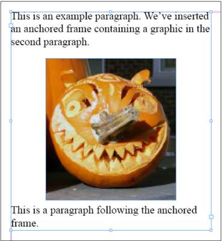

```
element Br {empty}* ) }
```

Table 115. Hyperlink  Text  Source Properties Represented as Attributes

| Name                      | Type      | Req     | Description |
| ------------------------- | --------- | ------- | ----------------------------------------------- |
| AppliedCharacterStyle   | string    | no      | CharacterStyle of the hyperlink text source. |
| Hidden                    | boolean   | no      | If true, the HyperlinkTextSource is hidden. |
| Name                      | string    | no      | The name of the HyperlinkTextSource. |

**IDML Example 58. Hyperlink Text Source**

```xml
<ParagraphStyleRange AppliedParagraphStyle="Paragraph  Style\k Normal  Paragraph  Style" SpaceAfter="12"> <CharacterStyleRange> <Content>This is an example paragraph. We've inserted a URL hyperlink in the second paragraph.</Content> <br/> </CharacterStyleRange> <CharacterStyleRange> <HyperlinkTextSource Self="u12b" Name="Hyperlink_1" Hidden="false"> <Content>http://www.adobe.com</Content> </HyperlinkTextSource> </CharacterStyleRange> </Paragraph  Style Range>
```

Figure 42. Hyperlink

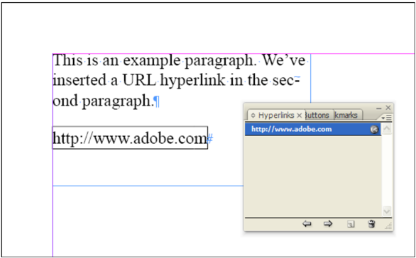

## HyperlinkTextDestination

A hyperlink text destinations is one of the possible 'targets' of a hyperlink.

**Schema Example 89. HyperlinkTextDestination**

```
HyperlinkTextDestination_Object = element HyperlinkTextDestination { attribute Self { xsd:string }, attribute Name { xsd:string }, attribute Hidden { xsd:boolean }?, attribute DestinationUniqueKey { xsd:int }?, element Properties { element Label { element KeyValuePair { KeyValuePair_TypeDef }* }? } ? }
```

Table 116. Hyperlink  Text  Destination Properties Represented as Attributes

| Name                     | Type      | Req     | Description |
| ------------------------ | --------- | ------- | ----------------------------------------------------------------------------------------------- |
| Destination UniqueKey   | int       | no      | Aunique identifier for the hyperlink text destination. |
| Hidden                   | boolean   | no      | If true, the hyperlink text destination is hidden. |
| Name                     | string    | yes     | The name of the hyperlink text destination. The name must be unique within the IDML document. |

**IDML Example 59. HyperlinkTextDestination**

```xml
<Story Self="uc8"> <ParagraphStyleRange AppliedParagraphStyle= "ParagraphStyle/$ID/NormalParagraphStyle"> <CharacterStyleRange AppliedCharacterStyle= "CharacterStyle/$ID/[No CharacterStyle]"> <Content>This is a </Content> <HyperlinkTextDestination Self="ue5" Name="hyperlink text destination" Hidden="false" DestinationUniqueKey="1"/> <HyperlinkTextSource Self="u104" Name="Hyperlink 1" Hidden="false" AppliedCharacterStyle="n"> <Content>hyperlink text destination</Content> </HyperlinkTextSource> <Content>.</Content> <Br/> </CharacterStyleRange> </ParagraphStyleRange> </Story>
```

Figure 43. HyperlinkTextDestination

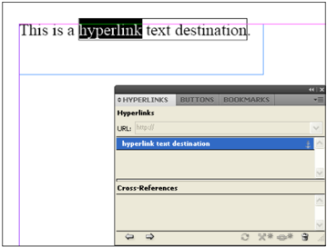

## Cross Reference Sources

A <CrossReferenceSource> is the source for a cross reference hyperlink.

**Schema Example 90. CrossReferenceSource**

```
CrossReferenceSource_Object = element CrossReferenceSource { attribute Self { xsd:string }, attribute AppliedFormat { xsd:string }, attribute Name { xsd:string }?, attribute Hidden { xsd:boolean }?, attribute AppliedCharacterStyle { xsd:string }?, element Properties { element Label { element KeyValuePair { KeyValuePair_TypeDef }* }? } ?, ( GaijiOwnedItemObject_Object*& TextVariableInstance_Object*& HyperlinkTextDestination_Object*& Change_Object*& HiddenText_Object*& XMLElement_Object*& XMLInstruction_Object1*& XMLComment_Object*& ParagraphStyleRange_Object*& CharacterStyleRange_Object* ) }
```

Table 117. CrossReferenceSource Properties Represented as Attributes

| Name                      | Type      | Req     | Description |
| ------------------------- | --------- | ------- | ------------------------------------------------------------------------------------------------------------------------------------------------------------------------------------------------------------------------------------------------------------------------------------------------------------------------------------------------------------------------------------------------------------------------------------------------------------------------------------------------- |
| AppliedCharacterStyle   | string    | no      | CharacterStyle of the cross reference source. |
| AppliedFormat             | string    | yes     | String specifying the format for the cross refer- ence. This attribute corresponds to the defini- tions found in the Cross Reference Formats dialog box in InDesign. You can enter any text, use built-in format tags, use InDesign metacha- racters, or freely mix the three. The built-in format tags are shown in the following table. The metacharacters are shown in the second table below. For more on using applied formats in cross references, refer to the InDesign docu- mentation. |
| Hidden                    | boolean   | no      | If true, the cross reference source is hidden. |
| Name                      | string    | no      | The name of the cross reference source. |

Table 118. AppliedFormat Tags

| Tag                                           | Description |
| --------------------------------------------- | ---------------------------------------------------------------------------------------------------------------------------------------------------------------------------------------------------------------------------------------------- |
| <pageNum/>                                    | The number of the page containing the cross reference source. |
| <paraNum/>                                    | The number of the paragraph containing the cross reference source (if the para- graph is a numbered paragraph). |
| <paraText/>                                   | The text of the paragraph, excluding the return character. |
| <fullPara/>                                   | The text of the paragraph, including the return character. |
| <fullPara delim="" include Delim="false"/>   | The text from the beginning of the paragraph to the specified delimiter. If you do not enter a delimiter character and change the Delim value to true, this tag will include the full text of the paragraph, including the return character. |
| <txtAnchrName/>                               | The name of the text anchor. |
| <chapNum/>                                    | The number of the chapter. |
| <fileName/>                                   | The name of the file. |
| <cs name=""></cs>                             | The name of the CharacterStyle applied to the cross reference source. |

**Table 119**: Metacharacters

| Tag       | Description          | Tag     | Description |
| --------- | -------------------- | ------- | -------------------------------- |
| ^_        | Emdash               | ^s      | Fixed width non-breaking space |
| ^        | En dash              | ^~      | Non-breaking hypehn |
| ^m        | Emspace              | ^{      | Double left quotation mark |
| ^n        | En space             | ^}      | Double right quotation mark |
| ^&#124;   | Hair space           | ^[      | Single left quotation mark |
| ^%        | Sixth space          | ^]      | Single right quotation mark |
| ^<     | Thin space (^<)      | ^8      | Bullet character |
| ^4        | Quarter space        | ^7      | Paragraph symbol |
| ^3        | Third space          | ^6      | Section symbol |
| ^.       | Punctucation space   | ^t      | Tab character |
| ^/        | Figure space         | ^n      | Forced line break character |
| ^f        | Flush space          | ^h      | End nested style character |
| ^S        | Non-breaking space   | ^j      | Non-joiner character |

**IDML Example 60. CrossReferenceSource**

```xml
<CrossReferenceSource Self="u464" AppliedFormat="ud8" Name="Hyperlink 1" Hidden="false" AppliedCharacterStyle="n">
    <CharacterStyleRange AppliedCharacterStyle="CharacterStyle/Hyperlink"> 
        <Content>See 'Text  Variable' on page </Content>
    </CharacterStyleRange>
    <CharacterStyleRange AppliedCharacterStyle="CharacterStyle/Hyperlink" PageNumberType="TextVariable">
        <TextVariableInstance Self="u482" Name="&amp;lt;?AID 001b?&amp;gt;TV XRefPageNumber" ResultText="1" AssociatedTextVariable="dTextVariablen&amp;lt;?AID 001b?&amp;gt;TV XRefPageNumber"/>
    </CharacterStyleRange>
    <CharacterStyleRange AppliedCharacterStyle="CharacterStyle/Hyperlink"> 
        <Content> for an example.</Content> 
    </CharacterStyleRange> 
</CrossReferenceSource>
```
