## 10.6 Graphics

In an IDML package, the Graphic.xml file stores elements that define graphic attributes in an In  Design document. Page items and text elements refer to these attributes to apply formatting to page items and text. Inside Graphic.xml , you'll find the following elements.

- Colors
- Swatches
- Gradients
- Tints
- Inks
- Mixed Inks
- Mixed Ink Groups
- Pasted  Smooth  Shades
- Stroke Styles

## 10.6.1 Colors and Swatches

In the In  Design user interface, colors, tints, gradients, and mixed inks are all swatches, and can be applied to the fill or stroke of a page item or text. Swatches share similar attributes and are used in similar ways. Swatches are not the same as inks (see 'Ink'), but each swatch generally corresponds to one ink or to a specific set of inks. A <Color> element, for example, might correspond to a single spot ink, or might be made up of percentages of process inks. (If a spot ink exists in the document, a <Color> element with the same name will also exist.) A <MixedInk> might be based on two or more spot inks, or on at least one spot ink and one or more process inks. For more on the relationship between swatches and inks, refer to the In  Design online help.

Colors can be specified as spot colors or process colors, and can be defined using the LAB, RGB, or CMYK color model.

To support consistent color across multiple devices, you can apply a color profile to a document using the color management attributes of the <Document> element in the designmap.xml file. The color management profile assigned to the document changes the appearance of the color for display, printing, and export, but does not change the base values of the definition of the color in IDML or in an In  Design document. For more detailed information on color management, please refer to the In  Design documentation.

Note: In  Design will create the 'None' swatch, and the required 'Paper,' 'Black,' and 'Registration' colors, even if those elements are not included in the IDML document. In addition, all In  Design documents contain three hidden, reserved process colors: Cyan, Magenta, and Yellow. You cannot create colors with these names in IDML or in the In  Design user interface.

**Swatch**

In the In  Design user interface, all named colors, tints, gradients, and mixed inks are swatches, but there is only one object whose type is swatch-'None', or no color. Every In  Design document contains this special swatch.

**Schema Example 95. Swatch**

```rnc
Swatch_Object = element Swatch { attribute Self { xsd:string }, attribute Name { xsd:string }, attribute ColorEditable { xsd:boolean }?, attribute ColorRemovable { xsd:boolean }?, attribute Visible { xsd:boolean }?, attribute SwatchCreatorID { xsd:int }?, element Properties { element Label { element KeyValuePair { KeyValuePair_TypeDef }* }? } ? }
```

**Table 121**: Swatch Properties Represented as Attributes

| Name              | Type      | Req     | Description |
| ----------------- | --------- | ------- | ------------------------------------------------------------------------------------------------------------------------------------------------------------------------------------------------------------------------------------------------------------------------------------------------------------------------------------------- |
| ColorEditable     | boolean   | no      | If true, the swatch is editable. |
| ColorRemovable    | boolean   | no      | If true, the swatch can be deleted. If false, the swatch is used in an imported graphic file in the document. |
| Name              | string    | yes     | The name of the swatch. |
| SwatchCreatorID   | int       | no      | The unique ID of the creator (or vendor) of the swatch. SwatchCreatorID is useful when the swatch added is from a color library that InDesign shipped with. The SwatchCreatorID allows InDesign to load the proper color/swatch library quickly. If it is an user defined swatch, it simply defaults to the InDesign SwatchCreatorID. |
| Visible           | boolean   | no      | If true, the swatch is visible in the user interface. Unnamed process color and gradient swatches can have this attribute set to false. All named swatches should have this flag set to true. |

All <Color> , <Tint> , <Gradient> , <MixedInk> , and <MixedInkGroup> elements inherit the above properties.

**IDML Example 63. 'None' Swatch**

```xml
<Swatch Self="Swatch\cNone" Name="None" ColorEditable="false" ColorRemovable="false" Visible="true" SwatchCreatorID="7937"/>
```

**Color**

The <Color> element corresponds to a color in a document, including both named and unnamed colors. The Model attribute specifies the color model, the Space attribute specifies the color space, and the Color Value attribute contains the corresponding array of values that define the color in the appropriate color model. For information on color models and color spaces, refer to the InDesign online help.

**Schema Example 96. Color**

```
Color_Object = element Color { attribute Self { xsd:string }, attribute Model { ColorModel_EnumValue }?, attribute Space { ColorSpace_EnumValue }?, attribute ColorValue { list { xsd:double * } }?, attribute ColorOverride { ColorOverride_EnumValue }?, attribute BaseColor { xsd:string }?, attribute SpotInkAliasSpotColorReference { xsd:string }?, attribute AlternateSpace { ColorSpace_EnumValue }?, attribute AlternateColorValue { list { xsd:double * } }?, attribute Name { xsd:string }, attribute ColorEditable { xsd:boolean }?, attribute ColorRemovable { xsd:boolean }?, attribute Visible { xsd:boolean }?, attribute SwatchCreatorID { xsd:int }?, element Properties { element Label { element KeyValuePair { KeyValuePair_TypeDef }* }? } ? }
```

In addition to the attributes shared with the <Swatch> element, the <Color> element also defines the following attributes.

**Figure 44**: In  Design Swatches

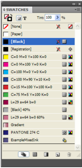

**Table 122**: Color Properties Represented as Attributes

| Name                               | Type                                           | Req     | Description |
| ---------------------------------- | ---------------------------------------------- | ------- | -------------------------------------------------------------------------------------------------------------------------------------------------------------------------------------------------------------------------------------------------------------------------------------------------------------------------------------------------------------------- |
| AlternateColorValue              | list of doubles as a space separated string   | no      | An alternate color value for the color. The <ColorValue> of the <Color> is defined as a sequence of values in the order in which they appear in the color space specified by the AlternateSpace attribute. Leave empty if AlternateSpace is NoAlternateColor. |
| AlternateSpace                     | ColorSpace_EnumValue                         | no      | The color space for the alternate color. Can be RGB , CMYK , LAB , MixedInk , NoAlternateColor . |
| BaseColor                          | string                                         | no      | Specifies the color that this color is based on, if any. Use n if the color is not based on another color. |
| ColorOverride                      | ColorOverride_ EnumValue                       | no      | Can be Normal , Specialpaper , Specialblack , Specialregistration , Hiddenreserved , or Mixedinkparent . Use Normal when defining color swatches in IDML-the other enumeration values are for special, default colors. |
| ColorValue                         | list of doubles as a space separated string   | no      | The number of values required and the range depends on the color space. For RGB, specify three values, with each value in the range 0 to 255; for CMYK, specify four values representing C, M, Y, and K, with each value in the range 0 to 100; for LAB, specify three values representing L (Range: 0 to 100), A(Range: -128 to 127), and B (Range: -128 to 127). |
| Model                              | ColorModel_EnumValue                         | no      | The color model. Can be Spot , or Process . |
| Space                              | ColorSpace_EnumValue                         | no      | The color space. Can be RGB , CMYK , or LAB . |
| SpotInkAliasSpotColorReference   | string                                         | no      | Aspot color can be aliased to another spot ink or process ink. From the user interface, this is done through the Ink Manager dialog. This attribute contains a reference to the original spot ink. |

**IDML Example 64. Process Color**

```xml
<Color Self="Color\C=100 M=90 Y=10 K=0" Model="Process" Space="CMYK" ColorValue="100 90 10 0" ColorOverride="Normal" BaseColor="n" AlternateSpace="NoAlternateColor" AlternateColorValue="" Name="C=100 M=90 Y=10 K=0" ColorEditable="true" ColorRemovable="true" Visible="true" SwatchCreatorID="7937"/>
```

**Figure 45**: Process Color

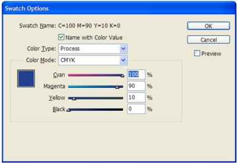

**IDML Example 65. Spot Color**

```xml
<Color Self="Color\PANTONE 274 C" Model="Spot" Space="CMYK" ColorValue="100 100 0 28" ColorOverride="Normal" BaseColor="n" SpotInkAliasSpotColorReference="n" AlternateSpace="LAB" AlternateColorValue="12.549019607843137 23 -42" Name="PANTONE 274 C" ColorEditable="true" ColorRemovable="true" Visible="true" SwatchCreatorID="31500"/>
```

**Figure 46**: Spot  Color

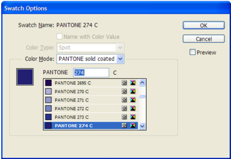

**IDML Example 66. LAB Color**

```xml
<Color Self="Color\L=29 a=64 b=0" Model="Process" Space="LAB" ColorValue="29 64 0" ColorOverride="Normal" BaseColor="n" AlternateSpace="NoAlternateColor" AlternateColorValue="" Name="L=29 a=64 b=0" ColorEditable="true" ColorRemovable="true" Visible="true" SwatchCreatorID="7937"/>
```

**Figure 47**: LAB Color

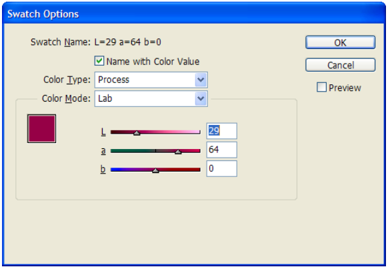

**Gradient**

A gradient is a blend between two or more colors or between two tints of the same color. Gradients can include the 'Paper' color, process colors, spot colors, or mixed inks using any color model or color space. Gradients are defined by a series of gradient stops. A gradient stop is the point at which a gradient changes from one color to another. Gradients can be linear or radial.

In IDML, each <Gradient> element has a Type attribute that defines the type of gradient (Linear or Radial). <Gradient> elements also contain two or more <GradientStop> elements. Each <GradientStop> element contains a reference to a color in the <StopColor> element, a Location attribute that specifies the location of the gradient stop in the gradient (as a percentage of the total width of the gradient), and a Midpoint attribute that defines the midpoint of the change in color from this gradient stop to the next (as a percentage of the distance between the two gradient stops).

When mixing gradients that contain gradient stops with different color spaces, In  Design looks through all of the gradient stops for the widest gamut color space and uses it as a unified color space. However, if CMYK color space is one of the gradient stops, then CMYK color space is always the preferred unified space. All process color gradient stops that are not in the unified color space are converted to the unified space before blending.

For more on gradients, refer to the In  Design online help.

**Schema Example 97. Gradient**

```rnc
Gradient_Object = element Gradient { attribute Self { xsd:string }, attribute Type { GradientType_EnumValue }?, attribute Name { xsd:string }, attribute ColorEditable { xsd:boolean }?, attribute ColorRemovable { xsd:boolean }?, attribute Visible { xsd:boolean }?, attribute SwatchCreatorID { xsd:int }?, element Properties { element Label { element KeyValuePair { KeyValuePair_TypeDef }* }? } ? , ( GradientStop_Object* ) }
```

In addition to the attributes shared with the <Swatch> element, the <Gradient> element also defines the following attributes.

**Table 123**: Gradient Properties Represented as Attributes

| Name     | Type                      | Req     | Description |
| -------- | ------------------------- | ------- | ---------------------------------------------- |
| Type     | GradientType_ EnumValue   | no      | The gradient type. Can be Linear or Radial . |

**IDML Example 67. Gradient**

```xml
<Gradient Self="Gradient\Example  Gradient" Type="Linear" Name="Example  Gradient" Color Editable="true" Color  Removable="true" Visible="true" Swatch Creator  ID="7937"> <GradientStop Self="ucd Gradient  Stop0" Stop  Color="Color\u7e" Location="0"/> <GradientStop Self="ucd Gradient  Stop1" Stop Color="Color\c  L=29 a=64 b=0" Location="100" Midpoint="50"/> </Gradient>
```

**Figure 48**: Gradient

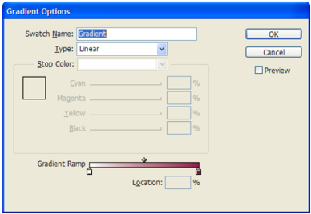

The example gradient contains two <GradientStop> elements, and each <GradientStop> refers to the Self value of a <Color> element in the Graphic.xml file.

**Gradient  Stop**

**Schema Example 98. Gradient  Stop**

```rnc
GradientStop_Object = element GradientStop { attribute Self { xsd:string }, attribute StopColor { xsd:string }?, attribute Location { xsd:double {minInclusive="0" maxInclusive="100"} }?, attribute Midpoint { xsd:double {minInclusive="13" maxInclusive="87"} }? }
```

**Table 124**: Gradient  Stop Properties Represented as Attributes

| Name        | Type     | Req     | Description |
| ----------- | -------- | ------- | ----------------------------------------------------------------------------------------------------------------------------- |
| Location    | double   | no      | The starting location (as a percentage of the gra- dient length) of the gradient stop on the gradi- ent. (Range: 0 to 100). |
| Midpoint    | double   | no      | The mid-point (as a percentage of the gradient length) of the gradient stop. (Range: 13 to 87) |
| StopColor   | string   | no      | The color, tint, or mixed ink applied to the gra- dient stop. |

**Tint**

A tint is a color that is based on a percentage of another a color. The appearance of a tint is determined by attribute Base Color (a reference to the color that the tint is based on) and the

attribute Tint Value (the percentage of the base color). For more on tints and their relationship with their base colors, refer to the In  Design documentation.

**Schema Example 99. Tint**

```rnc
Tint_Object = element Tint { attribute Self { xsd:string }, attribute TintValue { xsd:double {minInclusive="0" maxInclusive="100"} }?, attribute BaseColor { xsd:string }, attribute Name { xsd:string }, attribute ColorOverride { ColorOverride_EnumValue }?, attribute SpotInkAliasSpotColorReference { xsd:string }?, attribute AlternateSpace { ColorSpace_EnumValue }?, attribute AlternateColorValue { list { xsd:double * } }?, attribute ColorEditable { xsd:boolean }?, attribute ColorRemovable { xsd:boolean }?, attribute Visible { xsd:boolean }?, attribute SwatchCreatorID { xsd:int }?, element Properties { element Label { element KeyValuePair { KeyValuePair_TypeDef }* }? } ? }
```

In addition to the attributes shared with the <Swatch> , the <Tint> element also defines the following attributes.

**Table 125**: Tint Properties Represented as Attributes

| Name                               | Type                                           | Req     | Description |
| ---------------------------------- | ---------------------------------------------- | ------- | ------------------------------------------------------------------------------------------------------------------------------------------------------------------------------------------------------------------------------------------------------------- |
| AlternateColorValue              | list of doubles as a space separated string   | no      | An alternate color value for the tint. The <ColorValue> of the <Tint> is defined as a sequence of values in the order in which they appear in the color space specified by the AlternateSpace attribute. Leave empty if AlternateSpace is NoAlternateColor. |
| AlternateSpace                     | ColorSpace_EnumValue                         | no      | The color space for the alternate color. Can be RGB , CMYK , LAB , MixedInk , NoAlternateColor . |
| SpotInkAliasSpotColorReference   | string                                         | no      | Aspot color can be aliased to another spot ink or process ink. From the user interface, this is done through the Ink Manager dialog. This attribute contains a reference to the original spot ink. |

| Name        | Type     | Req     | Description |
| ----------- | -------- | ------- | ------------------------------------------------------------------------------------------------------------------------------------------------------------------------------------------------------------------------------------------------------------------------------------------------------------------------- |
| TintValue   | double   | no      | The percent of the base color. For process colors, the TintValue is the percentage of each process ink that makes up the base color. For RGB, each component is multiplied by 0.8 + 0.2, or r,g,b = tint*(r,g, b) + (1-tint). Tints of Lab colors use the same formula as RGB, but add the L component (1- tint)*100.0. |

**IDML Example 68. Tint**

```xml
<Tint Self="Tint\[Black] 40%" Tint  Value="40" Base  Color="Color\Black" Name="[Black] 40%" Color Override="Normal" Alternate  Space="No Alternate  Color" Alternate  Color Value="" Color  Editable="true" Color Removable="true" Visible="true" Swatch  Creator ID="7937"/>
```

**Figure 49**: Tint

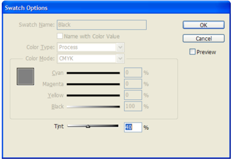

**Mixed Ink**

A mixed ink is a swatch created by mixing inks-you can combine up to sixteen spot inks, or mix one spot ink with one or more process inks. For more on mixed inks, refer to the In  Design documentation.

**Schema Example 100. Mixed  Ink**

```
MixedInk_Object = element MixedInk { attribute Self { xsd:string }, attribute Model { ColorModel_EnumValue }?, attribute Space { ColorSpace_EnumValue }?, attribute InkList { list { xsd:string * } }?, attribute InkPercentages { list { xsd:double * } }?, attribute BaseColor { xsd:string }?, attribute InkNameList { list { xsd:string * } }?, attribute MixedInkSpotColorNameList { list { xsd:string * } }?, attribute MixedInkSpotColorList { list { xsd:string * } }?, attribute Name { xsd:string }, attribute ColorEditable { xsd:boolean }?, attribute ColorRemovable { xsd:boolean }?, attribute Visible { xsd:boolean }?, attribute SwatchCreatorID { xsd:int }?, element Properties { element Label { element KeyValuePair { KeyValuePair_TypeDef }*}? } ? }
```
In addition to the attributes inherited from the <Swatch> element, the <MixedInk> element also defines the following attributes.

**Table 126**: Mixed  Ink Properties Represented as Attributes

| Name                          | Type                                                         | Req     | Description |
| ----------------------------- | ------------------------------------------------------------ | ------- | ----------------------------------------------------------------------------------------------------------------------------------------------------------------- |
| BaseColor                     | string                                                       | yes     | The mixed ink group that a mixed ink swatch is based on. Use n for a standalone mixed ink. |
| InkList                       | list of ink references as a spaceseparated string           | yes     | The component inks. Each ink is represented by its unique ID (the value of its Self attribute). |
| InkNameList                   | list of ink names as a space separated string               | no      | The names of the component inks. |
| InkPercentages                | list of doubles as a space separated string                 | no      | The array of tint percentages for inks in the ink list (in the same order as the inks appear in the the InkList attribute). Note: Specify a value for each ink. |
| MixedInkSpotColorList       | list of spot color references as a space separated string   | no      | The spot colors used in the mixed ink. Each spot color is represented by its unique ID (the value of its Self attribute). |
| MixedInkSpotColorNameList   | list of color names as a space separated string             | no      | The names of the spot colors used in the mixed ink. |
| Model                         | ColorModel_Enum Value                                       | no      | The color model. Use Mixedinkmodel . |
| Space                         | ColorSpace_Enum Value                                       | no      | The color space. Use MixedInk . |

The following example shows a mixed ink with one spot ink (Pantone 274 C) and one process ink (Black).

**IDML Example 69. Mixed ink**

```xml
<MixedInk Self="MixedInk\c Example  MixedInk" Model="Mixedinkmodel" Space="Mixed Ink" InkList="Ink\k  Process%20Black Ink\c PANTONE%20274%20C" InkPercentages="20 60" BaseColor="n" InkNameList="$ID/Process%20Black PANTONE%20274%20C" MixedInkSpotColorNameList="PANTONE%20274%20C" MixedInkSpotColorList="Color\c  PANTONE%20274%20C" Name="Example  Mixed Ink" ColorEditable="true" ColorRemovable="true" Visible="true" Swatch  Creator  ID="7937"/>
```

**Mixed  Ink  Group**

A mixed ink group contains a series of swatches created from incremental percentages of different process and spot color inks. For example, mixing a spot ink with five tints of a the default color Black (10%, 20%, 30%, 40%, and 50%) results in a mixed ink group that contains five different mixed ink swatches.

The mixed inks that make up a mixed ink group are the same as standalone mixed inks, except that the value of the Base  Color attribute for a mixed ink in a mixed ink group will contain a reference to the unique ID of the mixed ink group (rather than n for 'none').

**Schema Example 101. Mixed  Ink  Group**

```rnc
MixedInkGroup_Object = element MixedInkGroup { attribute Self { xsd:string }, attribute Model { ColorModel_EnumValue }?, attribute InkList { list { xsd:string * } }?, attribute InkNameList { list { xsd:string * } }?, attribute MixedInkSpotColorNameList { list { xsd:string * } }?, attribute MixedInkSpotColorList { list { xsd:string * } }?, attribute Name { xsd:string }, attribute ColorEditable { xsd:boolean }?, attribute ColorRemovable { xsd:boolean }?, attribute Visible { xsd:boolean }?, attribute SwatchCreatorID { xsd:int }?, element Properties { element Label { element KeyValuePair { KeyValuePair_TypeDef }* }? } ? }
```

In addition to the attributes inherited from the <Swatch> element, the <MixedInkGroup> element also defines the following attributes.

**Figure 50**: Mixed  Ink

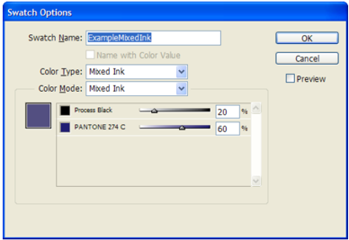

**Table 127**: Mixed  Ink  Group Properties Represented as Attributes

| Name                          | Type                                                         | Req     | Description |
| ----------------------------- | ------------------------------------------------------------ | ------- | --------------------------------------------------------------------------------------------------------------------------------- |
| InkList                       | list of ink references as a spaceseparated string           | yes     | The inks used in the mixed ink group. Each ink is represented by its unique ID (the value of its Self attribute). |
| InkNameList                   | list of ink names as a space separated string               | no      | The names of the inks used in the mixed ink. |
| MixedInkSpot ColorList       | list of spot color references as a space separated string   | no      | The spot colors used in the mixed ink group. Each spot color is represented by its unique ID (the value of its Self attribute). |
| MixedInkSpot ColorNameList   | list of color names as a space separated string             | no      | The names of the spot colors used in the mixed ink. |
| Model                         | ColorModel_Enum Value                                       | no      | The color model. Use Mixedinkmodel . |

**IDML Example 70. Mixed  Ink  Group**

```xml
<MixedInkGroup Self="Mixed  Ink Group\c  Example  Mixed Ink  Group" Model="Mixedinkmodel" Ink List="Ink\k  Process%20Black Ink\c PANTONE%20274%20C" Ink  Name List="$ID/Process%20 Black PANTONE%20274%20C" Mixed  Ink Spot Color Name  List="PANTONE%20274%20C" Mixed Ink Spot Color List="Color\c  PANTONE%20274%20C" Name="Example  Mixed Ink  Group" Color Editable="true" Color  Removable="true" Visible="true" Swatch Creator  ID="7937"/>
```

**Figure 51**: Mixed  Ink  Group

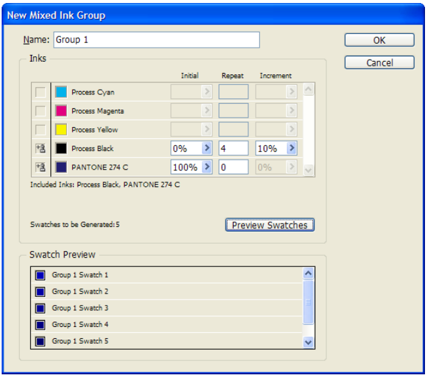

**Ink**

Inks are used to produce specific colors in printing. For process colors, Cyan, Magenta, Yellow and Black inks are mixed together to produce a range of colors. Every spot color, by contrast, represents an individual ink or printing plate. For more on the relationship between inks and colors, refer to the In  Design documentation.

**Schema Example 102. Ink**

```rnc
Ink_Object = element Ink { attribute Self { xsd:string }, attribute Name { xsd:string }, attribute AliasInkName { xsd:string }?, attribute Angle { xsd:double {minInclusive="0" maxInclusive="360"} }?, attribute ConvertToProcess { xsd:boolean }?, attribute Frequency { xsd:double {minInclusive="1" maxInclusive="500"} }?, attribute NeutralDensity { xsd:double {minInclusive="0.001" maxInclusive="10"} }?, attribute PrintInk { xsd:boolean }?, attribute TrapOrder { xsd:int }?, attribute InkType { InkTypes_EnumValue }?, element Properties { element Label { element KeyValuePair { KeyValuePair_TypeDef }* }? } ? }
```

**Table 128**: Ink Properties Represented as Attributes

| Name               | Type                   | Req     | Description |
| ------------------ | ---------------------- | ------- | ------------------------------------------------------------------------------------------------------------------------------------------------------------------------------------------------------------------------ |
| AliasInkName       | string                 | no      | Areference to the unique ID ( Self attribute) of the alias ink. For more on ink aliases, refer to the InDesign documentation. |
| Angle              | double                 | no      | The screen angle of the ink. (Range: 0 to 360) |
| ConvertToProcess   | boolean                | no      | Converts spot colors to process inks (for print- ing or export). Setting this value to true changes the printing or output values of the colors; it does not affect the definition of the spot colors in the document. |
| Frequency          | double                 | no      | The screen frequency of the ink. (Range: 1 to 500) |
| InkType            | InkTypes_Enum Value   | no      | The trapping type of the ink. Can be Normal , Opaque , Transparent, OpaqueIgnore. |
| Name               | string                 | yes     | The name of the ink. |
| NeutralDensity     | double                 | no      | The neutral density of the ink used for trapping. (Range: 0.001 to 10.0) |
| PrintInk           | boolean                | no      | If true (the default), prints the ink. |
| TrapOrder          | int                    | no      | The place of the ink in the trapping sequence. |

**IDML Example 71. Process Magenta ink**

```xml
<Ink Self="Ink\Process Magenta" Name="$ID/Process Magenta" Alias  Ink Name="[No Alias]" Angle="15" Convert  To Process="false" Frequency="70" Neutral  Density="0.76" Print Ink="true" Trap  Order="2" Ink Type="Normal"/>
```

Note that the '$ID' preceding the name of the default ink, 'Magenta' in the above example indicates that the name of this ink can be localized.

**IDML Example 72. Pantone 274 C Spot ink**

```xml
<Ink Self="Ink\c  PANTONE 274 C" Name="PANTONE 274 C" Alias  Ink Name="[No Alias]" Angle="45" Convert  To Process="false" Frequency="70" Neutral Density="1.6130121989933028" Print  Ink="true" Trap Order="5" Ink  Type="Normal"/>
```

## 10.6.2 Stroke Styles

The stroke styles used in an In  Design document are represented in an IDML package by the <StrokeStyle> , <DashedStrokeStyle> , <DottedStrokeStyle> , and <StripedStrokeStyle> elements in the Graphics.xml file.

**Schema Example 103. Stroke  Style**

```rnc
Stroke  Style_Object = element Stroke  Style { attribute Self { xsd:string }, attribute Name { xsd:string } }
```

**Table 129**: Stroke  Style Properties Represented as Attributes

| Name     | Type     | Req     | Description |
| -------- | -------- | ------- | ------------------------------- |
| Name     | string   | yes     | The name of the stroke style. |

**IDML Example 73. Default Stroke  Styles**

```xml
<StrokeStyle Self="Stroke  Style\Triple_Stroke" Name="$ID/Triple_Stroke"/> <StrokeStyle Self="Stroke Style\Thick  Thin Thick" Name="$ID/Thick  Thin Thick"/> <StrokeStyle Self="Stroke Style\Thin  Thick Thin" Name="$ID/Thin  Thick Thin"/> <StrokeStyle Self="Stroke Style\Thick  Thick" Name="$ID/Thick  Thick"/> <StrokeStyle Self="Stroke Style\Thick  Thin" Name="$ID/Thick  Thin"/> <StrokeStyle Self="Stroke Style\Thin  Thick" Name="$ID/Thin  Thick"/> <StrokeStyle Self="Stroke Style\Thin  Thin" Name="$ID/Thin  Thin"/> <StrokeStyle Self="Stroke  Style\Japanese Dots" Name="$ID/Japanese Dots"/> <StrokeStyle Self="Stroke  Style\White Diamond" Name="$ID/White Diamond"/> <StrokeStyle Self="Stroke  Style\Left Slant Hash" Name="$ID/Left Slant Hash"/> <StrokeStyle Self="Stroke  Style\Right Slant Hash" Name="$ID/Right Slant Hash"/> <StrokeStyle Self="Stroke  Style\Straight Hash" Name="$ID/Straight Hash"/> <StrokeStyle Self="Stroke  Style\Wavy" Name="$ID/Wavy"/> <StrokeStyle Self="Stroke  Style\Canned Dotted" Name="$ID/Canned Dotted"/> <StrokeStyle Self="Stroke  Style\Canned Dashed 3x2" Name="$ID/Canned Dashed 3x2"/> <StrokeStyle Self="Stroke  Style\Canned Dashed 4x4" Name="$ID/Canned Dashed 4x4"/> <StrokeStyle Self="Stroke  Style\Dashed" Name="$ID/Dashed"/> <StrokeStyle Self="Stroke  Style\Solid" Name="$ID/Solid"/>
```

Only the default stroke styles will appear as <StrokeStyle> elements. All custom stroke styles will appear as <DashedStrokeStyle> , <DottedStrokeStyle> , or <StripedStrokeStyle> elements. The names of the default stroke styles above have the '$ID' prefix, which means that the string will change based on the installed locale of the application. For more on the default stroke styles, refer to the In  Design online help.

**Figure 52**: In  Design Stroke Styles

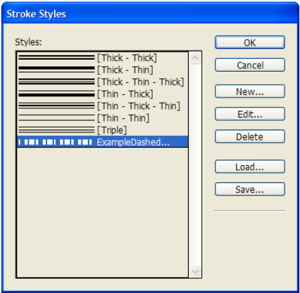

**Schema Example 104. Dashed  Stroke  Style**

```rnc
Dashed  Stroke Style_Object = element Dashed  Stroke  Style { attribute Self { xsd:string }, attribute Dash  Array { list { xsd:double * } }?, attribute Stroke  Corner Adjustment { Stroke  Corner Adjustment_Enum  Value }?, attribute End  Cap { End Cap_Enum  Value }?, attribute Name { xsd:string } }
```

**Table 130**: Dashed  Stroke  Style Properties Represented as Attributes

| Name                       | Type                                           | Req     | Description |
| -------------------------- | ---------------------------------------------- | ------- | ---------------------------------------------------------------------------------------------------------------------------------------------------------------------------------------------------------------------------------------------------------------------------------------------------------------------------------- |
| DashArray                  | list of doubles as a space separated string   | no      | The pattern of dashes and gaps that make up the dashed stroke, in the format [dash length1, gap length1, dash length2, gap length2, ...], in points. Define up to ten values. This pattern repeats along the path. The exact length of the dashes and gaps can be affected by the value of the StrokeCornerAdjustment attribute. |
| EndCap                     | EndCap_EnumValue                               | no      | The end shape of a the dashes. Can be ButtEndCap , RoundEndCap , or ProjectingEndCap . For a description of these end shapes, refer to the InDesign online help. |
| Name                       | string                                         | no      | The name of the dashed stroke style. |
| StrokeCorner Adjustment   | StrokeCorner Adjustment_Enum Value           | no      | The corner adjustment applied to the dashed stroke style. Can be None , Dashes , Gaps , or DashesAndGaps. For a description of these adjustments, refer to the InDesign online help. |

**IDML Example 74. Dashed  Stroke  Style**

```xml
<DashedStrokeStyle Self="Dashed  Stroke Style\c  Example Dashed  Stroke" Dash  Array="6 3 2 7 3 3" Stroke  Corner Adjustment="Dashes  And Gaps" End  Cap="Butt  End Cap" Name="Example Dashed  Stroke"/>
```

**Figure 53**: Dashed  Stroke  Style

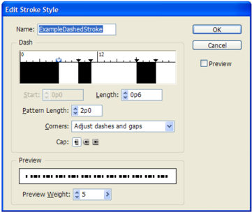

**Schema Example 105. Dotted  Stroke  Style**

```rnc
Dotted  Stroke Style_Object = element Dotted  Stroke  Style { attribute Self { xsd:string }, attribute Dot  Array { list { xsd:double * } }?, attribute Stroke  Corner Adjustment { Stroke  Corner Adjustment_Enum  Value }?, attribute Name { xsd:string } }
```

**Table 131**: Dotted  Stroke  Style Properties Represented as Attributes

| Name                       | Type                                           | Req     | Description |
| -------------------------- | ---------------------------------------------- | ------- | --------------------------------------------------------------------------------------------------------------------------------------------------------------------------------------------------------------------------------------------------------- |
| DotArray                   | list of doubles as a space separated string   | no      | The length of gaps between dots, in points (the diameter of the dots is determined by the stroke width). This pattern repeats along the path. The exact distance between the dots can be affected by the value of the StrokeCornerAdjustment attribute. |
| Name                       | string                                         | no      | The name of the dotted stroke style. |
| StrokeCorner Adjustment   | StrokeCorner Adjustment_Enum Value           | no      | The corner adjustment applied to the dotted stroke style. Can be None , Dashes , Gaps , or DashesAndGaps . For a description of these adjustments, refer to the InDesign online help. |

**IDML Example 75. Dotted  Stroke  Style**

```xml
<DottedStrokeStyle Self="Dotted  Stroke Style\c  Example Dotted  Stoke" Dot Array="5.554054054054054 6.445945945945946" Stroke  Corner  Adjustment="Gaps" Name="Example  Dotted  Stoke"/>
```

**Figure 54**: Dotted  Stroke  Style

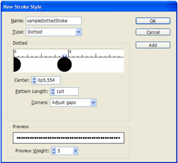

**Schema Example 106. Striped  Stroke  Style**

```rnc
Striped  Stroke Style_Object = element Striped  Stroke  Style { attribute Self { xsd:string }, attribute Stripe  Array { list { xsd:double * } }?, attribute Name { xsd:string } }
```

**Table 132**: Striped  Stroke  Style Properties Represented as Attributes

| Name          | Type                                           | Req     | Description |
| ------------- | ---------------------------------------------- | ------- | --------------------------------------------------------------------------------------------------------------------------------------------------------------------------------------------------------------------------------------------------------------------------------------- |
| Name          | string                                         | no      | The name of the striped stroke style. |
| StripeArray   | list of doubles as a space separated string   | no      | The width and position of stripes in a striped stroke pattern. Each stripe is specified by a start- end pair in the format start1, end1, start2, end2; each value indicates a percentage of the stroke weight. Each value must be greater than the pre- vious value. Range: 0 to 100. |

**IDML Example 76. Striped  Stroke  Style**

```xml
<StripedStrokeStyle Self="Striped  Stroke Style\c  Example Striped  Stroke" Stripe Array="25 75" Name="Example  Striped  Stroke"/>
```

**Figure 55**: Striped  Stroke  Style

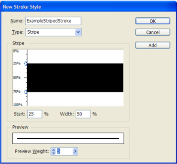
