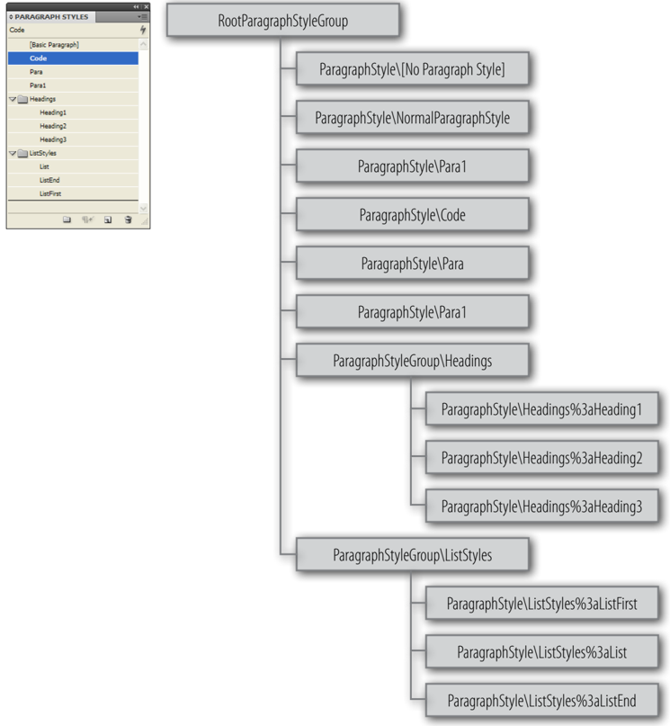
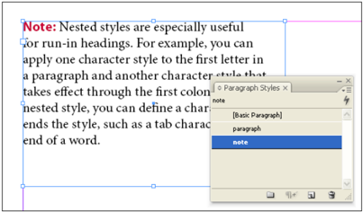
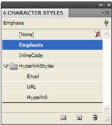
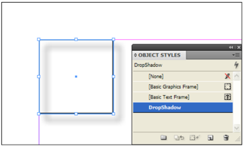
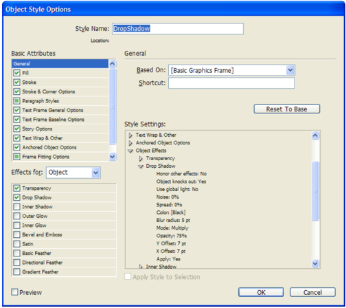
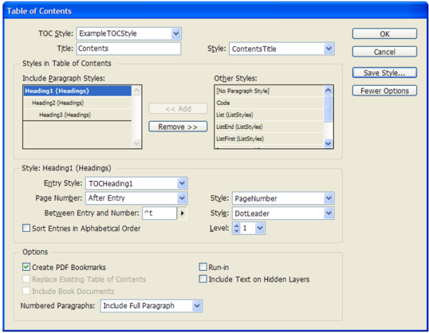

## 10.8 Styles

An In  Design document contains a number of style objects: notably paragraph styles, character styles, and object styles, but also including table styles, cell styles, and anchored object settings. In an IDML package, the Styles.xml file in the Resources folder contains the styles used in the document.

### 10.8.1 Style Paths and the Self Attribute

When you create a reference to a style in an IDML package, you specify the location of the style element using a path-like syntax. For example, when you want to refer to a paragraph style named 'Heading1' in the <RootParagraphStyle> element of a document, you use the value of its Self attribute:

`\ParagraphStyles\Heading1`

When a style appears within a style group other than the root style group, InDesign does not use a backslash as a path separator; instead, a colon is used. The colon apppears in the Name attribute of the style, but is encoded as `%3a` when it appears in the `Self` attribute, as shown in the example below:

```xml
<ParagraphStyle Self="ParagraphStyle\Headings%3aHeading1" Name="Headings:Heading1">
```

In the following example, a paragraph style group named 'TableHeadings' has been created inside the 'Headings' paragraph style group.

```xml
<ParagraphStyle Self="ParagraphStyle\Headings%3a  Table Headings%3a  Table Heading1" Name="Headings:TableHeadings:TableHeading1">
```

### 10.8.2 ParagraphStyles

A paragraph style includes both character and paragraph formatting attributes, and can be applied to a paragraph or range of paragraphs. Paragraph styles can define every formatting attribute that can be applied to a range of paragraphs, including character formatting. Paragraph styles in an In  Design document can be stored in paragraph styles groups for organizational purposes. In IDML, it is not necessary to define every formatting attribute of a paragraph style, but you should be aware that values that you do not include will be defined using the application's defaults.

Each IDML package document contains a <RootParagraphStyleGroup> element, which, in turn, contains all of the <ParagraphStyle> and <ParagraphStyleGroup> elements in the IDML package. A <ParagraphStyleGroup> element can contain other <ParagraphStyleGroup> elements. The following figure shows the relationship between the elements in an example InDesign document.

**Figure 56**: Example RootParagraphStyleGroup, ParagraphStyle, and ParagraphStyleGroup Elements (Self attribute values shown)



The <RootParagraphStyleGroup> and <ParagraphStyleGroup> elements have the same structure.

**Schema Example 150. ParagraphStyleGroup**

```rnc
ParagraphStyleGroup_Object = element ParagraphStyleGroup { attribute Self { xsd:string }, attribute Name { xsd:string }, element Properties { element Label { element KeyValuePair { KeyValuePair_TypeDef }* }? } ?, ( ParagraphStyle_Object*& ParagraphStyleGroup_Object* )}
```

In  Design documents always include two default paragraph styles, 'Normal Paragraph Style' and '[No Paragraph Style].' The former style can be edited by the user (it appears as 'Basic Paragraph Style' in the user interface); the latter contains default formatting and cannot be edited.

Many document designs feature hierarchies of styles sharing certain attributes. The headings and subheads, for example, often use the same font. You can easily create links between similar styles by creating a base, or parent, style. When you edit the parent style, the child styles will change as well. You can then edit the child styles to distinguish it from the parent style. The Based On attribute of a paragraph style refers to the parent style of a <ParagraphStyle> element.

The Next Style attribute only affects the user interface, and automatically applies styles as the user types text. If, for example, your document's design calls for the style 'body text' to follow a heading style named 'heading 1,' you can set the Next Style option for 'heading 1' to 'body text.' After you've typed a paragraph styled with 'heading 1,' pressing Enter or Return starts a new paragraph styled with 'body text.'

The following example shows an example <ParagraphStyleGroup> element inside the <RootParagraphStyleGroup> element. We have omitted the formatting specified in the individual <ParagraphStyle> elements for clarity.

**IDML Example 89. ParagraphStyleGroup**

```xml
<idPkg:Styles xmlns:idPkg="http://ns.adobe.com/AdobeInDesign/idml/1.0/packaging">
  <RootParagraphStyleGroup Self="u69">
    <ParagraphStyleGroup Self="ParagraphStyleGroup\Headings" Name="Headings">
      <ParagraphStyle Self="ParagraphStyle\Headings%3aHeading1" Name="Headings:Heading1">
      </ParagraphStyle>
      <ParagraphStyle Self="ParagraphStyle\Headings%3aHeading2" Name="Headings:Heading2">
      </ParagraphStyle>
      <ParagraphStyle Self="ParagraphStyle\Headings%3aHeading3" Name="Headings:Heading3">
      </ParagraphStyle>
    </ParagraphStyleGroup>
  </RootParagraphStyleGroup>
</idPkg:Styles>
```

**Schema Example 151. ParagraphStyle**

```rnc
ParagraphStyle_Object = element ParagraphStyle {
attribute Self { xsd:string },
attribute Name { xsd:string },
attribute Imported { xsd:boolean }?,
attribute NextStyle { xsd:string }?,
attribute FontStyle { xsd:string }?,
attribute PointSize { xsd:double }?,
attribute KerningMethod { xsd:string }?,
attribute Tracking { xsd:double }?,
attribute Capitalization { Capitalization_EnumValue }?,
attribute Position { Position_EnumValue }?,
attribute Underline { xsd:boolean }?,
attribute StrikeThru { xsd:boolean }?,
attribute Ligatures { xsd:boolean }?,
attribute NoBreak { xsd:boolean }?,
attribute HorizontalScale { xsd:double }?,
attribute VerticalScale { xsd:double }?,
attribute BaselineShift { xsd:double }?,
attribute Skew { xsd:double }?,
attribute FillTint { xsd:double }?,
attribute StrokeTint { xsd:double }?,
attribute StrokeWeight { xsd:double }?,
attribute OverprintStroke { xsd:boolean }?,
attribute OverprintFill { xsd:boolean }?,
attribute OTFFigureStyle { OTFFigureStyle_EnumValue }?,
attribute OTFOrdinal { xsd:boolean }?,
attribute OTFFraction { xsd:boolean }?,
attribute OTFDiscretionaryLigature { xsd:boolean }?,
attribute OTFTitling { xsd:boolean }?,
attribute OTFContextualAlternate { xsd:boolean }?,
attribute OTFSwash { xsd:boolean }?,
attribute UnderlineTint { xsd:double }?,
attribute UnderlineGapTint { xsd:double }?,
attribute UnderlineOverprint { xsd:boolean }?,
attribute UnderlineGapOverprint { xsd:boolean }?,
attribute UnderlineOffset { xsd:double }?,
attribute UnderlineWeight { xsd:double }?,
attribute StrikeThroughTint { xsd:double }?,
attribute StrikeThroughGapTint { xsd:double }?,
attribute StrikeThroughOverprint { xsd:boolean }?,
attribute StrikeThroughGapOverprint { xsd:boolean }?,
attribute StrikeThroughOffset { xsd:double }?,
attribute StrikeThroughWeight { xsd:double }?,
attribute FillColor { xsd:string }?,
attribute StrokeColor { xsd:string }?,
attribute AppliedLanguage { xsd:string }?,
attribute ParagraphKashidaWidth { xsd:double }?,
attribute FirstLineIndent { xsd:double }?,
attribute LeftIndent { xsd:double }?,
attribute RightIndent { xsd:double }?,
attribute SpaceBefore { xsd:double }?,
attribute SpaceAfter { xsd:double }?,
attribute Justification { Justification_EnumValue }?,
attribute SingleWordJustification { SingleWordJustification_EnumValue }?,
attribute AutoLeading { xsd:double }?,
attribute DropCapLines { xsd:short {minInclusive="0" maxInclusive="25"} }?,
attribute DropCapCharacters { xsd:short {minInclusive="0" maxInclusive="150"}
}?,
attribute KeepLinesTogether { xsd:boolean }?,
attribute KeepAllLinesTogether { xsd:boolean }?,
attribute KeepWithNext { xsd:short {minInclusive="0" maxInclusive="5"} }?,
attribute KeepFirstLines { xsd:short {minInclusive="1" maxInclusive="50"} }?,
attribute KeepLastLines { xsd:short {minInclusive="1" maxInclusive="50"} }?,
attribute StartParagraph { StartParagraph_EnumValue }?,
attribute Composer { xsd:string }?,
attribute MinimumWordSpacing { xsd:double }?,
attribute MaximumWordSpacing { xsd:double }?,
attribute DesiredWordSpacing { xsd:double }?,
attribute MinimumLetterSpacing { xsd:double }?,
attribute MaximumLetterSpacing { xsd:double }?,
attribute DesiredLetterSpacing { xsd:double }?,
attribute MinimumGlyphScaling { xsd:double }?,
attribute MaximumGlyphScaling { xsd:double }?,
attribute DesiredGlyphScaling { xsd:double }?,
attribute RuleAbove { xsd:boolean }?,
attribute RuleAboveOverprint { xsd:boolean }?,
attribute RuleAboveLineWeight { xsd:double }?,
attribute RuleAboveTint { xsd:double }?,
attribute RuleAboveOffset { xsd:double }?,
attribute RuleAboveLeftIndent { xsd:double }?,
attribute RuleAboveRightIndent { xsd:double }?,
attribute RuleAboveWidth { RuleWidth_EnumValue }?,
attribute RuleAboveGapTint { xsd:double }?,
attribute RuleAboveGapOverprint { xsd:boolean }?,
attribute RuleBelow { xsd:boolean }?,
attribute RuleBelowLineWeight { xsd:double }?,
attribute RuleBelowTint { xsd:double }?,
attribute RuleBelowOffset { xsd:double }?,
attribute RuleBelowLeftIndent { xsd:double }?,
attribute RuleBelowRightIndent { xsd:double }?,
attribute RuleBelowWidth { RuleWidth_EnumValue }?,
attribute RuleBelowGapTint { xsd:double }?,
attribute HyphenateCapitalizedWords { xsd:boolean }?,
attribute Hyphenation { xsd:boolean }?,
attribute HyphenateBeforeLast { xsd:short {minInclusive="1" maxInclusive="15"}
}?,
attribute HyphenateAfterFirst { xsd:short {minInclusive="1" maxInclusive="15"}
}?,
attribute HyphenateWordsLongerThan { xsd:short {minInclusive="3"
maxInclusive="25"} }?,
attribute HyphenateLadderLimit { xsd:short {minInclusive="0" maxInclusive="25"}
}?,
attribute HyphenationZone { xsd:double }?,
attribute HyphenWeight { xsd:short {minInclusive="0" maxInclusive="10"} }?,
attribute KeyboardShortcut { list { xsd:short ,xsd:short } }?,
attribute LastLineIndent { xsd:double }?,
attribute HyphenateLastWord { xsd:boolean }?,
attribute OTFSlashedZero { xsd:boolean }?,
attribute OTFHistorical { xsd:boolean }?,
attribute OTFStylisticSets { xsd:int }?,
attribute GradientFillLength { xsd:double }?,
attribute GradientFillAngle { xsd:double }?,
attribute GradientStrokeLength { xsd:double }?,
attribute GradientStrokeAngle { xsd:double }?,
attribute GradientFillStart { UnitPointType_TypeDef }?,
attribute GradientStrokeStart { UnitPointType_TypeDef }?,
attribute KeepWithPrevious { xsd:boolean }?,
attribute SpanColumnType { SpanColumnTypeOptions_EnumValue }?,
attribute SplitColumnInsideGutter { xsd:double }?,
attribute SplitColumnOutsideGutter { xsd:double }?,
attribute SpanColumnMinSpaceBefore { xsd:double }?,
attribute SpanColumnMinSpaceAfter { xsd:double }?,
attribute RuleBelowOverprint { xsd:boolean }?,
attribute RuleBelowGapOverprint { xsd:boolean }?,
attribute DropcapDetail { xsd:int }?,
attribute HyphenateAcrossColumns { xsd:boolean }?,
attribute KeepRuleAboveInFrame { xsd:boolean }?,
attribute IgnoreEdgeAlignment { xsd:boolean }?,
attribute OTFMark { xsd:boolean }?,
attribute OTFLocale { xsd:boolean }?,
attribute PositionalForm { PositionalForms_EnumValue }?,
attribute ParagraphDirection { ParagraphDirectionOptions_EnumValue }?,
attribute ParagraphJustification { ParagraphJustificationOptions_EnumValue }?,
attribute MiterLimit { xsd:double {minInclusive="0" maxInclusive="1000"} }?,
attribute StrokeAlignment { TextStrokeAlign_EnumValue }?,
attribute EndJoin { OutlineJoin_EnumValue }?,
attribute OTFOverlapSwash { xsd:boolean }?,
attribute OTFStylisticAlternate { xsd:boolean }?,
attribute OTFJustificationAlternate { xsd:boolean }?,
attribute OTFStretchedAlternate { xsd:boolean }?,
attribute CharacterDirection { CharacterDirectionOptions_EnumValue }?,
attribute KeyboardDirection { CharacterDirectionOptions_EnumValue }?,
attribute DigitsType { DigitsTypeOptions_EnumValue }?,
attribute Kashidas { KashidasOptions_EnumValue }?,
attribute DiacriticPosition { DiacriticPositionOptions_EnumValue }?,
attribute XOffsetDiacritic { xsd:double }?,
attribute YOffsetDiacritic { xsd:double }?,
attribute ParagraphBreakType { ParagraphBreakTypes_EnumValue }?,
attribute PageNumberType { PageNumberTypes_EnumValue }?,
attribute GridAlignFirstLineOnly { xsd:boolean }?,
attribute GridAlignment { GridAlignment_EnumValue }?,
attribute GridGyoudori { xsd:short }?,
attribute AutoTcy { xsd:short }?,
attribute AutoTcyIncludeRoman { xsd:boolean }?,
attribute KinsokuType { KinsokuType_EnumValue }?,
attribute KinsokuHangType { KinsokuHangTypes_EnumValue }?,
attribute BunriKinshi { xsd:boolean }?,
attribute Rensuuji { xsd:boolean }?,
attribute RotateSingleByteCharacters { xsd:boolean }?,
attribute LeadingModel { LeadingModel_EnumValue }?,
attribute CharacterAlignment { CharacterAlignment_EnumValue }?,
attribute Tsume { xsd:double }?,
attribute LeadingAki { xsd:double }?,
attribute TrailingAki { xsd:double }?,
attribute CharacterRotation { xsd:double }?,
attribute Jidori { xsd:short }?,
attribute ShataiMagnification { xsd:double }?,
attribute ShataiDegreeAngle { xsd:double }?,
attribute ShataiAdjustRotation { xsd:boolean }?,
attribute ShataiAdjustTsume { xsd:boolean }?,
attribute Tatechuyoko { xsd:boolean }?,
attribute TatechuyokoXOffset { xsd:double }?,
attribute TatechuyokoYOffset { xsd:double }?,
attribute KentenTint { xsd:double }?,
attribute KentenStrokeTint { xsd:double }?,
attribute KentenWeight { xsd:double }?,
attribute KentenOverprintFill { AdornmentOverprint_EnumValue }?,
attribute KentenOverprintStroke { AdornmentOverprint_EnumValue }?,
attribute KentenKind { KentenCharacter_EnumValue }?,
attribute KentenPlacement { xsd:double }?,
attribute KentenAlignment { KentenAlignment_EnumValue }?,
attribute KentenPosition { RubyKentenPosition_EnumValue }?,
attribute KentenFontSize { xsd:double }?,
attribute KentenXScale { xsd:double }?,
attribute KentenYScale { xsd:double }?,
attribute KentenCustomCharacter { xsd:string }?,
attribute KentenCharacterSet { KentenCharacterSet_EnumValue }?,
attribute RubyTint { xsd:double }?,
attribute RubyWeight { xsd:double }?,
attribute RubyOverprintFill { AdornmentOverprint_EnumValue }?,
attribute RubyOverprintStroke { AdornmentOverprint_EnumValue }?,
attribute RubyStrokeTint { xsd:double }?,
attribute RubyFontSize { xsd:double }?,
attribute RubyOpenTypePro { xsd:boolean }?,
attribute RubyXScale { xsd:double }?,
attribute RubyYScale { xsd:double }?,
attribute RubyType { RubyTypes_EnumValue }?,
attribute RubyAlignment { RubyAlignments_EnumValue }?,
attribute RubyPosition { RubyKentenPosition_EnumValue }?,
attribute RubyXOffset { xsd:double }?,
attribute RubyYOffset { xsd:double }?,
attribute RubyParentSpacing { RubyParentSpacing_EnumValue }?,
attribute RubyAutoAlign { xsd:boolean }?,
attribute RubyOverhang { xsd:boolean }?,
attribute RubyAutoScaling { xsd:boolean }?,
attribute RubyParentScalingPercent { xsd:double }?,
attribute RubyParentOverhangAmount { RubyOverhang_EnumValue }?,
attribute Warichu { xsd:boolean }?,
attribute WarichuSize { xsd:double }?,
attribute WarichuLines { xsd:short }?,
attribute WarichuLineSpacing { xsd:double }?,
attribute WarichuAlignment { WarichuAlignment_EnumValue }?,
attribute WarichuCharsAfterBreak { xsd:short }?,
attribute WarichuCharsBeforeBreak { xsd:short }?,
attribute OTFProportionalMetrics { xsd:boolean }?,
attribute OTFHVKana { xsd:boolean }?,
attribute OTFRomanItalics { xsd:boolean }?,
attribute ScaleAffectsLineHeight { xsd:boolean }?,
attribute CjkGridTracking { xsd:boolean }?,
attribute GlyphForm { AlternateGlyphForms_EnumValue }?,
attribute ParagraphGyoudori { xsd:boolean }?,
attribute RubyAutoTcyDigits { xsd:short }?,
attribute RubyAutoTcyIncludeRoman { xsd:boolean }?,
attribute RubyAutoTcyAutoScale { xsd:boolean }?,
attribute TreatIdeographicSpaceAsSpace { xsd:boolean }?,
attribute AllowArbitraryHyphenation { xsd:boolean }?,
attribute BulletsAndNumberingListType { ListType_EnumValue }?,
attribute NumberingExpression { xsd:string }?,
attribute BulletsTextAfter { xsd:string }?,
attribute NumberingLevel { xsd:int }?,
attribute NumberingContinue { xsd:boolean }?,
attribute NumberingStartAt { xsd:int }?,
attribute NumberingApplyRestartPolicy { xsd:boolean }?,
attribute BulletsAlignment { ListAlignment_EnumValue }?,
attribute NumberingAlignment { ListAlignment_EnumValue }?,
element Properties {
element BasedOn {
(object_type, xsd:string ) |
(string_type, xsd:string )
}?&
element AppliedFont {
(object_type, xsd:string ) |
(string_type, xsd:string )
}?&
element Leading {
(unit_type, xsd:double ) |
(enum_type, Leading_EnumValue )
}?&
element UnderlineColor {
(object_type, xsd:string ) |
(string_type, xsd:string )
}?&
element UnderlineGapColor {
(object_type, xsd:string ) |
(string_type, xsd:string )
}?&
element UnderlineType {
(object_type, xsd:string ) |
(string_type, xsd:string )
}?&
element StrikeThroughColor {
(object_type, xsd:string ) |
(string_type, xsd:string )
}?&
element StrikeThroughGapColor {
(object_type, xsd:string ) |
(string_type, xsd:string )
}?&
element StrikeThroughType {
(object_type, xsd:string ) |
(string_type, xsd:string )
}?&
element BalanceRaggedLines {
(bool_type, xsd:boolean ) |
(enum_type, BalanceLinesStyle_EnumValue )
}?&
element RuleAboveColor {
(object_type, xsd:string ) |
(string_type, xsd:string )
}?&
element RuleAboveGapColor {
(object_type, xsd:string ) |
(string_type, xsd:string )
}?&
element RuleAboveType {
(object_type, xsd:string ) |
(string_type, xsd:string )
}?&
element RuleBelowColor {
(object_type, xsd:string ) |
(string_type, xsd:string )
}?&
element RuleBelowGapColor {
(object_type, xsd:string ) |
(string_type, xsd:string )
}?&
element RuleBelowType {
(object_type, xsd:string ) |
(string_type, xsd:string )
}?&
element SpanSplitColumnCount {
(short_type, xsd:short {minInclusive="1" maxInclusive="40"} ) |
(enum_type, SpanColumnCountOptions_EnumValue )
}?&
element PreviewColor {
(InDesignUIColorType_TypeDef ) |
(enum_type, NothingEnum_EnumValue )
}?&
element AllLineStyles { list_type, element ListItem {
record_type,
(
element AppliedCharacterStyle { object_type, xsd:string }&
element LineCount { long_type, xsd:int }&
element RepeatLast { long_type, xsd:int })
}*
}?&
element AllGREPStyles { list_type, element ListItem {
record_type,
(
element AppliedCharacterStyle { object_type, xsd:string }&
element GrepExpression { string_type, xsd:string })
}*
}?&
element AllNestedStyles { list_type, element ListItem {
record_type,
(
element AppliedCharacterStyle { object_type, xsd:string }&
element Delimiter {
(string_type, xsd:string ) |
(enum_type, NestedStyleDelimiters_EnumValue )
}&
element Repetition { long_type, xsd:int }&
element Inclusive { bool_type, xsd:boolean })
}*
}?&
element TabList { list_type, element ListItem {
record_type,
(
element Alignment { enum_type, TabStopAlignment_EnumValue }&
element AlignmentCharacter { string_type, xsd:string }&
element Leader { string_type, xsd:string }&
element Position { unit_type, xsd:double })
}*
}?&
element KinsokuSet {
(object_type, xsd:string ) |
(enum_type, KinsokuSet_EnumValue ) |
(string_type, xsd:string )
}?&
element Mojikumi {
(object_type, xsd:string ) |
(string_type, xsd:string ) |
(enum_type, MojikumiTableDefaults_EnumValue )
}?&
element KentenFillColor {
(object_type, xsd:string ) |
(string_type, xsd:string )
}?&
element KentenStrokeColor {
(object_type, xsd:string ) |
(string_type, xsd:string )
}?&
element KentenFont {
(object_type, xsd:string ) |
(string_type, xsd:string )
}?&
element KentenFontStyle {
(string_type, xsd:string ) |
(enum_type, NothingEnum_EnumValue )
}?&
element RubyFill {
(object_type, xsd:string ) |
(string_type, xsd:string )
}?&
element RubyStroke {
(object_type, xsd:string ) |
(string_type, xsd:string )
}?&
element RubyFont {
(object_type, xsd:string ) |
(string_type, xsd:string )
}?&
element RubyFontStyle {
(string_type, xsd:string ) |
(enum_type, NothingEnum_EnumValue )
}?&
element BulletChar {
attribute BulletCharacterType { BulletCharacterType_EnumValue },
attribute BulletCharacterValue { xsd:int }
}?&
element BulletsFont {
(object_type, xsd:string ) |
(string_type, xsd:string ) |
(enum_type, AutoEnum_EnumValue )
}?&
element BulletsFontStyle {
(string_type, xsd:string ) |
(enum_type, NothingEnum_EnumValue ) |
(enum_type, AutoEnum_EnumValue )
}?&
element BulletsCharacterStyle {
(object_type, xsd:string ) |
(string_type, xsd:string )
}?&
element NumberingCharacterStyle {
(object_type, xsd:string ) |
(string_type, xsd:string )
}?&
element AppliedNumberingList {
(object_type, xsd:string ) |
(string_type, xsd:string )
}?&
element NumberingFormat {
(enum_type, NumberingStyle_EnumValue ) |
(string_type, xsd:string )
}?&
element NumberingRestartPolicies {
attribute RestartPolicy { RestartPolicy_EnumValue },
attribute LowerLevel { xsd:int },
attribute UpperLevel { xsd:int }
}?&
element Label { element KeyValuePair { KeyValuePair_TypeDef }*
}?
}
?
}
```

Most of the attributes and elements of a <ParagraphStyle> element are shared with all other text elements. Refer to 'Common Text Properties.' The following tables describe the attributes and elements of a <ParagraphStyle> element that are not shared with all text objects.

Table 172. Paragraph Style Properties Represented as Attributes

| Name               | Type      | Req     | Description |
| ------------------ | --------- | ------- | ------------------------------------------------------------------------------------------------------------------------------------------------------------------------------------------------------------------------------------------------------------------------------------------------------------- |
| Imported           | Boolean   | no      | If true, the paragraph style was imported from another file. |
| KeyboardShortcut   | string    | no      | The keyboard shortcut for the style. |
| NextStyle          | string    | no      | Areference to the next paragraph style for the paragraph style, as a unique ID (as the value of the Self attribute of the <ParagraphStyle> element). The next paragraph style determines the style that is applied to the next paragraph when you enter a return at the end of a para- graph of this style. |

Table 173. Paragraph Style Properties Represented as Elements

| Name      | Type     | Req     | Description |
| --------- | -------- | ------- | -------------------------------------------------------------------------------------------------------------------------------------------------------------------------------------------------------------------------------------------------------------------------------------------- |
| BasedOn   | string   | no      | Areference to the paragraph style that this para- graph style is based on, as a unique ID (the value of the Self attribute of the <ParagraphStyle> element), or as a reference to the default '[No paragraph style]' element, in the form: $ID/[No paragraph style] . This is the default. |

**IDML Example 90. BasedOn '[No paragraph style]'**

```xml
<ParagraphStyle Self="ParagraphStyle\Code" Name="Code" Imported="false" NextStyle="ParagraphStyle\Code"> <Properties> <BasedOn type="string">$ID/[No paragraph style]</BasedOn> </Properties> </ParagraphStyle> 
```

**IDML Example 91. BasedOn Another Style** 

```xml
<ParagraphStyle Self="ParagraphStyle\ListStyles%3aList First" Name="ListFirst" Imported="false" NextStyle="ParagraphStyle\ListStyles%3aList"> <Properties> <BasedOn type="object">ParagraphStyle\ListStyles%3aList</BasedOn> </Properties>
</ParagraphStyle>
```

### 10.8.3 Nested Styles

Nested styles are a feature of In  Design's paragraph formatting, and can be applied as local formatting or as part of a paragraph style. Using nested styles, you can specify character-level formatting for one or more ranges of text within a paragraph. Nested styles have two parts: a delimiter that sets the end of the text range affected, and a CharacterStyle to apply to the range of text defined by the delimiter.

Nested styles are especially useful for run-in headings. For example, you can apply one CharacterStyle to the first letter in a paragraph and another CharacterStyle that takes effect through the first colon (:). For each nested style, you can define a character that ends the style, such as a tab character or the end of a word.

The nested style schema is included in a number of text objects (most notably the <ParagraphStyle> and <ParagraphStyleRange> elements).

**Schema Example 152. NestedStyle**

```rnc
element AllNestedStyles { list_type, element ListItem { record_type, ( element AppliedCharacterStyle { object_type, xsd:string }& element Delimiter { (string_type, xsd:string ) | (enum_type, NestedStyleDelimiters_EnumValue ) }& element Repetition { long_type, xsd:int }& element Inclusive { bool_type, xsd:boolean })}* }
```

Table 174. NestedStyle Properties Represented as Elements

| Name                      | Type                                           | Req     | Description |
| ------------------------- | ---------------------------------------------- | ------- | --------------------------------------------------------------------------------------------------------------- |
| AppliedCharacterStyle   | string                                         | yes     | The CharacterStyle applied to the nested style, as a reference to the Self attribute of the CharacterStyle. |
| Delimiter                 | string or Nested StyleDelimiters_ EnumValue   | yes     | The delimiter character for the nested style. |
| Repetition                | int                                            | yes     | The number of instances of the delimiter required to complete the nested style. |
| Inclusive                 | boolean                                        | yes     | If true, the formatting of the nested style is applied to the delimiter character. |

The following example shows how a CharacterStyle and a paragraph style can work together to format text using a nested style.

**IDML Example 92. NestedStyle**

```xml
<CharacterStyle Self="CharacterStyle/Note" Name="Note" FillColor="Color/C=15 M=100 Y=100 K=0" FontStyle="Bold"> <Properties> <BasedOn type="string">$ID/[No CharacterStyle]</BasedOn> <PreviewColor type="enumeration">Nothing</PreviewColor> <AppliedFont type="string">Myriad Pro</AppliedFont> </Properties> </CharacterStyle> <ParagraphStyle Self="ParagraphStyle/note" Name="note" NextStyle="ParagraphStyle/paragraph"> <Properties> <BasedOn type="object">ParagraphStyle/paragraph</BasedOn> <PreviewColor type="enumeration">Nothing</PreviewColor> <AllNestedStyles type="list"> <ListItem type="record"> <AppliedCharacterStyle type="object">CharacterStyle/Note </AppliedCharacterStyle> <Delimiter type="string">:</Delimiter> <Repetition type="long">1</Repetition> <Inclusive type="boolean">true</Inclusive> </ListItem> </AllNestedStyles> </Properties> </ParagraphStyle>
```

### 10.8.4 Character Styles

A CharacterStyle is a collection of character formatting attributes that can be applied to text in a single step. Unlike paragraph styles, character styles do not necessarily define every formatting attribute that can be applied to a range of text. Instead, character styles typically contain only formatting which differs from that of the surrounding text.

Character styles in IDML are represented the same way as paragraph styles: each document contains a <RootCharacterStyleGroup> element, which, in turn, contains all of the <CharacterStyle> and <CharacterStyleGroup> elements used in the document described by the IDML package. The <RootCharacterStyleGroup> and <CharacterStyleGroup> elements have the same structure.

**Schema Example 153. CharacterStyleGroup**

```rnc
CharacterStyleGroup_Object = element CharacterStyleGroup { attribute Self { xsd:string }, attribute Name { xsd:string }, element Properties { }? } ?, ( CharacterStyle_Object*& CharacterStyleGroup_Object* ) element Label { element KeyValuePair { KeyValuePair_TypeDef }* } 
```

**Figure 57**: Nested Style



**IDML Example 93. CharacterStyleGroup** 

```xml
<RootCharacterStyleGroup Self="u6a"> <CharacterStyle Self="CharacterStyle\[No CharacterStyle]" Imported="false" Name="$ID/[No CharacterStyle]"/> <CharacterStyle Self="CharacterStyle\Emphasis" Imported="false" Name="Emphasis" FontStyle="Italic"> <Properties> <BasedOn type="string">$ID/[No CharacterStyle]</BasedOn> </Properties> </CharacterStyle> <CharacterStyle Self="CharacterStyle\cInlineCode" Imported="false"
Name="InlineCode" FontStyle="Regular"> <Properties> <BasedOn type="string">$ID/[No CharacterStyle]</BasedOn> <AppliedFont type="string">Droid Sans Mono</AppliedFont> </Properties> </CharacterStyle> <CharacterStyleGroup Self="CharacterStyleGroup\HyperlinkStyles" Name="$ID/HyperlinkStyles"> <CharacterStyle Self="CharacterStyle\HyperlinkStyles%3aEmail" Imported="false" Name="HyperlinkStyles:Email"> <Properties> <BasedOn type="object">CharacterStyle\HyperlinkStyles\Hyperlink</BasedOn> </Properties> </CharacterStyle> <CharacterStyle Self="CharacterStyle\HyperlinkStyles\URL" Imported="false" Name="HyperlinkStyles:URL"> <Properties> <BasedOn type="object">CharacterStyle\HyperlinkStyles\Hyperlink</BasedOn> </Properties> </CharacterStyle> <CharacterStyle Self="CharacterStyle\HyperlinkStyles\Hyperlink" Imported="false" Name="HyperlinkStyles:Hyperlink"> <Properties> <BasedOn type="string">$ID/[No CharacterStyle]</BasedOn> </Properties> </CharacterStyle> </CharacterStyleGroup> </RootCharacterStyleGroup>
```

**Figure 58**: Character Styles



**Schema Example 154. CharacterStyle**

```rnc
CharacterStyle_Object = element CharacterStyle {
attribute Self { xsd:string },
attribute Imported { xsd:boolean }?,
attribute FontStyle { xsd:string }?,
attribute PointSize { xsd:double }?,
attribute KerningMethod { xsd:string }?,
attribute Tracking { xsd:double }?,
attribute Capitalization { Capitalization_EnumValue }?,
attribute Position { Position_EnumValue }?,
attribute Underline { xsd:boolean }?,
attribute StrikeThru { xsd:boolean }?,
attribute Ligatures { xsd:boolean }?,
attribute NoBreak { xsd:boolean }?,
attribute HorizontalScale { xsd:double }?,
attribute VerticalScale { xsd:double }?,
attribute BaselineShift { xsd:double }?,
attribute Skew { xsd:double }?,
attribute FillTint { xsd:double }?,
attribute StrokeTint { xsd:double }?,
attribute StrokeWeight { xsd:double }?,
attribute OverprintStroke { xsd:boolean }?,
attribute OverprintFill { xsd:boolean }?,
attribute OTFFigureStyle { OTFFigureStyle_EnumValue }?,
attribute OTFOrdinal { xsd:boolean }?,
attribute OTFFraction { xsd:boolean }?,
attribute OTFDiscretionaryLigature { xsd:boolean }?,
attribute OTFTitling { xsd:boolean }?,
attribute OTFContextualAlternate { xsd:boolean }?,
attribute OTFSwash { xsd:boolean }?,
attribute UnderlineTint { xsd:double }?,
attribute UnderlineGapTint { xsd:double }?,
attribute UnderlineOverprint { xsd:boolean }?,
attribute UnderlineGapOverprint { xsd:boolean }?,
attribute UnderlineOffset { xsd:double }?,
attribute UnderlineWeight { xsd:double }?,
attribute StrikeThroughTint { xsd:double }?,
attribute StrikeThroughGapTint { xsd:double }?,
attribute StrikeThroughOverprint { xsd:boolean }?,
attribute StrikeThroughGapOverprint { xsd:boolean }?,
attribute StrikeThroughOffset { xsd:double }?,
attribute StrikeThroughWeight { xsd:double }?,
attribute FillColor { xsd:string }?,
attribute StrokeColor { xsd:string }?,
attribute AppliedLanguage { xsd:string }?,
attribute KeyboardShortcut { list { xsd:short ,xsd:short } }?,
attribute OTFSlashedZero { xsd:boolean }?,
attribute OTFHistorical { xsd:boolean }?,
attribute OTFStylisticSets { xsd:int }?,
attribute GradientFillLength { xsd:double }?,
attribute GradientFillAngle { xsd:double }?,
attribute GradientStrokeLength { xsd:double }?,
attribute GradientStrokeAngle { xsd:double }?,
attribute GradientFillStart { UnitPointType_TypeDef }?,
attribute GradientStrokeStart { UnitPointType_TypeDef }?,
attribute OTFMark { xsd:boolean }?,
attribute OTFLocale { xsd:boolean }?,
attribute PositionalForm { PositionalForms_EnumValue }?,
attribute KerningValue { xsd:double }?,
attribute Name { xsd:string },
attribute MiterLimit { xsd:double {minInclusive="0" maxInclusive="1000"} }?,
attribute StrokeAlignment { TextStrokeAlign_EnumValue }?,
attribute EndJoin { OutlineJoin_EnumValue }?,
attribute OTFOverlapSwash { xsd:boolean }?,
attribute OTFStylisticAlternate { xsd:boolean }?,
attribute OTFJustificationAlternate { xsd:boolean }?,
attribute OTFStretchedAlternate { xsd:boolean }?,
attribute CharacterDirection { CharacterDirectionOptions_EnumValue }?,
attribute KeyboardDirection { CharacterDirectionOptions_EnumValue }?,
attribute DigitsType { DigitsTypeOptions_EnumValue }?,
attribute Kashidas { KashidasOptions_EnumValue }?,
attribute DiacriticPosition { DiacriticPositionOptions_EnumValue }?,
attribute XOffsetDiacritic { xsd:double }?,
attribute YOffsetDiacritic { xsd:double }?,
attribute ParagraphBreakType { ParagraphBreakTypes_EnumValue }?,
attribute PageNumberType { PageNumberTypes_EnumValue }?,
attribute CharacterAlignment { CharacterAlignment_EnumValue }?,
attribute Tsume { xsd:double }?,
attribute LeadingAki { xsd:double }?,
attribute TrailingAki { xsd:double }?,
attribute CharacterRotation { xsd:double }?,
attribute Jidori { xsd:short }?,
attribute ShataiMagnification { xsd:double }?,
attribute ShataiDegreeAngle { xsd:double }?,
attribute ShataiAdjustRotation { xsd:boolean }?,
attribute ShataiAdjustTsume { xsd:boolean }?,
attribute Tatechuyoko { xsd:boolean }?,
attribute TatechuyokoXOffset { xsd:double }?,
attribute TatechuyokoYOffset { xsd:double }?,
attribute KentenTint { xsd:double }?,
attribute KentenStrokeTint { xsd:double }?,
attribute KentenWeight { xsd:double }?,
attribute KentenOverprintFill { AdornmentOverprint_EnumValue }?,
attribute KentenOverprintStroke { AdornmentOverprint_EnumValue }?,
attribute KentenKind { KentenCharacter_EnumValue }?,
attribute KentenPlacement { xsd:double }?,
attribute KentenAlignment { KentenAlignment_EnumValue }?,
attribute KentenPosition { RubyKentenPosition_EnumValue }?,
attribute KentenFontSize { xsd:double }?,
attribute KentenXScale { xsd:double }?,
attribute KentenYScale { xsd:double }?,
attribute KentenCustomCharacter { xsd:string }?,
attribute KentenCharacterSet { KentenCharacterSet_EnumValue }?,
attribute RubyTint { xsd:double }?,
attribute RubyWeight { xsd:double }?,
attribute RubyOverprintFill { AdornmentOverprint_EnumValue }?,
attribute RubyOverprintStroke { AdornmentOverprint_EnumValue }?,
attribute RubyStrokeTint { xsd:double }?,
attribute RubyFontSize { xsd:double }?,
attribute RubyOpenTypePro { xsd:boolean }?,
attribute RubyXScale { xsd:double }?,
attribute RubyYScale { xsd:double }?,
attribute RubyType { RubyTypes_EnumValue }?,
attribute RubyAlignment { RubyAlignments_EnumValue }?,
attribute RubyPosition { RubyKentenPosition_EnumValue }?,
attribute RubyXOffset { xsd:double }?,
attribute RubyYOffset { xsd:double }?,
attribute RubyParentSpacing { RubyParentSpacing_EnumValue }?,
attribute RubyAutoAlign { xsd:boolean }?,
attribute RubyOverhang { xsd:boolean }?,
attribute RubyAutoScaling { xsd:boolean }?,
attribute RubyParentScalingPercent { xsd:double }?,
attribute RubyParentOverhangAmount { RubyOverhang_EnumValue }?,
attribute Warichu { xsd:boolean }?,
attribute WarichuSize { xsd:double }?,
attribute WarichuLines { xsd:short }?,
attribute WarichuLineSpacing { xsd:double }?,
attribute WarichuAlignment { WarichuAlignment_EnumValue }?,
attribute WarichuCharsAfterBreak { xsd:short }?,
attribute WarichuCharsBeforeBreak { xsd:short }?,
attribute OTFProportionalMetrics { xsd:boolean }?,
attribute OTFHVKana { xsd:boolean }?,
attribute OTFRomanItalics { xsd:boolean }?,
attribute ScaleAffectsLineHeight { xsd:boolean }?,
attribute CjkGridTracking { xsd:boolean }?,
attribute GlyphForm { AlternateGlyphForms_EnumValue }?,
attribute RubyAutoTcyDigits { xsd:short }?,
attribute RubyAutoTcyIncludeRoman { xsd:boolean }?,
attribute RubyAutoTcyAutoScale { xsd:boolean }?,
element Properties {
element BasedOn {
(object_type, xsd:string ) |
(string_type, xsd:string )
}?&
element AppliedFont {
(object_type, xsd:string ) |
(string_type, xsd:string )
}?&
element Leading {
(unit_type, xsd:double ) |
(enum_type, Leading_EnumValue )
}?&
element UnderlineColor {
(object_type, xsd:string ) |
(string_type, xsd:string )
}?&
element UnderlineGapColor {
(object_type, xsd:string ) |
(string_type, xsd:string )
}?&
element UnderlineType {
(object_type, xsd:string ) |
(string_type, xsd:string )
}?&
element StrikeThroughColor {
(object_type, xsd:string ) |
(string_type, xsd:string )
}?&
element StrikeThroughGapColor {
(object_type, xsd:string ) |
(string_type, xsd:string )
}?&
element StrikeThroughType {
(object_type, xsd:string ) |
(string_type, xsd:string )
}?&
element PreviewColor {
(InDesignUIColorType_TypeDef ) |
(enum_type, NothingEnum_EnumValue )
}?&
element KentenFillColor {
(object_type, xsd:string ) |
(string_type, xsd:string )
}?&
element KentenStrokeColor {
(object_type, xsd:string ) |
(string_type, xsd:string )
}?&
element KentenFont {
(object_type, xsd:string ) |
(string_type, xsd:string )
}?&
element KentenFontStyle {
(string_type, xsd:string ) |
(enum_type, NothingEnum_EnumValue )
}?&
element RubyFill {
(object_type, xsd:string ) |
(string_type, xsd:string )
}?&
element RubyStroke {
(object_type, xsd:string ) |
(string_type, xsd:string )
}?&
element RubyFont {
(object_type, xsd:string ) |
(string_type, xsd:string )
}?&
element RubyFontStyle {
(string_type, xsd:string ) |
(enum_type, NothingEnum_EnumValue )
}?&
element Label { element KeyValuePair { KeyValuePair_TypeDef }*
}?
}
?
,
(
StyleExportTagMap_Object*
)}
```

Most of the attributes and elements of a <CharacterStyle> element are shared with all other text elements. Refer to 'Common Text Properties.' The following tables describe the attributes and elements of a <CharacterStyle> element that are not shared with all text objects.

**Table 175**: CharacterStyle Properties Represented as Attributes

| Name       | Type      | Req     | Description |
| ---------- | --------- | ------- | -------------------------------------------------------------- |
| Imported   | Boolean   | no      | If true, the paragraph style was imported from another file. |

| KeyboardShortcut     | string     | no     | The keyboard shortcut for the style. |
| -------------------- | ---------- | ------ | ---------------------------------------- |
| Name                 | string     | yes    | The name of the CharacterStyle. |

**Table 176**: CharacterStyle Properties Represented as Elements

| Name      | Type     | Req     | Description |
| --------- | -------- | ------- | -------------------------------------------------------------------------------------------------------------------------------------------------------------------------------------------------------------------------------------------------------------------------------------------- |
| BasedOn   | string   | no      | Areference to the CharacterStyle that this char- acter style is based on, as a unique ID (the value of the Self attribute of the <CharacterStyle> element), or as a reference to the default '[No CharacterStyle]' element, in the form: $ID/[No CharacterStyle] . This is the default. |

#### StyleExportTagMap

The <StyleExportTagMap> element maps an export type to an export tag.

**Schema Example 155. StyleExportTagMap**

```rnc
StyleExportTagMap_Object = element StyleExportTagMap { attribute Self { xsd:string }, attribute ExportType { xsd:string }, attribute ExportTag { xsd:string }, attribute ExportClass { xsd:string }, attribute ExportAttributes { xsd:string } }
```

**Table 177**: StyleExportTagMap Properties Represented as Attributes

| Name               | Type     | Req     | Description |
| ------------------ | -------- | ------- | ------------------------ |
| ExportType         | string   | yes     | The type of export. |
| ExportTag          | string   | yes     | The tag to map. |
| ExportClass        | string   | yes     | The class to map. |
| ExportAttributes   | string   | yes     | The attributes to map. |

### 10.8.5 TableStyles

A table style is a collection of table formatting attributes, such as table borders and row and column strokes, that can be applied in a single step. Table styles can be organized into table style groups. In an IDML package, <TableStyle> elements are saved inside <TableStyleGroup> elements. All <TableStyle> and <TableStyleGroup> elements exist with the <RootTableStyleGroup> element. <TableStyleGroup> elements can contain both <TableStyle> elements and <TableStyleGroup> elements.

**Schema Example 156. TableStyleGroup**

```rnc
TableStyleGroup_Object = element TableStyleGroup { attribute Self { xsd:string }, attribute Name { xsd:string }, element Properties { element Label { element KeyValuePair { KeyValuePair_TypeDef }*
}? } ?, ( TableStyle_Object*& TableStyleGroup_Object* ) } 
```

**Schema Example 157. TableStyle** 

```rnc
TableStyle_Object = element TableStyle { attribute Self { xsd:string }, attribute Name { xsd:string }, attribute StrokeOrder { StrokeOrderTypes_EnumValue }?, attribute TopBorderStrokeWeight { xsd:double }?, attribute TopBorderStrokeType { xsd:string }?, attribute TopBorderStrokeColor { xsd:string }?, attribute TopBorderStrokeTint { xsd:double }?, attribute TopBorderStrokeOverprint { xsd:boolean }?, attribute TopBorderStrokeGapColor { xsd:string }?, attribute TopBorderStrokeGapTint { xsd:double }?, attribute TopBorderStrokeGapOverprint { xsd:boolean }?, attribute LeftBorderStrokeWeight { xsd:double }?, attribute LeftBorderStrokeType { xsd:string }?, attribute LeftBorderStrokeColor { xsd:string }?, attribute LeftBorderStrokeTint { xsd:double }?, attribute LeftBorderStrokeOverprint { xsd:boolean }?, attribute LeftBorderStrokeGapColor { xsd:string }?, attribute LeftBorderStrokeGapTint { xsd:double }?, attribute LeftBorderStrokeGapOverprint { xsd:boolean }?, attribute BottomBorderStrokeWeight { xsd:double }?, attribute BottomBorderStrokeType { xsd:string }?, attribute BottomBorderStrokeColor { xsd:string }?, attribute BottomBorderStrokeTint { xsd:double }?, attribute BottomBorderStrokeOverprint { xsd:boolean }?, attribute BottomBorderStrokeGapColor { xsd:string }?, attribute BottomBorderStrokeGapTint { xsd:double }?, attribute BottomBorderStrokeGapOverprint { xsd:boolean }?, attribute RightBorderStrokeWeight { xsd:double }?, attribute RightBorderStrokeType { xsd:string }?, attribute RightBorderStrokeColor { xsd:string }?, attribute RightBorderStrokeTint { xsd:double }?, attribute RightBorderStrokeOverprint { xsd:boolean }?, attribute RightBorderStrokeGapColor { xsd:string }?, attribute RightBorderStrokeGapTint { xsd:double }?, attribute RightBorderStrokeGapOverprint { xsd:boolean }?, attribute SpaceBefore { xsd:double }?, attribute SpaceAfter { xsd:double }?, attribute SkipFirstAlternatingStrokeRows { xsd:int }?, attribute SkipLastAlternatingStrokeRows { xsd:int }?, attribute StartRowStrokeCount { xsd:int }?, attribute StartRowStrokeColor { xsd:string }?, attribute StartRowStrokeWeight { xsd:double }?,
attribute StartRowStrokeType { xsd:string }?, attribute StartRowStrokeTint { xsd:double }?, attribute StartRowStrokeGapOverprint { xsd:boolean }?, attribute StartRowStrokeGapColor { xsd:string }?, attribute StartRowStrokeGapTint { xsd:double }?, attribute StartRowStrokeOverprint { xsd:boolean }?, attribute EndRowStrokeCount { xsd:int }?, attribute EndRowStrokeColor { xsd:string }?, attribute EndRowStrokeWeight { xsd:double }?, attribute EndRowStrokeType { xsd:string }?, attribute EndRowStrokeTint { xsd:double }?, attribute EndRowStrokeOverprint { xsd:boolean }?, attribute EndRowStrokeGapColor { xsd:string }?, attribute EndRowStrokeGapTint { xsd:double }?, attribute EndRowStrokeGapOverprint { xsd:boolean }?, attribute SkipFirstAlternatingStrokeColumns { xsd:int }?, attribute SkipLastAlternatingStrokeColumns { xsd:int }?, attribute StartColumnStrokeCount { xsd:int }?, attribute StartColumnStrokeColor { xsd:string }?, attribute StartColumnStrokeWeight { xsd:double }?, attribute StartColumnStrokeType { xsd:string }?, attribute StartColumnStrokeTint { xsd:double }?, attribute StartColumnStrokeOverprint { xsd:boolean }?, attribute StartColumnStrokeGapColor { xsd:string }?, attribute StartColumnStrokeGapTint { xsd:double }?, attribute StartColumnStrokeGapOverprint { xsd:boolean }?, attribute EndColumnStrokeCount { xsd:int }?, attribute EndColumnStrokeColor { xsd:string }?, attribute EndColumnStrokeWeight { xsd:double }?, attribute EndColumnLineStyle { xsd:string }?, attribute EndColumnStrokeTint { xsd:double }?, attribute EndColumnStrokeOverprint { xsd:boolean }?, attribute EndColumnStrokeGapColor { xsd:string }?, attribute EndColumnStrokeGapTint { xsd:double }?, attribute EndColumnStrokeGapOverprint { xsd:boolean }?, attribute ColumnFillsPriority { xsd:boolean }?, attribute SkipFirstAlternatingFillRows { xsd:int }?, attribute SkipLastAlternatingFillRows { xsd:int }?, attribute StartRowFillColor { xsd:string }?, attribute StartRowFillCount { xsd:int }?, attribute StartRowFillTint { xsd:double }?, attribute StartRowFillOverprint { xsd:boolean }?, attribute EndRowFillCount { xsd:int }?, attribute EndRowFillColor { xsd:string }?, attribute EndRowFillTint { xsd:double }?, attribute EndRowFillOverprint { xsd:boolean }?, attribute SkipFirstAlternatingFillColumns { xsd:int }?, attribute SkipLastAlternatingFillColumns { xsd:int }?, attribute StartColumnFillCount { xsd:int }?, attribute StartColumnFillColor { xsd:string }?, attribute StartColumnFillTint { xsd:double }?, attribute StartColumnFillOverprint { xsd:boolean }?, attribute EndColumnFillCount { xsd:int }?, attribute EndColumnFillColor { xsd:string }?,
attribute EndColumnFillTint { xsd:double }?, attribute EndColumnFillOverprint { xsd:boolean }?, attribute HeaderRegionSameAsBodyRegion { xsd:boolean }?, attribute FooterRegionSameAsBodyRegion { xsd:boolean }?, attribute LeftColumnRegionSameAsBodyRegion { xsd:boolean }?, attribute RightColumnRegionSameAsBodyRegion { xsd:boolean }?, attribute HeaderRegionCellStyle { xsd:string }?, attribute FooterRegionCellStyle { xsd:string }?, attribute LeftColumnRegionCellStyle { xsd:string }?, attribute RightColumnRegionCellStyle { xsd:string }?, attribute BodyRegionCellStyle { xsd:string }?, attribute KeyboardShortcut { list { xsd:short,xsd:short } }?, element Properties { element BasedOn { (object_type, xsd:string ) | (string_type, xsd:string ) }?& element Label { element KeyValuePair { KeyValuePair_TypeDef }* }? } ? }
```

**Table 178**: TableStyle Properties Represented as Attributes

| Name                                 | Type      | Req     | Description |
| ------------------------------------ | --------- | ------- | -------------------------------------------------------------------------------------------------------------------------------------------------------------------------- |
| BodyRegionCellStyle                | string    | no      | The cell style of the body (i.e., not header or footer) region. |
| BottomBorderStrokeColor            | string    | no      | The color, specified as a swatch (color, gradient, tint, or mixed ink), of the bottom border stroke. |
| BottomBorderStrokeGapColor         | string    | no      | The gap color, specified as a swatch (color, gradi- ent, tint, or mixed ink), of the bottom border stroke. Note: Valid only when bottom border stroke type is not solid. |
| BottomBorderStrokeGapOverprint   | boolean   | no      | If true, the gap of the bottom border stroke will overprint. Note: Valid only when bottom border stroke type is not solid. |
| BottomBorderStrokeGapTint          | double    | no      | The tint (as a percentage) of the gap color of the bottom border stroke. (Range: 0 to 100) Note: Valid only when bottom border stroke type is not solid. |
| BottomBorderStrokeOverprint        | boolean   | no      | If true, the bottom border stroke will overprint. |
| BottomBorderStrokeTint             | double    | no      | The tint (as a percentage) of the bottom border stroke. (Range: 0 to 100) |
| BottomBorderStrokeType             | string    | no      | The stroke type of the bottom border. |
| BottomBorderStrokeWeight           | double    | no      | The stroke weight of the bottom border stroke. |
| ColumnFills Priority           | boolean   | no      | If true, hides alternating row fills. If false, hides alternating column fills. |
| EndColumnFill Color            | string    | no      | The FillColor, specified as a swatch (color, gra- dient, tint, or mixed ink), of columns in the second alternating fill group. Note: Valid when alternating fills are defined for table columns. |
| EndColumnFill Count            | int       | no      | The number of columns in the second alternat- ing fills group. Note: Valid when alternating fills are defined for table columns. |
| EndColumnFill Overprint        | boolean   | no      | If true, the columns in the second alternating fills group will overprint. Note: Valid when alternating fills are defined for table columns. |
| EndColumnFillTint               | double    | no      | The tint (as a percentage) of the columns in the second alternating fills group. (Range: 0 to 100) Note: Valid when alternating fills are defined for table columns. |
| EndColumnLine Style            | string    | no      | The stroke type of columns in the second alter- nating strokes group. |
| EndColumnStroke Color          | string    | no      | The stroke color, specified as a swatch (color, gradient, tint, or mixed ink), of column borders in the second alternating column strokes group. Note: Valid when end column stroke count is 1 or greater. |
| EndColumnStroke Count          | int       | no      | The number of columns in the second alternat- ing column strokes group. |
| EndColumnStroke GapColor       | string    | no      | The stroke gap color, specified as a swatch (color, gradient, tint, or mixed ink), of column borders in the second alternating column strokes group. Note: Valid when end column stroke count is 1 or greater. |
| EndColumnStroke GapOverprint   | boolean   | no      | If true, the gap of the column border stroke in the second alternating column strokes group will overprint. Note: Valid when end column stroke count is 1 or greater. |
| EndColumnStroke GapTint        | double    | no      | The tint (as a percentage) of the gap color of col- umn borders in the second alternating column strokes group. (Range: 0 to 100) Note: Valid when end column stroke count is 1 or greater. |
| EndColumnStroke Overprint      | boolean   | no      | If true, the column borders in the second alter- nating column strokes group will overprint. Note: Valid when end column stroke count is 1 or greater. |
| EndColumnStroke Tint           | double    | no      | The tint (as a percentage) of column borders in the second alternating column strokes group. (Range: 0 to 100) Note: Valid when end column stroke count is 1 or greater. |
| EndColumnStroke Weight      | double    | no      | The stroke weight of column borders in the second alternating column strokes group. Note: Valid when end column stroke count is 1 or greater. |
| EndRowFillColor              | string    | no      | The FillColor, specified as a swatch (color, gradi- ent, tint, or mixed ink), of rows in the second alternating fills group. Note: Valid when alter- nating fills are defined for table rows. |
| EndRowFillCount              | int       | no      | The number of rows in the second alternating fills group. Note: Valid when alternating fills are defined for table rows. |
| EndRowFill Overprint        | boolean   | no      | If true, the rows in the second alternating fills group will overprint. Note: Valid when alternat- ing fills are defined for table rows. |
| EndRowFillTint               | double    | no      | The tint (as a percentage) of the rows in the second alternating fills group. (Range: 0 to 100) Note: Valid when alternating fills are defined for table rows. |
| EndRowStrokeColor            | string    | no      | The stroke color, specified as a swatch (color, gradient, tint, or mixed ink), of row borders in the second alternating row strokes group. Note: Valid when end row stroke count is 1 or greater. |
| EndRowStrokeCount            | int       | no      | The number of rows in the second alternating row strokes group. |
| EndRowStrokeGapColor       | string    | no      | The gap color, specified as a swatch (color, gradi- ent, tint, or mixed ink), of row borders in the second alternating rows group. Note: Valid when end row stroke count is 1 or greater. |
| EndRowStrokeGapOverprint   | boolean   | no      | If true, the gap of the row borders in the second alternating rows group will overprint. Note: Valid when end row stroke count is 1 or greater. |
| EndRowStrokeGapTint        | double    | no      | The tint (as a percentage) of the gap color of rows in the second alternating strokes group. (Range: 0 to 100) Note: Valid when end row stroke count is 1 or greater and end row stroke type is not solid. |
| EndRowStrokeOverprint      | boolean   | no      | If true, the rows in the second alternating rows group will overprint. Note: Valid when end row stroke count is 1 or greater. |
| EndRowStrokeTint             | double    | no      | The tint (as a percentage) of the row borders in the second alternating strokes group. (Range: 0 to 100) Note: Valid when end row stroke count is 1 or greater. |
| EndRowStrokeType             | string    | no      | The stroke type of rows in the second alternating strokes group. |
| EndRowStrokeWeight         | double    | no      | The stroke weight of row borders in the second alternating row strokes group. Note: Valid when end row stroke count is 1 or greater. |
| FooterRegionCell Style              | string    | no      | The cell style of the footer region. |
| FooterRegionSame AsBodyRegion       | boolean   | no      | If true, uses the cell style of the body region for the footer region. |
| HeaderRegionCell Style              | string    | no      | The cell style of the header region. |
| HeaderRegionSame AsBodyRegion       | boolean   | no      | If true, use the cell style of the body region for the header region. |
| KeyboardShortcut                     |           | no      |  |
| LeftBorderStrokeColor              | string    | no      | The color, specified as a swatch (color, gradient, tint, or mixed ink), of the left border stroke. |
| LeftBorderStrokeGapColor           | string    | no      | The gap color, specified as a swatch (color, gradi- ent, tint, or mixed ink), of the left border stroke. Note: Valid only when left border stroke type is not solid. |
| LeftBorderStrokeGapOverprint       | boolean   | no      | If true, the gap of the left border stroke will overprint. Note: Valid only when left border stroke type is not solid. |
| LeftBorderStrokeGapTint            | double    | no      | The tint (as a percentage) of the gap color of the left border stroke. (Range: 0 to 100) Note: Valid only when left border stroke type is not solid. |
| LeftBorderStrokeOverprint          | boolean   | no      | If true, the left border stroke will overprint. |
| LeftBorderStrokeTint               | double    | no      | The tint (as a percentage) of the left border stroke. (Range: 0 to 100) |
| LeftBorderStrokeType               | string    | no      | The stroke type of the left border. |
| LeftBorderStrokeWeight             | double    | no      | The stroke weight of the left border stroke. |
| LeftColumnRegion CellStyle          | string    | no      | The cell style of the left column region. |
| LeftColumnRegion SameAsBodyRegion   | boolean   | no      | If true, uses the cell style of the body region for the left column region. |
| Name                                 | string    | yes     | The name of the TableStyle. |
| RightBorderStrokeColor             | string    | no      | The color, specified as a swatch (color, gradient, tint, or mixed ink), of the right border stroke. |
| RightBorderStrokeGapColor          | string    | no      | The gap color, specified as a swatch (color, gra- dient, tint, or mixed ink), of the right border stroke. Note: Valid only when right border stroke type is not solid. |
| RightBorderStrokeGapOverprint    | boolean   | no      | If true, the gap color of the right border stroke will overprint. Note: Valid only when right bor- der stroke type is not solid. |
| RightBorderStrokeGapTint           | double    | no      | The tint (as a percentage) of the gap color of the right border stroke. (Range: 0 to 100) Note: Valid only when right border stroke type is not solid. |
| RightBorderStrokeOverprint            | boolean   | no      | If true, the right border stroke will overprint. |
| RightBorderStrokeTint                 | double    | no      | The tint (as a percentage) of the right border stroke. (Range: 0 to 100) |
| RightBorderStrokeType                 | string    | no      | The stroke type of the right border. |
| RightBorderStrokeWeight               | double    | no      | The stroke weight of the right border stroke. |
| RightColumn RegionCellStyle            | string    | no      | The cell style of the right column region. |
| RightColumn RegionSameAsBody Region   | boolean   | no      | If true, uses the cell style of the body region for the right column region. |
| SkipFirst AlternatingFill Columns     | int       | no      | The number of columns on the left side of the table to skip before applying the column fill col- or. Note: Valid when alternating fills are defined for table columns. |
| SkipFirst AlternatingFill Rows        | int       | no      | The number of body rows at the beginning of the table to skip before applying the row FillColor. Note: Valid when alternating fills are defined for table rows. For information on body rows, see body row count. |
| SkipFirst Alternating StrokeColumns   | int       | no      | The number of columns on the left of the table in which to skip border stroke formatting. Note: Valid when start column stroke count is 1 or greater and/or end column stroke count is 1 or greater. |
| SkipFirst Alternating StrokeRows      | int       | no      | The number of body rows at the beginning of the table in which to skip border stroke format- ting. Note: Valid when start row stroke count is 1 or greater and/or end row stroke count is 1 or greater. For information on body rows, see body row count. |
| SkipLast AlternatingFill Columns      | int       | no      | The number columns on the right side of the table in which to not apply the column FillColor. Note: Valid when alternating fills are defined for table columns. |
| SkipLast AlternatingFill Rows         | int       | no      | The number of body rows at the end of the table in which to not apply the row FillColor. Note: Valid when alternating fills are defined for table rows. For information on body rows, see body row count. |
| SkipLast Alternating StrokeColumns    | int       | no      | The number of columns on the right side of the table in which to skip border stroke formatting. Note: Valid when start column stroke count is 1 or greater and/or end column stroke count is 1 or greater. |
| SkipLast Alternating StrokeRows   | int       | no      | The number of body rows at the end of the table in which to skip border stroke formatting. Note: Valid when start row stroke count is 1 or greater and/or end row stroke count is 1 or greater. For information on body rows, see body row count. |
| SpaceAfter                          | double    | no      | The space below the table. |
| SpaceBefore                         | double    | no      | The space above the table. |
| StartColumnFill Color              | string    | no      | The FillColor, specified as a swatch (color, gradi- ent, tint, or mixed ink), of columns in the first alternating fills group. Note: Valid when alter- nating fills are defined for table columns. |
| StartColumnFill Count              | int       | no      | The number of columns in the first alternating fills group. Note: Valid when alternating fills are defined for table columns. |
| StartColumnFill Overprint          | boolean   | no      | If true, the columns in the first alternating fills group will overprint. Note: Valid when alternat- ing fills are defined for table columns. |
| StartColumnFill Tint               | double    | no      | The tint (as a percentage) of the columns in the first alternating fills group. (Range: 0 to 100) Note: Valid when alternating fills are defined for table columns. |
| StartColumn StrokeColor            | string    | no      | The stroke color, specified as a swatch (color, gradient, tint, or mixed ink), of column borders in the first alternating column strokes group. |
| StartColumn StrokeCount            | int       | no      | The number of columns in the first alternating column strokes group. |
| StartColumn StrokeGapColor         | string    | no      | The stroke gap color, specified as a swatch (color, gradient, tint, or mixed ink), of column borders in the first alternating column strokes group. Note: Valid when start column stroke count is 1 or greater. |
| StartColumn StrokeGap Overprint   | boolean   | no      | If true, the gap of the column borders in the first alternating column strokes group will overprint. Note: Valid when start column stroke count is 1 or greater. |
| StartColumn StrokeGapTint          | double    | no      | The tint (as a percentage) of the gap color of column borders in the first alternating column strokes group. (Range: 0 to 100) Note: Valid when start column stroke count is 1 or greater. |
| StartColumn StrokeOverprint        | boolean   | no      | If true, the column borders in the first alternat- ing column strokes group will overprint. Note: Valid when start column stroke count is 1 or greater. |
| StartColumn StrokeTint             | double    | no      | The tint (as a percentage) of column borders in the first alternating column strokes group. (Range: 0 to 100) Note: Valid when start column stroke count is 1 or greater. |
| StartColumn StrokeType             | string    | no      | The stroke type of columns in the first alternat- ing strokes group. |
| StartColumn StrokeWeight      | double    | no      | The stroke weight of column borders in the first alternating column strokes group. Note: Valid when start column stroke count is 1 or greater. |
| StartRowFillColor              | string    | no      | The FillColor, specified as a swatch (color, gradi- ent, tint, or mixed ink), of rows in the first alter- nating fills group. Note: Valid when alternating fills are defined for table rows. |
| StartRowFillCount              | int       | no      | The number of rows in the first alternating fills group. Note: Valid when alternating fills are defined for table rows. |
| StartRowFill Overprint        | boolean   | no      | If true, the rows in the first alternating fills group will overprint. Note: Valid when alternat- ing fills are defined for table rows. |
| StartRowFillTint               | double    | no      | The tint (as a percentage) of the rows in the first alternating fills group. (Range: 0 to 100) Note: Valid when alternating fills are defined for table rows. |
| StartRowStrokeColor          | string    | no      | The color, specified as a swatch (color, gradient, tint, or mixed ink), of row borders in the first alternating row strokes group. Note: Valid when start row stroke count is 1 or greater. |
| StartRowStroke Count          | int       | no      | The number of rows in the first alternating row strokes group. |
| StartRowStrokeGapColor       | string    | no      | The stroke gap color of row borders in the first alternating row strokes group, specified as a swatch (color, gradient, tint, or mixed ink). Note: Valid when start row stroke count is 1 or greater. |
| StartRowStroke GapOverprint   | boolean   | no      | If true, the gap color of the row border stroke in the first alternating row strokes group will over- print. Note: Valid when start row stroke count is 1 or greater. |
| StartRowStrokeGapTint        | double    | no      | The tint (as a percentage) of the gap color of row borders in the first alternating rows group. (Range: 0 to 100) Note: Valid when start row stroke count is 1 or greater. |
| StartRowStrokeOverprint      | boolean   | no      | If true, the row borders in the first alternating row strokes group will overprint. Note: Valid when start row stroke count is 1 or greater. |
| StartRowStrokeTint           | double    | no      | The tint (as a percentage) of the borders in the first alternating row strokes group. (Range: 0 to 100) Note: Valid when start row stroke count is 1 or greater. |
| StartRowStrokeType           | string    | no      | The stroke type of rows in the first alternating strokes group. |
| StartRowStrokeWeight         | double    | no      | The stroke weight of row borders in the first alternating row strokes group. Note: Valid when start row stroke count is 1 or greater. |
| StrokeOrder                     | StrokeOrderTypes_ EnumValue   | no      | The order in which to display row and column strokes at corners.Can be RowOnTop (Places row strokes in front of column strokes), Column OnTop (Places column strokes in front of row strokes), BestJoins (Places row strokes in front of column strokes when row and col- umn strokes are different colors; joins striped strokes and connects crossing points), or Indesign2Compatibility (Places row strokes in front when row and column strokes are dif- ferent colors; joins striped strokes only at points where strokes cross in a T-shape). |
| TopBorderStrokeColor          | string                        | no      | The color, specified as a swatch (color, gradi- ent, tint, or mixed ink), of the table's top border stroke. |
| TopBorderStrokeGapColor       | string                        | no      | The gap color, specified as a swatch (color, gradi- ent, tint, or mixed ink), of the table's top border stroke. Note: Valid only when top border stroke type is not solid. |
| TopBorderStrokeGapOverprint   | boolean                       | no      | If true, the gap of the top border stroke will overprint. Note: Valid only when top border stroke type is not solid. |
| TopBorderStrokeGapTint        | double                        | no      | The tint (as a percentage) of the gap color of the table's top border stroke. (Range: 0 to 100) Note: Valid only when top border stroke type is not solid. |
| TopBorderStrokeOverprint      | boolean                       | no      | If true, the top border strokes will overprint. |
| TopBorderStrokeTint           | double                        | no      | The tint (as a percentage) of the table's top bor- der stroke. (Range: 0 to 100) |
| TopBorderStrokeType           | string                        | no      | The stroke type of the top border. |
| TopBorderStrokeWeight         | double                        | no      | The stroke weight of the table's top border stroke. |

**Table 179**: TableStyle Properties Represented as Elements

| Name      | Type     | Req     | Description |
| --------- | -------- | ------- | ------------------------------------------------------------------------------------------------------------------------------------------------------------------------------------------------------------------------------------------------------------------------------------------------------------------------------------------------------------------- |
| BasedOn   | string   | no      | The table style that the table style is based on. Can be either: type = "object" Areference to the table style this table style is based on, as a unique ID (as the value of the Self attribute of the <TableStyle> element). or type = "string" Areference to the default '[No table style]' ele- ment, in the form: $ID/[No table style] . This is the default. |

### 10.8.6 Cell  Styles

A cell style includes formatting such as cell insets, paragraph styles, and strokes and fills. Cell styles can be organized into cell style groups. In an IDML package, <CellStyle> elements are saved inside <CellStyleGroup> elements. All <CellStyle> and <CellStyleGroup> elements exist with the <RootCellStyleGroup> element. <CellStyleGroup> elements can contain both <CellStyle> elements and <CellStyleGroup> elements.

**Schema Example 158. CellStyleGroup**

```rnc
CellStyleGroup_Object = element CellStyleGroup { attribute Self { xsd:string }, attribute Name { xsd:string }, element Properties { }? } ?, ( CellStyle_Object*& CellStyleGroup_Object* ) element Label { element KeyValuePair { KeyValuePair_TypeDef }* } Schema Example 159. CellStyle CellStyle_Object = element CellStyle { attribute Self { xsd:string }, attribute AppliedParagraphStyle { xsd:string }?, attribute GradientFillLength { xsd:double }?, attribute GradientFillAngle { xsd:double }?, attribute GradientFillStart { UnitPointType_TypeDef }?, attribute TopInset { xsd:double }?, attribute LeftInset { xsd:double }?, attribute BottomInset { xsd:double }?, attribute RightInset { xsd:double }?, attribute FillColor { xsd:string }?, attribute FillTint { xsd:double }?, attribute OverprintFill { xsd:boolean }?, attribute TopLeftDiagonalLine { xsd:boolean }?, attribute TopRightDiagonalLine { xsd:boolean }?, attribute DiagonalLineInFront { xsd:boolean }?, attribute DiagonalLineStrokeWeight { xsd:double }?, attribute DiagonalLineStrokeType { xsd:string }?, attribute DiagonalLineStrokeColor { xsd:string }?, attribute DiagonalLineStrokeTint { xsd:double }?, attribute DiagonalLineStrokeOverprint { xsd:boolean }?, attribute DiagonalLineStrokeGapColor { xsd:string }?, attribute DiagonalLineStrokeGapTint { xsd:double }?, attribute DiagonalLineStrokeGapOverprint { xsd:boolean }?, attribute ClipContentToCell { xsd:boolean }?, attribute FirstBaselineOffset { FirstBaseline_EnumValue }?, attribute VerticalJustification { VerticalJustification_EnumValue }?, attribute ParagraphSpacingLimit { xsd:double }?, attribute MinimumFirstBaselineOffset { xsd:double {minInclusive="0" maxInclusive="8640"} }?, attribute RotationAngle { xsd:double }?, attribute LeftEdgeStrokeWeight { xsd:double }?, attribute LeftEdgeStrokeType { xsd:string }?, attribute LeftEdgeStrokeColor { xsd:string }?, attribute LeftEdgeStrokeTint { xsd:double }?, attribute LeftEdgeStrokeOverprint { xsd:boolean }?, attribute LeftEdgeStrokeGapColor { xsd:string }?, attribute LeftEdgeStrokeGapTint { xsd:double }?, attribute LeftEdgeStrokeGapOverprint { xsd:boolean }?, attribute TopEdgeStrokeWeight { xsd:double }?, attribute TopEdgeStrokeType { xsd:string }?, attribute TopEdgeStrokeColor { xsd:string }?, attribute TopEdgeStrokeTint { xsd:double }?, attribute TopEdgeStrokeOverprint { xsd:boolean }?, attribute TopEdgeStrokeGapColor { xsd:string }?, attribute TopEdgeStrokeGapTint { xsd:double }?, attribute TopEdgeStrokeGapOverprint { xsd:boolean }?, attribute RightEdgeStrokeWeight { xsd:double }?, attribute RightEdgeStrokeType { xsd:string }?, attribute RightEdgeStrokeColor { xsd:string }?, attribute RightEdgeStrokeTint { xsd:double }?, attribute RightEdgeStrokeOverprint { xsd:boolean }?, attribute RightEdgeStrokeGapColor { xsd:string }?, attribute RightEdgeStrokeGapTint { xsd:double }?, attribute RightEdgeStrokeGapOverprint { xsd:boolean }?, attribute BottomEdgeStrokeWeight { xsd:double }?, attribute BottomEdgeStrokeType { xsd:string }?, attribute BottomEdgeStrokeColor { xsd:string }?, attribute BottomEdgeStrokeTint { xsd:double }?, attribute BottomEdgeStrokeOverprint { xsd:boolean }?, attribute BottomEdgeStrokeGapColor { xsd:string }?, attribute BottomEdgeStrokeGapTint { xsd:double }?, attribute BottomEdgeStrokeGapOverprint { xsd:boolean }?, attribute KeyboardShortcut { list { xsd:short,xsd:short } }?, attribute RotationRunsAgainstStory { xsd:boolean }?, attribute Name { xsd:string }, element Properties { element BasedOn { (object_type, xsd:string ) | (string_type, xsd:string ) }?& element Label { element KeyValuePair { KeyValuePair_TypeDef }* }? } ? }
```

Most of the properties of a cell style are shared with the properties of a cell, see 'Cell Properties Represented as Attributes.'

Table 180. CellStyle Properties Represented as Elements

| Name      | Type     | Req     | Description |
| --------- | -------- | ------- | ----------------------------------------------------------------------------------------------------------------------------------------------------------------------------------------------------------------------------------------------------------------- |
| BasedOn   | string   | no      | Areference to the cell style that this cell style is based on, as a unique ID (the value of the Self attribute of the <CellStyle> element), or as a reference to the default '[No cell style]' element, in the form: $ID/[No cell style] . This is the default. |

### 10.8.7 Object Styles

Just as you use paragraph and character styles to quickly format text, you can use object styles to quickly format graphics and frames. Object styles include settings for stroke, color, transparency, drop shadows, paragraph styles, text wrap, and more. You can assign different transparency effects for the object, fill, stroke, and text. Use object styles, rather than applying extensive local formatting, to format page items.

You can apply object styles to objects, groups, and frames (including TextFrames). A style can either clear and replace all object settings or it can replace only specific settings, leaving other settings unchanged. You control which settings the style affects by including or excluding a category of settings in the definition.

Object styles in an In  Design document can be organized into object style groups.

All In  Design documents contain a set of default object styles: 'None,' '[Normal Graphics Frame],' '[Normal TextFrame],' and '[Normal Grid].' Apart from 'None,' which cannot be edited, all of the default styles can be edited by the user, so you should define these object styles in your IDML if you plan to use them to format objects. The default object style 'None' is an object style that does not apply any formatting. Use this style when you want to apply local formatting to page items.

For a description of the default objects styles, refer to the In  Design documentation.

In an IDML package, the Styles.xml document contains a <RootObjectStyleGroup> element, which, in turn, contains all <ObjectStyle> and <ObjectStyleGroup> elements. An <ObjectStyleGroup> element can contain other <ObjectStyleGroup> elements.

**Schema Example 160. ObjectStyleGroup**

```
ObjectStyleGroup_Object = element ObjectStyleGroup { attribute Self { xsd:string }, attribute Name { xsd:string }, element Properties { element Label { element KeyValuePair { KeyValuePair_TypeDef }* }? } ?, ( ObjectStyle_Object*& ObjectStyleGroup_Object* ) }
```

**Schema Example 161. ObjectStyle**

```
ObjectStyle_Object = element ObjectStyle { attribute Self { xsd:string }, attribute EnableTextFrameAutoSizingOptions { xsd:boolean }?, attribute Name { xsd:string }, attribute AppliedParagraphStyle { xsd:string }?, attribute ApplyNextParagraphStyle { xsd:boolean }?, attribute EnableFill { xsd:boolean }?, attribute EnableStroke { xsd:boolean }?, attribute EnableParagraphStyle { xsd:boolean }?, attribute EnableTextFrameGeneralOptions { xsd:boolean }?, attribute EnableTextFrameBaselineOptions { xsd:boolean }?, attribute EnableStoryOptions { xsd:boolean }?, attribute EnableTextWrapAndOthers { xsd:boolean }?, attribute EnableAnchoredObjectOptions { xsd:boolean }?, attribute CornerRadius { xsd:double }?, attribute FillColor { xsd:string }?, attribute FillTint { xsd:double }?, attribute OverprintFill { xsd:boolean }?, attribute StrokeWeight { xsd:double }?, attribute MiterLimit { xsd:double {minInclusive="1" maxInclusive="500"} }?, attribute EndCap { EndCap_EnumValue }?, attribute EndJoin { EndJoin_EnumValue }?, attribute StrokeType { xsd:string }?, attribute LeftLineEnd { ArrowHead_EnumValue }?, attribute RightLineEnd { ArrowHead_EnumValue }?, attribute StrokeColor { xsd:string }?, attribute StrokeTint { xsd:double }?, attribute OverprintStroke { xsd:boolean }?, attribute GapColor { xsd:string }?, attribute GapTint { xsd:double }?, attribute OverprintGap { xsd:boolean }?, attribute StrokeAlignment { StrokeAlignment_EnumValue }?, attribute Nonprinting { xsd:boolean }?, attribute GradientFillAngle { xsd:double }?, attribute GradientStrokeAngle { xsd:double }?, attribute StrokeCornerAdjustment { StrokeCornerAdjustment_EnumValue }?, attribute StrokeDashAndGap { list { xsd:double * } }?, attribute AppliedNamedGrid { xsd:string }?, attribute KeyboardShortcut { list { xsd:short,xsd:short } }?, attribute TopLeftCornerOption { CornerOptions_EnumValue }?, attribute TopRightCornerOption { CornerOptions_EnumValue }?, attribute BottomLeftCornerOption { CornerOptions_EnumValue }?, attribute BottomRightCornerOption { CornerOptions_EnumValue }?, attribute TopLeftCornerRadius { xsd:double }?, attribute TopRightCornerRadius { xsd:double }?, attribute BottomLeftCornerRadius { xsd:double }?, attribute BottomRightCornerRadius { xsd:double }?, attribute EnableFrameFittingOptions { xsd:boolean }?, attribute CornerOption { CornerOptions_EnumValue }?, attribute EnableStrokeAndCornerOptions { xsd:boolean }?, element Properties { element BasedOn { (object_type, xsd:string ) | (string_type, xsd:string ) }?& element Label { element KeyValuePair { KeyValuePair_TypeDef }* }? } ?, ( TextFramePreference_Object?& BaselineFrameGridOption_Object?& AnchoredObjectSetting_Object?& TextWrapPreference_Object?& StoryPreference_Object?& FrameFittingOption_Object?& TransparencySetting_Object?& StrokeTransparencySetting_Object?& FillTransparencySetting_Object?& ContentTransparencySetting_Object?& ObjectStyleObjectEffectsCategorySettings_Object?& ObjectStyleStrokeEffectsCategorySettings_Object?& ObjectStyleFillEffectsCategorySettings_Object?& ObjectStyleContentEffectsCategorySettings_Object? ) }
```

Most of the attributes and elements of an object style are shared with other elements. For moreon the <TextFramePreference>, <BaselineFrameGridOption>, <TextWrapPreference>, <FrameFittingOption>, <TransparencySetting>, <StrokeTransparencySetting>, and <ContentTransparencySetting> elements, refer to the corresponding sections in the 'Spreads and Master Spreads' section. For more on the <AnchoredObjectSetting> and <StoryPreference> elements, see the corresponding sections in the 'Stories' section.

The <ObjectStyleObjectEffectsCategorySettings>, <ObjectStyleStrokeEffectsCategorySettings>, <ObjectStyleFillEffectsCategorySettings>, and <ObjectStyleContentEffectsCategorySettings> elements are unique to an <ObjectStyle> element. These elements contain attributes that enable (when set to true) or disable (when false) sections of the <ObjectStyle>. To specify that the drop shadow settings of an object style does not affect the fill of a page item, for example you would set the value of the EnableDropShadow attribute of the <ObjectStyleStrokeEffectsCategorySettings> element to false. When you do this, applying the object style will have no effect on the fill of the page item.

**Schema Example 162. ObjectStyleObjectEffectsCategorySettings**

```rnc
ObjectStyleObjectEffectsCategorySettings_Object = element ObjectStyleObjectEffectsCategorySettings { attribute EnableTransparency { xsd:boolean }?, attribute EnableDropShadow { xsd:boolean }?, attribute EnableFeather { xsd:boolean }?, attribute EnableInnerShadow { xsd:boolean }?, attribute EnableOuterGlow { xsd:boolean }?, attribute EnableInnerGlow { xsd:boolean }?, attribute EnableBevelEmboss { xsd:boolean }?, attribute EnableSatin { xsd:boolean }?, attribute EnableDirectionalFeather { xsd:boolean }?, attribute EnableGradientFeather { xsd:boolean }?}
```

**Schema Example 163. ObjectStyleStrokeEffectsCategorySettings**

```rnc
ObjectStyleStrokeEffectsCategorySettings_Object = element ObjectStyleStrokeEffectsCategorySettings { attribute EnableTransparency { xsd:boolean }?, attribute EnableDropShadow { xsd:boolean }?, attribute EnableFeather { xsd:boolean }?, attribute EnableInnerShadow { xsd:boolean }?, attribute EnableOuterGlow { xsd:boolean }?, attribute EnableInnerGlow { xsd:boolean }?, attribute EnableBevelEmboss { xsd:boolean }?, attribute EnableSatin { xsd:boolean }?, attribute EnableDirectionalFeather { xsd:boolean }?, attribute EnableGradientFeather { xsd:boolean }? } Schema Example 164. ObjectStyleFillEffectsCategorySettings ObjectStyleFillEffectsCategorySettings_Object = element ObjectStyleFillEffectsCategorySettings { attribute EnableTransparency { xsd:boolean }?, attribute EnableDropShadow { xsd:boolean }?, attribute EnableFeather { xsd:boolean }?, attribute EnableInnerShadow { xsd:boolean }?, attribute EnableOuterGlow { xsd:boolean }?, attribute EnableInnerGlow { xsd:boolean }?, attribute EnableBevelEmboss { xsd:boolean }?, attribute EnableSatin { xsd:boolean }?, attribute EnableDirectionalFeather { xsd:boolean }?, attribute EnableGradientFeather { xsd:boolean }? } Schema Example 165. ObjectStyleContentEffectsCategorySettings ObjectStyleContentEffectsCategorySettings_Object = element ObjectStyleContentEffectsCategorySettings { attribute EnableTransparency { xsd:boolean }?, attribute EnableDropShadow { xsd:boolean }?, attribute EnableFeather { xsd:boolean }?, attribute EnableInnerShadow { xsd:boolean }?, attribute EnableOuterGlow { xsd:boolean }?, attribute EnableInnerGlow { xsd:boolean }?, attribute EnableBevelEmboss { xsd:boolean }?, attribute EnableSatin { xsd:boolean }?, attribute EnableDirectionalFeather { xsd:boolean }?, attribute EnableGradientFeather { xsd:boolean }? }
```

Like character styles, object styles do not need to fully specify the formatting of an object. An object style might apply only a drop shadow, while leaving the FillColor of the page item unchanged. The following example <ObjectStyle> element demonstrates this point-the only difference between this object style and the object style it is based on is that the Mode attribute of the <TransparencySetting> element is set to Drop (thereby turning the drop shadow on). For more information on the available attributes of the <TransparencySetting> element.

**IDML Example 94. ObjectStyle**

```xml
<ObjectStyle Self="ObjectStyle\DropShadow" Name="DropShadow"> <Properties> <BasedOn type="object">ObjectStyle\[Normal Graphics Frame]</BasedOn> </Properties> <TransparencySetting Self="ud4TransparencySetting1"> <DropShadowSetting Self="ud4TransparencySetting1DropShadowSetting1" Mode="Drop"/> </TransparencySetting> </ObjectStyle>
```

**Figure 59**: ObjectStyle





### 10.8.8 TOCStyles

A table of contents (TOC) can list the contents of an In  Design document. A document can contain multiple tables of contents-for example, a list of chapters and a list of illustrations. A 'TOC style' defines the way that a specific TOC is created and formatted.

In an IDML document, <TOCStyle> elements contain attributes that define the properties of a TOC. Inside a <TOCStyle> element, <TOCStyleElement> elements define which paragraphs will appear in the TOC and the formatting of each paragraph.

```rnc
Schema Example 166. TOCStyle TOCStyle_Object = element TOCStyle {attribute Self { xsd:string }, attribute TitleStyle { xsd:string }?, attribute Title { xsd:string }?, attribute Name { xsd:string }, attribute RunIn { xsd:boolean }?, attribute IncludeHidden { xsd:boolean }?, attribute IncludeBookDocuments { xsd:boolean }?, attribute CreateBookmarks { xsd:boolean }?, attribute SetStoryDirection { HorizontalOrVertical_EnumValue }?, element Properties { element Label { element KeyValuePair { KeyValuePair_TypeDef }* }? } ?, ( TOCStyleEntry_Object* ) attribute NumberedParagraphs { NumberedParagraphsOptions_EnumValue }?, } Schema Example 167. TOCStyleEntry TOCStyleEntry_Object = element TOCStyleEntry { attribute Self { xsd:string }, attribute Name { xsd:string }?, attribute Level { xsd:short }?, attribute PageNumberPosition { PageNumberPosition_EnumValue }?, attribute Separator { xsd:string }?, attribute SortAlphabet { xsd:boolean }?, element Properties { element FormatStyle { (object_type, xsd:string ) | (string_type, xsd:string ) }?& element PageNumberStyle { (object_type, xsd:string ) | (string_type, xsd:string ) }?& element SeparatorStyle { (object_type, xsd:string ) | (string_type, xsd:string ) }? } ? }
```

**Table 181**: TOCStyle Properties Represented as Attributes

| Name                     | Type                                      | Req     | Description |
| ------------------------ | ----------------------------------------- | ------- | ----------------------------------------------------------------------------------------------------------------------------------------------------------------------------- |
| CreateBookmarks          | boolean                                   | no      | If true, creates bookmarks for TOC entries. |
| IncludeBookDocuments   | boolean                                   | no      | If true, includes the entire book in the TOC. If false, includes only the TOC entries in the current document. Note: Valid when the current document is part of a book. |
| IncludeHidden            | boolean                                   | no      | If true, the TOC includes entries from text on hidden layers (this applies to the next TOC gen- erated by a user, not to a TOC that has already been placed in a document). |
| Name                     | string                                    | no      | The name of the TOCStyle. |
| NumberedParagraphs     | NumberedParagraphsOptions_EnumValue         | no      | The format for importing numbered paragraphs into the TOC. Can be IncludeFullParagraph, IncludeNumbersOnly, or ExcludeNumbers. |
| RunIn                    | boolean                                   | no      | If true, the lowest-level TOC entries are placed on the same line as the previous entry. |
| SetStoryDirection        | HorizontalOrVertical_EnumValue             | no      | The table of contents StoryDirection. Can be LeftToRightDirection or RightToLeftDirection. |
| Title                    | string                                    | no      | The TOC title. |
| TitleStyle               | string                                    | no      | The paragraph style applied to the TOC title. |

**Table 182**: TOCStyle  Entry Properties Represented as Attributes

| Name                   | Type                               | Req     | Description |
| ---------------------- | ---------------------------------- | ------- | ---------------------------------------------------------------------------------------------- |
| Level                  | short                              | no      | The indent level of the entry in the TOC. |
| Name                   | string                             | no      | The name of the TOCStyleEntry. |
| PageNumber Position   | PageNumber Position_Enum Value   | no      | The page number placement for the TOC entry style. Can be AfterEntry, BeforeEntry, or None. |
| Self                   | string                             | yes     | The unique ID of the object. |
| Separator              | string                             | no      | The string to insert between the entry text and the page numbers. |
| SortAlphabet           | boolean                            | no      | If true, sorts the TOC entries alphabetically. |

**Table 183**: TOCStyleEntry Properties Represented as Elements

| Name     | Type     | Req     | Description |
| -------- | -------- | ------- | --------------- |

| FormatStyle       | string     | no     | The paragraph style applied to the TOC entry. Can be either: type = "object" Areference to a paragraph style as a unique ID (the value of the Self attribute of the <ParagraphStyle> element). or type = "string" Areference to the default '[No paragraph style]' element, in the form: $ID/[No paragraph style] . This is the default. |
| ----------------- | ---------- | ------ | --------------------------------------------------------------------------------------------------------------------------------------------------------------------------------------------------------------------------------------------------------------------------------------------------------------------------------------------------------- |
| PageNumberStyle   | string     | no     | The CharacterStyle applied to the page number of the entry. Can be either: type = "object" Areference to a CharacterStyle as a unique ID (the value of the Self attribute of the <CharacterStyle> element). or type = "string" Areference to the default '[No CharacterStyle]' element, in the form: $ID/[No CharacterStyle] . This is the default. |
| SeparatorStyle    | string     | no     | The CharacterStyle applied to the separator of the entry. Can be either: type = "object" Areference to a CharacterStyle as a unique ID (the value of the Self attribute of the <CharacterStyle> element). or type = "string" Areference to the default '[No CharacterStyle]' element, in the form: $ID/[No CharacterStyle] . This is the default. |

**IDML Example 95. TOCStyle**

```xml
<TOCStyle Self="TOCStyle\kDefaultTOCStyleName" TitleStyle="ParagraphStyle\k[No paragraph style]" Title="Contents" Name="$ID/DefaultTOCStyleName" RunIn="false" IncludeHidden="false" IncludeBookDocuments="false" CreateBookmarks="true" SetStoryDirection="Horizontal" NumberedParagraphs="IncludeFullParagraph"/> <TOCStyle Self="TOCStyle\cExampleTOCStyle" TitleStyle="ParagraphStyle\cContentsTitle" Title="Contents" Name="ExampleTOCStyle" RunIn="false" IncludeHidden="false" IncludeBookDocuments="false" CreateBookmarks="true" NumberedParagraphs="IncludeFullParagraph">
<TOCStyleEntry Self="ue4TOCStyleEntry0" Name="Headings:Heading1" Level="1" PageNumberPosition="AfterEntry" Separator="$ID/^t" SortAlphabet="false">
<Properties>
<FormatStyle type="object">ParagraphStyle\TOCHeading1</FormatStyle> <PageNumberStyle type="object">CharacterStyle\PageNumber</PageNumberStyle> <SeparatorStyle type="object">CharacterStyle\DotLeader</SeparatorStyle>
</Properties>
</TOCStyleEntry>
<TOCStyleEntry Self="ue4TOCStyleEntry1" Name="Headings:Heading2" Level="2" PageNumberPosition="AfterEntry" Separator="$ID/^t" SortAlphabet="false">
<Properties> <FormatStyle type="object">ParagraphStyle\TOCHeading2</FormatStyle> <PageNumberStyle type="object">CharacterStyle\PageNumber</PageNumberStyle> <SeparatorStyle type="object">CharacterStyle\DotLeader</SeparatorStyle> </Properties> </TOCStyleEntry> <TOCStyleEntry Self="ue4TOCStyleEntry2" Name="Headings:Heading3" Level="3" PageNumberPosition="AfterEntry" Separator="$ID/^t" SortAlphabet="false"> <Properties> <FormatStyle type="object">ParagraphStyle\TOCHeading3</FormatStyle> <PageNumberStyle type="object">CharacterStyle\PageNumber</PageNumberStyle> <SeparatorStyle type="object">CharacterStyle\DotLeader</SeparatorStyle> </Properties> </TOCStyleEntry> </TOCStyle>
```

Figure 60. TOCStyle



### 10.8.9 TrapPresets

A TrapPreset is a collection of trapping settings you can apply to a page or range of pages in an In  Design document. TrapPresets can be applied to the entire document, to ranges of pages, or to individual pages. If no TrapPreset is applied, In  Design will use the [Default] TrapPreset to trap a document.

TrapPresets in an IDML package are stored as <TrapPreset> elements.

**Schema Example 168. TrapPreset**

```
TrapPreset_Object = element TrapPreset { attribute Self { xsd:string }, attribute Name { xsd:string }, attribute DefaultTrapWidth { xsd:double {minInclusive="0" maxInclusive="8"} }?, attribute BlackWidth { xsd:double {minInclusive="0" maxInclusive="8"} }?, attribute TrapJoin { EndJoin_EnumValue }?, attribute TrapEnd { TrapEndTypes_EnumValue }?, attribute ObjectsToImages { xsd:boolean }?, attribute ImagesToImages { xsd:boolean }?, attribute InternalImages { xsd:boolean }?, attribute OneBitImages { xsd:boolean }?, attribute ImagePlacement { TrapImagePlacementTypes_EnumValue }?, attribute StepThreshold { xsd:double {minInclusive="1" maxInclusive="100"} }?, attribute BlackColorThreshold { xsd:double {minInclusive="0" maxInclusive="100"} }?, attribute BlackDensity { xsd:double {minInclusive="0" maxInclusive="10"} }?, attribute SlidingTrapThreshold { xsd:double {minInclusive="0" maxInclusive="100"} }?, attribute ColorReduction { xsd:double {minInclusive="0" maxInclusive="100"} }?, element Properties { element Label { element KeyValuePair { KeyValuePair_TypeDef }* }? } ? }
```

**IDML Example 96. TrapPreset**

```xml
<TrapPreset Self="TrapPreset\ExampleTrapPreset" Name="ExampleTrapPreset" DefaultTrapWidth="0.25" BlackWidth="0.5" TrapJoin="MiterEndJoin" TrapEnd="MiterTrapEnds" ObjectsToImages="true" ImagesToImages="true" InternalImages="false" OneBitImages="true" ImagePlacement="CenterEdges" StepThreshold="10" BlackColorThreshold="100" BlackDensity="1.6" SlidingTrapThreshold="70" ColorReduction="100"/>
```

## Table 184. TrapPreset Properties Represented as Attributes

| Name                    | Type                                   | Req     | Description |
| ----------------------- | -------------------------------------- | ------- | --------------------------------------------------------------------------------------------------------------------------------------------------------------------------------------------------------------------------------- |
| BlackColorThreshold   | double                                 | no      | The minimum amount (as a percentage) of black ink required before the black width setting is applied. (Range: 0 to 100) |
| BlackDensity            | double                                 | no      | The neutral density value at or above which an ink is considered black. (Range: .001 to 10) |
| BlackWidth              | double                                 | no      | The black width. (Range: 0.0 to 8.0) |
| ColorReduction          | double                                 | no      | The degree (as a percentage) to which components from abutting colors are used to reduce the trap color. (Range: 0 to 100) Note: 0% creates a trap whose neutral density is equal to the neutral density of the darker color. |
| DefaultTrapWidth        | double                                 | no      | The default width for trapping all colors except those involving solid black. (Range: 0.0 to 8.0) |
| ImagePlacement          | TrapImagePlacementTypes_EnumValue           | no      | The trap placement between vector objects and bitmap images. Can be CenterEdges, Choke, ImageNeutralDensity, or ImagesOverSpread. |
| ImagesToImages          | boolean                                | no      | If true, turns on trapping along the boundary of overlapping or abutting bitmap images. |
| InternalImages          | boolean                                | no      | If true, turns on trapping among colors within individual bitmap images. |
| Name                     | string                                    | no      | The name of the TrapPreset. |
| ObjectsToImages          | boolean                                | no      | If true, ensures that vector objects overlap bitmap images. |
| OneBitImages             | boolean                                | no      | If true, ensures that one-bit images trap to abutting objects. |
| SlidingTrapThreshold   | double                                 | no      | The difference (as a percentage) between the neutral densities of abutting colors at which the trap is moved from the darker side of a color edge toward the centerline. (Range: 0 to 100) |
| StepThreshold            | double                                 | no      | The amount (as a percentage) that components of abutting colors must vary before a trap is created. (Range: 1 to 100) |
| TrapEnd                  | TrapEndTypes_EnumValue                   | no      | The shape to use at the intersection of three-way traps. Can be MiterTrapEnds or OverlapTrapEnds. |
| TrapJoin                 | EndJoin_EnumValue                        | no      | The join type of the TrapPreset. Can be MiterEndJoin, RoundEndJoin, or BevelEndJoin. |
